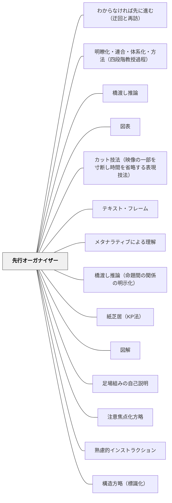

# 先行オーガナイザー

> 学習の前に全体構造・見通し・枠組みを示すことで、新しい知識と既知の知識をつなぐ橋をかける。

## [Pattern Connection]

### ヘルバルト（1806）教育学綱要統合——アペルツィオーンとしての先行オーガナイザー

Ausubelの先行オーガナイザー（1960年代）の認知心理学的基盤は、ヘルバルトのアペルツィオーン（Apperzeption）概念（1806）に起源を持つ。

> 「教授は孤立した経験を組織化し、まとまった形に再構成し、それらを既存の知識と同化（アペルツィオーン）させる。」（§64）

- **アペルツィオーンとは何か**：「既存の観念群へ新印象を取り込み、理解・再構成する心的作用」（§07 注記）。先行オーガナイザーが「既存の知識構造との橋渡し」を設計するのは、このアペルツィオーンを意図的に引き起こすためである。
- **観念群（Vorstellungsmassen）の活性化**：ヘルバルトは「注意（Aufmerksamkeit）を規定する根本条件は、関連する表象塊（Vorstellungsmassen）の存在」（§72）と述べた。先行オーガナイザーは、学習者の中に「関連する観念群」が存在するかを確認・活性化する実践的手段である。
- **「無秩序な教授」への批判**：「無秩序な教授は、何をどのように要求するのかを児童に明確にせず、精神的散漫を助長する。欲すべきものを知らぬ者に、それを強く欲することはできない」（§102）——先行オーガナイザーなしの授業がもたらす問題をヘルバルトが1806年に明示していた。
- **補強された点**：先行オーガナイザーが「なぜ有効か」の認知的根拠（アペルツィオーン）が1806年時点で既に体系化されていた。Ausubelの研究はこれを実証的に確認したものと位置づけられる。
- **波及するパタン**：[[パタン/既知から未知へ]] — アペルツィオーンの認識論的基盤；[[パタン/明瞭化・連合・体系化・方法（四段階教授過程）]] — アペルツィオーンの教授過程；[[文献/教育学綱要（ヘルバルト）]] — 本統合の出典

---

## 背景（Context）
オーズベル（David Ausubel）が提唱した概念で、新しい学習内容の前に抽象的・包括的な枠組みを示すことで学習を促進する教授方略である。山本弘樹「教師のための説明実践の心理学」でも説明実践の重要な方略として位置づけられている。先行オーガナイザーは新しい知識が既存の知識構造に統合されやすくする「足場」として機能する。

## 問題（Problem）
新しい知識は、既存の知識構造とのつながりなしには理解・記憶されにくい。「今日から○○を学びます」とだけ言って学習に入ると、学習者は新しい知識をどこに位置づけるべきかが分からない。全体構造の見通しがない状態では、学習が進んでも「自分は今何を学んでいるか」が不明確になりやすい。

## 力のかたち（Forces）
- 先行オーガナイザーは抽象的すぎると効果が薄く、具体的すぎると学習内容と区別がつかなくなる
- 学習者の既有知識と新しい知識の関係を橋渡しするものが最も有効
- 図・マップ・アウトライン・概念・問いなど形式は多様
- 毎回長い先行オーガナイザーを使うと形式的になり効果が下がる

## 解決（Solution）
**「今日はこういう流れで学びます」「この単元のマップです」「今日学ぶことは○○とどうつながっているか考えてみましょう」という形で、学習の前に全体の構造・見通し・既知の知識との関係を示す枠組みを提供する。**
概念マップ・アウトライン・KWL表（知っていること・知りたいこと・学んだこと）・中心問いの提示など形式を選ぶ。学習者に既有知識を活性化させる問いかけを組み合わせることで、新旧の知識をつなぐ橋が実際に機能する。単元の冒頭・授業の冒頭・大きな概念を導入する前に使う。

## 結果（Consequences）
- 学習者が新しい知識を既存の知識構造に統合しやすくなる
- 授業全体の見通しが持てることで、学習への動機と集中が高まる
- 単元末の振り返りで「最初に見た地図のどこを歩んだか」を確認できる

## クラスター図

## Actionable Insight

- 授業の冒頭に「今日の授業のロードマップ」を板書し「今日はここを学びます」と指し示す——全体が見えると部分の意味と位置づけが変わる
- 単元の最初に概念マップを見せ「知っているものに印をつけよう」と既有知識を活性化させる——新旧知識の橋渡しを意識的に作ることが理解の統合を促す
- KWL表（知っていること・知りたいこと・学んだこと）を使って学習前後を比較させる——単元末に「学んだこと」欄を埋める活動が見通しと振り返りを一体化させる

## 出典

- 一つの教育のパタン・ランゲージ（岩井輝久）
- Herbart, J. F. (1806). *Allgemeine Pädagogik* §64, §72, §102. → [[文献/教育学綱要（ヘルバルト）]]

## 関連パタン
- [[パタン/わからなければ先に進む（迂回と再訪）]]
- [[パタン/明瞭化・連合・体系化・方法（四段階教授過程）]]
- [[実践/BDA読解授業の設計]]
- [[パタン/橋渡し推論]]
- [[パタン/図表]]
- [[パタン/カット技法（映像の一部を寸断し時間を省略する表現技法）]]
- [[パタン/テキスト・フレーム]]
- [[パタン/メタナラティブによる理解]]
- [[パタン/橋渡し推論（命題間の関係の明示化）]]
- [[パタン/紙芝居（KP法）]]
- [[パタン/図解]]
- [[パタン/足場組みの自己説明]]
- [[パタン/注意焦点化方略]]
- [[パタン/熟慮的インストラクション]] — 親パタン
- [[パタン/構造方略（標識化）]] — 構造の継続的な明示
- [[パタン/結論を先に言う（全体像を先に示す）]] — 全体像の先行提示
- [[パタン/既知から未知へ]] — 既有知識を出発点とする
- [[パタン/方向づけのベース]] — 学習の方向付けの基盤
- [[パタン/場を設定する]] — 先行オーガナイザーを届けるための5点チェックリスト
- [[パタン/コペルニクス的転回（認識論）]] — 先行オーガナイザーは「学習者の既有認識構造から出発する」コペルニクス的転回の最もシンプルな実践形態。教材（対象）を学習者（認識）に合わせる第一歩
