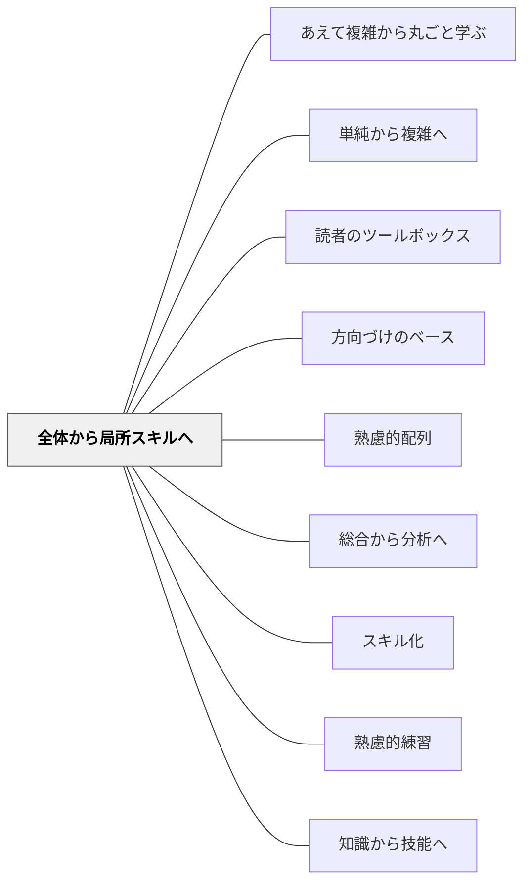

# 全体から局所スキルへ

> ゲームを知らなければ、そのルールを覚える意味がわからない。

## 背景（Context）

[[パタン/熟慮的配列]] のスキル粒度次元。David Perkins の「全体ゲーム」論に象徴される考え方で、スキルは活動全体の文脈の中ではじめて意味を持つ。

## 問題（Problem）

局所的なサブスキル（音読の流暢さ、計算の速さ、ドリブルの正確さ）だけを反復練習しても、それがどんな「全体活動」に貢献するかが見えないため、学習者の動機づけが低く、統合的な活動への転移も起きにくい。

## 力のかたち（Forces）

- 全体活動は複合的で難しく、初心者には荷が重い場合がある
- サブスキルには集中的な反復が有効な場面がある
- 「全体」を体験させる機会の設計は手間がかかる
- 全体から入ると「できない感」で意欲を失う学習者もいる

## 解決（Solution）

**まず「全体ゲーム（活動全体）」の経験（たとえ不完全でも）を先に提供し、そこで必要性を感じた学習者が局所スキルを練習する順序を作る。**

実践例：
- 水泳：平泳ぎのキックだけ練習する前に、まず簡単な形で水の中を進んでみる
- 書く指導：文法の練習よりも先に「好きなことを書く」経験をさせ、そこで出てきた課題に対して技術を教える
- プログラミング：構文の前に「動くプログラム」を実行させ、仕組みへの問いを引き出す

[[パタン/スキル化]] と組み合わせ、全体ゲームを経験した後で必要なサブスキルを同定・抽出して練習させる。

## 結果（Consequences）

- サブスキル練習の意義が学習者に内側から感じられる
- 局所スキルが全体活動に統合されやすくなる
- 教師は「この子には今何のサブスキル練習が必要か」を学習者の実践から診断できる

## クラスター図

## Actionable Insight

- 単元の初回に「完成形を不完全でも体験させる」5分間を設ける（例：文章を書く、ゲームを一度やってみる）——全体経験が後のサブスキル練習の「文脈」になる
- 局所スキル練習を始める前に「なぜこれを練習するか」を学習者に問い、自分の言葉で答えさせる——「意味がわかって練習する」状態が局所スキルの全体活動への転移を生む
- 単元中盤で「全体活動を再度やってみる」時間を設け、練習前と何が変わったかを自己評価させる——全体と局所を往復する構造が統合的な習得を促す

## 出典

- 一つの教育のパタン・ランゲージ（岩井輝久）

## 関連パタン
- [[パタン/あえて複雑から丸ごと学ぶ]]
- [[パタン/単純から複雑へ]]
- [[パタン/読者のツールボックス]]
- [[パタン/方向づけのベース]]

- [[パタン/熟慮的配列]] — 上位パタン
- [[パタン/総合から分析へ]] — 全体から入る同方向のパタン
- [[パタン/スキル化]] — サブスキルを同定する
- [[パタン/熟慮的練習]] — サブスキルを意図的に練習する
- [[パタン/知識から技能へ]] — 技能習得の別次元
