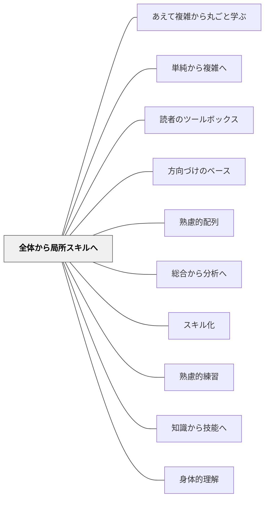

# 全体から局所スキルへ

> ゲームを知らなければ、そのルールを覚える意味がわからない。

## [Pattern Connection]

### ラヴェッソン／ベルクソン（1934）思考と動き 統合（2026-06-02）：生命的なものから始める

19世紀フランスの哲学者ラヴェッソンは、当時のデッサン教育——直線・三角形・円という幾何学的要素から始め、次第に複雑な形へ進む——を根本から批判した。その批判の論拠をベルクソンが『思考と動き』でこう要約している：

> 「機械的なものを合成して生命的なものにいたることはできない。無機的な世界の鍵を与えるのはむしろ生命である」——ラヴェッソン（ベルクソン 1934/2013 による要約）

ラヴェッソンの代替案：**生命の特徴である曲線（人間・動物の形）から始め、幾何学的要素は後から**。

> 「形の精神はつねに彼の手を逃れる。それとは反対に、生命の特徴である曲線から始める生徒は、まったく違った結果を手に入れるだろう。::：最も単純なのは幾何学に最も接近するものではなく、知性に最もよく語りかけるものである」——ラヴェッソン（ベルクソン 1934/2013 引用）

> 「幾何学的なものから出発した場合には、それをいくら複雑にしても、生命を表現する曲線に接近することはできない。それとは反対に曲線から始めるならば、幾何学の曲線に出会ったときは、それをすでに手中にしていることがわかるだろう」

この「完全なものから始めれば要素は後からついてくるが、要素から始めても完全なものにはならない」という原則は、本パタンの哲学的根拠として機能する。

さらにベルクソン自身の認識論としての非対称性：**「直観から分析へは移行できるが、分析から直観へは移行できない」**——全体的・直観的な把握が先行しなければ、部分的な分析練習がいくら積み重なっても全体への統合は起きない。

- **既存パタンとの関連**：Perkins の「全体ゲーム」論（活動全体の文脈からサブスキルへ）と、ラヴェッソンの「生命的なものから始める」（完全な形から要素へ）は同一構造を異なる文脈で示す。「要素から全体は作れない」という不可逆性の哲学的根拠がここに加わる。
- **補強された点**：「全体から局所スキルへ」が単に「文脈を与えるとモチベが上がる」という動機付け論に留まらず、**学習の認識論的構造**——直観的把握が分析的習得を可能にする——として理解できるようになる。
- **他のパタンへの波及**：[[パタン/身体的理解]] — 全体的・直観的な身体的把握が分析的理解に先行する；[[パタン/朗読術]] — 文学の全体的・音声的体験が分析的読解に先行する

[[文献/思考と動き（ベルクソン）]]

---

### ベルクソン（1919）精神のエネルギー 統合（2026-06-02）：動的図式と機能の記憶——スキル習得の認識論的構造

ベルクソンは『精神のエネルギー』第VI章「知的努力」において、**スキル習得がなぜ「全体→局所」の方向でしか機能しないか**を二つの事例で示した。

**チェスの達人の「機能の記憶」：**

チェスの達人は盤面を写真的・空間的に記憶しているのではなく、「各駒がどの役割を果たし、他の駒とどう機能的に関係するか」という全体的な**機能の図式**を把握している。だからこそ局所的な手を瞬時に判断できる。視覚的記憶（部分）から機能の全体像（全体）は導き出せない。

**ダンス習得の例：**

> ダンスを習うとき、全体的な動作の図式（動的図式）が先に形成され、個々の要素的な運動はそこから引き出される。部分的な運動の組み合わせからダンス全体の「感じ」は作り出せない。

これをベルクソンは「**動的図式（schema dynamogène）**」と呼んだ：観念とイメージの中間にある、全体的・機能的・時間的な把握のかたち。

> 「図式からイメージへの作用は生命の作用そのものである。」——ベルクソン（1919/2012）

- **既存パタンとの関連**：ラヴェッソン／ベルクソン（思考と動き）が「完全なものから始めれば要素は後からついてくる」と示したとすれば、精神のエネルギーは**なぜそうなのか**の認知メカニズムを提供する——動的図式（全体図式）が先行しなければ、局所スキルはバラバラのまま統合されない。
- **補強された点**：本パタンの「まず全体を体験させる」は、動機付け上の工夫に留まらず、**スキル習得の認識論的条件**である。全体的な動的図式がなければ、局所スキルの練習は「どこに向かうかわからない部品を磨く」ことになる。
- **他のパタンへの波及**：[[パタン/身体的理解]] — 動的図式は身体的・直観的な全体把握と同構造；[[パタン/スキル化]] — 動的図式から局所スキルを「引き出す」作業がスキル化

[[文献/精神のエネルギー（ベルクソン）]]

---

## 背景（Context）

[[パタン/熟慮的配列]] のスキル粒度次元。David Perkins の「全体ゲーム」論に象徴される考え方で、スキルは活動全体の文脈の中ではじめて意味を持つ。

## 問題（Problem）

局所的なサブスキル（音読の流暢さ、計算の速さ、ドリブルの正確さ）だけを反復練習しても、それがどんな「全体活動」に貢献するかが見えないため、学習者の動機づけが低く、統合的な活動への転移も起きにくい。

## 力のかたち（Forces）

- 全体活動は複合的で難しく、初心者には荷が重い場合がある
- サブスキルには集中的な反復が有効な場面がある
- 「全体」を体験させる機会の設計は手間がかかる
- 全体から入ると「できない感」で意欲を失う学習者もいる

## 解決（Solution）

**まず「全体ゲーム（活動全体）」の経験（たとえ不完全でも）を先に提供し、そこで必要性を感じた学習者が局所スキルを練習する順序を作る。**

実践例：
- 水泳：平泳ぎのキックだけ練習する前に、まず簡単な形で水の中を進んでみる
- 書く指導：文法の練習よりも先に「好きなことを書く」経験をさせ、そこで出てきた課題に対して技術を教える
- プログラミング：構文の前に「動くプログラム」を実行させ、仕組みへの問いを引き出す

[[パタン/スキル化]] と組み合わせ、全体ゲームを経験した後で必要なサブスキルを同定・抽出して練習させる。

## 結果（Consequences）

- サブスキル練習の意義が学習者に内側から感じられる
- 局所スキルが全体活動に統合されやすくなる
- 教師は「この子には今何のサブスキル練習が必要か」を学習者の実践から診断できる

## クラスター図

## Actionable Insight

- 単元の初回に「完成形を不完全でも体験させる」5分間を設ける（例：文章を書く、ゲームを一度やってみる）——全体経験が後のサブスキル練習の「文脈」になる
- 局所スキル練習を始める前に「なぜこれを練習するか」を学習者に問い、自分の言葉で答えさせる——「意味がわかって練習する」状態が局所スキルの全体活動への転移を生む
- 単元中盤で「全体活動を再度やってみる」時間を設け、練習前と何が変わったかを自己評価させる——全体と局所を往復する構造が統合的な習得を促す

## 出典

- 一つの教育のパタン・ランゲージ（岩井輝久）
- ベルクソン，A.（原章二訳）（2013）『思考と動き』平凡社ライブラリー784 → [[文献/思考と動き（ベルクソン）]]

## 関連パタン
- [[パタン/あえて複雑から丸ごと学ぶ]]
- [[パタン/単純から複雑へ]]
- [[パタン/読者のツールボックス]]
- [[パタン/方向づけのベース]]

- [[パタン/熟慮的配列]] — 上位パタン
- [[パタン/総合から分析へ]] — 全体から入る同方向のパタン
- [[パタン/スキル化]] — サブスキルを同定する
- [[パタン/熟慮的練習]] — サブスキルを意図的に練習する
- [[パタン/知識から技能へ]] — 技能習得の別次元
- [[パタン/身体的理解]] — 全体的・直観的な身体的把握が分析的理解に先行する（ベルクソン接続）
- [[文献/精神のエネルギー（ベルクソン）]] — 動的図式（機能の記憶）・ダンス習得の例（1919）
