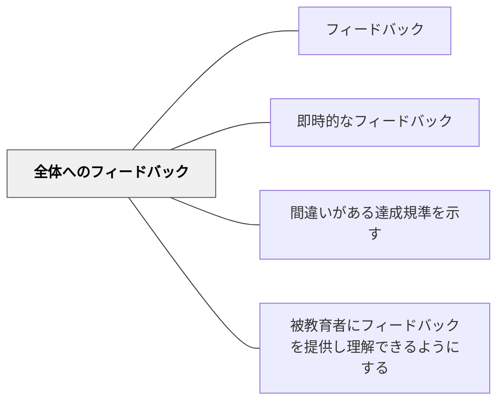

# 全体へのフィードバック

> 個人ではなくクラス全体に向けてフィードバックする。共通の傾向・パターンを一度に扱うことで、全員に届く効率的な情報提供となる。

## 背景（Context）

教師が提出物・テスト・活動を採点・観察するとき、個人の特有の誤りではなくクラスに共通する傾向やパターンに気づくことがある。「多くの学習者が同じ概念を誤解している」「文章の書き方に共通の弱点がある」「この問題の解き方に典型的なつまずきがある」といった観察は、個別フィードバックより全体へのフィードバックで扱う方が効率的で、かつ個人を傷つけない方法で届けられる。

全体へのフィードバックは、採点後の返却時・授業の導入・活動の振り返りなど様々な場面で使うことができる。

## 問題（Problem）

教師が全学習者に個別のフィードバックを届けることには時間的・物理的な限界がある。しかし個別対応を諦めて何もしないのでは、学習改善の機会が失われる。共通の課題に全体で取り組む時間を設けることで、限られた時間の中で多くの学習者に改善情報を届けられる。

また、個人を名指しして指摘することで生じる恥・傷つきのリスクを、全体への言及に変えることで回避できる。ただし全体へのフィードバックは一般的すぎると個人に届かなくなるため、具体性のバランスが重要である。

## 力のかたち（Forces）

- 共通のつまずき・傾向は全体への一度のフィードバックで効率的に扱える
- 全体に向けることで、個人を名指しする際の傷つきのリスクが軽減される
- 全体への一般的すぎるフィードバックは個人の改善に結びつきにくい

## 解決（Solution）

採点・観察の後、個人の特有の誤りと全体に共通するパターンを仕分けする。共通パターンについては、次の授業の導入・中間振り返り・返却時の全体共有の場で取り扱う。典型的な例（匿名の学習者のもの、または架空の例）を示し、なぜそれが課題なのかを全員で考える時間を設ける。

[[パタン/間違いがある達成規準を示す]]や[[パタン/悪い実例を示す]]と組み合わせることで、全体への批評的な分析の場が学習活動として機能する。[[パタン/即時的なフィードバック]]の観点から、活動直後にその場で全体への短いフィードバックをすることも効果的である。

## 結果（Consequences）

- 個別対応では届かない学習者にも共通の改善情報が届く
- 個人を名指しせずに共通の課題を扱えるため、安全な雰囲気が保たれる
- 全体へのフィードバックだけでは個人の特有の課題が見落とされるため、個別対応との組み合わせが必要

## 関連パタン

- [[パタン/フィードバック]] — 親パタン
- [[パタン/即時的なフィードバック]] — 全体へのフィードバックを迅速に届ける
- [[パタン/間違いがある達成規準を示す]] — 全体への批評的分析の材料として使う
- [[パタン/被教育者にフィードバックを提供し理解できるようにする]] — 全体フィードバックの受け取りを支援する

## クラスター図

## Actionable Insight

- 採点後に「クラスで多くの人がつまずいていた点」を次の授業冒頭で全体に取り上げる——個別対応の前に共通の課題を全員で扱うことが効率的に学習を底上げする
- 典型的なつまずきを匿名の例として示し「なぜこうなるか」を全員で考える時間を設ける——個人を名指しせず共通課題を安全に扱う方法が批評文化の土台になる
- 全体フィードバックでは「具体的に何をすれば改善できるか」を1点に絞って伝える——一般的すぎるフィードバックは個人の改善に届かないため具体性が鍵

## 出典

Wiliam, D. (2011). *Embedded Formative Assessment*. Solution Tree.
