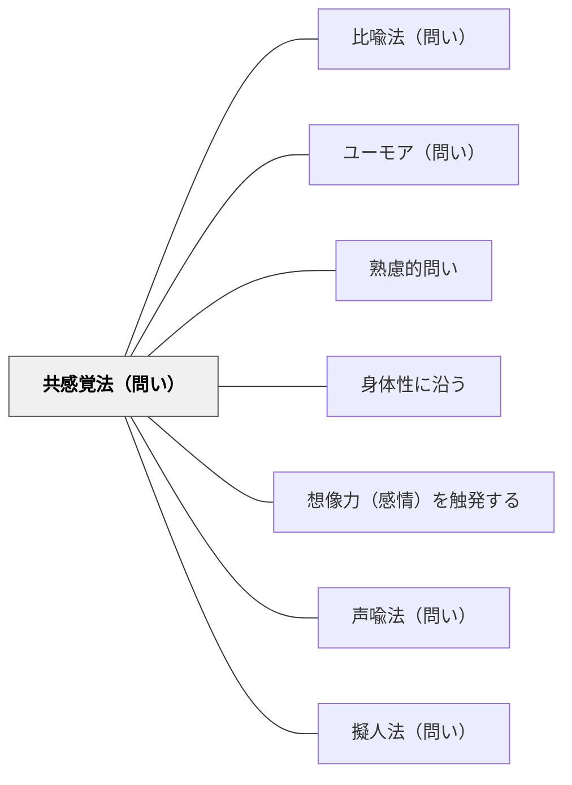

# 共感覚法（問い）

> 五感に関する表現で感覚を刺激する問い

## 背景（Context）
共感覚（シネスセジア）とは、ある感覚刺激が別の感覚を呼び起こす現象であり、詩や芸術表現で古くから用いられてきた技法でもある。問いに五感的な表現を取り入れることで、学習者の身体的・感覚的な想像力を引き出し、言語化しにくい直感や印象を問いの場に持ち込む橋渡しになる。

## 問題（Problem）
知識や概念を言葉だけで問うと、学習者は覚えている定義を繰り返すだけになりがちである。感覚的・身体的な回路を使わなければ、個人の独自の理解や経験が議論に現れない。「どんな感じがするか」という問いの入口がなければ、感性的知性が学びの場で活かされない。

## 力のかたち（Forces）
- 感覚的直感 vs 論理的説明
- 個人的な感受性 vs 共有可能な知識
- イメージの豊かさ vs 概念の正確さ
- 身体的関与 vs 抽象的思考

## 解決（Solution）
「この考えはどんな色をしている？」「この理論を音に喩えると、どんな音がする？」「この問題に触れたとき、どんな感触がする？」のように、視覚・聴覚・触覚・味覚・嗅覚などの感覚次元に翻訳して問う。正解を求めず、なぜその感覚を選んだかを語らせることで、深い内省が生まれる。

## 結果（Consequences）
- 言語化しにくい個人的な理解や印象が問いの場に現れる
- 感性的・身体的な知性が評価される学習環境が生まれる
- 多様な感覚的メタファーが議論を豊かにする

## 関連パタン
- [[パタン/比喩法（問い）]]
- [[パタン/ユーモア（問い）]]
- [[パタン/熟慮的問い]] — 親パタン
- [[パタン/身体性に沿う]] — 感覚・身体的直感を学びに引き込む上位パタン
- [[パタン/想像力（感情）を触発する]] — 感覚的な問いが感情・想像力を動かす
- [[パタン/声喩法（問い）]] — オノマトペで内的状態を問う兄弟パタン
- [[パタン/擬人法（問い）]] — 対象に感覚・人格を与えて問う兄弟パタン

## クラスター図

## Actionable Insight

- 「この考えはどんな色をしている？」「この理論を音に喩えると？」と五感次元に翻訳して問う——言語化しにくい個人的な理解や印象が問いの場に現れる
- 「この問題に触れたとき、どんな感触がする？」と問い、なぜその感覚を選んだかを語らせる——感覚的メタファーの理由の語りが深い内省を生む
- 問いの前に「感覚で考えるモード」に入ることを宣言する——感性的・身体的な知性が評価される学習環境が生まれる

## 出典
- [[文献/熟慮的問いのパターンリスト（動画記録）]]
