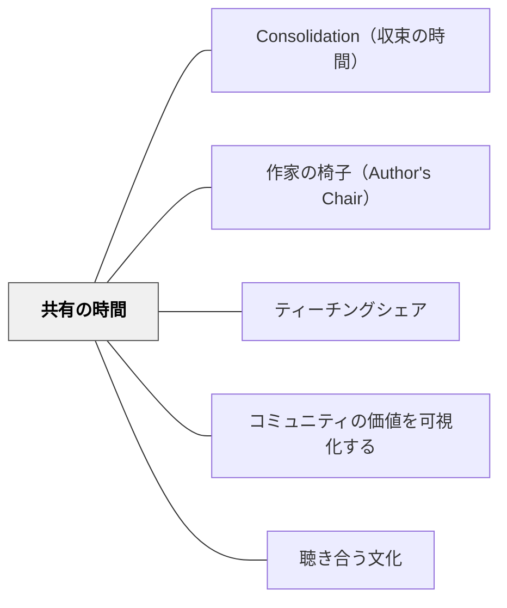

# 共有の時間

> 個々の学びを短く持ち寄り、クラス全体の価値・発見・次の問いとして見えるようにする。

## 背景（Context）

読書・作文・探究・算数の活動では、子どもたちがそれぞれ別の発見をする。その発見を個人の中に閉じたままにすると、教室全体の文化や学びの蓄積になりにくい。

## 問題（Problem）

活動の最後が「終わった人から片付ける」だけになると、よい試み・つまずき・発見が共有されず、次の学習に活かされない。

## 解決（Solution）

**活動の終わりに3〜10分を取り、数人の発見・作品・方法・問いを全体で共有する。教師はそれを価値づけ、次の学習につながる言葉として残す。**

## 結果（Consequences）

- 個人の学びが教室の共有財産になる
- 学習者が「何が価値ある行為か」を具体例から学べる
- 次の活動への見通しや問いが生まれる

## クラスター図

## Actionable Insight

- 授業の最後に「今日、みんなに渡したい発見は何？」と問い、1〜3人だけ共有する
- 共有された発見を板書やアンカーチャートに一文で残す

## 関連パタン

- [[パタン/Consolidation（収束の時間）]]
- [[パタン/作家の椅子（Author's Chair）]]
- [[パタン/ティーチングシェア]]
- [[パタン/コミュニティの価値を可視化する]]
- [[パタン/聴き合う文化]]
