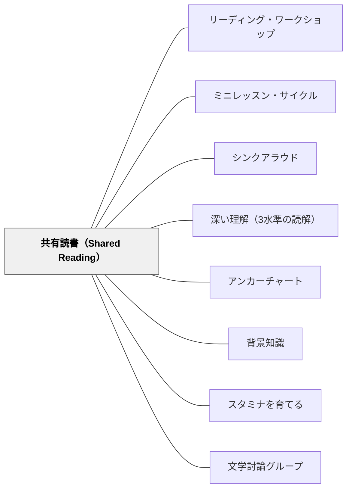

# 共有読書（Shared Reading）

> 読書の「ダンス」——教師と子どもが、難しさと易しさのリズムを共に刻む。

---

## Pattern Connection

**Allen（1999）統合（2026-05-20）**：

*Words, Words, Words* は共有読書を「Reading With（一緒に読む）」として語彙指導の3つの道の第二の道に位置づける。独立読書では扱えない語彙方略の指導を「リアルタイムで」行える場として機能する。

- **既存パタンとの関連**：Dorn & Soffos の「スケール・オブ・ヘルプ」による動的な足場は、語彙理解の足場とも重なる。共有読書の最中に教師が「この語、ここで何を意味しているか分かる？」と止まることが、語彙方略のモデリングになる
- **補強された点**：共有読書中に教師が教えられる語彙指導の具体が加わった——文脈からの語義推測・辞書の使い方・多義語への気づき・専門語の重要性・語のネットワーク（類義語・対義語）の確認・リニア・アレイの共同構築
- **修正・拡張された点**：共有読書の「目的の設定」として語彙目標が加わる。「今日はこのテキストを読みながら、知らない語に出会ったときの対処法をやってみよう」というように、語攻略の12の方略を共有読書でモデリングする場として使える
- **他のパタンへの波及**：[[パタン/語彙指導]] — Reading With の語彙方略詳細。[[パタン/ワードウォール]] — 共有読書で出てきた語をウォールに追加する流れが語彙環境を生きたものにする

**出典**: Dorn, L. J., & Soffos, C.（2005）*Teaching for Deep Comprehension: A Reading Workshop Approach*（Ch.3）. Stenhouse Publishers.（統合：2026-05-19）

- **既存パタンとの関連**：本パタンは [[パタン/リーディング・ワークショップ]] の「共有読書フェーズ」を独立したパタンとして展開する。[[パタン/シンクアラウド]] がミニレッスンの指導形態を扱うのに対して、共有読書はテキストを教師と子どもが「一緒に読む」形式での足場のかけ方を扱う
- **補強された点**：Holdaway（1979）の「リズミカルなパターン（Rhythmic Patterns）」理論——易しい処理と挑戦が交互に現れることが「疲れ知らずの学習（fatigueless activity）」を生む——が共有読書の設計原理として明確になった。「最初に親しみのあるテキストを読む」のは「熟練した読者のリズム感覚を記憶に刻む」ためだという根拠
- **拡張された点**：**スケール・オブ・ヘルプ（Scale of Help）**が共有読書の言語設計に具体的に接続した。新しいテキストを読む間、教師は子どもの処理具合に応じて「明示的言語＋行動（高支援）→ リマインダー・選択肢（中支援）→ 聴いて励ます（低支援）」と動的に調整する
- **他のパタンへの波及**：[[パタン/ミニレッスン・サイクル]] — 共有読書は指導ポイントのデリバリー場として機能。[[パタン/アンカーチャート]] — 共有読書で発見したことをチャートに加える。[[パタン/深い理解（3水準の読解）]] — 共有読書を通じて省察的知識の足場を作る

**Collins（2004）統合（2026-05-24）：**

*Growing Readers* は共有読書を、Reader's Toolbox（[[パタン/読者のツールボックス]]）の**最初のモデリングの場**として位置づける。

- **補強された点（ストラテジーのデモンストレーション）**：Collins は共有読書中に、教師が「詰まったときに何をするか」を声に出して見せる（シンクアラウド）ことを推奨する。同じ文を「ロボット声（一語ずつ区切る）」と「話す声（自然な表現）」で読み比べる流暢さのミニレッスンも共有読書の形式を使う
- **補強された点（MSVクロスチェックの可視化）**：「M：意味が通る？」「S：音として正しい？」「V：字の形と合う？」の3点を共有テキストを使って全体に見せることができる——一人では気づけない「複数キューの同時使用」が、クラス全体で観察・共有できる
- **他のパタンへの波及**：[[パタン/読者のツールボックス]] — 共有読書で見せたストラテジーがツールボックス・アンカーチャートに追加される

---

## 背景（Context）

共有読書（Shared Reading）は、1960年代にニュージーランドの教育者 Don Holdaway が開発し、それ以来初等教育のリテラシー指導の柱として位置づけられてきた。大型テキスト（Big Book）や拡大印刷を使って、教師と子どもが「声に出して一緒に読む」形式の活動だ。

Dorn & Soffos（2005）は共有読書を単なる「音読の時間」から、**言語リテラシーの社会的足場**として再定義した。共有読書は「読むことを教える」ための場であると同時に、「読書経験を楽しむ」「言語のリッチさに浸る」「仲間とアイデアを共有する」複数の目的を同時に達成する。

## 問題（Problem）

読書指導に問題が起きるのは、難しさと易しさのバランスが崩れるときだ：

- 常に難しいテキストだけを与えると、子どもは「疲弊した読書者」になる——問題解決のエネルギーが尽き、読むことへの動機が下がる
- 常に易しいテキストだけでは、成長が止まり、流暢さだけが増して深い理解が育たない
- 教師が「正解の読み方」を一方的に伝えると、子どもは受動的になり、問題解決の主体性が育たない

## 力のかたち（Forces）

- 流暢な読書はテキストを「流れに乗って」読む経験の積み重ねから生まれる——難しい新テキストの前に「成功する読書の記憶」を持ち込むことが効果的
- 子どもたちは聴いて楽しんだテキストを再読するとき、作者の言語パターンを模倣して内面化する
- 教師の言語（プロンプト vs. 質問）の違いが、子どもの思考の深さを決定する
- 同じ指導でも読者の発達段階によって必要なサポートは異なる——emergent（新興）・early（初期）・transitional（移行期）・fluent（流暢）で教師の言語は変わる

## 解決（Solution）

**予測可能な5ステップの枠組みで共有読書を設計し、「易しさ」と「挑戦」のリズムを意図的に作る。教師はスケール・オブ・ヘルプを使って、子どもの処理の状態に合わせてサポートを動的に調整する。**

---

### 共有読書の5ステップ・フレームワーク

**ステップ1：親しみのある／易しいテキストの再読**

目的：流暢な読書のリズムを身体に刻む。

- 使えるテキスト：童謡・詩・劇・チャント・クラスで書いたテキスト・繰り返しパターンのある物語・以前読んだお気に入りの本
- このステップで子どもたちは「読者として成功する」——声が揃い、楽しんで読む
- 教師はここで1〜2つの素早いティーチング・ポイント（読解方略や語スキル）を加えることができる

---

**ステップ2：新しいテキストへのオリエンテーション**

目的：新テキストを読む前に背景知識を活性化し、予測を形成する。

- 表紙・タイトル・著者名から予測する：「このタイトルから何を想像しますか？」
- ページをめくりながら挿絵・写真を見て、物語・内容について推論する
- 子どもたちに特定の語・表現・難しそうなアイデアを予告する

---

**ステップ3：テキストの共有読書**

目的：教師と子どもが一緒に声を出して読み、流暢さ・表現・理解を同時に扱う。

- 読みを止める頻度を最小限に保ちながら、理解と語解決方略を並行して扱う
- 子どもたちの参加と発言を奨励し、理解確認のための問いかけを適宜行う
- **スケール・オブ・ヘルプを動的に調整する**：

| 支援の度合い | 教師の言語の例 |
|---|---|
| 高い支援 | 「ここを一緒に指で追いましょう。"__" という言葉に注目して。どんな意味だと思う？」 |
| 中程度の支援 | 「読み直して、意味に合う言葉を3つ考えてみて。」 |
| 低い支援 | 「うん。よく読んでいるね。」（聴いて見守る） |

---

**ステップ4：討論と教えのポイント**

目的：読後の理解を深め、1〜2つの指導ポイントを届ける。

討論を促す問いの例：
- 「この物語のメッセージを話し合おう」
- 「著者は何を教えようとしていると思う？」
- 「次に何が起きると思う？なぜそう思う？」
- 「みんなは賛成？それとも反対？理由は？」
- 「どこかよく分からなかったところはある？」

読後の教えのポイントの例：
- 初期読者：ドライイレーズボードやウィキスティックスを使って印刷の概念を深める
- 移行期読者：付箋に好きな語・表現を書き留め、読書ログに追加する

---

**ステップ5：文学的拡張（Literary Extensions）**

目的：共有読書の理解を新しい水準に発展させる。

- ペアで再読する
- 物語の別バージョンを書く
- 劇・人形劇・アートで表現する
- 作者へ手紙を書く

---

### 発達段階別・教師の言語調整

Dorn & Soffos は読者の発達段階によって共有読書の言語を変えるべきだと強調する：

| 発達段階 | 教師の言語の特徴 | 焦点 |
|---|---|---|
| 新興読者（Emergent） | 明示的・テキストの言語に近い。繰り返しリハーサルを含む | 印刷の概念・語・文字 |
| 初期読者（Early） | 明示的と推論的がほぼ同量 | 語解決方略・文章の流れ |
| 移行・流暢読者（Transitional/Fluent） | 推論的問いかけが主体 | 著者の意図・比較・評価・自己反省 |

---

### プロンプト vs. 質問

共有読書では「質問（Question）」よりも「プロンプト（Prompt）」の方が一般に有効：

- **プロンプト**：方略を動かすための言語。「何かできることがあるかな？」「もう一度読んで考えてみて」
- **質問**：特定の答えを引き出す言語。「この話はどこで起きましたか？」

質問も「テキストを著者に問う探究的な問い」として機能するとき（「著者はなぜここでこの言葉を選んだと思う？」）、深い理解を促す。教師は問いとプロンプトを目的に応じて使い分ける。

---

## 結果（Consequences）

- 易しさと挑戦のリズムにより、子どもたちが「疲れ知らず」の読書経験を積む
- 新テキストを読む前に「成功した読書」の記憶を持ち込むことで、困難なテキストへの取り組みやすさが上がる
- 教師のスケール・オブ・ヘルプが適切なら、全員が参加できる読書経験になる
- ただし、テキスト選択が「易しすぎる/難しすぎる」と5ステップの効果が半減する

## 関連パタン

- [[パタン/リーディング・ワークショップ]] — 共有読書が機能するワークショップ構造
- [[パタン/ミニレッスン・サイクル]] — 共有読書はミニレッスンの核心的デリバリー方法
- [[パタン/シンクアラウド]] — 共有読書でのモデリング形態
- [[パタン/深い理解（3水準の読解）]] — 共有読書で第1〜第3水準を扱う
- [[パタン/アンカーチャート]] — 共有読書で発見したことをチャートに蓄積
- [[パタン/背景知識]] — オリエンテーションで背景知識を活性化する
- [[パタン/スタミナを育てる]] — 易しい再読がスタミナの「助走」になる
- [[パタン/文学討論グループ]] — 共有読書から文学討論グループへの発展

## クラスター図

## Actionable Insight

- **「今日の共有読書」を5ステップで設計し直す**：再読（易しいテキスト）→ オリエンテーション → 一緒に読む → 討論 → 拡張。ステップ1の「再読」が省略されていないか確認する——ここが「疲れ知らず」のリズムを作る助走になる
- **次の共有読書で「プロンプト比率」を測る**：使った「質問」と「プロンプト」の数を授業後に振り返り、プロンプトが少なければ「何かできることがある？」「もう一度読んで考えてみて」を意識的に増やす
- **スケール・オブ・ヘルプを意識する**：共有読書中に子どもが詰まったとき、すぐに「答え」を言うのではなく、「高支援→中支援→低支援」の順に少しずつ足場を変える。「低支援（聴いて励ます）」まで待てたか授業後に確認する
- **「発達段階別の言語調整」を試す**：同じ学年でも読者のレベルは違う。移行期・流暢読者のグループでは推論的問いかけ（「著者はなぜ……？」「あなたはどう思う？」）を大幅に増やし、明示的な説明は最小化する

## 出典

Dorn, L. J., & Soffos, C. (2005). *Teaching for Deep Comprehension: A Reading Workshop Approach*. Stenhouse Publishers.
Holdaway, D. (1979). *Foundations of Literacy*. Portsmouth, NH: Heinemann.

> 「共有読書は、より知識のある者（教師）と一群の初学者（子どもたち）の間での相互的な言語経験だ。……まるで丁寧に振付けられたダンスのように、教師はサポートを調整して、子どもたちが易しい動きと挑戦的な動きをスムーズなリズムで体験できるようにする。」——Dorn & Soffos（2005）
