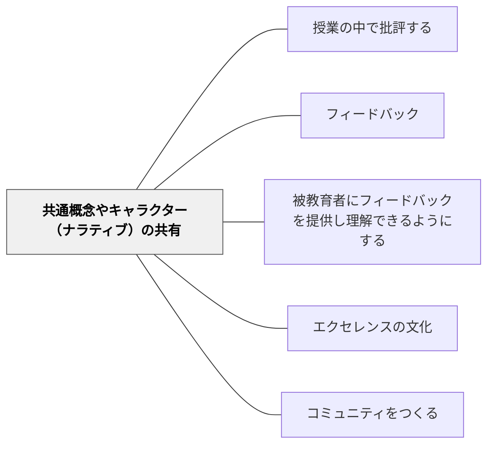

# 共通概念やキャラクター（ナラティブ）の共有

> 安全に批評できるのは、みんなが同じ言葉と物語を共有しているからだ。

## 背景（Context）

フィードバックや批評は、学習コミュニティにとって重要な実践だが、相手の作品を評価することは心理的なリスクを伴う。批判的なコメントは傷つきやすく、また評価する側も「何を言っていいかわからない」という状態では建設的な対話が生まれない。

学習コミュニティが継続的に機能するためには、フィードバックを交わすための共通の文化・語彙・物語（ナラティブ）が必要になる。これはルールの設定だけでは不十分で、全員が参照できる「語り」の共有が必要だ。

## 問題（Problem）

フィードバックのための語彙や枠組みがコミュニティ内で共有されていないと、批評は個人的な攻撃として受け取られたり、表面的なコメントに終始したりする。

特に「厳しいことを言ってもいい」「改善案を出してもいい」という共通認識がない場合、フィードバックは抑制され、学習の深まりが妨げられる。また、評価の基準が暗黙知のままであると、コミュニティ内で評価の一貫性が失われる。

## 力のかたち（Forces）

- 批評は学習を深める力をもつが、同時に対人関係を傷つけるリスクも伴う
- 「批判的に見る」という行為には練習が必要であり、モデルとなる語りや枠組みがないと習得しにくい
- コミュニティ全体で同じキャラクターや概念を使うことで、「自分の意見」ではなく「この視点から見ると」という形で批評が可能になる

## 解決（Solution）

コミュニティ内で批評・フィードバックを安全に行うために、共通のキャラクターや概念的枠組みを明示的に設計・共有する。例えば「温かい友人」キャラクターは、相手のことを思いながら正直に言うという態度を体現する。「厳しい批評家」キャラクターは、作品の弱点を見つけることに集中する。

こうしたキャラクターを授業の中で紹介し、ロールプレイや例示を通じて全員が使いこなせるようにする。学習者が「今は『温かい友人』の視点で」と言えるようになると、フィードバックが個人の感情から切り離され、建設的な批評が可能になる。また「星（成功している点）と願い（改善点）」「二つのほめと一つの提案」のような構造的な語りも同様の機能を果たす。

## 結果（Consequences）

- フィードバックが個人攻撃ではなく、共通の語りに基づく学習活動として機能するようになる
- 学習者が批評することへの心理的ハードルが下がり、フィードバックの質と量が向上する
- コミュニティに独自の文化と言語が育まれ、帰属意識が高まる

## 関連パタン
- [[パタン/授業の中で批評する]]

- [[パタン/フィードバック]] — 親パタン
- [[パタン/被教育者にフィードバックを提供し理解できるようにする]] — 共通言語があることでフィードバックの理解が容易になる
- [[パタン/エクセレンスの文化]] — 高い基準を安全に語れる文化的土台
- [[パタン/コミュニティをつくる]] — 共通言語はコミュニティ形成の核となる

## クラスター図

## Actionable Insight

- 批評前に「温かい友人の視点で（相手のことを思いながら正直に）」というキャラクターを全員で確認する——共通の語りが個人の感情から批評を切り離す
- 「星（成功）と願い（改善）」の枠組みをカードに書いて机の隅に置く——構造が見える場所にあるとフィードバックのプロトコルが機能しやすい
- クラス独自の「批評する言葉」を子どもたちと作り、掲示する——自分たちが作った言語がコミュニティへの帰属意識と安全なフィードバック文化を同時に育てる

## 出典

Berger, R. (2003). *An Ethic of Excellence*. Heinemann.
Clarke, S. (2014). *Outstanding Formative Assessment*. Hodder Education.
