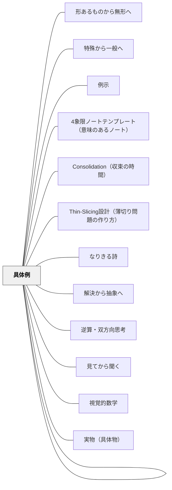

# 具体から抽象へ

> 多くの「そうだ」という瞬間が積み重なって、はじめて「つまりこういうことだ」が生まれる。

## 背景（Context）

[[パタン/熟慮的配列]] の抽象度次元。抽象的な概念・原理・法則は、学習者が複数の具体的事例を経験・比較することで自然に浮かび上がってくる。これはヘルバルト以来の教授学の中心的知見でもある。

## 問題（Problem）

抽象的な定義・公式・法則を先に提示してから例を示すという順序では、学習者は定義を暗記するが、その概念が「何のためにあるのか」「どんな現象を説明するのか」を理解しにくい。

## 力のかたち（Forces）

- 抽象化には複数の異なる具体例が必要（一例では「その例の特徴」と「概念の本質」が区別できない）
- 具体例を多く扱うほど時間がかかる
- 概念の境界例・例外も扱わないと不正確な抽象化が起きる
- 教師が先に抽象を言いたくなる誘惑がある

## 解決（Solution）

**複数の具体的事例を比較・検討させてから、学習者自身が共通パターンを言語化するよう促す。教師による抽象（定義）の提示はその後に置く。**

実践例：
- 「平行」を教える前に、様々な直線の組み合わせを観察させ「ずっと伸ばしても交わらないもの」を見つけさせる
- 歴史の「因果関係」を教える前に、3つの歴史的事件を分析させる
- 詩の「対比」を教える前に、対比のある詩を複数読んで「気づいたこと」を話し合う

## 結果（Consequences）

- 学習者が抽象概念を「発見した」感覚を持て、オーナーシップが高まる
- 新しい事例に概念を適用する（転移）能力が育つ
- 定義の言葉が、具体的なイメージの網に支えられる

## クラスター図

## Actionable Insight

## 出典

- 一つの教育のパタン・ランゲージ（岩井輝久）

- 抽象的な定義を先に提示する代わりに、「まず3つの事例を比べて共通点を探してみよう」と問いかける——学習者が自ら一般化する経験が深い概念理解を生む
- 概念を教える前に「これらに共通しているのは何だと思う？」と問い、学習者の言語化を聞いてから定義を示す——発見の感覚が概念のオーナーシップを高める
- 境界例（「これは当てはまるか？」という事例）を1つ追加して定義をさらに磨く時間を設ける——例外・境界例が概念の輪郭を精緻にする

## 関連パタン
- [[教科/算数・数学で使うパタン]]
- [[パタン/具体事例から典型事例（中心概念）へ]]
- [[パタン/形あるものから無形へ]]
- [[パタン/特殊から一般へ]]
- [[パタン/例示]]
- [[パタン/4象限ノートテンプレート（意味のあるノート）]]
- [[パタン/Consolidation（収束の時間）]]
- [[パタン/Thin-Slicing設計（薄切り問題の作り方）]]
- [[パタン/なりきる詩]]
- [[パタン/解決から抽象へ]]
- [[パタン/逆算・双方向思考]]
- [[パタン/具体例]]
- [[パタン/見てから聞く]]
- [[パタン/視覚的数学]]
- [[パタン/実物（具体物）]]
- [[パタン/身体的理解]]
- [[パタン/抽象的現実の感覚]]
- [[パタン/同一文脈・複数概念の展開]]
- [[パタン/読み書きから生まれる眼]]
- [[パタン/例えば？（例示・具象化）]]

## このパタンが働く実践

| 実践パタン | どのように具体から抽象へ進むか |
|------------|--------------------------------|
| [[実践/個別支援級の複式算数：重さと面積をわたり・ずらしで学ぶ]] | 文房具・1円玉・自作天びん・教室の広さなど具体的な対象から、g、kg、cm²、m²などの単位理解へ進む |

- [[パタン/熟慮的配列]] — 上位パタン
- [[パタン/形あるものから無形へ]] — 物質的具体性から出発する
- [[パタン/具体事例から典型事例（中心概念）へ]] — 具体事例から核を取り出す次のステップ
- [[パタン/特殊から一般へ]] — 個別事例から一般化する次元
- [[パタン/比較による精緻化]] — 比較によって概念を鋭くする
- [[概念/精緻化]] — 精緻化の概念的背景
