# 具体から抽象へ

> 多くの「そうだ」という瞬間が積み重なって、はじめて「つまりこういうことだ」が生まれる。

本パタンは [[パタン/記号接地（Symbol Grounding）]] の実装パタン（物質的具体から抽象・無形へのグラデーションを設計する）。

## [Pattern Connection]

**ペスタロッチ（1801）ゲルトルート児童教育法 統合——心理学的順序の原則と三段階の概念発展：**

- **「混乱→明確→概念」の三段階**：本パタンの「具体事例の比較→共通パターンの言語化→概念の提示」という流れは、ペスタロッチが「曖昧な見解から明確な見解へ、明確な見解から明確な概念へ」と定式化した認識の三段階と完全に対応する。「まず3つの事例を比べて共通点を探そう」という教授活動は、ペスタロッチの「心理学的順序の原則」の現代的実装である。
- **五感の優先と近さの法則**：ペスタロッチは「あなたを常に取り囲んでいるものは、あなたの五感にとって近いので、明瞭かつ明確にすることは容易である」と述べた。「具体から抽象へ」の配列は、単なる教育的工夫ではなく、認識の発達が「近いもの→遠いもの」「感覚的→概念的」へと進む人間の本性的な順序に基づく。
- **三元素（数・形・言語）の並行性**：ペスタロッチが初等教育の三元素として「数・形・言語」を示したことは、本パタンの「複数の具体事例の比較・検討→概念化」というサイクルを三方向に並行して設計することへの示唆を与える。算数の「数」、図形の「形」、国語の「言語」それぞれで、具体から抽象への独自のルートが存在する。
- **補強される点**：カントが哲学的に「直観なき概念は空虚」と述べ、ペスタロッチが教授論として「五感から始めよ」と実践した——この二つが本パタンの理論的・実践的支柱を形成する。
- **波及するパタン**：[[パタン/感性と悟性の協働]] — 認識論的基盤；[[パタン/操作物による概念形成]] — 具体の素材；[[文献/ゲルトルート児童教育法（ペスタロッチ）]] — 本統合の出典

---

**ヘルバルト（1806）教育学綱要統合——教授配列の原則の明示的定式化：**

ペスタロッチが「心理学的順序の原則」として「具体から抽象へ」を定式化したのに対し、ヘルバルトはそれを教授配列の体系的原則として§101に明示した。

> 「教授配列の原則：具体から抽象へ／近いものから遠いものへ／単純から複雑へ／無関心から関心へ（すでに存在する興味を足場に新興味へ橋渡しする）」（§101）

- **「無関心から関心へ」という第四原則の追加**：ペスタロッチの三原則に加え、ヘルバルトは「すでに存在する興味を足場に新しい興味へ橋渡しする」という動機論的次元を加えた。「具体から抽象へ」という配列は、認識論的な順序であるだけでなく、動機の順序でもある——知っている・できることから始めることが学習者の関与を生む。
- **アペルツィオーン（Apperzeption）との接続**：具体から抽象への移行は、新観念が既存の観念群に「同化（アペルツィオーン）」されるプロセスである。具体的な体験が「引っ掛かり」となって、新概念が観念群に組み込まれる。
- **四段階教授過程との接続**：ヘルバルトの四段階（明瞭化→連合→体系化→方法）は「具体から抽象へ」の実践的手順として読める。明瞭化＝具体的な例示、連合＝既存知識への接続、体系化＝抽象的な原理への統合、方法＝応用・創造。
- **波及するパタン**：[[パタン/明瞭化・連合・体系化・方法（四段階教授過程）]] — 四段階の詳細；[[文献/教育学綱要（ヘルバルト）]] — 本統合の出典

---

**カント（1781/1787）統合：**

- **哲学的基盤の提供**：カントの「超越論的感性論・図式論」が本パタンに深い認識論的基盤を与える。感性（直観・具体体験）と悟性（概念・抽象）の関係は、単なる「教育的効果の問題」ではなく「人間の認識が成立する構造そのもの」である。
- **感性論との接続**：カントは「時間・空間は経験の素材ではなく、経験を可能にする感性のア・プリオリな形式」と論じた。これを教育に読み替えると「具体的体験は新しい概念を注入するものではなく、学習者が既に持っている認識の形式（[[パタン/ア・プリオリな枠組み]]）を活性化させ、新しい概念が接地する場を作る」ということになる。
- **「直観なき概念は空虚」との接続**：[[パタン/感性と悟性の協働]] のカントの名言「直観なき概念は空虚、概念なき直観は盲目」は、本パタンの理論的核心を一言で言い表している。具体体験（直観）と概念化（悟性）の両方が揃って初めて深い理解が生まれる。
- **図式論との接続**：カントの「図式論」（概念と直観の媒介として時間図式が機能する）は、本パタンにおける「具体事例の時間的・経験的蓄積が概念理解の足場になる」という直観と対応する。

---

**プラトン『メノン』（前387年頃）統合——ミツバチの比喩とエイドス：「共通の一つのかたち」を問う最古の教授法：**

プラトン『メノン』（72a〜c）の「ミツバチの比喩」は、具体から抽象への移行を促す問いの構造を最も鮮明に示す最古の記録である。

**ミツバチの比喩（72a〜c）：**

メノンは「徳とは何か」を問われ、「男の徳」「女の徳」「子どもの徳」「老人の徳」と例を列挙し始める。ソクラテスはこう返す：

> 「多くのミツバチがいるとして、私があなたにミツバチの本性について問うたとき、あなたは『ミツバチはたくさんの種類があります』と答えるでしょうか？それとも、それらはすべてミツバチとして同一のひとつのかたち（エイドス）を持っているとお答えになりますか？」（72a〜c）

ソクラテスが示した区別：

| 答えの種類 | 内容 | 具体から抽象への位置 |
|---|---|---|
| **列挙（具体の羅列）** | 「男の徳・女の徳・子どもの徳…」 | 具体レベルにとどまる |
| **エイドス（共通の一形）** | 「それらすべてに共通する『ひとつのかたち』は何か」 | 抽象への飛躍点 |

**エイドス（εἶδος）の教授論的意味：**
- 多数の具体例を列挙することは「共通のひとつのかたち（エイドス）の定義」ではない
- 「これらすべてに共通しているものは何か」という問いが、列挙（具体）から概念（抽象）への橋渡しをする
- この問い——「それらはすべてどんな点で同じか」——がプラトン以来の概念形成の核心的問いである

**授業における「ミツバチの問い」：**
- 「正方形・長方形・ひし形はみんな四角形。では四角形に共通しているのは何？」
- 「春・夏・秋・冬はみんな季節。では季節に共通するのは何？」
- 「犬・猫・馬はみんな動物。では動物に共通しているのは何？」

列挙を聞き終わった後「ではそれらに共通する『ひとつのかたち』は何か」と問う——これがエイドスを求めるソクラテス的問いであり、具体から抽象への移行の操作的手順そのものである。

**補強点**：カント（哲学的根拠「直観なき概念は空虚」）・ペスタロッチ（実践的手順「五感から始めよ」）・ヘルバルト（体系的定式化§101）に、プラトンが「具体から抽象へ」の移行を引き起こす問いの言語形式を加える——「それらに共通するひとつのかたちは何か」という問いの発見が最も古い記録。

**波及するパタン**：[[パタン/アポリアの設計]] — エイドスを問う前に「多数の例を出すだけでは定義にならない」という困惑（アポリア）を経験させるとより深まる；[[パタン/熟慮的問い]] — エイドスを求める問いが熟慮的問いの原型；[[文献/メノン（プラトン）]] — 本統合の出典

---

**小林俊行（2024）地力をつける微分と積分——「4つの入口から1つの芯へ」という具体から抽象の実践形態：**

小林は積分の「芯」（細かく分けて積み上げる）を、円の面積を4つの異なる方法で求めることを通じて体感させる。この設計は「複数の具体から共通の抽象へ」という本パタンの数学教育における具体的実装である。

**4つの方法と具体から抽象への対応：**

| 方法 | 操作 | 「芯」との接続 |
|---|---|---|
| 方眼紙を使う | 細かいマス目で囲む（少なめ・多めの両端） | 分割→近似→精度向上の感覚 |
| 扇形を互い違いに並べる | 円を薄い扇に切り並べる→長方形に近づく | 形を変えても量は保存 |
| 同心円（バウムクーヘン）を使う | 年輪状の輪を切り開くと三角形に収束 | 次元変換でも同じ芯 |
| 帯に切り分ける | 縦の細長い短冊を積み上げる | 区分求積法の一般形 |

4つの異なる入口が「細かく分けて積み上げる」という1つの芯に収束する——これは、プラトンが「ミツバチの比喩」で示した「多くの具体から共通のエイドスを問う」という移行の数学版である。

> 「積分という名称は非常によくできていて『細かく分けて積み上げる』という本質をとらえています。分割の方法はさまざまですが、どのように分割しても細かく分けて積み上げれば、同じ量にたどりつく」——小林（2024）

**「感覚を先に→論理へ」という順序の強調：**

小林は「感覚を研ぎ澄ませると論理を明快に組み立てることが可能になり、また論理思考のミスも減ります」と述べる。これはカントの「直観なき概念は空虚」・ペスタロッチの「五感から始めよ」と同じ認識論的順序を、数学教育として具体化した言明である。

**補強点**：4つの入口から1つの芯へという設計が、「具体から抽象へ」の実践的手順として機能する。特に「どの分割方法でも同じ答えになる」という体験が、抽象的な定理（積分の定義）の前に「なぜそうなるか」の感覚的基盤を作る。

**波及するパタン**：[[パタン/概念の芯をつかむ（地力の学び方）]]（本統合の新規パタン）；[[文献/地力をつける微分と積分（小林俊行）]]

---

**今井むつみ・秋田喜美（2023）言語の本質——「アイコン性から恣意性へ」の進化が示す認知科学的根拠：**

本書は「具体から抽象へ」という原則に、進化的・発達的・実証的な根拠を提供する。

**言語進化の道筋：アナログ（具体・アイコン的）からデジタル（抽象・恣意的）へ：**
言語は音と感覚イメージの直接的な類似（アイコン性）から始まり、体系化・デジタル化によって抽象的な記号システムへと進化した。ニカラグア手話の発生・進化はその実例（パントマイム的ジェスチャー→体系的手話言語）。この「アイコン→恣意性」の進化は、子どもの言語習得でも再演される。

**絵本のオノマトペ段階論（今井・秋田, 2023）：**
- 0歳用：「もこもこ」のようにオノマトペ単体（感覚に直接つながる最も具体的な段階）
- 2歳半〜：簡単な句・文の中でオノマトペが意味推論を助ける（「ぽたあん どろどろ ぴちぴちぴち」）
- 3〜6歳：動詞と組み合わされてオノマトペが動作の核心を示す足場に
- 就学後：恣意的な語彙が増え、オノマトペの役割が下がる（抽象化の完成）

この段階論は「具体から抽象へ」という教授配列の原則が、人間の言語発達そのものと一致することを示す。

**語彙密度とオノマトペの役割逆転：**
語彙が少ない段階では、アイコン的なオノマトペが学習の足場として機能する。語彙が増えると今度は恣意的な語の方が「情報密度が高く」効率的になる（一つの語が多くの意味を担える）。「具体から抽象へ」という移行は認知的効率の変化でもある。

**記号接地問題との接続：**
本パタンが「具体から抽象へ」という順序を推奨する理由は、単なる「わかりやすさ」ではない——[[パタン/記号接地（Symbol Grounding）]] が示す通り、記号（抽象語）は身体経験への接地がなければ「空洞のまま」である。具体的経験から始めることは記号接地を確保するための根本的な必要性。

**補強点**：カント「直観なき概念は空虚」・ペスタロッチ「五感から始めよ」・ヘルバルト「具体から抽象への教授原則」という哲学的・教授論的根拠に加え、言語の進化・習得における認知科学的根拠が追加される。

**波及するパタン**：[[パタン/記号接地（Symbol Grounding）]] — 本パタンの認知科学的基盤；[[文献/言語の本質（今井むつみ・秋田喜美）]] — 本統合の出典

---

**結城浩（2013）数学ガールの秘密ノート——「恒等式→暗算の工夫」という具体↔抽象の往復：**

結城浩の対話形式の数学書は、「具体から抽象へ」という方向だけでなく、抽象（恒等式）から再び具体（暗算）へ戻るという「往復」を鮮やかに実演する。

**恒等式の体験プロセス：**

| ステップ | 内容 | 抽象度の位置 |
|---|---|---|
| 具体数で確かめる | a=3, b=2 を代入して (3+2)(3-2)=5, 3²-2²=5 と確認 | 具体 |
| 恒等式として一般化 | (a+b)(a-b) = a²-b² が任意のa,bで成立 | 抽象 |
| 暗算への応用 | 102×98 = (100+2)(100-2) = 100²-2² = 9996 | 具体への戻り |

この往復こそが「公式を道具として使う」体験であり、抽象化の目的が「再び具体を豊かにすること」だという感覚をつくる。「恒等式は知識ではなく計算の工夫を生む道具である」という体験が、抽象化の動機を生む。

**数式のシルエットを読む——グラフと式の往復：**
第3章「数式のシルエット」では、数式の形（次数・係数の符号）からグラフの形（直線・放物線・上向き・下向き）を予測し、グラフの形から数式の性質を読むという往復を扱う。これは「抽象（式）と具体（グラフの形状）の相互翻訳」であり、どちらの方向にも行き来できることが数学的感覚の核心とされる。

**補強点**：「具体から抽象へ」という一方向の移行だけでなく、「抽象から具体へ戻ることで、抽象化の価値が体感される」という往復構造が追加される。恒等式という高度に抽象的な対象でも、具体→抽象→具体という三段階で扱えることが示される。

**波及するパタン**：[[パタン/定義から始める（言葉を厳密にする）]]（本統合の新規パタン）；[[文献/数学ガールの秘密ノート式とグラフ（結城浩）]]

---

**伊藤由佳理（2020）美しい数学入門——「同じ」の基準の連続的抽象化：**

伊藤は「同じ図形」の基準を変えていく（具体→抽象→より抽象）という連続を通して、幾何学が何を抽象化しているかを示す。

**幾何学の「同じ」基準の連続的抽象化：**

| 幾何学 | 「同じ」の基準（不変量） | 直観的なイメージ |
|---|---|---|
| ユークリッド幾何 | 長さ・角度が等しい | 定規とコンパスで測れる |
| 位相幾何 | 穴の数（種数）が等しい | ゴムで変形しても壊れない性質（マグカップ＝ドーナツ） |
| 微分幾何 | 曲率が等しい | 表面の「曲がり具合」（球面の三角形の内角の和は180度以上） |
| 射影幾何 | 射影変換で移り合う | 光源から光を当てたときの影（鉄道の路線図のように実際の距離と異なる） |

「この同値関係という数学的概念は、数学のいろんなところで使われていて、数多くの対象の分類や特徴づけに用いられている」——伊藤（2020）

「同じ」の基準を抽象化するたびに、より多くのものが「同じ」に見えてくる——これは「具体から抽象へ」の典型的なプロセスである。ユークリッド幾何で「違う図形」だった三角形と正方形が、位相幾何では「同じ図形」になる。この「視点を変えると見えなかった共通性が見える」という体験が、抽象化の価値を直観させる。

**「公式は導くもの・覚えるものではない」——三角関数の加法定理の例：**

伊藤は第4章で、回転行列を二つ掛け合わせると三角関数の加法定理が自動的に出てくることを示す。「三角関数の和の公式をあんなに苦労して覚えたのに、行列を使うとこんなに簡単に得られる。公式として教科書に書かれていたものは、覚えるものではなく計算で求まるものだということを理解してほしい」——伊藤（2020）

「覚えるべき公式」として提示されたものが、より抽象的な枠組みから「自動的に導出できるもの」になる——これは抽象化が「覚える負荷を減らす」という具体的利益を持つことの例である。

**補強点**：「具体から抽象へ」の動機として、「より抽象的な視点では、具体的には見えなかった共通性が見える」「より抽象的な枠組みから、具体的な知識が自動的に導出できる」という二つの価値が追加される。

**波及するパタン**：[[パタン/分類の設計（「同じ」を決める力）]]（本統合の新規パタン）；[[文献/美しい数学入門（伊藤由佳理）]]

---

**結城浩（2014）数学ガールの秘密ノート・整数で遊ぼう——「文字の導入による一般化」という移行の言語化：**

第1章「足しても引いても同じ数」で、3の倍数判定法の証明が「具体から抽象へ」のアークを完結させる。

| 段階 | 内容 | 抽象度 |
|---|---|---|
| 具体的な数で確かめる | n=123、各桁1+2+3=6が3の倍数か？ | 具体 |
| 文字を導入して一般化 | n = 100a + 10b + c（任意の3桁の数） | 抽象 |
| 変形して証明 | n = (a+b+c) + 3×(33a+3b) — 「各桁の和が3の倍数」と「nが3の倍数」の同値 | 抽象的証明 |

このとき語り手は「具体的な数から文字に変える操作」に明示的な名前を与える：

> 「《文字の導入による一般化》というんだよ」

「具体から抽象へ」という暗黙の操作が**名前を持つ技法**として可視化されることで、学習者がこの操作を意識的に行えるようになる。プラトンの「ミツバチの比喩」（多数の具体から共通のエイドスを問う）が、数学の証明では「変数の導入」として実装される。

**補強点**：「文字の導入による一般化」という言語化によって、「具体から抽象への移行」が**名前を持つ操作**として学習者に渡せることが示される。操作に名前があると「今何をしているか」のメタ認知が可能になる。

**波及するパタン**：[[パタン/例示は理解の試金石（具体例で理解を確かめる）]]（抽象理解の確認には具体例への逆行が必要）；[[文献/数学ガールの秘密ノート・整数で遊ぼう（結城浩）]]

---

## 背景（Context）

※旧パタン「形あるものから無形へ」を本ページに統合（2026-06-13）

[[パタン/熟慮的配列]] の抽象度次元。抽象的な概念・原理・法則は、学習者が複数の具体的事例を経験・比較することで自然に浮かび上がってくる。これはヘルバルト以来の教授学の中心的知見でもある。カントの認識論はその哲学的基盤となる——感性（具体的直観）と悟性（概念的思考）の協働なしに、本物の認識は成立しない。

## 問題（Problem）

抽象的な定義・公式・法則を先に提示してから例を示すという順序では、学習者は定義を暗記するが、その概念が「何のためにあるのか」「どんな現象を説明するのか」を理解しにくい。

## 力のかたち（Forces）

- 抽象化には複数の異なる具体例が必要（一例では「その例の特徴」と「概念の本質」が区別できない）
- 具体例を多く扱うほど時間がかかる
- 概念の境界例・例外も扱わないと不正確な抽象化が起きる
- 教師が先に抽象を言いたくなる誘惑がある

## 解決（Solution）

**複数の具体的事例を比較・検討させてから、学習者自身が共通パターンを言語化するよう促す。教師による抽象（定義）の提示はその後に置く。**

実践例：
- 「平行」を教える前に、様々な直線の組み合わせを観察させ「ずっと伸ばしても交わらないもの」を見つけさせる
- 歴史の「因果関係」を教える前に、3つの歴史的事件を分析させる
- 詩の「対比」を教える前に、対比のある詩を複数読んで「気づいたこと」を話し合う

---

**物質性次元の具体例（旧パタン「形あるものから無形へ」より）**：まず実物・模型・操作物・身体動作を通じて概念の骨格を形成し、徐々に図・記号・言語による表現へと移行する。これは [[パタン/熟慮的配列]] の物質性次元として、抽象度次元（本パタンの主軸）と並走する。

実践例：
- 算数：ブロックや折り紙で分数を操作してから、記号「1/2」を導入する
- 理科：磁石の実験で力を感じてから、磁界の図を描く
- 国語：気持ちを身体で表現（ロールプレイ）してから、感情語を学ぶ
- 音楽：音符を読む前に、実際に鳴らしてリズムを体に入れる

[[パタン/操作物による概念形成]] と強く重なる実践形態である。ピアジェの発達論でも、具体的操作期を経て形式的操作期へと進む——この発達的順序が、教授配列における「形あるものから無形へ」の原則を支える。

## 結果（Consequences）

- 学習者が抽象概念を「発見した」感覚を持て、オーナーシップが高まる
- 新しい事例に概念を適用する（転移）能力が育つ
- 定義の言葉が、具体的なイメージの網に支えられる

## クラスター図

```mermaid
flowchart LR
    ne585b7e4bd93e3818be38289e68abde8b1a1e381b8["具体から抽象へ"]
    ne382a2e382b9e3839ae382afe38388e381aee6b097e381a5e3818defbc88e38282e38186e8a68be38188e381a6e38184e3819fe381aee381abe8a68be38188e381a6e38184e381aae3818be381a3e3819fefbc89["アスペクトの気づき（もう見えていたのに見えていなかった）"]
    ne6a682e5bfb5e381aee88aafe38292e381a4e3818be38280efbc88e59cb0e58a9be381aee5ada6e381b3e696b9efbc89["概念の芯をつかむ（地力の学び方）"]
    ne8a898e58fb7e68ea5e59cb0efbc8853796d626f6c2047726f756e64696e67efbc89["記号接地（Symbol Grounding）"]
    ne695b0e5bc8fe381afe8a880e89189efbc88e5bc8fe38292e8aaade38280e383bbe5bc8fe381a7e8aa9ee3828befbc89["数式は言葉（式を読む・式で語る）"]
    ne68abde8b1a1e381a8e585b7e8b1a1e381aee381afe38197e38194["抽象と具象のはしご"]
    ne79bb4e68ea5e8a68be38188e381aae38184e5afbee8b1a1e381b8e381aee9a19ee68ea8efbc88e8aa8de8ad98e8ab96e79a84e381abe59bb0e99ba3e381aae69687e88488efbc89["直接見えない対象への類推（認識論的に困難な文脈）"]
    ne5ae9ae7bea9e3818be38289e5a78be38281e3828befbc88e8a880e89189e38292e58eb3e5af86e381abe38199e3828befbc89["定義から始める（言葉を厳密にする）"]
    ne98193e585b7e381aee99990e7958ce3818be38289e696b0e6a682e5bfb5e381b8efbc88e697a2e79fa5e381aee5a381e38292e5ada6e381b3e381aee585a5e58fa3e381abefbc89["道具の限界から新概念へ（既知の壁を学びの入口に）"]
    ne4ba8ce381a4e381aee4b896e7958ce381aee6a98befbc88e78fbee8b1a1e381a8e695b0e5bc8fe38292e5be80e69da5e38199e3828befbc89["二つの世界の橋（現象と数式を往来する）"]
    ne883bde58a9be381a8e38197e381a6e381aee79fa5e8ad98efbc88e79fa5e3828be38193e381a8e381afe381a7e3818de3828be38193e381a8e381a0efbc89["能力としての知識（知ることはできることだ）"]
    ne6988ee8a8bce680a7e381a8e588a4e6988ee680a7efbc88e887aae58886e381a7e7a2bae3818be38281e3828be79fa5e381aee7bf92e685a3efbc89["明証性と判明性（自分で確かめる知の習慣）"]
    ne4be8be7a4bae381afe79086e8a7a3e381aee8a9a6e98791e79fb3efbc88e585b7e4bd93e4be8be381a7e79086e8a7a3e38292e7a2bae3818be38281e3828befbc89["例示は理解の試金石（具体例で理解を確かめる）"]
    ne3839fe383a1e383bce382b7e382b9efbc88e6a8a1e580a3e381abe38288e3828be5ada6e381b3efbc89["ミメーシス（模倣による学び）"]
    ne382a8e38394e382b9e38386e383bce383a1e383bce381a8e38389e382afe382b5efbc88e79fa5e8ad98e381a8e6ada3e38197e38184e88083e38188efbc89["エピステーメーとドクサ（知識と正しい考え）"]

    ne585b7e4bd93e3818be38289e68abde8b1a1e381b8 --- ne382a2e382b9e3839ae382afe38388e381aee6b097e381a5e3818defbc88e38282e38186e8a68be38188e381a6e38184e3819fe381aee381abe8a68be38188e381a6e38184e381aae3818be381a3e3819fefbc89
    ne585b7e4bd93e3818be38289e68abde8b1a1e381b8 --- ne6a682e5bfb5e381aee88aafe38292e381a4e3818be38280efbc88e59cb0e58a9be381aee5ada6e381b3e696b9efbc89
    ne585b7e4bd93e3818be38289e68abde8b1a1e381b8 --- ne8a898e58fb7e68ea5e59cb0efbc8853796d626f6c2047726f756e64696e67efbc89
    ne585b7e4bd93e3818be38289e68abde8b1a1e381b8 --- ne695b0e5bc8fe381afe8a880e89189efbc88e5bc8fe38292e8aaade38280e383bbe5bc8fe381a7e8aa9ee3828befbc89
    ne585b7e4bd93e3818be38289e68abde8b1a1e381b8 --- ne68abde8b1a1e381a8e585b7e8b1a1e381aee381afe38197e38194
    ne585b7e4bd93e3818be38289e68abde8b1a1e381b8 --- ne79bb4e68ea5e8a68be38188e381aae38184e5afbee8b1a1e381b8e381aee9a19ee68ea8efbc88e8aa8de8ad98e8ab96e79a84e381abe59bb0e99ba3e381aae69687e88488efbc89
    ne585b7e4bd93e3818be38289e68abde8b1a1e381b8 --- ne5ae9ae7bea9e3818be38289e5a78be38281e3828befbc88e8a880e89189e38292e58eb3e5af86e381abe38199e3828befbc89
    ne585b7e4bd93e3818be38289e68abde8b1a1e381b8 --- ne98193e585b7e381aee99990e7958ce3818be38289e696b0e6a682e5bfb5e381b8efbc88e697a2e79fa5e381aee5a381e38292e5ada6e381b3e381aee585a5e58fa3e381abefbc89
    ne585b7e4bd93e3818be38289e68abde8b1a1e381b8 --- ne4ba8ce381a4e381aee4b896e7958ce381aee6a98befbc88e78fbee8b1a1e381a8e695b0e5bc8fe38292e5be80e69da5e38199e3828befbc89
    ne585b7e4bd93e3818be38289e68abde8b1a1e381b8 --- ne883bde58a9be381a8e38197e381a6e381aee79fa5e8ad98efbc88e79fa5e3828be38193e381a8e381afe381a7e3818de3828be38193e381a8e381a0efbc89
    ne585b7e4bd93e3818be38289e68abde8b1a1e381b8 --- ne6988ee8a8bce680a7e381a8e588a4e6988ee680a7efbc88e887aae58886e381a7e7a2bae3818be38281e3828be79fa5e381aee7bf92e685a3efbc89
    ne585b7e4bd93e3818be38289e68abde8b1a1e381b8 --- ne4be8be7a4bae381afe79086e8a7a3e381aee8a9a6e98791e79fb3efbc88e585b7e4bd93e4be8be381a7e79086e8a7a3e38292e7a2bae3818be38281e3828befbc89
    ne585b7e4bd93e3818be38289e68abde8b1a1e381b8 --- ne3839fe383a1e383bce382b7e382b9efbc88e6a8a1e580a3e381abe38288e3828be5ada6e381b3efbc89
    ne585b7e4bd93e3818be38289e68abde8b1a1e381b8 --- ne382a8e38394e382b9e38386e383bce383a1e383bce381a8e38389e382afe382b5efbc88e79fa5e8ad98e381a8e6ada3e38197e38184e88083e38188efbc89

    classDef hub fill:#f0f0f0,stroke:#555,color:#000,font-weight:bold
    class ne585b7e4bd93e3818be38289e68abde8b1a1e381b8 hub
```

## Actionable Insight

- 抽象的な定義を先に提示する代わりに、「まず3つの事例を比べて共通点を探してみよう」と問いかける——学習者が自ら一般化する経験が深い概念理解を生む
- 概念を教える前に「これらに共通しているのは何だと思う？」と問い、学習者の言語化を聞いてから定義を示す——発見の感覚が概念のオーナーシップを高める
- 境界例（「これは当てはまるか？」という事例）を1つ追加して定義をさらに磨く時間を設ける——例外・境界例が概念の輪郭を精緻にする
- 算数で新しい概念を導入するとき、記号より先に実物（ブロック・折り紙）で操作させる——手で触れた感覚が後で記号に出会ったときの理解の土台になる
- 理科の実験で「感じたこと」を身体の言葉で表現させてから図や言語表現に移る——感覚から言語への移行を意識することで理解が深まる
- 国語で感情語を学ぶ前に身体でその感情を表現させる——身体化された理解が言語の意味を豊かにする

## 出典

- 一つの教育のパタン・ランゲージ（岩井輝久）
- Kant, I. (1781/1787). *Kritik der reinen Vernunft* [純粋理性批判]. 中山元訳（2010）光文社古典新訳文庫. → [[文献/純粋理性批判 1（カント、中山元訳）]]
- Pestalozzi, J. H. (1801). *Wie Gertrud ihre Kinder lehrt* [ゲルトルート児童教育法]. → [[文献/ゲルトルート児童教育法（ペスタロッチ）]]
- Herbart, J. F. (1806). *Allgemeine Pädagogik* §101. → [[文献/教育学綱要（ヘルバルト）]]
- プラトン（渡辺邦夫訳）（2022）『メノン——徳について』光文社古典新訳文庫（Bフ 2-2）, pp.72a–c（ミツバチの比喩・エイドスの問い）. → [[文献/メノン（プラトン）]]

## 関連パタン
- [[パタン/アスペクトの気づき（もう見えていたのに見えていなかった）]]
- [[パタン/概念の芯をつかむ（地力の学び方）]]
- [[パタン/記号接地（Symbol Grounding）]]
- [[パタン/数式は言葉（式を読む・式で語る）]]
- [[パタン/抽象と具象のはしご]]
- [[パタン/直接見えない対象への類推（認識論的に困難な文脈）]]
- [[パタン/定義から始める（言葉を厳密にする）]]
- [[パタン/道具の限界から新概念へ（既知の壁を学びの入口に）]]
- [[パタン/二つの世界の橋（現象と数式を往来する）]]
- [[パタン/能力としての知識（知ることはできることだ）]]
- [[パタン/明証性と判明性（自分で確かめる知の習慣）]]
- [[パタン/例示は理解の試金石（具体例で理解を確かめる）]]
- [[パタン/ミメーシス（模倣による学び）]]
- [[パタン/エピステーメーとドクサ（知識と正しい考え）]]
- [[パタン/明瞭化・連合・体系化・方法（四段階教授過程）]]
- [[パタン/ア・プリオリな枠組み]]
- [[パタン/感性と悟性の協働]]
- [[特別支援/特別支援で使えるパタン]]
- [[パタン/オズボーン⑦並び方を変える]]
- [[特別支援/インクルーシブ教育]]
- [[特別支援/太田ステージ]]
- [[特別支援/身体と学習]]
- [[教科/算数]]
- [[教科/分数パズル（youcubed）]]
- [[パタン/既知から未知へ]]
- [[パタン/数学語彙の文脈的指導]]
- [[パタン/半具体物]]
- [[教科/算数・数学で使うパタン]]
- [[パタン/具体事例から典型事例（中心概念）へ]]
- [[パタン/特殊から一般へ]]
- [[パタン/例示]]
- [[パタン/4象限ノートテンプレート（意味のあるノート）]]
- [[パタン/Consolidation（収束の時間）]]
- [[パタン/Thin-Slicing設計（薄切り問題の作り方）]]
- [[パタン/なりきる詩]]
- [[パタン/解決から抽象へ]]
- [[パタン/逆算・双方向思考]]
- [[パタン/具体例]]
- [[パタン/見てから聞く]]
- [[パタン/視覚的数学]]
- [[パタン/操作物による概念形成]]
- [[パタン/身体的理解]]
- [[パタン/抽象的現実の感覚]]
- [[パタン/同一文脈・複数概念の展開]]
- [[パタン/読み書きから生まれる眼]]
- [[パタン/例えば？（例示・具象化）]]

- [[パタン/熟慮的配列]] — 上位パタン
- [[パタン/身体性に沿う]] — 物質性次元の身体的経験が抽象化の土台をつくる
- [[パタン/スモールステップ]] — 具体→抽象の段階的移行を支える難易度配列
- [[パタン/比較による精緻化]] — 比較によって概念を鋭くする
- [[パタン/分類の設計（「同じ」を決める力）]] — 洗濯物・積み木という具体から同値関係という抽象への典型的移行
- [[パタン/誤概念の組み替え（素朴概念を資源にする）]] — 自然数で成り立つ規則を小数・分数まで拡張する局面は、具体経験の再構成として抽象化のやり直しになる
## このパタンが働く実践
- [[実践/10や100を単位にして計算しよう]]
- [[実践/個別教材の設計]]

| 実践パタン | どのように具体から抽象へ進むか |
|------------|--------------------------------|
| [[実践/個別支援級の複式算数：重さと面積をわたり・ずらしで学ぶ]] | 文房具・1円玉・自作天びん・教室の広さなど具体的な対象から、g、kg、cm²、m²などの単位理解へ進む |

- [[概念/精緻化]] — 精緻化の概念的背景
