# 具体から抽象へ

> 多くの「そうだ」という瞬間が積み重なって、はじめて「つまりこういうことだ」が生まれる。

## [Pattern Connection]

**ペスタロッチ（1801）ゲルトルート児童教育法 統合——心理学的順序の原則と三段階の概念発展：**

- **「混乱→明確→概念」の三段階**：本パタンの「具体事例の比較→共通パターンの言語化→概念の提示」という流れは、ペスタロッチが「曖昧な見解から明確な見解へ、明確な見解から明確な概念へ」と定式化した認識の三段階と完全に対応する。「まず3つの事例を比べて共通点を探そう」という教授活動は、ペスタロッチの「心理学的順序の原則」の現代的実装である。
- **五感の優先と近さの法則**：ペスタロッチは「あなたを常に取り囲んでいるものは、あなたの五感にとって近いので、明瞭かつ明確にすることは容易である」と述べた。「具体から抽象へ」の配列は、単なる教育的工夫ではなく、認識の発達が「近いもの→遠いもの」「感覚的→概念的」へと進む人間の本性的な順序に基づく。
- **三元素（数・形・言語）の並行性**：ペスタロッチが初等教育の三元素として「数・形・言語」を示したことは、本パタンの「複数の具体事例の比較・検討→概念化」というサイクルを三方向に並行して設計することへの示唆を与える。算数の「数」、図形の「形」、国語の「言語」それぞれで、具体から抽象への独自のルートが存在する。
- **補強される点**：カントが哲学的に「直観なき概念は空虚」と述べ、ペスタロッチが教授論として「五感から始めよ」と実践した——この二つが本パタンの理論的・実践的支柱を形成する。
- **波及するパタン**：[[パタン/感性と悟性の協働]] — 認識論的基盤；[[パタン/実物（具体物）]] — 具体の素材；[[文献/ゲルトルート児童教育法（ペスタロッチ）]] — 本統合の出典

---

**ヘルバルト（1806）教育学綱要統合——教授配列の原則の明示的定式化：**

ペスタロッチが「心理学的順序の原則」として「具体から抽象へ」を定式化したのに対し、ヘルバルトはそれを教授配列の体系的原則として§101に明示した。

> 「教授配列の原則：具体から抽象へ／近いものから遠いものへ／単純から複雑へ／無関心から関心へ（すでに存在する興味を足場に新興味へ橋渡しする）」（§101）

- **「無関心から関心へ」という第四原則の追加**：ペスタロッチの三原則に加え、ヘルバルトは「すでに存在する興味を足場に新しい興味へ橋渡しする」という動機論的次元を加えた。「具体から抽象へ」という配列は、認識論的な順序であるだけでなく、動機の順序でもある——知っている・できることから始めることが学習者の関与を生む。
- **アペルツィオーン（Apperzeption）との接続**：具体から抽象への移行は、新観念が既存の観念群に「同化（アペルツィオーン）」されるプロセスである。具体的な体験が「引っ掛かり」となって、新概念が観念群に組み込まれる。
- **四段階教授過程との接続**：ヘルバルトの四段階（明瞭化→連合→体系化→方法）は「具体から抽象へ」の実践的手順として読める。明瞭化＝具体的な例示、連合＝既存知識への接続、体系化＝抽象的な原理への統合、方法＝応用・創造。
- **波及するパタン**：[[パタン/明瞭化・連合・体系化・方法（四段階教授過程）]] — 四段階の詳細；[[文献/教育学綱要（ヘルバルト）]] — 本統合の出典

---

**カント（1781/1787）統合：**

- **哲学的基盤の提供**：カントの「超越論的感性論・図式論」が本パタンに深い認識論的基盤を与える。感性（直観・具体体験）と悟性（概念・抽象）の関係は、単なる「教育的効果の問題」ではなく「人間の認識が成立する構造そのもの」である。
- **感性論との接続**：カントは「時間・空間は経験の素材ではなく、経験を可能にする感性のア・プリオリな形式」と論じた。これを教育に読み替えると「具体的体験は新しい概念を注入するものではなく、学習者が既に持っている認識の形式（[[パタン/ア・プリオリな枠組み]]）を活性化させ、新しい概念が接地する場を作る」ということになる。
- **「直観なき概念は空虚」との接続**：[[パタン/感性と悟性の協働]] のカントの名言「直観なき概念は空虚、概念なき直観は盲目」は、本パタンの理論的核心を一言で言い表している。具体体験（直観）と概念化（悟性）の両方が揃って初めて深い理解が生まれる。
- **図式論との接続**：カントの「図式論」（概念と直観の媒介として時間図式が機能する）は、本パタンにおける「具体事例の時間的・経験的蓄積が概念理解の足場になる」という直観と対応する。

---

**プラトン『メノン』（前387年頃）統合——ミツバチの比喩とエイドス：「共通の一つのかたち」を問う最古の教授法：**

プラトン『メノン』（72a〜c）の「ミツバチの比喩」は、具体から抽象への移行を促す問いの構造を最も鮮明に示す最古の記録である。

**ミツバチの比喩（72a〜c）：**

メノンは「徳とは何か」を問われ、「男の徳」「女の徳」「子どもの徳」「老人の徳」と例を列挙し始める。ソクラテスはこう返す：

> 「多くのミツバチがいるとして、私があなたにミツバチの本性について問うたとき、あなたは『ミツバチはたくさんの種類があります』と答えるでしょうか？それとも、それらはすべてミツバチとして同一のひとつのかたち（エイドス）を持っているとお答えになりますか？」（72a〜c）

ソクラテスが示した区別：

| 答えの種類 | 内容 | 具体から抽象への位置 |
|---|---|---|
| **列挙（具体の羅列）** | 「男の徳・女の徳・子どもの徳…」 | 具体レベルにとどまる |
| **エイドス（共通の一形）** | 「それらすべてに共通する『ひとつのかたち』は何か」 | 抽象への飛躍点 |

**エイドス（εἶδος）の教授論的意味：**
- 多数の具体例を列挙することは「共通のひとつのかたち（エイドス）の定義」ではない
- 「これらすべてに共通しているものは何か」という問いが、列挙（具体）から概念（抽象）への橋渡しをする
- この問い——「それらはすべてどんな点で同じか」——がプラトン以来の概念形成の核心的問いである

**授業における「ミツバチの問い」：**
- 「正方形・長方形・ひし形はみんな四角形。では四角形に共通しているのは何？」
- 「春・夏・秋・冬はみんな季節。では季節に共通するのは何？」
- 「犬・猫・馬はみんな動物。では動物に共通しているのは何？」

列挙を聞き終わった後「ではそれらに共通する『ひとつのかたち』は何か」と問う——これがエイドスを求めるソクラテス的問いであり、具体から抽象への移行の操作的手順そのものである。

**補強点**：カント（哲学的根拠「直観なき概念は空虚」）・ペスタロッチ（実践的手順「五感から始めよ」）・ヘルバルト（体系的定式化§101）に、プラトンが「具体から抽象へ」の移行を引き起こす問いの言語形式を加える——「それらに共通するひとつのかたちは何か」という問いの発見が最も古い記録。

**波及するパタン**：[[パタン/アポリアの設計]] — エイドスを問う前に「多数の例を出すだけでは定義にならない」という困惑（アポリア）を経験させるとより深まる；[[パタン/熟慮的問い]] — エイドスを求める問いが熟慮的問いの原型；[[文献/メノン（プラトン）]] — 本統合の出典

---

## 背景（Context）

[[パタン/熟慮的配列]] の抽象度次元。抽象的な概念・原理・法則は、学習者が複数の具体的事例を経験・比較することで自然に浮かび上がってくる。これはヘルバルト以来の教授学の中心的知見でもある。カントの認識論はその哲学的基盤となる——感性（具体的直観）と悟性（概念的思考）の協働なしに、本物の認識は成立しない。

## 問題（Problem）

抽象的な定義・公式・法則を先に提示してから例を示すという順序では、学習者は定義を暗記するが、その概念が「何のためにあるのか」「どんな現象を説明するのか」を理解しにくい。

## 力のかたち（Forces）

- 抽象化には複数の異なる具体例が必要（一例では「その例の特徴」と「概念の本質」が区別できない）
- 具体例を多く扱うほど時間がかかる
- 概念の境界例・例外も扱わないと不正確な抽象化が起きる
- 教師が先に抽象を言いたくなる誘惑がある

## 解決（Solution）

**複数の具体的事例を比較・検討させてから、学習者自身が共通パターンを言語化するよう促す。教師による抽象（定義）の提示はその後に置く。**

実践例：
- 「平行」を教える前に、様々な直線の組み合わせを観察させ「ずっと伸ばしても交わらないもの」を見つけさせる
- 歴史の「因果関係」を教える前に、3つの歴史的事件を分析させる
- 詩の「対比」を教える前に、対比のある詩を複数読んで「気づいたこと」を話し合う

## 結果（Consequences）

- 学習者が抽象概念を「発見した」感覚を持て、オーナーシップが高まる
- 新しい事例に概念を適用する（転移）能力が育つ
- 定義の言葉が、具体的なイメージの網に支えられる

## クラスター図

```mermaid
flowchart LR
    ne585b7e4bd93e3818be38289e68abde8b1a1e381b8["具体から抽象へ"]
    ne3839fe383a1e383bce382b7e382b9efbc88e6a8a1e580a3e381abe38288e3828be5ada6e381b3efbc89["ミメーシス（模倣による学び）"]
    ne382a8e38394e382b9e38386e383bce383a1e383bce381a8e38389e382afe382b5efbc88e79fa5e8ad98e381a8e6ada3e38197e38184e88083e38188efbc89["エピステーメーとドクサ（知識と正しい考え）"]
    ne6988ee79eade58c96e383bbe980a3e59088e383bbe4bd93e7b3bbe58c96e383bbe696b9e6b395efbc88e59b9be6aeb5e99a8ee69599e68e88e9818ee7a88befbc89["明瞭化・連合・体系化・方法（四段階教授過程）"]
    ne382a2e383bbe38397e383aae382aae383aae381aae69ea0e7b584e381bf["ア・プリオリな枠組み"]
    ne6849fe680a7e381a8e6829fe680a7e381aee58d94e5838d["感性と悟性の協働"]
    ne382aae382bae3839ce383bce383b3e291a6e4b8a6e381b3e696b9e38292e5a489e38188e3828b["オズボーン⑦並び方を変える"]
    ne697a2e79fa5e3818be38289e69caae79fa5e381b8["既知から未知へ"]
    ne695b0e5ada6e8aa9ee5bd99e381aee69687e88488e79a84e68c87e5b08e["数学語彙の文脈的指導"]
    ne58d8ae585b7e4bd93e789a9["半具体物"]
    ne585b7e4bd93e4ba8be4be8be3818be38289e585b8e59e8be4ba8be4be8befbc88e4b8ade5bf83e6a682e5bfb5efbc89e381b8["具体事例から典型事例（中心概念）へ"]
    ne5bda2e38182e3828be38282e381aee3818be38289e784a1e5bda2e381b8["形あるものから無形へ"]
    ne789b9e6ae8ae3818be38289e4b880e888ace381b8["特殊から一般へ"]
    ne4be8be7a4ba["例示"]
    n34e8b1a1e99990e3838ee383bce38388e38386e383b3e38397e383ace383bce38388efbc88e6848fe591b3e381aee38182e3828be3838ee383bce38388efbc89["4象限ノートテンプレート（意味のあるノート）"]

    ne585b7e4bd93e3818be38289e68abde8b1a1e381b8 --- ne3839fe383a1e383bce382b7e382b9efbc88e6a8a1e580a3e381abe38288e3828be5ada6e381b3efbc89
    ne585b7e4bd93e3818be38289e68abde8b1a1e381b8 --- ne382a8e38394e382b9e38386e383bce383a1e383bce381a8e38389e382afe382b5efbc88e79fa5e8ad98e381a8e6ada3e38197e38184e88083e38188efbc89
    ne585b7e4bd93e3818be38289e68abde8b1a1e381b8 --- ne6988ee79eade58c96e383bbe980a3e59088e383bbe4bd93e7b3bbe58c96e383bbe696b9e6b395efbc88e59b9be6aeb5e99a8ee69599e68e88e9818ee7a88befbc89
    ne585b7e4bd93e3818be38289e68abde8b1a1e381b8 --- ne382a2e383bbe38397e383aae382aae383aae381aae69ea0e7b584e381bf
    ne585b7e4bd93e3818be38289e68abde8b1a1e381b8 --- ne6849fe680a7e381a8e6829fe680a7e381aee58d94e5838d
    ne585b7e4bd93e3818be38289e68abde8b1a1e381b8 --- ne382aae382bae3839ce383bce383b3e291a6e4b8a6e381b3e696b9e38292e5a489e38188e3828b
    ne585b7e4bd93e3818be38289e68abde8b1a1e381b8 --- ne697a2e79fa5e3818be38289e69caae79fa5e381b8
    ne585b7e4bd93e3818be38289e68abde8b1a1e381b8 --- ne695b0e5ada6e8aa9ee5bd99e381aee69687e88488e79a84e68c87e5b08e
    ne585b7e4bd93e3818be38289e68abde8b1a1e381b8 --- ne58d8ae585b7e4bd93e789a9
    ne585b7e4bd93e3818be38289e68abde8b1a1e381b8 --- ne585b7e4bd93e4ba8be4be8be3818be38289e585b8e59e8be4ba8be4be8befbc88e4b8ade5bf83e6a682e5bfb5efbc89e381b8
    ne585b7e4bd93e3818be38289e68abde8b1a1e381b8 --- ne5bda2e38182e3828be38282e381aee3818be38289e784a1e5bda2e381b8
    ne585b7e4bd93e3818be38289e68abde8b1a1e381b8 --- ne789b9e6ae8ae3818be38289e4b880e888ace381b8
    ne585b7e4bd93e3818be38289e68abde8b1a1e381b8 --- ne4be8be7a4ba
    ne585b7e4bd93e3818be38289e68abde8b1a1e381b8 --- n34e8b1a1e99990e3838ee383bce38388e38386e383b3e38397e383ace383bce38388efbc88e6848fe591b3e381aee38182e3828be3838ee383bce38388efbc89

    classDef hub fill:#f0f0f0,stroke:#555,color:#000,font-weight:bold
    class ne585b7e4bd93e3818be38289e68abde8b1a1e381b8 hub
```

## Actionable Insight

- 抽象的な定義を先に提示する代わりに、「まず3つの事例を比べて共通点を探してみよう」と問いかける——学習者が自ら一般化する経験が深い概念理解を生む
- 概念を教える前に「これらに共通しているのは何だと思う？」と問い、学習者の言語化を聞いてから定義を示す——発見の感覚が概念のオーナーシップを高める
- 境界例（「これは当てはまるか？」という事例）を1つ追加して定義をさらに磨く時間を設ける——例外・境界例が概念の輪郭を精緻にする

## 出典

- 一つの教育のパタン・ランゲージ（岩井輝久）
- Kant, I. (1781/1787). *Kritik der reinen Vernunft* [純粋理性批判]. 中山元訳（2010）光文社古典新訳文庫. → [[文献/純粋理性批判 1（カント、中山元訳）]]
- Pestalozzi, J. H. (1801). *Wie Gertrud ihre Kinder lehrt* [ゲルトルート児童教育法]. → [[文献/ゲルトルート児童教育法（ペスタロッチ）]]
- Herbart, J. F. (1806). *Allgemeine Pädagogik* §101. → [[文献/教育学綱要（ヘルバルト）]]
- プラトン（渡辺邦夫訳）（2022）『メノン——徳について』光文社古典新訳文庫（Bフ 2-2）, pp.72a–c（ミツバチの比喩・エイドスの問い）. → [[文献/メノン（プラトン）]]

## 関連パタン
- [[パタン/ミメーシス（模倣による学び）]]
- [[パタン/エピステーメーとドクサ（知識と正しい考え）]]
- [[パタン/明瞭化・連合・体系化・方法（四段階教授過程）]]
- [[パタン/ア・プリオリな枠組み]]
- [[パタン/感性と悟性の協働]]
- [[特別支援/特別支援で使えるパタン]]
- [[パタン/オズボーン⑦並び方を変える]]
- [[特別支援/インクルーシブ教育]]
- [[特別支援/太田ステージ]]
- [[特別支援/身体と学習]]
- [[教科/算数]]
- [[教科/分数パズル（youcubed）]]
- [[パタン/既知から未知へ]]
- [[パタン/数学語彙の文脈的指導]]
- [[パタン/半具体物]]
- [[教科/算数・数学で使うパタン]]
- [[パタン/具体事例から典型事例（中心概念）へ]]
- [[パタン/形あるものから無形へ]]
- [[パタン/特殊から一般へ]]
- [[パタン/例示]]
- [[パタン/4象限ノートテンプレート（意味のあるノート）]]
- [[パタン/Consolidation（収束の時間）]]
- [[パタン/Thin-Slicing設計（薄切り問題の作り方）]]
- [[パタン/なりきる詩]]
- [[パタン/解決から抽象へ]]
- [[パタン/逆算・双方向思考]]
- [[パタン/具体例]]
- [[パタン/見てから聞く]]
- [[パタン/視覚的数学]]
- [[パタン/実物（具体物）]]
- [[パタン/身体的理解]]
- [[パタン/抽象的現実の感覚]]
- [[パタン/同一文脈・複数概念の展開]]
- [[パタン/読み書きから生まれる眼]]
- [[パタン/例えば？（例示・具象化）]]

- [[パタン/熟慮的配列]] — 上位パタン
- [[パタン/比較による精緻化]] — 比較によって概念を鋭くする
## このパタンが働く実践
- [[実践/10や100を単位にして計算しよう]]
- [[実践/個別教材の設計]]

| 実践パタン | どのように具体から抽象へ進むか |
|------------|--------------------------------|
| [[実践/個別支援級の複式算数：重さと面積をわたり・ずらしで学ぶ]] | 文房具・1円玉・自作天びん・教室の広さなど具体的な対象から、g、kg、cm²、m²などの単位理解へ進む |

- [[概念/精緻化]] — 精緻化の概念的背景
