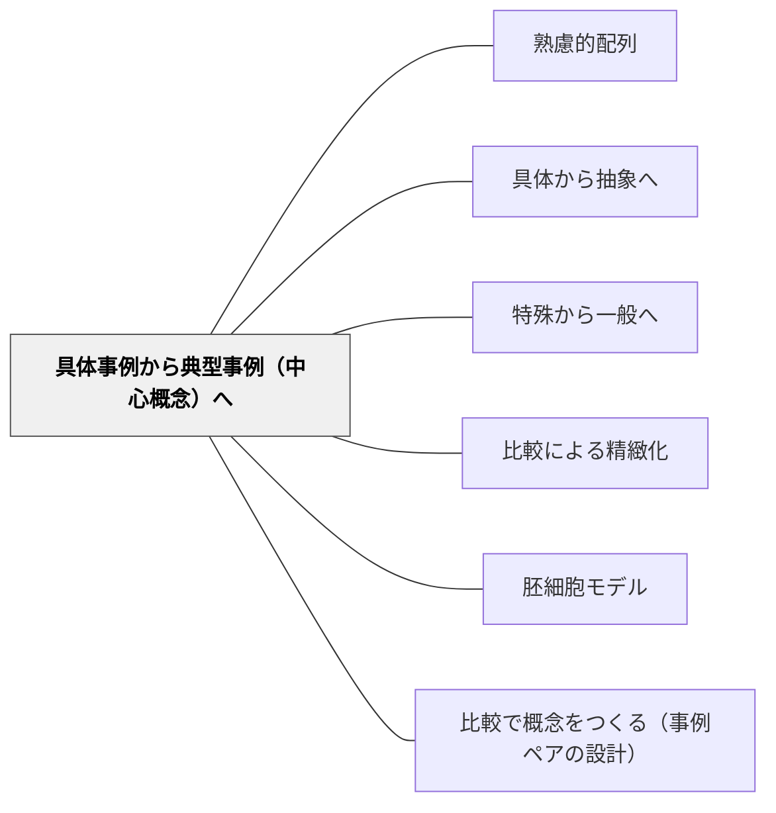

# 具体事例から典型事例（中心概念）へ

> 多くの「例」の中に、その概念の心臓部がある。

## 背景（Context）

[[パタン/熟慮的配列]] の概念形成次元。[[パタン/具体から抽象へ]] でさらに一歩進んだ問いを扱う。学習者が具体事例を集めたとき、次の課題は「その中でもっとも概念の核心を体現している典型事例（プロトタイプ）はどれか」を見極めることである。

## 問題（Problem）

具体事例を羅列しても、学習者の頭の中には「個別の事例の集まり」が残るだけで、概念の中心的構造（何がその概念を「その概念」たらしめているか）は見えてこない。

## 力のかたち（Forces）

- 典型事例はカテゴリ学習を加速するが、典型に引きずられすぎると周辺事例を排除する危険がある
- 「何が典型か」の判断は、文化・文脈によって異なる
- 典型と境界例を両方扱うことで概念の輪郭が明確になる

## 解決（Solution）

**複数の具体事例を収集・比較した後、「その概念をもっともよく示しているものはどれか、そしてそれはなぜか」を学習者に問い、中心概念（核）を言語化させる。**

実践例：
- 「民主主義の事例」を集めた後、「これぞ民主主義という場面を一つ選ぶとしたら？ その理由は？」
- 俳句を複数読んだ後、「もっとも俳句らしい一句はどれ？ 何がそうさせている？」
- 様々な「協力」の場面を見てから、「協力の本質とは何か」を定義する

境界例（「これは当てはまるか？」という事例）を追加することで、典型の定義をさらに鋭くする。

## 結果（Consequences）

- 学習者は概念のプロトタイプ（典型）を内面化し、新しい事例への応用が速くなる
- 「なぜそれが典型か」を説明する過程で、概念の核構造を言語化できる
- 概念の「境界」への感度が生まれ、より精緻な分類思考が育つ

## クラスター図

## Actionable Insight

- 具体事例を数個集めた後、「その中でもっともこの概念を体現しているものはどれか、なぜか」を問う——典型を選ぶ判断の中に概念の核構造の理解が宿る
- 「これは当てはまるか、当てはまらないか」という境界例を1つ提示し、話し合わせる——境界例が概念の輪郭を鋭くする
- 「協力の本質は何か」のような定義づけ活動を、事例を並べた後に設ける——具体→典型→抽象概念の言語化というプロセスが深い概念理解を生む

## 出典

- 一つの教育のパタン・ランゲージ（岩井輝久）

## 関連パタン

- [[パタン/熟慮的配列]] — 上位パタン
- [[パタン/具体から抽象へ]] — 前段階
- [[パタン/特殊から一般へ]] — 一般化の次元
- [[パタン/比較による精緻化]] — 比較によって典型を際立たせる
- [[パタン/胚細胞モデル]] — 中心概念を核として展開する設計
- [[パタン/比較で概念をつくる（事例ペアの設計）]] — 事例群から中心概念へ向かう道のりの最小単位（2事例のペア）を設計する。典型抽出はその拡張形
