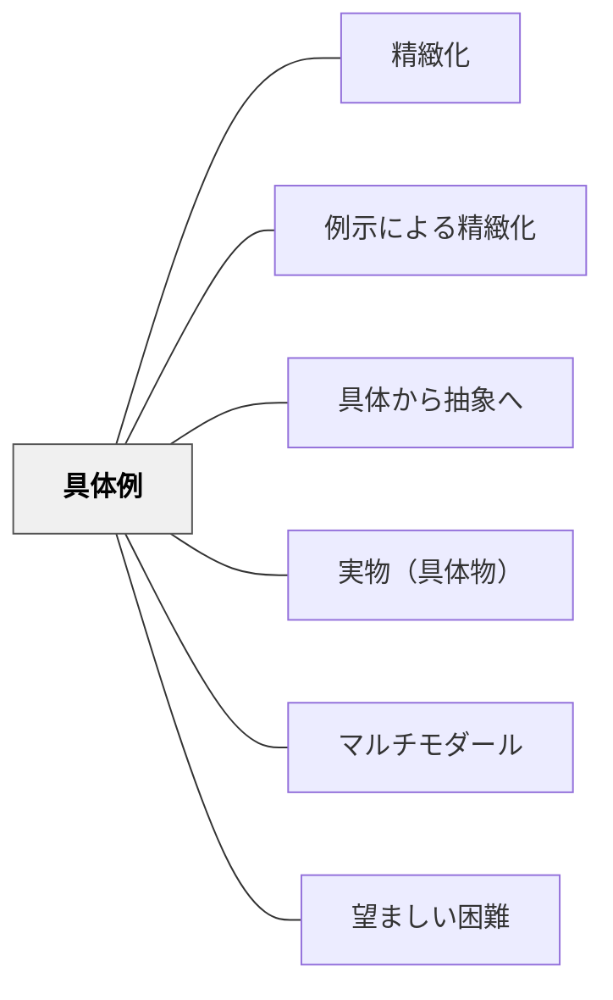

# 具体例

> 1つの例は「その特殊ケース」に見える——多様な文脈からの具体例が、抽象概念の輪郭を形づくる。

## Pattern Connection

**Weinstein & Sumeracki（2018）統合（2026-05-20）**：

*Understanding How We Learn*（東京書籍, 2022）は、具体化（Concrete Examples）を6つの学習方略の1つとして体系化している。

- **既存パタンとの関連**：[[パタン/精緻化]] の子パタン [[パタン/例示による精緻化]] と深く関連する。本パタンは「精緻化の実装手段」としての具体例に焦点を当て、その数・多様性・誤例の役割を独立したパタンとして整理する。[[パタン/具体から抽象へ]] の配列原則と連動する——具体例を先に置き、抽象化を後に続ける設計の根拠を提供する。
- **新しい知見**：具体例の「数と多様性」が記憶定着に決定的に重要——1つの例は「その特殊ケース」に見えるが、異なる文脈からの複数例が概念の一般性を示す。「誤例（non-example）」も概念の境界を明確にする手段として有効。
- **認知的根拠**：新しい抽象概念はワーキングメモリに高い負荷をかける（[[概念/認知負荷理論]]）。具体例がスキーマの「足がかり（hook）」として機能することで、抽象化への認知的橋渡しが生まれる。
- **他のパタンへの波及**：[[パタン/望ましい困難]] との組み合わせ——「複数の例から概念を一般化する」活動自体が望ましい困難の一形式になる。[[実践/学習科学の6方略]] で6方略の一つとして位置づけられた。

## 背景（Context）

教科書や授業では、概念を定義から始めることが多い——「分数とは整体の一部分を表す数です」。しかしこの抽象的な定義は、ワーキングメモリに過剰な負荷をかける。具体的な経験・イメージに接続できない状態では、定義は言葉として処理されても「意味のある知識」として記憶されない。

具体例は抽象概念をスキーマに「引っかける」ための足場だ。しかし具体例が1つだけの場合、学習者はそれを「一般的な概念」ではなく「その特殊な例」として記憶してしまう危険がある。

## 問題（Problem）

1. 抽象的な定義から始める授業では、学習者がワーキングメモリを使い果たし、理解が表面的になる
2. 1つの例だけでは「例外ケース」「この教科固有のケース」に見えて、概念の一般性が伝わらない
3. 学習者が「この例の形でしか使えない」という表面依存（surface-level dependency）を形成する
4. 「これは分数の単元だから分数を使えばいい」という文脈依存が生まれ、転移が起きない

## 力のかたち（Forces）

- 具体例がスキーマの足がかりになる——抽象概念を既有知識に接続するために不可欠
- しかし具体例が1つでは「あの例のこと」という特殊ケースの記憶になる
- 複数の多様な文脈（食べ物・スポーツ・日常生活・自然）からの例が概念の一般性を示す
- 誤例（non-example）が概念の境界を明確にする——「これは○○ではない例」が表面的特徴への依存を防ぐ
- 学習者が自分で例を作る行為が、最も深い概念理解を生む（精緻化との融合）
- 具体例が具体的すぎると「表面的特徴への依存」が生まれる（例：哺乳類＝毛を持つ生き物→クジラで混乱）

## 解決（Solution）

**抽象的な概念を教えるとき、定義より先に複数の多様な文脈からの具体例を示せ。次に、それらに共通するものを学習者に見つけさせる形で抽象化を導く。**

---

### 設計原則1：複数の文脈から具体例を選ぶ

1つの文脈に偏らず、異なる領域・場面から例を選ぶ。

**例：「等分（equal sharing）」の概念**

| 文脈 | 具体例 |
|------|-------|
| 食べ物 | ピザを4人で等しく分ける |
| 時間 | 1時間を4等分した15分 |
| お金 | 100円を4人で等しく分ける |
| 距離 | 1kmを4等分した250m |

→ 「等分」は食べ物の話ではなく、あらゆる量に適用できる普遍的な概念だと学習者が発見する

---

### 設計原則2：誤例（non-example）を示す

概念の境界を明確にするために、「これは○○ではない例」を意図的に示す。

**例：「哺乳類」の概念**

| 例（哺乳類） | 非例（非哺乳類） |
|------------|--------------|
| 犬（毛・母乳・肺呼吸） | ヘビ（変温動物・爬虫類） |
| クジラ（海にいるが哺乳類）← ここが鍵 | サメ（クジラに似た魚類） |
| コウモリ（翼を持つが哺乳類） | 鳥（翼を持つが鳥類） |

→ 非例が「毛がある動物＝哺乳類」という表面的特徴への依存を防ぐ

---

### 設計原則3：学習者に例を作らせる

教師が例をすべて提供するより、学習者が自分で例を作る活動の方が深い理解を生む。

- 「今日学んだ概念の例を自分の身近なものから1つ作ってみよう」
- 作った例をペアで確認し合う（「それは本当に例？それとも非例？」）
- 自分で例を作れない状態＝まだ概念を理解できていないシグナル

---

### 設計原則4：具体→抽象の順序

定義を先に置かない。

❌ よくある順序：
1. 定義を説明する
2. 例を見せる

✅ 推奨する順序：
1. 複数の具体例を見せる
2. 共通するものを学習者に見つけさせる
3. 見つけたものを抽象的な言葉（定義）でまとめる

→ [[パタン/具体から抽象へ]] の配列パタンと一致する

---

## 結果（Consequences）

- 抽象概念の理解と長期記憶への定着が向上する
- 「この例でしか使えない」という表面依存から脱し、別の文脈への転移が生まれる
- 非例によって概念の境界が明確になり、「例外ケースで混乱する」が減る
- 自分で例を作れることが「本当に理解した」状態のシグナルになる
- ただし、複数の多様な具体例の準備には教師の設計コストがかかる

## 関連パタン

- [[パタン/精緻化]] — 具体例は精緻化の実装形式の一つ
- [[パタン/例示による精緻化]] — 具体例と精緻化の交差点（子パタン）
- [[パタン/具体から抽象へ]] — 具体例を先に置く配列原則
- [[パタン/実物（具体物）]] — 物理的な具体物を使う特殊な具体化
- [[パタン/マルチモダール]] — 具体例に視覚情報を組み合わせると記憶経路が増える
- [[パタン/望ましい困難]] — 例から概念を一般化する活動が望ましい困難の一形式
- [[概念/認知負荷理論]] — 抽象概念がワーキングメモリに過剰負荷をかけるメカニズム
- [[実践/学習科学の6方略]] — 6方略の文脈における具体例の位置づけ
- [[文献/認知心理学者が教える最適の学習法（Weinstein & Sumeracki）]] — 一次資料

## クラスター図

## Actionable Insight

- **説明に「例を2つ以上、異なる文脈から」用意する**——食べ物・スポーツ・日常生活など文脈を変えた例を3つ準備してから授業に臨む。1つの例しかない説明は概念が十分に伝わっていない可能性がある
- **「これは○○ではない例」を1つ準備する**——非例が概念の境界を明確にする。「クジラは哺乳類」という教え方より、「クジラは海にいるのに哺乳類——なぜ？」という非例的問いかけが概念理解を深める
- **授業末に「今日学んだ概念の例を自分で1つ作ってみよう」**——自分で例を作れれば理解している。作れなければ理解できていない。採点しなくてよい——学習者が自分の理解をモニタリングするツールとして使う

## 出典

Weinstein, Y., Sumeracki, M., & Caviglioli, O.（2018）. *Understanding How We Learn: A Visual Guide*. Routledge.

山田祐樹（監訳）岡崎善弘（訳）（2022）. 『認知心理学者が教える最適の学習法 ビジュアルガイドブック』東京書籍.

> "Concrete examples are useful because they make abstract ideas more specific, and they can provide links to information already stored in long-term memory." — Weinstein & Sumeracki（2018）
