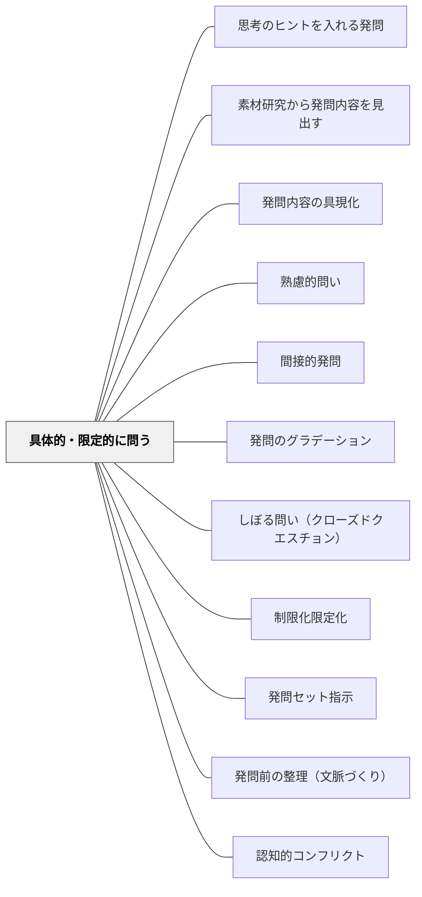

# 具体的・限定的に問う

> 「どんなことに気づきますか」と抽象的に問うのをやめ、「最も印象に残った場面を○行目で答えて」と答え方・範囲・切り口を絞り込むことで、すべての子が考えを表現できる状態をつくる。

## [Pattern Connection]

- **既存パタンとの関連**：[[パタン/間接的発問]] が「ねらいを迂回する」方向の工夫であるのに対し、本パタンは「答え方を絞り込む」方向の工夫であり、両者は発問自体への工夫の二本柱をなす。[[パタン/しぼる問い（クローズドクエスチョン）]] と深く重なるが、本パタンはOCR事例（行番号・テープ・数値化など）の具体的手法に焦点を当てる。
- **補強された点**：抽象的な問いが子どもの「どう考え、どう答えたらいいかわからない」という困惑を生むことを、土居（2026）が実践的に示す。具体物の提示と問いの限定化が同時に機能することも明らかになった。
- **修正・拡張された点**：単なる「クローズドクエスチョン」ではなく、具体物（テープ・図・ICチップ）を組み合わせた「具体物提示＋発問の限定化」というセット技法として整理される。
- **他のパタンへの波及**：[[パタン/制限化限定化]] の実践的下位技法。[[パタン/発問のグラデーション]] において、具体的に問う工夫を削ぎ落とすと「抽象的に問う」段階へと移行する。

## 背景（Context）

授業の問いには「内容」（何を問うか）と「工夫」（どのように問うか）の二つがある。教師が授業のねらいを設定したとき、そのまま言葉にした発問は「どんな気持ちですか」「気づいたことは何ですか」のように抽象的になりやすい。子どもは抽象的に問われると、どのように考え、どのように答えたらいいかわからず、参加の壁が生まれる。

## 問題（Problem）

抽象的な発問では、すでにその問いを自力でこなせる一部の子だけが活躍し、多くの子どもはどこから考えればいいかわからないまま授業が進んでしまう。「どんなことに気づきましたか」という問いに対して、手を挙げられるのはごく少数だ。

## 力のかたち（Forces）

- 抽象的に問われると「何をどう答えればいいかわからない」という困惑が先行する
- 具体的に問われると「どのように考え、どのように答えたらいいかわかりやすくなる」（土居正博（2026））
- 答えの範囲・形式・視点を絞ると、子どもの意識が授業のねらいへと焦点化しやすくなる
- 具体物（テープ・図・数直線・実物など）を示すことで、さらに具体的に問うことが可能になる
- 絞り込みすぎると子どもの思考の広がりが制限される側面もある

## 解決（Solution）

**問いの「内容」は変えずに、答え方・範囲・切り口を具体的に絞り込んで発問する。必要に応じて具体物を提示しながら問う。**

### 抽象的な発問を具体的に変換する

| 抽象的な発問 | 具体的・限定的な発問 |
|---|---|
| 「どんなことに気づきますか」 | 「最も印象に残った場面はどこですか。○ページ○行目で答えてください」 |
| 「感想を教えてください」 | 「あなたが最も印象に残った場面はどこですか（具体的・最も・場面で限定）」 |
| 「人間の歴史はどのくらいか」 | 「黒板に3mのテープを示します。地球の誕生から現在までをこのテープで表すとき、人間はどのあたりで生まれたでしょうか（西尾一氏の実践：向山洋一ほか編（1987））」 |
| 「情景描写とは何か」 | 「この情景描写は、登場人物の気持ちを表すためにありますか。それとも無関係ですか（選択肢で限定）」 |
| 「心情の変化を考えよう」 | 「一番心情が大きく変化した場所（○ページ○行目）を見つけてください（行番号で限定）」 |

### 具体物提示と問いの限定化

西尾一氏の実践では、黒板に3mのテープを示して「人間はどのあたりで生まれたか」と問う。具体物を示すことで：
- 「どう答えたらいいかわからない」という困惑が消える
- 子どもは意欲的に考え、自分の考えを指さしや言葉で表現するようになる

算数では「ICチップ（整数カード・数カード）を並べて」「数直線上のどこに当たるか」などの操作活動と組み合わせた具体的発問が典型例となる。

### 「最も」「○行目」「○つ」など限定語を入れる

- 「最も〜」（最上級で順位を明示する）
- 「○ページ○行目で答えて」（箇所を数値で特定する）
- 「一つだけ選ぶとしたら」（選択肢を1つに絞る）
- 「三つ挙げてください」（答えの数を指定する）

これらの限定語は、子ども达が「どこまで考えればいいか」「何をどれだけ答えるか」を明確にし、参加の敷居を下げる。

## 結果（Consequences）

- どの子も「どう考え、どう答えたらいいかわかりやすくなる」ことで参加が広がる
- 教師の側から見ると、子どもの意識が授業のねらいへと焦点化しやすくなる
- 具体的・限定的な問いを削ぎ落とした「抽象的な問い」が [[パタン/発問のグラデーション]] の上位段階となり、子どもが自立するにつれて移行できる
- ただし、限定しすぎると本来多様な捉え方がある問いを一面的にしてしまう可能性がある

## 関連パタン
- [[パタン/思考のヒントを入れる発問]]
- [[パタン/素材研究から発問内容を見出す]]
- [[パタン/発問内容の具現化]]

- [[パタン/熟慮的問い]] — 発問設計の上位パタン
- [[パタン/間接的発問]] — 発問自体への工夫の並列する一柱
- [[パタン/発問のグラデーション]] — 具体的に問う工夫を段階的に削ぎ落とす
- [[パタン/しぼる問い（クローズドクエスチョン）]] — 答えを限定するという点で重なる
- [[パタン/制限化限定化]] — 限定化の上位概念パタン
- [[パタン/発問セット指示]] — 具体的な問いも指示とセットで設計する
- [[パタン/発問前の整理（文脈づくり）]] — 具体的な問いが機能する前提として文脈をつくる
- [[パタン/認知的コンフリクト]] — 具体的な発問が「考えのズレ」を生んで交流を促す

## クラスター図

## Actionable Insight

- 明日の国語の発問を1つ選び「○ページ○行目で答えて」という行番号指定を加えてみる——どの子も答える箇所が決まり参加しやすくなる
- 「どんなことに気づきますか」を「最も〜なところはどこですか」に言い換える練習をする——「最も」という限定語一つで子どもの焦点化が生まれる
- 算数・理科で実物やカードを示しながら「このどのあたりに当たるか指さしてみましょう」と問う——具体物の提示が「抽象→具体」のギャップを埋める

## 出典

- 土居正博（2026）『自分で考え、学べる子を育てる！ 発問の技術』学陽書房
- 向山洋一ほか編（1987）『第4期教育技術の法則化師』明治図書
- [[文献/自分で考え、学べる子を育てる！ 発問の技術]]

> 「後者は具体的に『最も』『場面』と視点を限定して問うています。子ども達は、抽象的に問われると、どのように考え、どのように答えたらいいかわかりにくくなります。一方、具体的に問われると、どのように考え、どのように答えたらいいかわかりやすくなるのです」——土居正博（2026）
