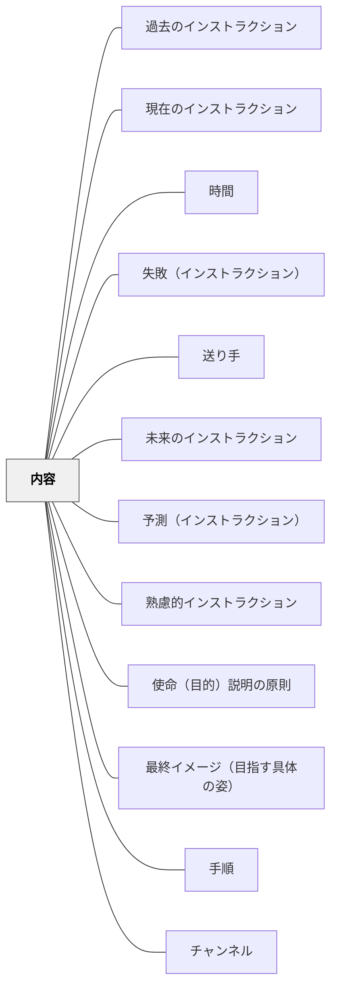

# 内容

> インストラクションのメッセージそのものは、6つの要素で構成される。

## 背景（Context）
インストラクションの「内容」とは、何を伝えるかというメッセージ本体である。チャンネル（言葉・図・映像など）には縛られない独立した概念であり、どのように伝えるかとは区別される。ワーマンの「理解の秘密」はインストラクションを送り手・受け手・内容・チャンネル・コンテクストの5要素システムとして捉え、内容の充実がインストラクションの質を決定づけると示す。

## 問題（Problem）
インストラクションを設計するとき、「どう伝えるか（チャンネル）」に注意が向きすぎて、「何を伝えるか（内容）」が曖昧なまま発せられることがある。内容が不完全だと、どんなに優れたチャンネルを使っても受け手は動けない。

## 力のかたち（Forces）
- 内容はチャンネルと独立しており、同じ内容を複数のチャンネルで伝えられる
- 過去・現在・未来の3種類のインストラクションで求められる内容の要素が異なる
- 6要素（使命・最終イメージ・手順・時間・予測・失敗）はすべて存在するが、場面によって省略できるものもある
- 要素が欠けるほど受け手の不確実性が増す

## 解決（Solution）
**インストラクションを設計するとき、使命・最終イメージ・手順・時間・予測・失敗の6要素を意識的に確認し、場面に応じて必要な要素をそろえる。**

まず「何のためか（使命）」と「どうなれば完成か（最終イメージ）」を固め、次に「どうするか（手順）」を組み立てる。さらに「どれくらいかかるか（時間）」「途中で何が起きるか（予測）」「失敗のサインは何か（失敗）」を加えることで、受け手が迷わず動ける内容になる。

## 結果（Consequences）
- インストラクションの設計が体系的になり、抜け漏れが減る
- 受け手が行動の全体像を持って動けるようになる
- 6要素を意識することで、設計者自身の思考が整理される

## クラスター図

## Actionable Insight

- インストラクションを出す前に「何のためか（使命）」と「どうなれば完成か（最終イメージ）」を自分の中で言語化する——この2要素が揃うだけで受け手の行動の全体像が変わる
- 特に「予測（途中で何が起きるか）」と「失敗（失敗のサインは何か）」を意識して加える——この2要素が欠けると受け手は途中で止まってしまう
- 指示後に「今言ったことでわからない部分はある？」と確認し欠けている要素を補う——確認が設計の抜け漏れを修復し「伝えたつもり」の誤解を防ぐ

## 出典

- 一つの教育のパタン・ランゲージ（岩井輝久）

## 関連パタン
- [[パタン/過去のインストラクション]]
- [[パタン/現在のインストラクション]]
- [[パタン/時間]]
- [[パタン/失敗（インストラクション）]]
- [[パタン/送り手]]
- [[パタン/未来のインストラクション]]
- [[パタン/予測（インストラクション）]]
- [[パタン/熟慮的インストラクション]] — 親パタン
- [[パタン/使命（目的）説明の原則]] — 6要素のひとつ
- [[パタン/最終イメージ（目指す具体の姿）]] — 6要素のひとつ
- [[パタン/手順]] — 6要素の中核
- [[パタン/チャンネル]] — 内容を届ける媒体
