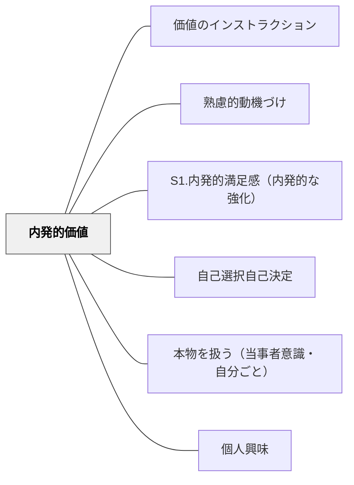

# 内発的価値

> 活動そのものが報酬になるとき、人は外から促されなくても動き続ける。やっていること自体が価値なら、動機は尽きない。

## 背景（Context）
動機付けの研究において、内発的価値（intrinsic value）は最も持続的な動機の源泉とされる。外からの報酬や評価に依存せず、活動それ自体への関心・楽しさ・意味がエネルギーになる状態である。デシ＆ライアンの自己決定理論では、内発的動機付けの核心に位置する。

## 問題（Problem）
多くの学習環境では、テスト・成績・称賛といった外発的動機が前面に出ており、学習者が「活動そのものの価値」を感じる機会が少ない。外発的動機に慣れた学習者は、報酬がない場面での学習継続が難しくなる。

## 力のかたち（Forces）
- 内発的価値は一朝一夕には育たないが、一度育つと非常に安定した動機の基盤になる
- 強制・評価・監視は内発的価値を損なうことがある
- 好奇心・有能感・自律性が満たされると内発的価値が生まれやすい
- 活動への没頭（フロー）体験が内発的価値の実感につながる

## 解決（Solution）
**活動自体の面白さ・達成感・意味を学習者が実感できるよう、環境と課題を設計する。評価よりも経験の質を優先する。**

活動に集中できる時間と空間を確保する、結果だけでなく過程を重視する振り返りを行う、学習者が「やってみたい」と感じる課題を選べる余地を設ける、活動後に「何が楽しかったか」を言語化する機会を作るなどが有効である。

## 結果（Consequences）
- 学習者が報酬がない場面でも自発的に学び続ける姿勢が育つ
- 長期的な学習習慣の形成につながる
- 学ぶことへの肯定的な態度が、生涯学習の基盤となる

## クラスター図

## Actionable Insight

- 課題が終わった後に「今日の活動で一番熱中した・楽しかった部分はどこ？」を1文言語化させる——活動への内発的な関与を言語化することが内発的価値の自覚を育てる
- 点数や評価より「過程で何を発見したか・何が面白かったか」を重視する振り返りを行う——過程への注目が報酬ではなく活動そのものへの価値を育てる
- 「やってみたい」と感じる選択肢を課題に1つ含める余地を設ける——自律的な選択の経験が好奇心・有能感・自律性を満たし内発的動機の土台を作る

## 出典

- 一つの教育のパタン・ランゲージ（岩井輝久）

## 関連パタン
- [[パタン/価値のインストラクション]]
- [[パタン/熟慮的動機づけ]] — 親パタン
- [[パタン/S1.内発的満足感（内発的な強化）]] — 関連パタン（ARCSとの接点）
- [[パタン/自己選択自己決定]] — 関連パタン
- [[パタン/本物を扱う（当事者意識・自分ごと）]] — 関連パタン
- [[パタン/個人興味]] — 関連パタン
