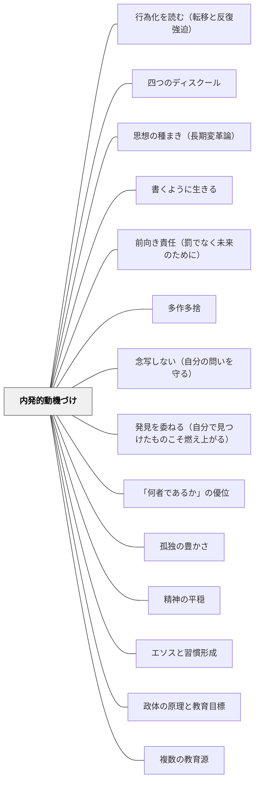

# 内発的動機付け

> 「やらされる」でなく「やりたい」——内側から湧く動機づけは、外から与えられた報酬や罰とは異なる源泉を持ち、長期的な学習・探究・成長の燃料になる。

---

## Pattern Connection

**ショーペンハウアー（1851/2013）「幸福について」統合（2026-05-31）：**

ショーペンハウアーは「三つの財宝」論において、内発的動機付けの哲学的根拠を与える。「その人は何者であるか」（内的性状）が「何を持っているか」（外的報酬）や「いかなるイメージを与えるか」（他者からの評価）を圧倒するという論点は、SDTの「内発的動機が外発的動機を上回る」と構造的に対応する。

- **補強された点**：SDTの「外発的報酬が内発的動機を損なう（過正当化効果）」に対して、ショーペンハウアーは「外的財宝の追求が第一の財宝（内的性状）の育成を阻む」という存在論的な補強を加える。外部評価への過度な集中が「何者であるか」の成長を妨げるという構造
- **「幸福の主観性」と自律性欲求の接続**：「ひとりひとりが生きる世界は、何よりもまず、その人が世界をどう把握しているかに左右される」——SDTの「自律性（自分の意志で行動している感覚）」は、ショーペンハウアーの「主観的な把握の力」として哲学的に深化する
- **波及するパタン**：[[パタン/「何者であるか」の優位]] — 内発的動機付けの哲学的・存在論的根拠；[[パタン/精神の平穏]] — 内発的に動くとき精神の平穏が生まれ、精神の平穏があるとき内発的動機が育つ

---

**ヘルバルト（1806）教育学綱要統合——アペルツィオーンとしての内発的動機：**

ヘルバルトは「興味（Interesse）」を「知的・情緒的関与によって生じる持続的な注意傾向」（§07 注記）と定義し、単なる知識取得と区別した。この「興味」の概念はSDTの内発的動機付けと深く共鳴する。

> 「単なる知識では足りない。人は知識を有していても失っていても、依然として同じ人格にとどまりうる。それに対し、知識を掴み、それを広げようとする者は、そこに興味を抱いているのである。」（§62）

- **「興味とは態度であって情報量ではない」**：ヘルバルトは「興味は態度であって、情報量ではない。だが、知識がなければ興味も具体化しない」（§63）と述べた。SDTの「内発的動機は活動そのものへの関与の質から生まれる」という定義と一致する。情報量を増やすだけでは内発的動機は生まれない。
- **アペルツィオーンと内発的動機の接続**：「教授は孤立した経験を組織化し、既存の知識と同化（アペルツィオーン）させ、児童の自然興味を相互に結び付けて深化させる」（§64）——新しい知識が既有知識と有機的につながるとき「わかった」という内的報酬（有能感）が生まれる。これがSDTの有能感（Competence）欲求の充足と対応する。
- **「連関（Korrelation）」なしに興味は持続しない**：「個々の印象は、他の印象との結びつきがなければ心に定着し難い。ばらばらの体験が海に浮かぶ島のように散在しているだけでは、恒久的な関心へとは育たない」（§64）——孤立した知識が内発的動機を生まない理由の構造的説明。
- **過度な教師主導への警告**：「教授が細部まで児童を導きすぎれば、自立心を失わせる」（§111）——SDTの自律性（Autonomy）欲求の侵食への警告が1806年に既に述べられていた。
- **波及するパタン**：[[パタン/多方興味]] — ヘルバルトの六種興味論の直接応用；[[パタン/先行オーガナイザー]] — アペルツィオーンの実践；[[文献/教育学綱要（ヘルバルト）]] — 本統合の出典

---

**Willingham（2015）統合（2026-05-17）：**

*Raising Kids Who Read* は「過正当化効果（overjustification effect）」を読書文脈で詳細に展開し、報酬・義務・強制が内発的動機を侵食する具体的なメカニズムを示す。

- **Lepper, Greene & Nisbett（1973）の古典実験**：就学前の子どもが自発的に選んでいたマーカーに「good player certificate」を与えたところ、その後マーカーへの興味が顕著に低下した——「賞をもらうためにやった」という解釈が「楽しいからやった」を上書きする。読書ポイント・シール・冊数競争がこれと同じリスクを持つ
- **称賛と報酬の区別**：Willingham は報酬（事前に約束した外発的報酬）と称賛（自発的行動への事後的な反応）を区別する。「読んだら○をあげる」は過正当化効果を生むが、「読んでいたね、どんな本だった？」という関心の表明は生みにくい
- **Playground Analogy（遊び場のアナロジー）**：「毎日20分ブランコで遊びなさい、真剣に」とは言わない——楽しみに義務化は矛盾する。「毎日20分読みなさい」が読書の内発的動機を侵食するのも同じ構造。義務化された活動は「仕事」になる
- **academic reading vs pleasure reading の区別**：学校での読書の多くは学術的目的を持つ（教科書・課題）。この「学術的読書」と「自発的な娯楽読書（pleasure reading）」を生徒に明示的に区別することで、後者への内発的動機を保護できる（Gallagher, 2009）——「これは学習の読書。自由読書はまた別」という枠組みの明示
- **授業内プレジャーリーディングの5条件**（Kamil, 2008）：内発的動機を守る授業内読書には5条件が必要（最低20分・自由選書・豊富な本・読書コミュニティ・教師の積極的指導）。特に「教師が自分の本を読むのでなく生徒の読書を支援・観察する」が成功の鍵
- **読書観の家庭的フレーミング**（Baker, 2003）：「読書はエンターテインメントだ」と伝える家庭の子は読書成績が高い——これは SDT の「自律性」欲求と「活動のフレーミング（何のためにやるかの解釈）」が動機の質を決めることを示す実証

---

### 牧口常三郎（1930）——教師の動機付け四段階：報酬から教育そのものへの愛へ

牧口は *創価教育学体系 第4巻*（教育技術論）において、教師のモチベーション（なぜこの仕事をするか）が四段階の発達を辿ると論じた。Deci & Ryan の自己決定理論（SDT）とは独立して、同じ原理を1930年代に定式化した先駆的な洞察である。

**教師の動機付け四段階**

| 階級 | 動機の源泉 | 内容 |
|---|---|---|
| **第一階級** | 報酬・俸給 | 給料・雇用保障のために教える。仕事はあくまで生計手段 |
| **第二階級** | 名誉・地位 | 学校・社会での評判・昇進・尊敬を得るために教える |
| **第三階級** | 児童への愛 | 子どもへの愛情・情熱で教える。子どもが好きだからやる |
| **第四階級** | 教育の仕事自体への内発的興味 | 「教育法・学習指導そのものへの方法的関心」から動く。教え方を研究すること自体が楽しい |

牧口はこの四段階について具体的に観察した：

> 「新卒業生などの熱心する最初の動機は子供の愛にあるがため、受持ちの交替に和して失望した結句、校長を怨み、いつしか熱がさめる傾向がある」

つまり第三階級（児童愛）の動機は、環境の変化（クラス替え・転勤）で消えやすい。しかし第四階級（方法への内発的関心）は「金持ちを目的とした利殖家が、遂には金そのものへの興味を超えて仕事への没頭者になる」ように、仕事の本質に向かう動機として持続する。

**SDT との対応と深化**

| Deci & Ryan（SDT）の概念 | 牧口の対応 |
|---|---|
| 外発的動機（報酬・罰） | 第一・第二階級 |
| 内発化された動機（アイデンティティ・自律的外発） | 第三階級（児童愛） |
| 内発的動機（活動自体への興味） | 第四階級（教育法への方法的関心） |

SDT では「活動そのものへの内発的動機」が最も持続的で質の高い動機だとする——牧口はこれを1930年に「教育の術の発展とは、方法その物に興味が転移すること」と表現した。

**教育実践への含意**

教師が第四階級に到達すると何が変わるか：
- 「この子を教えるのが嫌いだ」という感情（第三階級の陰）に動かされなくなる
- 研究・省察が義務でなく楽しみになる
- 「うまくいった・いかなかった」の両方から等しく学べるようになる（認識先行）

- **他のパタンへの波及**：[[パタン/教師の三方面修養]]（第四階級の実現には三方面の修養が必要）・[[パタン/守・破・離（習熟の三段階）]]（第四階級は「離」の段階の動機的基盤）

---

**実践理性批判１（中山元訳）統合：**

カントの実践理性批判（1788）は、外発的動機と内発的動機の区別に哲学的な根拠を与える。

- **幸福原理 = 自愛の原理（Selbstliebe）**：カントは「幸福の追求」を「自愛の原理」と規定し、経験的・主観的・不確定なものとして位置づけた。学習者が「点数を取りたい」「褒められたい」「楽しいから」という動機で動くとき、これはすべて幸福原理（自愛の原理）の表れであり、外発的動機付けの哲学的基盤と一致する
- **道徳原理 = 理性に基づく客観的原理**：道徳法則（「全員がこうすべき」という普遍的原理）は幸福原理と対比される——命令形式が定言的（無条件）であり、知性の質が純粋理性に基づく。SDTの「内発化された動機（義務が真に自分のものになった状態）」の最深部はこの道徳原理に対応する
- **上級・下級の欲求能力**：カントは欲求能力を「下級（感性・傾向性・欲望に基づく）」と「上級（理性・道徳法則に基づく）」に区別する。SDTの連続体（外発的→内発的）は、カントの下級の欲求能力から上級の欲求能力への移行として理解できる
- **教育設計への含意**：外発的動機付け（褒賞・罰）は下級の欲求能力に働きかける。内発的動機の最深部は上級の欲求能力——「これが正しいから、自分がすべきだから行う」という道徳的動機に至る。Deci & Ryan が「自律性」を最も質の高い動機づけとするとき、カントはその哲学的根拠を1788年に提示していた
- **補強するパタン**：[[パタン/道徳的自律]] — 内発的動機の最深部は道徳的自律（自己立法）と一致する。[[文献/実践理性批判１（カント、中山元訳）]] — 本統合の主出典

---

### Dewey（1909）Moral Principles in Education 統合（2026-05-31）：

Deweyは1909年に「恐怖と競争心（fear and emulation）」を道徳的観点から最も有害な動機として批判した：

> "Practically all teachers would admit that emulation and the motive of fear are at bottom undesirable motives... the habit of being stimulated to activity by these undesirable motives is a positively harmful one, even though the result—the actual lesson learned—may be satisfactory."（Ch.3）

また「遠い将来への動機」批判も明示した：「大人になって役立つ」という動機は子どもの現在の関与には届かない——「道徳的訓練は未来への準備ではなく、現在の生活の質の問題である」。

SDT（自律性・有能感・関係性）の哲学的前身として：

| Deweyの概念（1909） | SDTの対応概念（2000） |
|---|---|
| 現在の社会的共同活動への関心（social interests） | 関係性（Relatedness）欲求の充足 |
| 競争心・恐怖の批判 | 外発的動機による過正当化効果の批判 |
| 将来への動機の無効性 | 外発的動機が内発的動機を侵食するメカニズム |
| 社会的知性（social intelligence） | 自律性（Autonomy）欲求——共同活動の中で判断する |

- **既存パタンとの関連**：Deci & Ryan（2000）・Willingham（2015）の「過正当化効果」批判とDeweyの「恐怖と競争心」批判は、「外から報酬・恐怖で動かすことが内発的動機を損なう」という同じ構造を示す。Deweyの批判は1909年時点でより哲学的・道徳的な文脈から定式化されていた。
- **ルソー（1755）との三者接続**：Deweyの「競争心（emulation）」はルソーの「利己愛（amour propre）」と同型である——どちらも「他者との比較から生まれ、内側の動機を腐敗させる社会的感情」として批判される。ルソーは哲学的・人類史的な診断を示し、Deweyは教育実践の道徳的問題として定式化し、Deci & RyanのSDTは実験的に実証した——三者は150年を超えて同じ問いに独立して到達した。
- **補強された点**：内発的動機付けの理論は20世紀後半の心理学（SDT）だけでなく、プラグマティズム哲学（Dewey, 1909）に深い根拠を持つ。「現在の社会的共同活動への関心」こそが内発的動機の社会的源泉であるという主張は、SDTの関係性欲求と有能感欲求の社会的側面を哲学的に支える。
- **他のパタンへの波及**：[[パタン/胚細胞的コミュニティとしての学校]]（現在の社会的関心を動機の基盤とするコミュニティ設計）；[[パタン/利己愛の罠（比較が内発的動機を壊す）]] — emulation（競争心）とamour propre（利己愛）の接続を独立パタンとして展開

[[文献/Moral Principles in Education（Dewey）]]

---

### クセノフォン（前370年代）——「徳への憧れ」という最古の内発的動機論

クセノフォン『ソクラテスの思い出』（相澤拓訳、光文社古典新訳文庫 2022）は、現代のSDT（自己決定理論）より2300年前に、内発的動機付けの核心を記述していた：

> 「多くの人々をそれら[の悪徳]から解放し、**徳への憧れをもたせる**とともに、自分自身に配慮するなら、やがて善美の人となるという期待を抱かせることによって」——クセノフォン（第一巻序章）

ソクラテスの教育戦略の核心は、学習者の中にある「より善くありたい」という根源的な欲望（徳への憧れ）を呼び起こすことだった。これは外から報酬・罰で行動を操作するのではなく、**内側にすでにある動機の種に火をつける**というアプローチ。

**プロディコスのヘラクレス（第一巻第一章）：物語による動機の活性化**

ソクラテスが語るヘラクレスの岐路の物語は、内発的動機付けの技法の実例：
- 「悪徳（安逸・快楽）」と「徳（労苦・卓越性）」の二つの道を物語として提示する
- どちらが良いかを教えるのではなく、**選択を学習者に委ねる**
- 「神々は労苦なしに善いものをお与えにならない」という確信が、徳の道を選ぶ動機となる

- **既存パタンとの関連**：Deci & Ryanの自律性欲求（Autonomy）は、ソクラテスの「学習者に選択を委ねる」アプローチと完全に対応する。ヘルバルトの「興味は態度であって情報量ではない」（既に統合済み）に対し、クセノフォンは「興味の起点は憧れである」という古典的定式化を提供する。
- **補強された点**：過正当化効果（Willingham統合済み）が「外からの報酬が内発的動機を侵食する」ことを示すとすれば、クセノフォンは「内側の憧れを呼び起こすことが動機付けの代替戦略」であることを示す——否定と肯定の両面から内発的動機の設計原理が揃う。
- **波及するパタン**：[[パタン/ヘラクレスの岐路]] — 徳への憧れを物語で活性化する具体的技法；[[パタン/エンクラテイア（自制の鍛錬）]] — 憧れを行動に変えるための実践的基盤；[[文献/ソクラテスの思い出（クセノフォン）]] — 本統合の出典

---

**北大路翼（2019）生き抜くための俳句塾 統合（2026-06-02）：道楽——内発的動機の実践語**

北大路翼は「道楽」という日本語で内発的動機付けの核心を語る。

> 「道楽でたいていのことは学べる。」——北大路翼（2019）第一講

> 「遊んで遊んで遊びまくって蓄えた経験が俳句の財産だ。」——おわりに

> 「俳句は作者そのものだ。人間を鍛えることが俳句を鍛えることに他ならない。鍛えるなんて言うと難しそうだが、要は遊べばいい。」——おわりに

Deci & RyanのSDTが「外発的動機vs内発的動機」という学術的二項対立で論じるものを、北大路翼は「道楽」という一語で圧縮する。道楽とは「本能と遊ぶこと」——金子兜太の句「酒止めようかどの本能と遊ぼうか」に北大路翼が見た「軽み」と「達観」がそれを示す。

**「感じることが表現の勉強。覚えることではない」という動機論：**
「学ぶとは盗むこと。感じることが表現の勉強だ。覚えることではない」——これはSDTの「有能感（できる）」を超えて、活動への感覚的・感情的関与そのものが学習の本体であることを示す。「覚えること」が外発的動機（評価・テスト）と結びつきやすいのに対し、「感じること」は内発的なものとしかつながらない。

**「面白い奴が面白い俳句を作れるとは限らないが、つまらない奴は面白い俳句を作れない」：**
内発的動機付けの結果は「有能になること」だけでなく「何者であるか」と直結する——ショーペンハウアー「その人は何者であるか」（既統合）との共鳴。人格と作品の一致（「俳句は作者そのもの」）が内発的動機付けの最深部にある命題。

- **既存パタンとの関連**：SDTの「自律性」欲求（自分の意志で行動している感覚）と「道楽」は対応する。「道楽でたいていのことは学べる」は「遊びが役に立たないから価値がある」という逆説——活動の目的が活動の外にないとき（道楽）、最も深い学習が起きる
- **補強された点**：内発的動機付けの理論に「道楽」という日本語の実感語が加わる。「楽しいからやる（内発的）」の特殊形として「遊びそのものへの没入（道楽）」を位置づけられる
- **他のパタンへの波及**：[[パタン/タウマゼイン（驚きから始まる探究）]] — 怒り・余差・不満も内発的動機の源泉；[[文献/生き抜くための俳句塾（北大路翼）]] — 本統合の出典

---

**ベルクソン（1919）精神のエネルギー 統合（2026-06-02）：歓び（Joy）と快楽（Pleasure）——内発的動機の質的指標**

ベルクソンは『精神のエネルギー』第I章「意識と生命」において、**歓び（Joy）と快楽（Pleasure）を本質的に区別**した：

> 「歓びのあるところにはどこにも創造がある。創造の豊かさと活力が強ければ強いほど、歓びは深い。」——ベルクソン（1919/2012）

- **快楽（Pleasure）**：受動的な享受。努力なしに得られる。消費・受け取ることから生まれる。
- **歓び（Joy）**：創造の印（シグナル）。自分の内から何かを引き出したとき生まれる。困難を越えて何かを作り上げたときの感覚。

この区別は、内発的動機付けの設計に重要な視点を加える。SDTが「動機の源泉（内から vs 外から）」を問うとすれば、ベルクソンは「動機の質的指標（歓び vs 快楽）」を提供する：

| | Deci & Ryan（SDT） | ベルクソン（精神のエネルギー） |
|---|---|---|
| 問い | 動機はどこから来るか | 動機の質はどう見分けるか |
| 外発的動機 | 報酬・罰・評価から | — |
| 内発的動機 | 活動そのものへの関心から | 歓び（創造）が伴う |
| 指標 | 自律性・有能感・関係性 | 歓びの有無（創造の有無） |

「楽しかった（快楽）」という感想と「何かが生まれた感じ（歓び）」という感想は、活動の質として区別できる。教師は「楽しかったか」ではなく「何か作り出せた感覚があるか」を問うことで、内発的動機の深さを診断できる。

- **既存パタンとの関連**：SDTの「有能感（Competence）」が「できる感覚」を動機の条件とするのに対し、ベルクソンの「歓び（Joy）」は「創り出した感覚」を内発的動機の証拠として提示する。「できる」と「創る」は重なるが同一ではない——より高次の内発的動機は「創造（歓び）」に根ざす。
- **補強された点**：「過正当化効果（外発的報酬が内発的動機を侵食する）」を逆から見ると：外発的報酬があるとき「創造（歓び）」が起きているかを確認すればよい。歓びが消えていれば創造が失われている証拠。
- **他のパタンへの波及**：[[パタン/作ることで学ぶ]] — 歓びは「作ること」の核心的成果；[[パタン/タウマゼイン（驚きから始まる探究）]] — 驚き（タウマゼイン）が探究を駆動し、歓び（Joy）が創造を証拠立てる

[[文献/精神のエネルギー（ベルクソン）]]

---

**スピノザ（1677）Spinoza on Free Will（Kisner, 2026）統合——コナトゥスと能動的感情：内発的動機の存在論的根拠**

スピノザの倫理学は、内発的動機付けの「なぜ内側から動く力があるのか」という問いに存在論的な答えを与える。

> すべての有限なものの本質はコナトゥス（自己の存在を維持し力を増大させようとする力）である（3p7）。喜びは力の増大への移行であり、欲望はコナトゥスが意識されたもの。

- **SDTとコナトゥスの接続**：Deci & Ryan の「内発的動機は活動への自然な関与から生まれる」という定義の哲学的基盤がコナトゥスにある。SDTが「自律性・有能感・関係性の三欲求が満たされると内発的動機が育つ」と言うとき、スピノザは「それはコナトゥスが阻害されていないからだ——自己の本性から行動できているから」と根拠づける。
- **能動的感情 vs 受動的感情**：スピノザの最も重要な動機論的区別。能動的感情（コナトゥスから自然に生まれる感情——「面白い・知りたい・やりたい」）は内発的動機の発現。受動的感情（外部から引き起こされる感情——「褒められたい・怖い・恥ずかしい」）は外発的動機の発現。SDTが「内発的 vs 外発的」と言う分類を、スピノザは「自己原因的 vs 外部原因的」という存在論的言語で説明する。
- **「コナトゥスを阻害しないことが先決」という逆転の視点**：SDT・Willingham・Deweyが「どう内発的動機を育てるか」を問うのに対し、スピノザは「すべての存在がコナトゥスを持つのだから、阻害しないことが先決」という逆転の視点を与える——「やる気を引き出す」でなく「やる気を損なっている何を取り除くか」。
- **過正当化効果のスピノザ的説明**：Lepper（1973）の過正当化効果（外発的報酬が内発的動機を侵食）は、スピノザ的には「活動の原因が自分の本性（コナトゥス）から外部（報酬）に移ること」として説明できる——活動の外に目的が生まれると、活動自体がコナトゥスの発現でなくなる。
- **補強された点**：内発的動機付けの理論に「なぜ外発的報酬が内発的動機を侵食するのか」の存在論的説明が加わる。SDTの「自律性」欲求の哲学的根拠として、スピノザの「自己の本性から行動すること（1DEF7）」が機能する。
- **波及するパタン**：[[パタン/コナトゥス（自己保存と自己拡張の力）]] — コナトゥスの詳細；[[パタン/自己選択自己決定]] — 内発的動機が「自己の本性から動く」ときに実現する学習設計（旧パタン「自己決定としての学び」を統合済み）；[[文献/Spinoza on Free Will（Kisner）]] — 本統合の出典

---

**フロイト（1911–1921）「フロイト、無意識について語る」統合（2026-06-03）：快感原則と現実原則——内発的動機付けの発達的基盤**

フロイトは教育を「快感原則を克服して現実原則を採用させることを促進する営み」と定義した（1911年論文）。この定義は、内発的動機付けの「発達的基盤」を照射する。

- **快感原則（Lustprinzip）→ 現実原則（Realitätsprinzip）の転換**：SDTが「自律性・有能感・関係性」を内発的動機の三条件として定義するとき、その前提には「現実に適応しながらも内側から動く」という発達がある。快感原則のみに支配されている状態（即座の満足・不快の回避）から、現実原則（延期・適応・思考）への移行が、内発的動機付けの発達的地盤になる
- **「愛の条件性」と動機設計**：「甘やかされた子供が何しなくてもそうした愛を手にすることができ、いかなる場合にもこの愛を失うことがないと信じるならば、教育は失敗するのである」（フロイト、1911年論文）——無条件の承認が動機形成を阻む構造。近年の「ありのまま承認」と、この「愛の条件性」の緊張関係は、承認の設計問題として読める
- **「分かっても変わらない」の構造**：SDTは動機の「質」を扱うが、フロイトの徹底操作（Durcharbeiten）は変化の「速度」を問う。内発的動機を育てることも、一回の体験で達成されるものではなく、繰り返しの向き合いを通じて変容する
- **補強された点**：過正当化効果（外発的報酬が内発的動機を侵食）に対して、フロイトは「愛の条件性」という逆方向の問いを立てる。「与えすぎる愛（承認）」と「与えすぎる報酬」の両方が、動機形成を阻む構造として対応する
- **波及するパタン**：[[パタン/行為化を読む（転移と反復強迫）]] — 内発的動機が育たない深層にある反復強迫への視点；[[概念/無意識と教育]] — 快感原則・現実原則の教育的文脈；[[文献/フロイト、無意識について語る（中山元訳）]] — 本統合の出典

---

**ルソー（1755）人間不平等起源論 統合——amour de soi と amour propre：内発的動機の哲学的根源**

ルソーは1755年に、内発的動機（amour de soi）と外発的動機（amour propre）の区別を哲学的に定式化した——SDTが20世紀後半に実証的に示したことの先駆である。

> 「自己愛は自然な感情であり、すべての動物たちはこの自己愛のために自己保存に留意するようになる。人間においては、理性に導かれ、憐れみの情によって姿を変えられることを通じて、自己愛から人間愛と美徳が生まれる。これにたいして利己愛は、社会の中で生まれる相対的で人為的な感情である」——注一五

| ルソーの概念 | SDTの対応 | 学校での表れ |
|---|---|---|
| amour de soi（自己愛）| 内発的動機 | 「知りたい」「できるようになりたい」 |
| amour propre（利己愛）| 外発的動機（比較・評価依存） | 「あの子より上になりたい」「褒められたい」 |

- **「比較」が利己愛を生む構造**：ルソーは「誰もが他人を眺め、誰もが他人に眺められたいと思うようになる」瞬間が「不平等と悪徳の最初の一歩」と論じた。学校の成績順位・序列化・競争は、この比較構造を日常的に作動させる。
- **補強された点**：過正当化効果（Willingham）が「外発的報酬が内発的動機を侵食する」と実証的に示すとすれば、ルソーはその哲学的根拠を提供する——「比較という構造そのもの」が内側からの動機（amour de soi）を利己愛（amour propre）に変換するメカニズム。コナトゥス（スピノザ）の受動的感情論との共鳴もここにある。Deweyの「競争心（emulation）」批判（1909年、既統合）は、amour propreの教育的形態の最も明確な批判として読める——ルソー（1755）→Dewey（1909）→SDT（2000）は同一の問いへの150年を超えた独立的到達である。
- **波及するパタン**：[[パタン/利己愛の罠（比較が内発的動機を壊す）]] — 本統合の中心内容を独立パタンとして展開；[[文献/人間不平等起源論（ルソー）]] — 本統合の出典；[[文献/Moral Principles in Education（Dewey）]] — emulation批判（1909）との三者接続

---

**うみ子（海が走るエンドロール）——amour de soi の物語的体現（2021）：**

たらちねジョン『海が走るエンドロール』（2021）は、amour de soi（内側からの動機）とamour propre（他者視点からの自己評価）の葛藤を65歳の主人公・うみ子を通じて描く。

> 「自分は映画が撮りたい側の人間なのだ」——うみ子（映画館で美大生・海の映画を観た後の自己発見）

> 「老後の趣味だから」——うみ子（amour propre的縮小ラベル）

> 「若いとか関係ない」——美大生からうみ子へ（amour propre的制限の解体）

| うみ子の状態 | ルソーの対応概念 | 内発的動機付けの観点 |
|---|---|---|
| 「映画が撮りたい」という衝動 | amour de soi（内側からの本物の動機） | 外発的報酬に依存しない動機の源泉 |
| 「老後の趣味だから」という縮小 | amour propre（他者視点からの自己評価） | 動機を矮小化する外的ラベリング |
| 「若いとか関係ない」での解放 | amour propre的制限の解体 | 外的制限が取り除かれて動機が回復 |
| 65歳での映画学科入学 | perfectibilité の発動 | 動機が行動に転化した状態 |

- **amour de soi の具体的形態**：「映画が撮りたい」という動機は、他者からの承認・年齢的「適切さ」・社会的評価と無関係に存在する。この純粋さがamour de soi の体現。一方「老後の趣味」というラベルは、他者の目（社会的な「65歳女性の趣味」像）からの自己規定——amour propre の働き。
- **「若いとか関係ない」という言葉の構造**：amour propre（年齢比較による自己制限）が解体されるとき、amour de soi（本来の動機）が再び表面に出る。これは学習者が「どうせ私には無理」「算数が苦手だから」と言うとき、その思い込みの解体と同型。
- **perfectibilité（可完成性）との接続**：65歳での変化は、ルソーの「状況に応じていつでも変化できる能力」の最も純粋な体現。年齢・状態による「もう遅い」という制限が、perfectibilité の信頼によって解体される。
- **波及するパタン**：[[パタン/遅咲きの一歩（perfectibilité - いつからでも）]] — うみ子の物語から起こした新規パタン；[[文献/海が走るエンドロール 1（たらちねジョン）]] — 第1巻の出典

**うみ子（海が走るエンドロール 9）——amour de soi的評価の純粋形（2026）：**

第9巻では、amour de soi評価の最も純粋な形が言語化される。

> 「数字どうこうは 置いといてさ 最高だった」——（うみ子の映画を観た人物）

> 「クオリティ低いし粗いし 美術も音声も 最悪やった でも好きって 言ったんだろ」

「数字を置いといて」は、amour propre（再生回数・評価点という外部指標）を括弧に入れて、amour de soi（内側からの体験）で評価する行為の明示的な宣言である。そして：

> 「俺の自信って うみ子さんに もらってるところが」——海

> 「好きに自信があるやつは 嫌いに自信はあるねんけどな」——（うみ子または海）

「自分の好きに自信がある」= amour de soi が安定しているとき、「嫌いなもの（自分の審美的基準）」にも自信が持てる。内発的動機付けの成熟した形：「面白いと思うもの」への確信が、「面白くないもの」への明確な判断力も育てる。

- **amour de soi的評価の訓練可能性**：「数字を置いといて 最高だった」という感覚は、一回一回の「内側の評価」の積み重ねで育つ。毎回の作品制作後に「点数を見る前に、これは自分にとって何が最高だったか」を問う習慣が、amour de soi的評価軸を育てる。
- **「存在することで他者の自信を支える」という関係性**：海がうみ子の「旅の姿」から自信を得る——これはSDTの関係性欲求（Relatedness）の最も深い形。教えることなく、変化し続けることで他者の自信の源になる。
- **波及するパタン**：[[パタン/前へ進む力（不完全さを推進力に）]] — 「数字を置いといて 最高だった」を独立パタンとして展開；[[文献/海が走るエンドロール 9（たらちねジョン）]] — 本統合の出典

---

## 背景（Context）

Edward Deci と Richard Ryan の**自己決定理論（Self-Determination Theory: SDT）**は、動機づけを「外発的（Extrinsic）」と「内発的（Intrinsic）」に区別し、人間の行動の質は動機づけの種類によって根本的に異なると主張する。

**内発的動機付け（Intrinsic Motivation）**——活動そのものへの興味・楽しさ・好奇心から行動する状態。

外発的動機付け（Extrinsic Motivation）——報酬・罰・評価・他者からの期待に応えるために行動する状態。

SDT は、人間には3つの基本的心理欲求があり、これが満たされるとき内発的動機が育つとする：

| 欲求 | 意味 | 学習での具現 |
|---|---|---|
| **自律性（Autonomy）** | 自分の意志で行動している感覚 | 課題・方法・ペースを選べる |
| **有能感（Competence）** | 「できる」という効力感 | 適度な挑戦・成功体験の累積 |
| **関係性（Relatedness）** | 他者とつながっている感覚 | 認められる・協力できる関係 |

Daniel Pink（2009）は*Drive*でこれを企業・教育文脈に展開した：「ルーティン作業は外発的動機で動くが、創造的・認知的な作業は内発的動機でしか動かない」。

## 問題（Problem）

学校の多くの仕組みが外発的動機付けを前提に設計されている：

- 成績・評価——よい点を取るために学ぶ
- 称賛・ご褒美——ほめられるためにやる
- 罰・プレッシャー——叱られないようにやる
- ランキング・競争——他より上になるためにやる

Deci の研究が示した「**過正当化効果（Overjustification Effect）**」：もともと内発的に好きだった活動に外発的報酬を与えると、報酬がなくなったとき動機が下がる——「先生に言われるからやる」が「楽しいからやる」を上書きする。

## 力のかたち（Forces）

- 内発的動機は長期的な学習継続の燃料——外発的動機は行動を生むが長期維持しない
- 自律性・有能感・関係性の3つが揃うと内発的動機が育つ
- 外発的報酬の追加は、すでに内発的に動いている活動の動機を下げる可能性がある
- 「難しすぎる（フロストレーション）」も「簡単すぎる（退屈）」も内発的動機を損なう
- 選択の自由は自律性を支える最も直接的な手段
- 「なぜこれをやるのか」が見えないと関係性・目的が失われる

## 解決（Solution）

**3つの基本的心理欲求（自律性・有能感・関係性）を満たす学習環境を意図的に設計し、外発的動機への過度な依存を避ける。**

---

### 自律性を支える設計

- **選択の機会を作る**：「どの問題から解くか」「どの本を読むか」「どんな方法でやるか」——小さな選択でも自律性の感覚は生まれる
- **理由を説明する**：「この課題は○○のためにある」と目的を伝える——「なぜやるか」が見えると内発的になる
- **過度な監視を減らす**：観察はするが管理はしない——「見られているからやる」を減らす

### 有能感を支える設計

- **適切な難度の設定（スウィートスポット）**：少し難しいが頑張ればできる課題——フロー理論のチャレンジとスキルのバランス
- **失敗を安全にする**：間違いが罰でなく学習の一部として扱われる文化（[[パタン/失敗（インストラクション）]]）
- **成長を可視化する**：「できるようになったこと」を振り返る機会——有能感は比較でなく成長から

### 関係性を支える設計

- **認められる体験**：「あなたの考えが聞きたい」「あなたならできると思う」——存在の承認
- **協力関係**：他者と一緒に何かを作る・解く体験が関係性欲求を満たす
- **教師との信頼関係**：「この先生は自分のことを気にかけてくれる」という感覚

---

### 外発的動機付けとの折り合い

SDTは外発的動機付けを全否定しない。評価・フィードバック・称賛は設計次第で内発的動機と共存できる：

| 外発的要素 | 内発的動機を守る使い方 |
|---|---|
| **称賛** | 「えらい」より「○○ができていた」——行動・プロセスへの具体的フィードバック |
| **評価・成績** | 「できたこと」の確認として使う。ランキング・競争への転化を避ける |
| **ご褒美** | 予期しない報酬は内発的動機を損なわない。事前の「やったらあげる」が問題 |
| **義務・課題** | 「なぜやるか」を伝え、選択の余地を残す——自律性の感覚を壊さない |

---

### アリストテレス（前335年頃）——ニコマコス倫理学 第一〜二巻

> 「美しい行為に快さを感じない人は善き人ではないことになる。というのも、だれも、正しく行為することに快さを感じない人を『正しい人』と呼ばないし、気前の良い行為に快さを感じない人を『気前の良い人』と呼ばないからである。」（第一巻第八章）

アリストテレスは内発的動機付けの哲学的基盤を2400年前に示した。**徳に基づく活動はそれ自体として快い**——快さが徳の形成の証拠であり、快さの伴う活動が継続・深化する。

> 「ちょうどオリュンピア競技において栄冠を手にするのが、最高の美しさと最高の力強さをそなえた人々ではなく、実際に競技する人々であるように、人生における美しく善き事柄についても、実際に行為する人々こそがそれらを勝ち取る人々である。」（第一巻第八章）

- **SDTとの接続**：アリストテレスの「徳に基づく活動が快い」は、SDTの「自律性・有能感・関係性の欲求が満たされるとき活動が内発的に動機付けられる」と構造的に対応する。徳の活動が「快い」のは、有能感（できている）・自律性（選んでいる）・関係性（共同体に貢献している）の三欲求が充足されているから。
- **快苦の方向付けが教育の核心**：「人はごく若い頃から早々に喜ぶべきものを喜び、苦痛を感ずべきものに苦痛を感じるよう導かれなければならない。正しい教育とはこのこと以外のなにものでもない」（第二巻第三章）——内発的動機付けの形成は「喜ぶべきものへの快さ」を育てること。
- **補強された点**：内発的動機付けはSDTが言うように「外から侵食されないもの」ではなく、習慣形成（[[パタン/エソスと習慣形成]]）によって「正しいものを快いと感じる感受性」として育てられるものでもある。

[[文献/ニコマコス倫理学（上）（アリストテレス）]]

---

### 読書指導における内発的動機付け

[[パタン/アリテラシー（読む意志）]]（Layne, 2009）との接続：

- 読む意志（WILL）= 読書への内発的動機
- 読書アイデンティティ（Willingham）= 「自分は読む人間だ」という内発的自己像
- 外発的読書（義務・評価・ご褒美）が内発的動機を侵食する過正当化効果は、読書嫌いの一因

---

## 結果（Consequences）

- 3つの欲求が満たされると、学習が「やらされること」から「やりたいこと」へと変わる
- 学校を出た後も学び続ける生涯学習者が育ちやすくなる
- 過正当化効果への意識が、善意の外発的介入（ご褒美・強制読書）を再考させる
- ただし、外発的動機と内発的動機は完全に分離できない——設計の問題は常に程度と文脈の問題

⚖ **緊張関係**: [[緊張関係マップ]] — [[パタン/ゴールドスター]]・[[パタン/ポジティブフィードバック]]・[[パタン/S2.報酬のある成果（外発的な報酬）]] と拮抗する。判断軸：〈プロセスへの情報か操作かで選ぶ〉

## 関連パタン
- [[パタン/行為化を読む（転移と反復強迫）]]
- [[パタン/四つのディスクール]]
- [[パタン/思想の種まき（長期変革論）]]
- [[パタン/書くように生きる]]
- [[パタン/前向き責任（罰でなく未来のために）]]
- [[パタン/多作多捨]]
- [[パタン/念写しない（自分の問いを守る）]]
- [[パタン/発見を委ねる（自分で見つけたものこそ燃え上がる）]]
- [[パタン/「何者であるか」の優位]]
- [[パタン/孤独の豊かさ]]
- [[パタン/精神の平穏]]
- [[パタン/エソスと習慣形成]]
- [[パタン/政体の原理と教育目標]]
- [[パタン/複数の教育源]]
- [[パタン/タウマゼイン（驚きから始まる探究）]]
- [[パタン/計量術（メトレーティケー）]]
- [[パタン/タクト（教育的機転）]]
- [[パタン/善意志（義務に基づいた行動）]]
- [[パタン/道徳的自律]]
- [[学級経営/学級経営で使えるパタン]]
- [[特別支援/特別支援で使えるパタン]]
- [[実践/読書への情熱を育てる実践集]]
- [[パタン/駆動質問]]
- [[パタン/パタンとアンチパタンの相対性]]
- [[パタン/失敗（インストラクション）]]
- [[パタン/心理的安全性（コンフォートゾーン）]]
- [[パタン/多方興味]]
- [[パタン/副次的学習]]

- [[パタン/熟慮的動機づけ]] — 動機づけを意図的に設計する上位パタン
- [[パタン/自己選択自己決定]] — 自律性を実現する最も直接的な実践
- [[パタン/読書アイデンティティ]] — 読書への内発的動機の長期的な形
- [[パタン/アリテラシー（読む意志）]] — 内発的動機が育たない「読まない読者」の問題
- [[パタン/ゲーム]] — 内発的動機を活用した学習設計
- [[パタン/本物を扱う（当事者意識・自分ごと）]] — 目的・意味が内発的動機を生む
- [[パタン/個別化]] — 個々の動機づけの違いに応じた設計
- [[パタン/フィードバック]] — 有能感を育てるフィードバックの設計
- [[パタン/教師の三方面修養]] — 教師の内発的動機が師範人格修養の核心（牧口常三郎）
- [[パタン/自己調整]] — 内発的動機付けが育つと自己調整の質が高まる
- [[パタン/アドベンチャー]] — 挑戦的な冒険設計が自律性と有能感を刺激する
- [[パタン/好奇心から多方興味へ]] — 一点の好奇心から広がる内発的な探究の形
- [[パタン/ブック・チャット]] — 本との個人的なつながりが読書への内発的動機を育てる
- [[パタン/目の前に山があれば登りたくなる]] — 内発的動機付けの環境設計的な実装
- [[パタン/不思議を育てる]] — 好奇心（内発的動機の種）を育てる実践
- [[パタン/コレクションと趣味]] — コレクションは純粋な内発的動機から生まれる活動の典型
- [[パタン/熟慮的問い]] — 熟慮的問いは学習者の自律性・有能感・関係性を刺激し内発的動機を呼び起こす
- [[文献/ソクラテスの思い出（クセノフォン）]] — 「徳への憧れ」という最古の内発的動機論
- [[パタン/遅咲きの一歩（perfectibilité - いつからでも）]] — perfectibilité × amour de soi：うみ子の65歳での映画挑戦が体現するパタン
- [[パタン/前へ進む力（不完全さを推進力に）]] — amour de soi的評価（「数字を置いといて 最高だった」）の独立パタン
- [[文献/海が走るエンドロール 1（たらちねジョン）]] — amour de soi の物語的体現・「映画が撮りたい側」という自己発見
- [[文献/海が走るエンドロール 9（たらちねジョン）]] — amour de soi評価の純粋形（「数字どうこうは置いといて 最高だった」）・海がうみ子の旅から自信を得る
- [[パタン/ヘラクレスの岐路]] — 徳への憧れを物語で活性化する
- [[パタン/エンクラテイア（自制の鍛錬）]] — 動機を行動に変えるための自制の鍛錬
- [[パタン/胚細胞的コミュニティとしての学校]] — 現在の社会的関心（social interests）が内発的動機の源泉
- [[文献/Moral Principles in Education（Dewey）]] — 「恐怖と競争心」批判・現在の社会的関心が内発的動機の哲学的根拠（1909）
- [[文献/精神のエネルギー（ベルクソン）]] — 歓び（Joy）= 創造の証・快楽（Pleasure）との区別（1919）
- [[文献/生き抜くための俳句塾（北大路翼）]] — 「道楽でたいていのことは学べる」——内発的動機の日本語実践語（北大路翼, 2019）
- [[パタン/コナトゥス（自己保存と自己拡張の力）]] — 内発的動機の存在論的根拠；コナトゥスが能動的に働くとき内発的動機は自然に生まれる
- [[文献/Spinoza on Free Will（Kisner）]] — コナトゥス・能動的感情・過正当化効果の存在論的説明（Kisner, 2026）
- [[パタン/利己愛の罠（比較が内発的動機を壊す）]] — amour propre（利己愛）の罠：比較が内発的動機を侵食する構造（ルソー, 1755）
- [[文献/人間不平等起源論（ルソー）]] — amour de soi vs amour propre の哲学的定式化（1755）

---

**三者統合——コナトゥス・快感原則・歓び：内発的動機の多層モデル（2026-06-05）**

スピノザ（1677）・フロイト（1911）・ベルクソン（1919）は、それぞれ独立して「内から湧く力」の正体に迫った。三者を対照することで、内発的動機の多層構造が見える：

| 問いの軸 | スピノザ（コナトゥス） | フロイト（快感原則） | ベルクソン（歓び） |
|---|---|---|---|
| **問い** | なぜ動くのか（存在論） | 動機はどう発達するか（発達論） | 本物の動機をどう見分けるか（質的指標） |
| **内発的動機の源泉** | コナトゥス（自己保存・自己拡張の力）が能動的に働く状態 | 快感原則が現実原則に適応され、満足が延期できる状態 | 創造の瞬間に生まれる歓び（Joy）——快楽（Pleasure）ではなく |
| **外発的動機との区別** | 能動的感情（自己原因）vs 受動的感情（外部原因） | 現実原則に従う動機 vs 快感原則だけの即座の満足追求 | 歓び（創造）vs 快楽（受動的享受） |
| **動機が損なわれるとき** | 外部から決定される——受動的感情の強制 | 愛の無条件与えすぎ・罰による現実原則への強制 | 外部報酬で「創造」が消え「受け取り」になるとき |
| **教育設計への示唆** | コナトゥスを阻害しないことが先決 | 快感→延期→目的という発達を支援する | 「楽しかったか」でなく「何かが生まれたか」を問う |

**統合的な診断軸：「この活動は内発的か？」**

三者の洞察を組み合わせると、内発的動機の質を診断する三問が生まれる：

1. **スピノザ的問い**：「この活動は学習者の自己の本性から生まれているか（コナトゥスが能動的か）、それとも外部から押しつけられているか（受動的感情か）」
2. **フロイト的問い**：「この活動への関与は快感原則の即座の満足追求か、それとも現実原則に従った延期と目的形成を経たものか」
3. **ベルクソン的問い**：「この活動に創造（歓び）が起きているか、それとも受動的な受け取り（快楽）だけか」

三問すべてに肯定的に答えられる活動が、最も深い内発的動機から生まれた学びである。

- **実践的統合**：「楽しかった」という感想は必ずしも内発的動機の証拠ではない（フロイト的快感原則の即座の満足かもしれない）。「何かが生まれた感じがする（ベルクソン）」「自分で考えて動いた感覚がある（スピノザ）」「難しかったけど面白かった（フロイト：延期された満足）」が重なるとき、本物の内発的動機が働いていた証拠になる。

---

## クラスター図

## Actionable Insight

- **今週の授業で一つ「選択肢」を加える**——「問1〜5の中から3つ選んで」「好きな方法でまとめて」——小さな自律性の感覚が動機の質を変える
- **「すごい」より「○○がよかった」に言い換える**——プロセス・具体的な行動への称賛が有能感を育て、内発的動機を守る
- **「なぜこれをやるか」を毎回1文で言う**——「○○のためにやる」が見えると、課題が「やらされること」から「やること」に変わる

---

## 出典
- [[文献/創価教育学体系 4（牧口常三郎）]]
- [[文献/教育学綱要（ヘルバルト）]]

Deci, E. L., & Ryan, R. M. (2000). The "what" and "why" of goal pursuits: Human needs and the self-determination of behavior. *Psychological Inquiry*, 11(4), 227–268.
Pink, D. H. (2009). *Drive: The Surprising Truth About What Motivates Us*. Riverhead Books.
Willingham, D. T. (2015). *Raising Kids Who Read: What Parents and Teachers Can Do*. Jossey-Bass. → [[文献/Raising Kids Who Read（Willingham）]]
Lepper, M. R., Greene, D., & Nisbett, R. E. (1973). Undermining children's intrinsic interest with extrinsic reward. *Journal of Personality and Social Psychology*, 28(1), 129–137.
Baker, L. (2003). The role of parents in motivating struggling readers. *Reading & Writing Quarterly*, 19(1), 87–106.

> 「外から与えられた報酬は、すでに内側で燃えている炎を消す。」——Deci & Ryan（SDT, 2000）

> 「毎日20分ブランコで遊びなさい、真剣に——そんなことは言わない。楽しみに義務化は矛盾する。」——Willingham（2015）趣意
