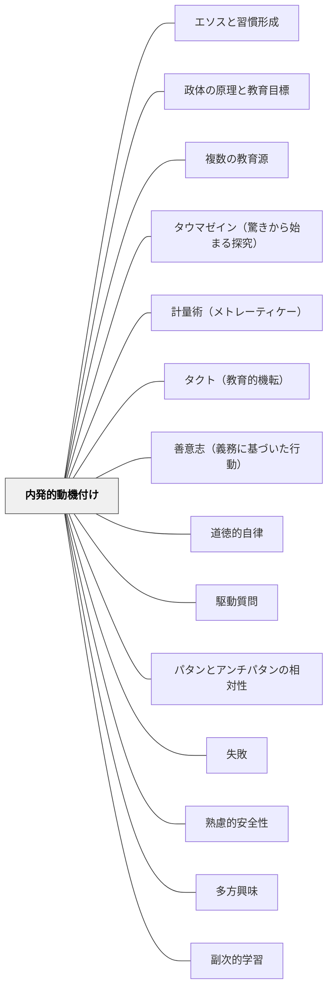

# 内発的動機付け

> 「やらされる」でなく「やりたい」——内側から湧く動機づけは、外から与えられた報酬や罰とは異なる源泉を持ち、長期的な学習・探究・成長の燃料になる。

---

## Pattern Connection

**ヘルバルト（1806）教育学綱要統合——アペルツィオーンとしての内発的動機：**

ヘルバルトは「興味（Interesse）」を「知的・情緒的関与によって生じる持続的な注意傾向」（§07 注記）と定義し、単なる知識取得と区別した。この「興味」の概念はSDTの内発的動機付けと深く共鳴する。

> 「単なる知識では足りない。人は知識を有していても失っていても、依然として同じ人格にとどまりうる。それに対し、知識を掴み、それを広げようとする者は、そこに興味を抱いているのである。」（§62）

- **「興味とは態度であって情報量ではない」**：ヘルバルトは「興味は態度であって、情報量ではない。だが、知識がなければ興味も具体化しない」（§63）と述べた。SDTの「内発的動機は活動そのものへの関与の質から生まれる」という定義と一致する。情報量を増やすだけでは内発的動機は生まれない。
- **アペルツィオーンと内発的動機の接続**：「教授は孤立した経験を組織化し、既存の知識と同化（アペルツィオーン）させ、児童の自然興味を相互に結び付けて深化させる」（§64）——新しい知識が既有知識と有機的につながるとき「わかった」という内的報酬（有能感）が生まれる。これがSDTの有能感（Competence）欲求の充足と対応する。
- **「連関（Korrelation）」なしに興味は持続しない**：「個々の印象は、他の印象との結びつきがなければ心に定着し難い。ばらばらの体験が海に浮かぶ島のように散在しているだけでは、恒久的な関心へとは育たない」（§64）——孤立した知識が内発的動機を生まない理由の構造的説明。
- **過度な教師主導への警告**：「教授が細部まで児童を導きすぎれば、自立心を失わせる」（§111）——SDTの自律性（Autonomy）欲求の侵食への警告が1806年に既に述べられていた。
- **波及するパタン**：[[パタン/多方興味]] — ヘルバルトの六種興味論の直接応用；[[パタン/先行オーガナイザー]] — アペルツィオーンの実践；[[文献/教育学綱要（ヘルバルト）]] — 本統合の出典

---

**Willingham（2015）統合（2026-05-17）：**

*Raising Kids Who Read* は「過正当化効果（overjustification effect）」を読書文脈で詳細に展開し、報酬・義務・強制が内発的動機を侵食する具体的なメカニズムを示す。

- **Lepper, Greene & Nisbett（1973）の古典実験**：就学前の子どもが自発的に選んでいたマーカーに「good player certificate」を与えたところ、その後マーカーへの興味が顕著に低下した——「賞をもらうためにやった」という解釈が「楽しいからやった」を上書きする。読書ポイント・シール・冊数競争がこれと同じリスクを持つ
- **称賛と報酬の区別**：Willingham は報酬（事前に約束した外発的報酬）と称賛（自発的行動への事後的な反応）を区別する。「読んだら○をあげる」は過正当化効果を生むが、「読んでいたね、どんな本だった？」という関心の表明は生みにくい
- **Playground Analogy（遊び場のアナロジー）**：「毎日20分ブランコで遊びなさい、真剣に」とは言わない——楽しみに義務化は矛盾する。「毎日20分読みなさい」が読書の内発的動機を侵食するのも同じ構造。義務化された活動は「仕事」になる
- **academic reading vs pleasure reading の区別**：学校での読書の多くは学術的目的を持つ（教科書・課題）。この「学術的読書」と「自発的な娯楽読書（pleasure reading）」を生徒に明示的に区別することで、後者への内発的動機を保護できる（Gallagher, 2009）——「これは学習の読書。自由読書はまた別」という枠組みの明示
- **授業内プレジャーリーディングの5条件**（Kamil, 2008）：内発的動機を守る授業内読書には5条件が必要（最低20分・自由選書・豊富な本・読書コミュニティ・教師の積極的指導）。特に「教師が自分の本を読むのでなく生徒の読書を支援・観察する」が成功の鍵
- **読書観の家庭的フレーミング**（Baker, 2003）：「読書はエンターテインメントだ」と伝える家庭の子は読書成績が高い——これは SDT の「自律性」欲求と「活動のフレーミング（何のためにやるかの解釈）」が動機の質を決めることを示す実証

---

### 牧口常三郎（1930）——教師の動機付け四段階：報酬から教育そのものへの愛へ

牧口は *創価教育学体系 第4巻*（教育技術論）において、教師のモチベーション（なぜこの仕事をするか）が四段階の発達を辿ると論じた。Deci & Ryan の自己決定理論（SDT）とは独立して、同じ原理を1930年代に定式化した先駆的な洞察である。

**教師の動機付け四段階**

| 階級 | 動機の源泉 | 内容 |
|---|---|---|
| **第一階級** | 報酬・俸給 | 給料・雇用保障のために教える。仕事はあくまで生計手段 |
| **第二階級** | 名誉・地位 | 学校・社会での評判・昇進・尊敬を得るために教える |
| **第三階級** | 児童への愛 | 子どもへの愛情・情熱で教える。子どもが好きだからやる |
| **第四階級** | 教育の仕事自体への内発的興味 | 「教育法・学習指導そのものへの方法的関心」から動く。教え方を研究すること自体が楽しい |

牧口はこの四段階について具体的に観察した：

> 「新卒業生などの熱心する最初の動機は子供の愛にあるがため、受持ちの交替に和して失望した結句、校長を怨み、いつしか熱がさめる傾向がある」

つまり第三階級（児童愛）の動機は、環境の変化（クラス替え・転勤）で消えやすい。しかし第四階級（方法への内発的関心）は「金持ちを目的とした利殖家が、遂には金そのものへの興味を超えて仕事への没頭者になる」ように、仕事の本質に向かう動機として持続する。

**SDT との対応と深化**

| Deci & Ryan（SDT）の概念 | 牧口の対応 |
|---|---|
| 外発的動機（報酬・罰） | 第一・第二階級 |
| 内発化された動機（アイデンティティ・自律的外発） | 第三階級（児童愛） |
| 内発的動機（活動自体への興味） | 第四階級（教育法への方法的関心） |

SDT では「活動そのものへの内発的動機」が最も持続的で質の高い動機だとする——牧口はこれを1930年に「教育の術の発展とは、方法その物に興味が転移すること」と表現した。

**教育実践への含意**

教師が第四階級に到達すると何が変わるか：
- 「この子を教えるのが嫌いだ」という感情（第三階級の陰）に動かされなくなる
- 研究・省察が義務でなく楽しみになる
- 「うまくいった・いかなかった」の両方から等しく学べるようになる（認識先行）

- **他のパタンへの波及**：[[パタン/教師の三方面修養]]（第四階級の実現には三方面の修養が必要）・[[パタン/守・破・離（習熟の三段階）]]（第四階級は「離」の段階の動機的基盤）

---

**実践理性批判１（中山元訳）統合：**

カントの実践理性批判（1788）は、外発的動機と内発的動機の区別に哲学的な根拠を与える。

- **幸福原理 = 自愛の原理（Selbstliebe）**：カントは「幸福の追求」を「自愛の原理」と規定し、経験的・主観的・不確定なものとして位置づけた。学習者が「点数を取りたい」「褒められたい」「楽しいから」という動機で動くとき、これはすべて幸福原理（自愛の原理）の表れであり、外発的動機付けの哲学的基盤と一致する
- **道徳原理 = 理性に基づく客観的原理**：道徳法則（「全員がこうすべき」という普遍的原理）は幸福原理と対比される——命令形式が定言的（無条件）であり、知性の質が純粋理性に基づく。SDTの「内発化された動機（義務が真に自分のものになった状態）」の最深部はこの道徳原理に対応する
- **上級・下級の欲求能力**：カントは欲求能力を「下級（感性・傾向性・欲望に基づく）」と「上級（理性・道徳法則に基づく）」に区別する。SDTの連続体（外発的→内発的）は、カントの下級の欲求能力から上級の欲求能力への移行として理解できる
- **教育設計への含意**：外発的動機付け（褒賞・罰）は下級の欲求能力に働きかける。内発的動機の最深部は上級の欲求能力——「これが正しいから、自分がすべきだから行う」という道徳的動機に至る。Deci & Ryan が「自律性」を最も質の高い動機づけとするとき、カントはその哲学的根拠を1788年に提示していた
- **補強するパタン**：[[パタン/道徳的自律]] — 内発的動機の最深部は道徳的自律（自己立法）と一致する。[[文献/実践理性批判１（カント、中山元訳）]] — 本統合の主出典

---

### クセノフォン（前370年代）——「徳への憧れ」という最古の内発的動機論

クセノフォン『ソクラテスの思い出』（相澤拓訳、光文社古典新訳文庫 2022）は、現代のSDT（自己決定理論）より2300年前に、内発的動機付けの核心を記述していた：

> 「多くの人々をそれら[の悪徳]から解放し、**徳への憧れをもたせる**とともに、自分自身に配慮するなら、やがて善美の人となるという期待を抱かせることによって」——クセノフォン（第一巻序章）

ソクラテスの教育戦略の核心は、学習者の中にある「より善くありたい」という根源的な欲望（徳への憧れ）を呼び起こすことだった。これは外から報酬・罰で行動を操作するのではなく、**内側にすでにある動機の種に火をつける**というアプローチ。

**プロディコスのヘラクレス（第一巻第一章）：物語による動機の活性化**

ソクラテスが語るヘラクレスの岐路の物語は、内発的動機付けの技法の実例：
- 「悪徳（安逸・快楽）」と「徳（労苦・卓越性）」の二つの道を物語として提示する
- どちらが良いかを教えるのではなく、**選択を学習者に委ねる**
- 「神々は労苦なしに善いものをお与えにならない」という確信が、徳の道を選ぶ動機となる

- **既存パタンとの関連**：Deci & Ryanの自律性欲求（Autonomy）は、ソクラテスの「学習者に選択を委ねる」アプローチと完全に対応する。ヘルバルトの「興味は態度であって情報量ではない」（既に統合済み）に対し、クセノフォンは「興味の起点は憧れである」という古典的定式化を提供する。
- **補強された点**：過正当化効果（Willingham統合済み）が「外からの報酬が内発的動機を侵食する」ことを示すとすれば、クセノフォンは「内側の憧れを呼び起こすことが動機付けの代替戦略」であることを示す——否定と肯定の両面から内発的動機の設計原理が揃う。
- **波及するパタン**：[[パタン/ヘラクレスの岐路]] — 徳への憧れを物語で活性化する具体的技法；[[パタン/エンクラテイア（自制の鍛錬）]] — 憧れを行動に変えるための実践的基盤；[[文献/ソクラテスの思い出（クセノフォン）]] — 本統合の出典

---

## 背景（Context）

Edward Deci と Richard Ryan の**自己決定理論（Self-Determination Theory: SDT）**は、動機づけを「外発的（Extrinsic）」と「内発的（Intrinsic）」に区別し、人間の行動の質は動機づけの種類によって根本的に異なると主張する。

**内発的動機付け（Intrinsic Motivation）**——活動そのものへの興味・楽しさ・好奇心から行動する状態。

外発的動機付け（Extrinsic Motivation）——報酬・罰・評価・他者からの期待に応えるために行動する状態。

SDT は、人間には3つの基本的心理欲求があり、これが満たされるとき内発的動機が育つとする：

| 欲求 | 意味 | 学習での具現 |
|---|---|---|
| **自律性（Autonomy）** | 自分の意志で行動している感覚 | 課題・方法・ペースを選べる |
| **有能感（Competence）** | 「できる」という効力感 | 適度な挑戦・成功体験の累積 |
| **関係性（Relatedness）** | 他者とつながっている感覚 | 認められる・協力できる関係 |

Daniel Pink（2009）は*Drive*でこれを企業・教育文脈に展開した：「ルーティン作業は外発的動機で動くが、創造的・認知的な作業は内発的動機でしか動かない」。

## 問題（Problem）

学校の多くの仕組みが外発的動機付けを前提に設計されている：

- 成績・評価——よい点を取るために学ぶ
- 称賛・ご褒美——ほめられるためにやる
- 罰・プレッシャー——叱られないようにやる
- ランキング・競争——他より上になるためにやる

Deci の研究が示した「**過正当化効果（Overjustification Effect）**」：もともと内発的に好きだった活動に外発的報酬を与えると、報酬がなくなったとき動機が下がる——「先生に言われるからやる」が「楽しいからやる」を上書きする。

## 力のかたち（Forces）

- 内発的動機は長期的な学習継続の燃料——外発的動機は行動を生むが長期維持しない
- 自律性・有能感・関係性の3つが揃うと内発的動機が育つ
- 外発的報酬の追加は、すでに内発的に動いている活動の動機を下げる可能性がある
- 「難しすぎる（フロストレーション）」も「簡単すぎる（退屈）」も内発的動機を損なう
- 選択の自由は自律性を支える最も直接的な手段
- 「なぜこれをやるのか」が見えないと関係性・目的が失われる

## 解決（Solution）

**3つの基本的心理欲求（自律性・有能感・関係性）を満たす学習環境を意図的に設計し、外発的動機への過度な依存を避ける。**

---

### 自律性を支える設計

- **選択の機会を作る**：「どの問題から解くか」「どの本を読むか」「どんな方法でやるか」——小さな選択でも自律性の感覚は生まれる
- **理由を説明する**：「この課題は○○のためにある」と目的を伝える——「なぜやるか」が見えると内発的になる
- **過度な監視を減らす**：観察はするが管理はしない——「見られているからやる」を減らす

### 有能感を支える設計

- **適切な難度の設定（スウィートスポット）**：少し難しいが頑張ればできる課題——フロー理論のチャレンジとスキルのバランス
- **失敗を安全にする**：間違いが罰でなく学習の一部として扱われる文化（[[パタン/失敗（インストラクション）]]）
- **成長を可視化する**：「できるようになったこと」を振り返る機会——有能感は比較でなく成長から

### 関係性を支える設計

- **認められる体験**：「あなたの考えが聞きたい」「あなたならできると思う」——存在の承認
- **協力関係**：他者と一緒に何かを作る・解く体験が関係性欲求を満たす
- **教師との信頼関係**：「この先生は自分のことを気にかけてくれる」という感覚

---

### 外発的動機付けとの折り合い

SDTは外発的動機付けを全否定しない。評価・フィードバック・称賛は設計次第で内発的動機と共存できる：

| 外発的要素 | 内発的動機を守る使い方 |
|---|---|
| **称賛** | 「えらい」より「○○ができていた」——行動・プロセスへの具体的フィードバック |
| **評価・成績** | 「できたこと」の確認として使う。ランキング・競争への転化を避ける |
| **ご褒美** | 予期しない報酬は内発的動機を損なわない。事前の「やったらあげる」が問題 |
| **義務・課題** | 「なぜやるか」を伝え、選択の余地を残す——自律性の感覚を壊さない |

---

### アリストテレス（前335年頃）——ニコマコス倫理学 第一〜二巻

> 「美しい行為に快さを感じない人は善き人ではないことになる。というのも、だれも、正しく行為することに快さを感じない人を『正しい人』と呼ばないし、気前の良い行為に快さを感じない人を『気前の良い人』と呼ばないからである。」（第一巻第八章）

アリストテレスは内発的動機付けの哲学的基盤を2400年前に示した。**徳に基づく活動はそれ自体として快い**——快さが徳の形成の証拠であり、快さの伴う活動が継続・深化する。

> 「ちょうどオリュンピア競技において栄冠を手にするのが、最高の美しさと最高の力強さをそなえた人々ではなく、実際に競技する人々であるように、人生における美しく善き事柄についても、実際に行為する人々こそがそれらを勝ち取る人々である。」（第一巻第八章）

- **SDTとの接続**：アリストテレスの「徳に基づく活動が快い」は、SDTの「自律性・有能感・関係性の欲求が満たされるとき活動が内発的に動機付けられる」と構造的に対応する。徳の活動が「快い」のは、有能感（できている）・自律性（選んでいる）・関係性（共同体に貢献している）の三欲求が充足されているから。
- **快苦の方向付けが教育の核心**：「人はごく若い頃から早々に喜ぶべきものを喜び、苦痛を感ずべきものに苦痛を感じるよう導かれなければならない。正しい教育とはこのこと以外のなにものでもない」（第二巻第三章）——内発的動機付けの形成は「喜ぶべきものへの快さ」を育てること。
- **補強された点**：内発的動機付けはSDTが言うように「外から侵食されないもの」ではなく、習慣形成（[[パタン/エソスと習慣形成]]）によって「正しいものを快いと感じる感受性」として育てられるものでもある。

[[文献/ニコマコス倫理学（上）（アリストテレス）]]

---

### 読書指導における内発的動機付け

[[パタン/アリテラシー（読む意志）]]（Layne, 2009）との接続：

- 読む意志（WILL）= 読書への内発的動機
- 読書アイデンティティ（Willingham）= 「自分は読む人間だ」という内発的自己像
- 外発的読書（義務・評価・ご褒美）が内発的動機を侵食する過正当化効果は、読書嫌いの一因

---

## 結果（Consequences）

- 3つの欲求が満たされると、学習が「やらされること」から「やりたいこと」へと変わる
- 学校を出た後も学び続ける生涯学習者が育ちやすくなる
- 過正当化効果への意識が、善意の外発的介入（ご褒美・強制読書）を再考させる
- ただし、外発的動機と内発的動機は完全に分離できない——設計の問題は常に程度と文脈の問題

## 関連パタン
- [[パタン/エソスと習慣形成]]
- [[パタン/政体の原理と教育目標]]
- [[パタン/複数の教育源]]
- [[パタン/タウマゼイン（驚きから始まる探究）]]
- [[パタン/計量術（メトレーティケー）]]
- [[パタン/タクト（教育的機転）]]
- [[パタン/善意志（義務に基づいた行動）]]
- [[パタン/道徳的自律]]
- [[学級経営/学級経営で使えるパタン]]
- [[特別支援/特別支援で使えるパタン]]
- [[実践/読書への情熱を育てる実践集]]
- [[パタン/駆動質問]]
- [[パタン/パタンとアンチパタンの相対性]]
- [[パタン/失敗（インストラクション）]]
- [[パタン/心理的安全性（コンフォートゾーン）]]
- [[パタン/多方興味]]
- [[パタン/副次的学習]]

- [[パタン/熟慮的動機付け]] — 動機づけを意図的に設計する上位パタン
- [[パタン/自己選択自己決定]] — 自律性を実現する最も直接的な実践
- [[パタン/読書アイデンティティ]] — 読書への内発的動機の長期的な形
- [[パタン/アリテラシー（読む意志）]] — 内発的動機が育たない「読まない読者」の問題
- [[パタン/ゲーム]] — 内発的動機を活用した学習設計
- [[パタン/本物を扱う（当事者意識・自分ごと）]] — 目的・意味が内発的動機を生む
- [[パタン/個別化]] — 個々の動機づけの違いに応じた設計
- [[パタン/フィードバック]] — 有能感を育てるフィードバックの設計
- [[パタン/教師の三方面修養]] — 教師の内発的動機が師範人格修養の核心（牧口常三郎）
- [[パタン/自己調整]] — 内発的動機付けが育つと自己調整の質が高まる
- [[パタン/アドベンチャー]] — 挑戦的な冒険設計が自律性と有能感を刺激する
- [[パタン/好奇心から多方興味へ]] — 一点の好奇心から広がる内発的な探究の形
- [[パタン/ブック・チャット]] — 本との個人的なつながりが読書への内発的動機を育てる
- [[パタン/目の前に山があれば登りたくなる]] — 内発的動機付けの環境設計的な実装
- [[パタン/不思議を育てる]] — 好奇心（内発的動機の種）を育てる実践
- [[パタン/コレクションと趣味]] — コレクションは純粋な内発的動機から生まれる活動の典型
- [[パタン/熟慮的問い]] — 熟慮的問いは学習者の自律性・有能感・関係性を刺激し内発的動機を呼び起こす
- [[文献/ソクラテスの思い出（クセノフォン）]] — 「徳への憧れ」という最古の内発的動機論
- [[パタン/ヘラクレスの岐路]] — 徳への憧れを物語で活性化する
- [[パタン/エンクラテイア（自制の鍛錬）]] — 動機を行動に変えるための自制の鍛錬

---

## クラスター図

## Actionable Insight

- **今週の授業で一つ「選択肢」を加える**——「問1〜5の中から3つ選んで」「好きな方法でまとめて」——小さな自律性の感覚が動機の質を変える
- **「すごい」より「○○がよかった」に言い換える**——プロセス・具体的な行動への称賛が有能感を育て、内発的動機を守る
- **「なぜこれをやるか」を毎回1文で言う**——「○○のためにやる」が見えると、課題が「やらされること」から「やること」に変わる

---

## 出典
- [[文献/創価教育学体系 4（牧口常三郎）]]
- [[文献/教育学綱要（ヘルバルト）]]

Deci, E. L., & Ryan, R. M. (2000). The "what" and "why" of goal pursuits: Human needs and the self-determination of behavior. *Psychological Inquiry*, 11(4), 227–268.
Pink, D. H. (2009). *Drive: The Surprising Truth About What Motivates Us*. Riverhead Books.
Willingham, D. T. (2015). *Raising Kids Who Read: What Parents and Teachers Can Do*. Jossey-Bass. → [[文献/Raising Kids Who Read（Willingham）]]
Lepper, M. R., Greene, D., & Nisbett, R. E. (1973). Undermining children's intrinsic interest with extrinsic reward. *Journal of Personality and Social Psychology*, 28(1), 129–137.
Baker, L. (2003). The role of parents in motivating struggling readers. *Reading & Writing Quarterly*, 19(1), 87–106.

> 「外から与えられた報酬は、すでに内側で燃えている炎を消す。」——Deci & Ryan（SDT, 2000）

> 「毎日20分ブランコで遊びなさい、真剣に——そんなことは言わない。楽しみに義務化は矛盾する。」——Willingham（2015）趣意
