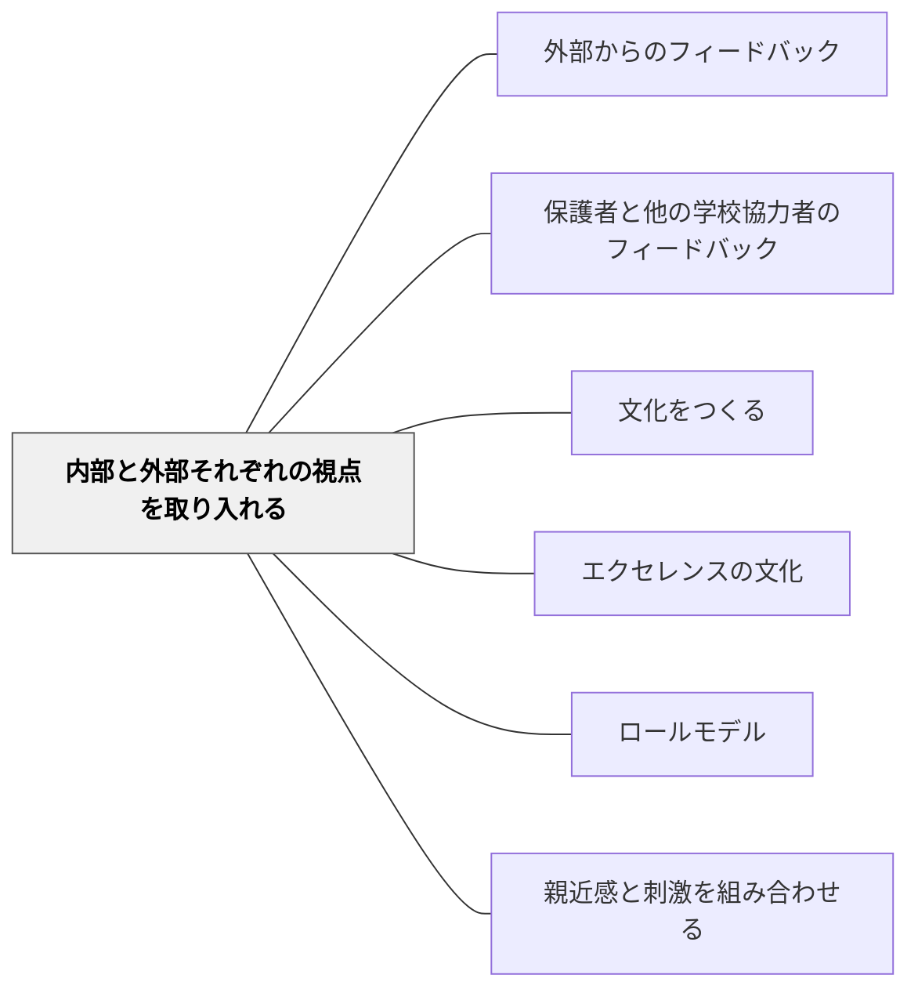

# 内部と外部それぞれの視点を取り入れる

> 優れたコミュニティを設計するためには、コミュニティの本質を見抜くことのできるインサイダーの観点が不可欠だ。— ウェンガー（p.97）

## Pattern Connection

本パタンは [[パタン/コミュニティをつくる]] を具体化する子パタンである。コミュニティ設計の原則のうち「内側の知識と外部の刺激の両立」を担う。コミュニティの自己革新は、内部視点と外部視点の意図的な組み合わせから生まれる。

## 背景（Context）

コミュニティには、内部からしか見えないものと、外部からしか見えないものがある。内側の人は文化を深く知っているが、見えなくなっていることもある。外側の人は新鮮な目を持つが、文脈を知らずに表面しか見えないこともある。

## 問題（Problem）

内側だけに閉じると停滞・自己強化ループに陥る。外側の視点だけ取り入れると、文脈に合わない改革になる。どちらか一方に偏ると、コミュニティは活力を失う。

## 力のかたち（Forces）

- 外部の卓越した作品・実践を見ることで、内部の基準が上がる（エクセレンスの文化との接続）
- 外部の視点は「当たり前を疑う」機会になる
- 外部評価・コンクールへの参加は、外部の基準を体験させる

## 解決（Solution）

**内側の知識と外部の刺激を意図的に組み合わせ、コミュニティの自己革新を促す。**

実践例：
- 地域の専門家・卒業生・保護者をゲストとして招く
- 外部のコンクール・発表の機会に参加する（短歌・俳句・科学展など）
- 他校の実践事例を共有・比較する
- 「自分たちのやり方を外の人に説明する」機会をつくる（説明することで内部が整理される）

## 結果（Consequences）

- 内部の「当たり前」が相対化され、改善の余地が見えるようになる
- 外部の卓越と接触することで、「もっとできる」という感覚が育つ
- コミュニティが外部に対しても開かれた存在になる

## 関連パタン
- [[パタン/外部からのフィードバック]]
- [[パタン/保護者と他の学校協力者のフィードバック]]

- [[パタン/文化をつくる]] — 親パタン
- [[パタン/エクセレンスの文化]] — 外部の基準が内部を高める
- [[パタン/ロールモデル]] — 外部の一流をモデルとして使う
- [[パタン/親近感と刺激を組み合わせる]] — 外部からの刺激が安心の土台の上で活きる

## クラスター図

## Actionable Insight

- 学期に一度、地域の専門家や保護者をゲストとして招き学習物を見せる——外部の視点が内部の「当たり前」を相対化し基準を引き上げる
- 他校の実践事例を1つ共有し「自分たちと何が違うか」をクラスで話し合う——比較によって外部の基準が内部に流入する
- 「自分たちのやり方を外の人に説明する」機会を年1回設ける——説明することで内部の知識が整理され、外部に開かれたコミュニティが育つ

## 出典

- Wenger, E., McDermott, R., & Snyder, W. M. (2002). *Cultivating Communities of Practice*. Harvard Business School Press.（邦訳（2002）『コミュニティ・オブ・プラクティス』翔泳社、第3章 p.97）
- 動画記録：[[文献/コミュニティオブプラクティスと文化をつくるパタン（動画記録）]]
