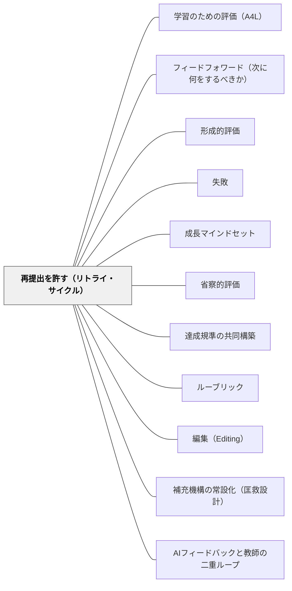

# 再提出を許す（リトライ・サイクル）

> フィードバックは「使う機会」があって初めて学習になる。提出して、採点されて、返ってきて、終わり——その一発勝負の構造では、どれほど良いフィードバックも行き先を失う。再提出の扉を開けることで、評価は「選別」から「学習の一部」に変わる。

## [Pattern Connection]

[[パタン/学習のための評価（A4L）]] の本文では「成績付けの6つの改善」の第1項として「再提出を許可する」が挙げられ、また9つの手法の8番目にも「再提出の許可」が登場する。本パタンはその一文を独立したパタンとして取り出し、制度設計の細部・教師側の運用ルール・公平性をめぐる緊張・特別支援の視点まで展開したものである。

- **既存パタンとの関連**：[[パタン/学習のための評価（A4L）]] 内で「最初の作品が最終版でない前提を作る」と短く言及されていた制度を、独立した実装パタンとして詳細化する。A4Lがフィードバック構造全体の設計だとすれば、本パタンはその中の「再挑戦の扉」を専門に扱う
- **補強された点**：Sadler (1989) のギャップ理論を地の文で参照することで、「再提出」が単なる温情措置ではなく、形成的評価が機能するための**論理的必要条件**であることを明示する。学習者がギャップを埋める行動をとれない構造下では、形成的評価は成立しない
- **修正・拡張された点**：[[パタン/フィードフォワード（次に何をするべきか）]] が「次に何をするか」という**助言（情報）**を扱うのに対し、本パタンはその助言を**実行できる構造（機会）**を扱う。情報だけ与えて行き先がないという矛盾を解く
- **他のパタンへの波及**：[[パタン/形成的評価]] の効果量0.9前後という数字は、再提出の機会がなければ実現しない。[[パタン/失敗（インストラクション）]] と [[パタン/成長マインドセット]] を、評価制度の側から下支えする

---

## 背景（Context）

授業も家庭学習も、最終的にはなんらかの提出物・テスト・成果物として評価される。多くの教室で評価は「提出する → 教師が採点する → 返却される → 終わり」という一回完結のサイクルで設計されている。この構造下では、教師がどれだけ丁寧な赤ペンを入れても、児童には「次に直す機会」が制度として用意されていない。

社会の側を見ると、運転免許も漢字検定も、たいていの資格試験は何度でも再挑戦できる設計になっている。プログラマーはコードを書き直し、料理人は試作を重ね、研究者は論文を改稿する。「一度きりで評価が確定する」という構造のほうがむしろ例外的である。Wormeli（2011）はこの逆転を問い直し、教室の評価だけが一発勝負で固定される必然性はないと指摘する。

## 問題（Problem）

提出が一回きりの構造では、フィードバックは行き先を失う。「読点の使い方を見直そう」と書かれた赤ペンは、書き直す機会がなければ次の作文まで活かされない（しかし次の作文は別のテーマで、同じ問題が同じ形では再現しない）。Sadler（1989）の言うところの「ギャップ」——現在の状態と目標との差——を学習者が認識しても、それを埋める具体的な行動の場が用意されていなければ、評価は学習に転化しない。

Black & Wiliam（1998）は、形成的評価が機能している教室と機能していない教室の差として、まさに「フィードバックを使う機会の有無」を挙げた。情報があっても、行動できなければ、評価は単なる選別装置に戻る。

加えて、一発勝負の評価は心理的負荷の偏在を生む。不安の強い子、ワーキングメモリに困難がある子、その日の体調がたまたま悪かった子は、本来の力を発揮できないまま「できない子」として記録される。再挑戦の扉が閉ざされた構造は、たまたまの一回を本人の能力として固定化してしまう。

## 力のかたち（Forces）

- フィードバックは「使う機会」があって初めて学習行動に転化する。情報だけでは行動は変わらない
- 再提出を全課題に開けば、教師の採点負担は単純計算で倍以上になりうる。持続可能性が問われる
- 「どうせあとで直せる」という前提が、初回の手抜きを誘発するリスクがある。初回の真剣さをどう担保するか
- カリキュラムの進度は止まってくれない。再提出期間を無制限にすれば次の単元に影響する
- 「再提出した子だけ点数が上がるのは不公平ではないか」という疑義が、保護者・同僚・本人から出ることがある
- 不安の強い子・ワーキングメモリに困難がある子にとって、一発勝負の評価は本来の力を測れない。再挑戦の保証は心理的安全性の評価版である
- [[パタン/フィードフォワード（次に何をするべきか）]] の「次に何をするか」という助言は、それを実行する場がなければ宙に浮く

## 解決（Solution）

**提出物・テスト・成果物に「再提出（リトライ）」の扉を**制度として**組み込む。フィードバック → 改善行動 → 再挑戦のサイクルが回るように、評価を一回完結ではなく循環として設計し直す。**

ただし、無条件・無制限に再提出を許すと、初回の手抜きを誘発し、教師の負担も破綻する。再提出を「制度」として機能させるためには、運用条件をあらかじめ明示する。

**再提出の条件設計（基本フレーム）**

1. **対象を絞る**：すべての課題ではなく、単元の核となる作文・成果物・テストに限定する。小さな練習問題は対象外でよい
2. **誤り分析を添える**：単に「やり直した」ではなく、「最初の提出のどこをどう変えたか・なぜ変えたか」を一言添える条件にする。これにより再提出が「写し直し」ではなく「振り返り」になる
3. **期限を区切る**：返却から1週間以内・単元終了まで、など期限を明示する。無制限にしない
4. **初回も本気で出す**：「再提出できるから初回は適当でいい」を防ぐため、初回の提出基準（例：自分で読み直して納得できる状態）を共有する
5. **評価は再提出後の到達点で**：「努力点を加算」ではなく「最終的な学習状態」で評価する。公平性の疑義への基本姿勢は「全員に再挑戦の扉が開かれている」こと

---

### 具体例1：作文の修正再提出

国語の単元末に書く意見文を、初回提出 → 教師の診断的コメント → 1週間以内に修正再提出、という2段構えで設計する。教師のコメントは [[パタン/フィードフォワード（次に何をするべきか）]] の形式で、「次のドラフトで一つだけ改善するとしたら、序論で自分の立場を一文で言い切ること」のように、再提出時に実行できる具体的な行動として書く。

再提出時には**「最初の提出のどこをどう変えたか」を3行で書く欄**を設ける。この一手間が、再提出を「やり直し作業」から「自分の文章への振り返り」に変える。評価は再提出後の作品で行う。初回の点と再提出後の点を平均しない——平均は「最初に間違えた人が損をする」設計になり、学習よりリスク回避を促してしまう。

---

### 具体例2：算数テストの訂正再挑戦

単元末の算数テストを返却したあと、間違えた問題について「**訂正シート**」を提出すれば、その問題の得点を一定割合で回復できる仕組みを作る。訂正シートには3つの欄を設ける——(1) 自分はどう考えて間違えたか、(2) 正しい考え方は何か、(3) 似た問題を1問作って解く。

この設計の核心は (3) にある。同じ問題を解き直すだけだと「答えを写しただけ」になりうるが、似た問題を自分で作って解くことは構造の理解を要求する（[[パタン/学習のための評価（A4L）]] の「生徒が問題を作る」と接続する）。誤り分析の (1) は [[パタン/形成的評価]] における「なぜこう考えたの？」というカントの認識論的問いに対応する。

得点回復は「全回復」ではなく「7割回復」など部分回復にしておくと、初回の真剣さを保ちつつ再挑戦の意味を残せる。

---

### 具体例3：成果物（自由研究・新聞・ポスター等）の再提出

長期の成果物では、提出を**ドラフト提出 → 教師＋児童相互のコメント → 最終提出**の2段構造にする。これは作文と似ているが、成果物の場合は「相互コメント」を挟むことで、再提出の改善材料が教師の赤ペンだけに集中しない。

再提出のときに、**どのコメントを受け取り、どのコメントは受け取らなかったか、その理由は何か**を書かせる。すべてのコメントに従う必要はない——選択し、判断する経験が [[パタン/省察的評価]] の力を育てる。

---

### 特別支援の視点：心理的安全性の評価版

不安の強い子、ワーキングメモリに困難がある子、感覚の過敏で当日の体調にムラがある子にとって、一発勝負の評価は本来の力を測れない構造である。「次がある」という保証は、認知的な配慮であると同時に情緒的な配慮でもある。

特に「全員に再提出の扉が開かれている」という制度設計は、特別な配慮として個別に与えるよりも公平性の疑義が起きにくい。全体の制度として組み込むことで、特定の子が「特別扱い」される構図を避けられる。

## 結果（Consequences）

**利点：**
- フィードバックが「読まれて終わり」ではなく「使われて学習になる」サイクルに乗る
- 「間違い＝失敗」ではなく「間違い＝改善の手がかり」という文化が、教師の言葉ではなく制度として生まれる（[[パタン/失敗（インストラクション）]] [[パタン/成長マインドセット]] の制度的下支え）
- 不安の強い子・特性のある子にとっての心理的負荷が下がり、本来の力で評価を受けられる
- 教師の赤ペンが宙に浮かなくなり、フィードバックの質を上げるインセンティブが生まれる

**注意点：**
- 全課題に開くと教師の採点負担が破綻する。対象を絞る運用設計が必須
- 「再提出できるから初回は適当に」を防ぐため、初回提出の基準と意味を学級で共有する必要がある
- 「再提出した子だけ点が上がる」という公平性の疑義には、「全員に同じ扉が開かれている」という制度設計と、保護者・同僚への事前説明で応える
- 期限を区切らないと進度に影響する。「返却から1週間」「単元末まで」など、明示的な締切を設ける
- 再提出を「努力点の加算」ではなく「最終的な学習到達点で評価する」と原則を立てておかないと、形成的評価ではなくただの温情に堕する

## 関連パタン

- [[パタン/学習のための評価（A4L）]] — 本パタンの母体。A4Lの「成績付けの6つの改善」第1項「再提出を許可する」を独立パタンとして展開した
- [[パタン/フィードフォワード（次に何をするべきか）]] — フィードフォワードが「次に何をするかという情報」を扱い、本パタンは「その情報を実行できる構造」を扱う。情報と機会の対
- [[パタン/形成的評価]] — 形成的評価が機能するための制度的前提。「フィードバックを使う機会」がなければ形成的評価は成立しない
- [[パタン/失敗（インストラクション）]] — 「失敗から学ぶ」を教師の言葉ではなく評価制度として組み込む
- [[パタン/成長マインドセット]] — 「努力で伸びる」という信念を、評価構造として実装する
- [[パタン/省察的評価]] — 再提出時の「どこをどう変えたか・なぜ変えたか」が省察の実践になる
- [[パタン/達成規準の共同構築]] — 再提出の評価規準が明示されていることで、児童が「何に向かって直すか」を理解できる
- [[パタン/ルーブリック]] — 再提出時の自己評価・教師評価の共通言語となり、評価の透明性を担保する
- [[パタン/編集（Editing）]] — 編集パスを経た再提出は「直せる」構造の書くこと版。フィードバック→改善行動→再挑戦のサイクルが編集チェックリストで具体化される
- [[パタン/補充機構の常設化（匡救設計）]] — 補充で力をつけてから再挑戦するサイクルが学習を循環させる。リトライの機会（本パタン）と補充の仕組みは相補的
- [[パタン/AIフィードバックと教師の二重ループ]] — AIフィードバックを「使う機会」があって初めて学習になる。評価を循環にする
- [[文献/Formative Assessment and the Design of Instructional Systems（Sadler）]] — 本パタンがすでに出典に含む原典。作り直しの必要は、学習者が質の概念を得た分だけ減らせる（Sadler, 1989）

- [[概念/教授学的契約（やり過ごしの均衡）]] — 「間違いを出すことが得になる」を評価構造として実装する
## クラスター図

## Actionable Insight

- **次の単元末の作文で「再提出の扉」を試す**：単元の最初に「初回提出 → コメント → 1週間以内に修正再提出可」と宣言する。再提出時には「どこをどう変えたか・なぜ変えたか」を3行で書く欄を用意する。評価は再提出後の作品で行うと事前に伝える
- **算数テストに「訂正シート」を導入する**：返却時に、間違えた問題について (1) 自分はどう考えたか、(2) 正しい考え方、(3) 似た問題を1問作って解く、の3点セットを提出すれば得点を7割回復できる仕組みを試す。1単元限定でやってみて、児童の反応と自分の採点負担を観察する
- **学級開きで「ここは再挑戦できる教室です」と宣言する**：年度初めや学期初めに、評価の構造を言葉にして共有する。「直さない」ではなく「直せる」を初期設定にすることで、提出への心理的ハードルが下がり、特に不安の強い子の参加が変わる

## 出典

Sadler, D. R. (1989). Formative assessment and the design of instructional systems. *Instructional Science*, 18(2), 119–144.

Black, P., & Wiliam, D. (1998). Assessment and classroom learning. *Assessment in Education: Principles, Policy & Practice*, 5(1), 7–74.

Wormeli, R. (2011). Redos and retakes done right. *Educational Leadership*, 69(3), 22–26.
