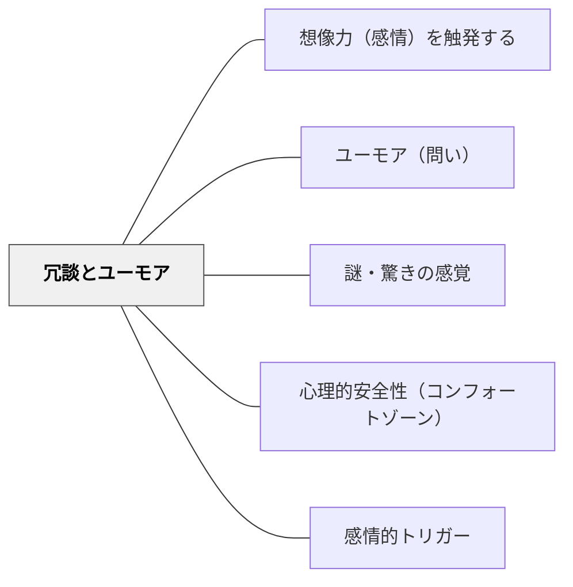

# 冗談とユーモア

> 笑いは学びの場を安心・活性化させ、記憶に刻む

## 背景（Context）

ユーモアは単なる「笑い」ではなく、生活の中で重要な役割を果たす。緊張を和らげ、関係を深め、批判的な視点を提供し、意外な発見をもたらす。

## 問題（Problem）

硬直した「真面目な授業」では、学習者の感情的な関与が低下しがちである。また失敗や間違いへの恐れが学習を妨げることもある。どうすれば安心感と活気のある学習環境をつくれるか。

## 力のかたち（Forces）

- ユーモアは心理的安全性を高め、間違えることへの恐れを軽減する
- 笑いは感情的な高揚をもたらし、その瞬間の内容を記憶に結びつける
- ユーモアは「ずれ」や「意外性」から生まれ、批判的・創造的思考と関連する
- 冗談は文化・年齢・文脈によって機能が異なる

## 解決（Solution）

授業の中に意図的にユーモアを取り入れる。教師自身が軽やかに笑いを使うことで、学習者も安心して失敗や発言ができる雰囲気が生まれる。学習内容に関連した冗談・言葉遊び・おかしな事例・漫画的な誇張を活用する。学習者同士がユーモアを共有できる活動（替え歌、面白い例え話づくりなど）も有効。

## 結果（Consequences）

- 心理的安全性が高まり、発言や挑戦が増える
- 感情的な記憶として内容が定着しやすくなる
- 冗談が特定の人を傷つける場合があるため、配慮が必要

## 関連パタン

- [[パタン/想像力（感情）を触発する]]
- [[パタン/ユーモア（問い）]]
- [[パタン/謎・驚きの感覚]]
- [[パタン/心理的安全性（コンフォートゾーン）]]
- [[パタン/感情的トリガー]]

## クラスター図

## Actionable Insight

- 学習内容に関連した言葉遊び・おかしな例え・ユーモラスな事例を1コマに1つ意図的に入れる——感情的な高揚と内容が結びつくことでその瞬間の記憶が強化される
- 教師自身の間違いを笑いで軽やかに受け流してみせる——教師がユーモアで失敗を扱う姿が学習者の「間違えることへの恐れ」を軽減する
- 替え歌・面白い例え話づくりなど、学習者がユーモアを共有できる活動を単元に1回入れる——共有された笑いが心理的安全性と集団の凝集性を高める

## 出典

キアラン・イーガン（2010）『想像力を触発する教育――認知的道具を活かした授業づくり』北大路書房
