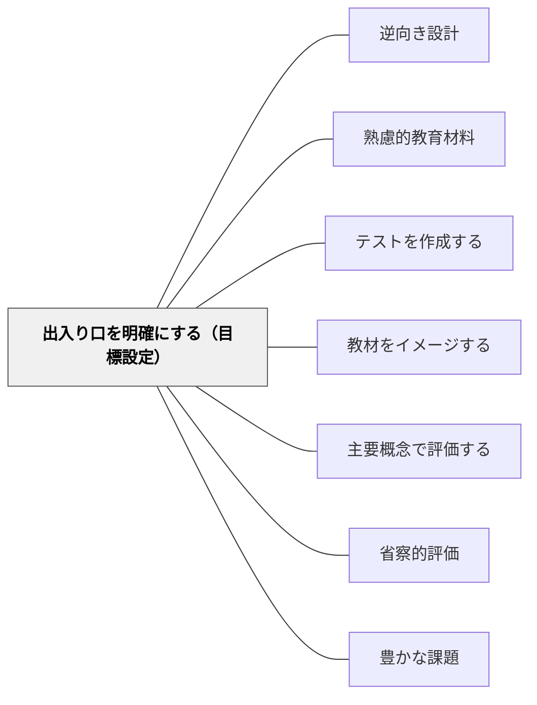

# 出入り口を明確にする（目標設定）

> 学習の入り口（出発点）とゴール（到達点）を明確にすることで教材設計が定まる。

## 背景（Context）

鈴木克明「教材設計マニュアル」の教材設計プロセスの重要ステップ。「出口」=学習後に何ができるようになるか（目標）と「入り口」=学習前の学習者の状態（レディネス・前提知識）を明確にすることで、教材で扱うべき内容が決まる。

## 問題（Problem）

目標と出発点が曖昧なまま教材を作ると、難易度・内容・評価が的外れになり、学習者も教師も困惑する。

## 力のかたち（Forces）

- 明確な目標は評価基準も明確にする
- レディネスの把握なしに適切な難易度は設定できない
- 目標設定が細かすぎると柔軟性を失う

## 解決（Solution）

**教材設計で「学習後に何ができるか」（出口）と「学習前の状態はどうか」（入り口）を明確に記述し、その差分を教材で埋める。**

## 結果（Consequences）

- 教材の範囲・難易度・内容が適切に設定される
- 評価基準が自然に決まる

## 関連パタン
- [[パタン/逆向き設計]]

- [[パタン/熟慮的教材教具]] — 親パタン
- [[パタン/テストを作成する]] — 目標から評価を作る
- [[パタン/教材をイメージする]] — 前のステップ

- [[パタン/主要概念で評価する]] — 出口目標が主要概念の評価設計と連動する
- [[パタン/省察的評価]] — 目標の振り返りが次回の設計改善を生む
- [[パタン/豊かな課題]] — 明確な出口目標から豊かな課題を設計する
- [[概念/教育評価論]] — 目標設定と評価の理論的接続
## クラスター図

## Actionable Insight

- 教材設計前に「学習後に学習者が何をできるようになるか」を観察可能な行動の言葉で1文書く——出口の明確化が教材の難易度・内容・評価の方向性を決める
- 学習の前に簡単な確認（一問クイズ・ペア対話など）で学習者の前提知識を把握する——入り口の現状確認なしに適切な難易度は設定できない
- 出口（目標）から入り口（出発点）の差分だけを教材でカバーする——的外れな内容の排除が教材の焦点と効率を高める

## 出典

- 鈴木克明（2002）『教材設計マニュアル――独学を支援するために』北大路書房
