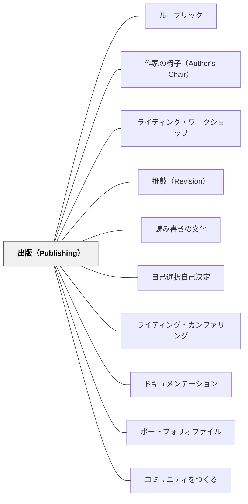

# 出版（Publishing）

> 本物の読者が存在するとき、書き手は初めて「伝わるか」を本気で問う。出版は書く動機の具体化であり、推敲を意味のある行為に変える。

---

## Pattern Connection

**出典**: Muschla, G. R.（2006）*Writing Workshop Survival Kit* (2nd ed.). Jossey-Bass.（統合：2026-05-19）

- **既存パタンとの関連**：[[パタン/ライティング・ワークショップ]] の最終段階として出版が位置づく。[[パタン/作家の椅子（Author's Chair）]] は出版の最もシンプルな形（口頭での読み聞かせ）。[[パタン/読み書きの文化]] で「書くことの文化」を作る際、出版が文化の可視的な拠点になる
- **補強された点**：出版を「完成を祝う儀式」としてだけでなく、「推敲の動機」として機能させることが重要。「誰かに読まれる」という見通しがあると、書き手が推敲の質を自ら上げようとする
- **拡張された点**：出版の形態は「作家の椅子」から「ウェブへの発表」まで多様。形態によって「誰が読者か」が変わり、それが書き方・語り方・内容の選択に影響する
- **他のパタンへの波及**：[[パタン/推敲（Revision）]] は出版という具体的な読者の存在があってこそ動機を持つ。[[パタン/自己選択自己決定]] のトピック選択も、「これを誰に届けたいか」という問いとともに深まる

---

## 背景（Context）

ライティング・ワークショップの書くプロセスには5つの段階がある——プリライティング・起草・推敲・編集・出版。しかし日本の作文指導では、「提出する」ことが出版に相当することが多く、読者は教師だけになりがちである。

Atwell（1998）・Muschla（2006）が強調するのは、**本物の読者（Authentic Audience）**の存在が書く行為を質的に変えるということだ。「先生に提出する」ための作文と、「クラスメートや保護者や地域の人に読んでもらう」ための作文は、書き手の態度が違う。

出版は最終段階でありながら、書くプロセス全体の動機を形成する。「この作品はどこに届けるか？誰が読むか？」という問いが、プリライティングから始まる全過程を方向づける。

## 問題（Problem）

- 作文の唯一の読者が「評価する教師」になると、子どもたちは「先生が好きな書き方」に最適化する
- 「書いたものを誰かに読んでもらう」経験がないと、書くことが孤立した課題になる
- 推敲が「点数を上げるため」の作業になり、「より伝わるものにするため」の作業にならない
- 「よい作品を作ったのに誰も読まない」という経験が、書くことへの動機を下げる

## 力のかたち（Forces）

- 本物の読者の存在が推敲の動機を最も強く高める——「誰かが読む」から「ちゃんと書きたい」になる
- 出版の形態が多様であるほど、子どもたちが「自分の作品に合った届け方」を選べる
- 出版を「評価の対象」にすると、書き手のリスクテイクが減る——出版は祝福の場であって評定の場ではない
- 小さな出版（クラス内の読み合い）も大きな出版（学校だより・ウェブ）も、書き手に「届いた」という経験をもたらす
- 出版のプロセスそのもの（レイアウト・表紙・タイトルページの作成）が書く技能の一部になる

## 解決（Solution）

**書くプロセスの始まりから「誰に届けるか」という出版の見通しを持たせ、作品の完成後に本物の読者への届け方を複数の形態から選んで実現する。出版は評価でなく祝福として設計する。**

---

### 出版の形態

| 形態 | 読者 | 規模 | 特徴 |
|------|------|------|------|
| **作家の椅子（Author's Chair）** | クラスメート | クラス | 最もシンプル。口頭での読み聞かせ。週1回でも文化になる |
| **クラス本・アンソロジー** | クラス・保護者 | クラス〜学校 | 子どもたちの作品を1冊にまとめる。製本体験そのものが出版の実感になる |
| **掲示板への展示** | 学校コミュニティ | 学校 | 廊下に展示。「読みに来る人がいる」という経験 |
| **学校だより・学年通信** | 保護者・地域 | 学校 | 保護者という本物の読者。家で読んでもらえる |
| **手紙・メール** | 特定の受け取り手 | 個人 | 「この手紙はあの人に届く」という最も直接的な読者意識 |
| **本や雑誌への投稿** | 不特定多数 | 社会 | 作文コンクール・子ども向け雑誌など |
| **ウェブへの発表** | インターネット上の読者 | 社会 | ブログ・学校ウェブサイト（保護者向け限定公開なども可能） |
| **読み聞かせ** | 下学年・他クラス | 学校 | 上学年が下学年に読み聞かせる——読み手でも書き手でもある |

---

### 出版のプロセス（作品を届けるまで）

Muschla（2006）はクラス本・アンソロジーの出版プロセスを具体的に示す：

1. **最終稿を準備する**——推敲・編集が完了した作品を清書する
2. **著者ページを書く**（Author's Page）——「著者について」を3〜5文で書く。作者自身が「作家」として紹介される経験
3. **イラストを追加する**——（任意）作品に合ったイラストや図を描く
4. **表紙・タイトルページを作成する**——クラス全体で一冊を作るとき、担当を決める
5. **読み合う**——完成したクラス本を全員で読む時間を設ける
6. **図書館や廊下に置く**——他のクラスや保護者が読める場所に置く

---

### 「著者について」（Author's Page）

Muschlaが特に重視する出版のステップ。短い自己紹介文を書くことで、子どもたちが「自分は作家だ」というアイデンティティを公式なものとして経験する。

モデル文：
> 「〇〇 〇〇は小学4年生です。読書と水泳が好きです。この作品は、去年の夏に祖父と行った川釣りの経験から生まれました。」

---

### 作家の椅子（Author's Chair）—— 最も手軽な出版

毎週1〜2人が「作家の椅子」に座り、書いた作品を読み聞かせる5〜10分の時間。

**聴衆の反応の指針**：
- 「一番心に残った部分を教えてください」
- 「もっと知りたいと思った部分は？」
- 「この作家に聞いてみたいことは？」

評価しない・批評しない——「伝わった」「印象に残った」を共有する場にする。

---

### 出版を評価から切り離す

出版された作品を評定の対象にしない、または評定を出版と別のタイミングにすることが重要。

「出版＝評価」になると：
- 子どもたちはリスクのないトピックを選ぶ
- 実験的な書き方を避ける
- 「先生が好きな書き方」への収束が起きる

出版は **祝福（Celebration）** の行為。評定は別のプロセスで行う。

---

### ウェブへの発表（第2版追加内容）

Muschla第2版（2006）で追加された章。ワープロを使った推敲・インターネットリサーチ・オンラインでの発表を扱う。

**注意点**：
- 保護者の同意を得てから掲載する
- 個人情報（フルネーム・学校名など）の取り扱いルールを事前に決める
- 学校のウェブサイトや限定公開のクラスブログは「安全なオンライン出版」の場になる

---

## 結果（Consequences）

- 「誰かが読む」という見通しが、書き始めから推敲まで書き手の態度を変える
- 作家の椅子や出版の経験が「書き手としての自分」というアイデンティティを育てる
- クラス内に「読み手としての文化」が生まれる——仲間の作品を読む経験が自分の書き方に影響する
- ただし出版を「負担の大きい特別な作業」にすると持続しない——作家の椅子のような小さな出版を週の習慣にすることが持続の鍵

## 関連パタン
- [[パタン/ルーブリック]]
- [[パタン/作家の椅子（Author's Chair）]]

- [[パタン/ライティング・ワークショップ]] — 出版が位置づく授業構造の最終段階
- [[パタン/推敲（Revision）]] — 本物の読者の存在が推敲の動機を生む
- [[パタン/読み書きの文化]] — 出版が「書く文化」を可視化し強化する
- [[パタン/自己選択自己決定]] — 「誰に届けるか」という選択がオーナーシップを深める
- [[パタン/ライティング・カンファリング]] — 出版に向けた推敲を会議が支援する
- [[パタン/ドキュメンテーション]] — 出版された作品の蓄積が成長の記録になる
- [[パタン/ポートフォリオファイル]] — 出版作品を含む成長の可視化
- [[パタン/コミュニティをつくる]] — 出版が教室のコミュニティをつなぐ
- [[文献/Writing Workshop Survival Kit（Muschla）]] — 本パタンの一次資料

---

## クラスター図

## Actionable Insight

- **今すぐできる出版：「作家の椅子」を今週試す**——毎週金曜日の最後の10分、1人だけ「今週書いたもの」を読み上げる時間を設ける。椅子は普通の椅子でいい。「読んでくれた人から一言もらいましょう」だけで出版の経験になる
- **クラス本を1学期に1回作る**——各自が1枚だけ「一番気に入った作品」を持ち寄り、教師がホッチキスで束ねる。「著者について」を2〜3行書いてもらう。これが最初のクラス本になる
- **「誰に届けたい？」をプリライティングの問いにする**——作文を始める前に「この作品を誰に読んでほしいですか？」と問う。クラスメート・保護者・下学年・知らない人——その答えが書き方を変える
- **手紙形式で本物の読者を作る**——「地域の図書館司書に本の感想を送る」「学校に来てくれた人へお礼の手紙を書く」——受け取り手が決まった瞬間に書き手の態度が変わる

---

## 出典

Muschla, G. R. (2006). *Writing Workshop Survival Kit* (2nd ed.). Jossey-Bass.
Atwell, N. (1998). *In the Middle: New Understandings About Writing, Reading, and Learning* (2nd ed.). Heinemann.

> "The best way to learn to write is to write, and to write with a purpose and an audience in mind." —Muschla

> "Publishing is not the end of the writing process. It is the reason for it." —Nancie Atwell
