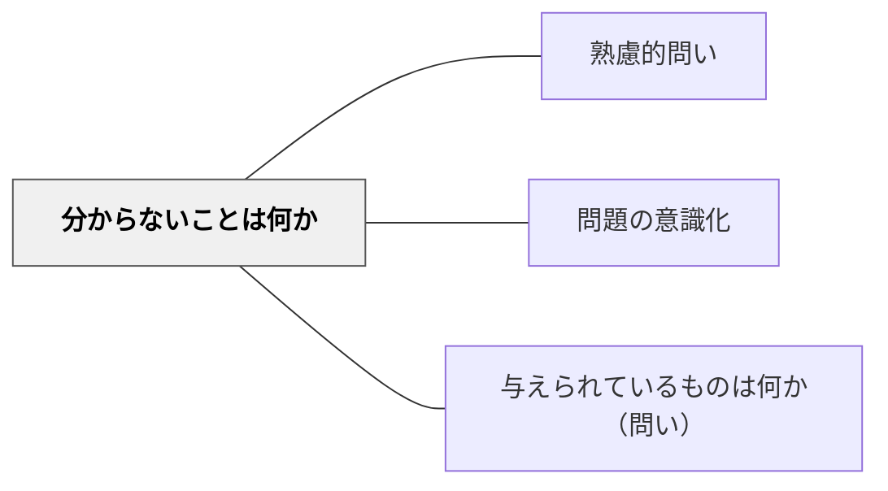

# 分からないことは何か

> 「何が分からないか」を言語化することで、学習者は未知とギャップを明確にし、探究の方向を定める。

## 背景（Context）
問題解決において、「分からないこと（未知）」を明確にすることは、解法を探す方向を決定する。ポリアは問題を理解する段階で「未知は何か」を問うことを強調した。既知と未知の境界線を意識することで、学習者は何に向かって思考を進めればよいかを把握できる。

## 問題（Problem）
「何が分からないか」を言語化できない学習者は、漠然とした混乱の中で足踏みし続ける。分からないことを分からないまま放置すると、問題の全体が見えず、部分的な理解で解き進めてしまい、根本的なつまずきが見えにくくなる。また、「分からない」を言語化する機会がなければ、教師や仲間に適切な助けを求めることもできない。

## 力のかたち（Forces）
- 未知を言語化することは、問いを立てる行為と本質的に同じである
- 「分からない」の粒度が重要：大きすぎると手がかりがなく、小さすぎると問いにならない
- 分からないことを公言できる心理的安全性が前提として必要
- 既知と未知を対比させることで、アプローチの手がかりが見えてくる

## 解決（Solution）
問題に取り組む前に「この問題で分からないことを一つ言葉にしてみよう」と促す。「分かること」と「分からないこと」を二欄に分けて書き出させる活動を取り入れる。例えば、図形の問題で「辺の長さは分かっているけれど、面積の求め方が分からない」と言語化させる。ペアで「お互いの分からないことを共有し合う」活動で、言語化の練習をする。

## 結果（Consequences）
- 未知を明確にする習慣が身につき、問題解決の方向性を素早く定められるようになる
- 「分からない」を言語化できることで、適切な支援を求める力が育まれる
- 既知と未知を整理することが、問題の構造理解を深め、解法の選択を効率化する

## 関連パタン
- [[パタン/熟慮的問い]] — 親パタン
- [[パタン/問題の意識化]] — 分からないことの言語化は問題の意識化と重なる
- [[パタン/与えられているものは何か（問い）]] — 既知と未知を対比させる

## クラスター図

## Actionable Insight

- 問題に取り組む前に「この問題で分からないことを1つ言葉にしよう」と促す——未知の言語化が漠然とした混乱を具体的な探究の方向に変える
- 「分かること」と「分からないこと」を二欄に書き出させる——既知と未知の対比が問題の全体構造を把握し解法へのアプローチを効率化する
- ペアで「お互いの分からないことを共有し合う」活動を取り入れる——公言できる心理的安全性の中での言語化が「分からない」を助けを求める力に変える

## 出典
- [[文献/熟慮的問いのパターンリスト（動画記録）]]
- ジョージ・ポリア（1954）『いかにして問題をとくか』丸善出版
