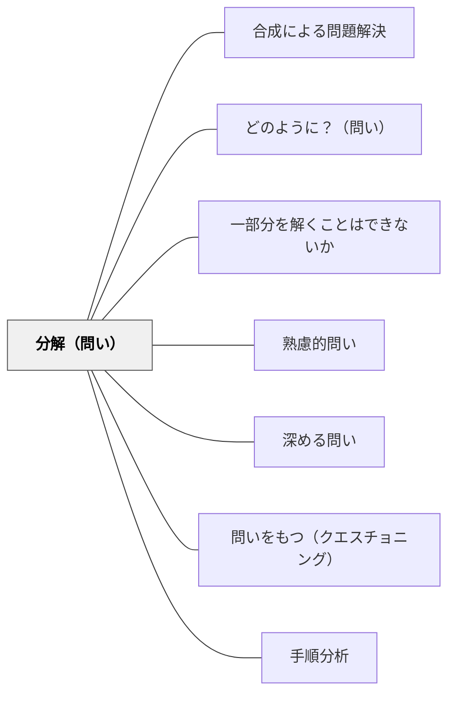

# 分解（問い）

> 「どの要素で構成されているか？」と問うことで、複雑な対象の内部構造が明らかになる。

## 背景（Context）

「うまくいっている」「なぜか難しい」「何となくわかった」といった漠然とした感覚を持っていても、その理由や根拠を説明できないことが多い。複雑な現象や概念は、全体として見るだけでは理解しにくい。要素に分解して考えることで、各部分の役割と相互作用が見えてくる。

## 問題（Problem）

全体をひとまとまりとして扱うと、どの部分が機能していてどの部分が問題なのかが特定できない。改善や分析のためには、対象を構成する要素を意識する必要がある。しかし分解の視点を持つことは、慣れていないと難しい。

## 力のかたち（Forces）

- 分解の粒度が細かすぎると、全体像が見えなくなる
- どの単位で分解するかは目的によって異なり、正解がない
- 分解と分類は混同されやすいが、分解は「部品と全体の関係」を問う
- 分解した要素を再統合する問いとセットで使うと効果的

## 解決（Solution）

「どの要素で構成されているか？」「部分に分けると何がある？」「それは何からできているか？」という問いを、概念や事象の理解を深めたい場面で使う。たとえば「よい授業はどの要素からできていると思う？」「この問題が難しい理由を要素に分けると？」のように問いかける。マインドマップや図解と組み合わせると、分解の結果が視覚的に共有されやすい。

## 結果（Consequences）

- 複雑な対象の構造が明確になり、分析や改善がしやすくなる
- 「なんとなく」の理解が、具体的な要素の言語化に変わる
- 分解に没頭するあまり、全体の目的や意味を忘れる場合がある

## 関連パタン
- [[パタン/合成による問題解決]]
- [[パタン/どのように？（問い）]]
- [[パタン/一部分を解くことはできないか]]

- [[パタン/熟慮的問い]] — 親パタン

- [[パタン/深める問い]] — 分解が複雑な問題の深い理解をもたらす
- [[パタン/問いをもつ（クエスチョニング）]] — 分解的問いを育てる上位パタン
- [[パタン/手順分析]] — 分解の問いと教材の手順分析が連動する

## クラスター図

## Actionable Insight

- 「この問題が難しい理由を要素に分けると？」「よい授業はどの要素からできている？」と問いかける——要素化が「なんとなくわかった」を具体的な言語の理解に変える
- マインドマップや図解と組み合わせて分解の結果を視覚化する——視覚化した分解が対話のきっかけになり全体の把握を容易にする
- 分解した後に「再統合するとどうなる？」という統合の問いをセットにする——分解と統合の往復が全体と部分への理解を同時に深める

## 出典

- [[文献/熟慮的問いのパターンリスト（動画記録）]]
