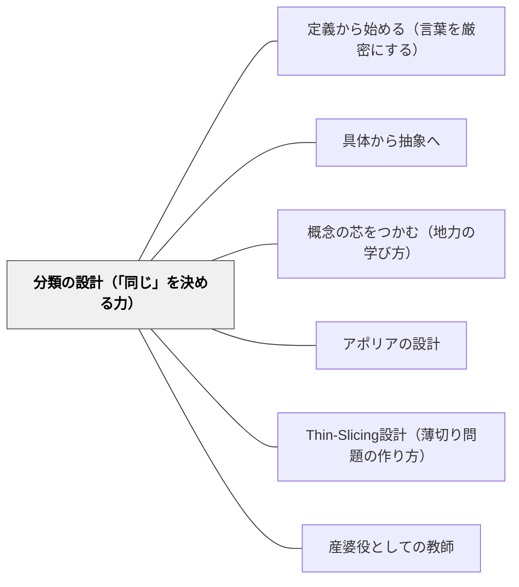

# 分類の設計（「同じ」を決める力）

> 「何が同じか」を決めること——それが混沌を秩序に変える、最初の一手である。

## [Pattern Connection]

### 伊藤由佳理（2020）美しい数学入門——同値関係という思考の道具

伊藤由佳理の『美しい数学入門』第1章は、数学の出発点として「分類」と「同値関係」を位置づける。

> 「数学はたくさんあるものを整理する道具である。混沌とした状態を何か特別なメガネで見てみると、意外と秩序のある世界に見えてくる」

この「数学のメガネ」の本体は「何が同じかを決める基準（同値関係）」である。

**同値関係の三条件：**

| 条件 | 名前 | 内容 | 洗濯物の例 |
|---|---|---|---|
| a ∼ a | 反射律 | 自分自身とは「同じ」 | Tシャツ同士は同じ種類 |
| a ∼ b ならば b ∼ a | 対称律 | 「同じ」は双方向 | AとBが同じ色なら、BとAも同じ色 |
| a ∼ b かつ b ∼ c ならば a ∼ c | 推移律 | 「同じ」は連鎖する | 赤いAとBが同じ色で、BとCが同じ色なら、AとCも同じ色 |

**「好きな人で班分け」が機能しない数学的理由：**

「Aさんは Bさんが好きだと思っている」という関係は：
- 対称律：AがBを好きでも、BがAを好きとは限らない → **成立しない**
- 推移律：AがBを好きで、BがCを好きでも、AがCを好きとは限らない → **成立しない**

「この関係はなかなか同値関係にはなりにくいのにもかかわらず、小学校で先生が『好きな人どうしで班を作りましょう！』という。そうするとうまく班分けできず、悲喜こもごもの状態になってしまう。実は数学的に『分類』できない条件だからなのである」——伊藤（2020）

この説明は教師にとって非常に重要で、「班分けのトラブル」が感情的・社会的な問題であるだけでなく、**数学的な構造の問題**であることを示す。

**「同じ図形」の多様な基準（幾何学の多様性）：**

| 幾何学 | 「同じ」の基準 | 不変量 | 面白い例 |
|---|---|---|---|
| ユークリッド幾何 | 長さ・角度が等しい | 長さ・角度 | 正三角形の3つの条件 |
| 位相幾何（トポロジー） | 穴の数が等しい（ゴムで変形可能） | 種数 | マグカップ＝ドーナツ（どちらも穴1つ） |
| 微分幾何 | 曲率が等しい | 曲率 | 球面の三角形の内角の和は180度以上 |
| 射影幾何 | 射影変換で移り合う | 射影的不変量 | 平行線は無限遠点で交わる |

「『同じ』とみなす基準を設けることで、いろいろなものが分類でき、その応用として『同じ図形』の基準をいろいろ変えると、新しい幾何学が誕生してきた」——伊藤（2020）

**既存パタンとの関連：**
- [[パタン/定義から始める（言葉を厳密にする）]]：同値関係の三条件は「定義の厳密化」の最も体系的な形
- [[パタン/具体から抽象へ]]：洗濯物→数学的同値関係という具体から抽象への典型的な流れ

**補強された点：**
分類は「感覚的に仲間分けする」ではなく「『同じ』の基準（同値関係）を明示的に設計する」という行為であることが示される。「基準のない分類はただの混乱である」という数学的洞察が、授業設計に応用できる。

**他のパタンへの波及：**
- [[パタン/定義から始める（言葉を厳密にする）]] — 同値関係は「定義の三条件」の最も明快な例
- [[パタン/概念の芯をつかむ（地力の学び方）]] — 「何の概念をとらえているか」は「どの基準で分類するか」に対応する

---

## 背景（Context）

算数・数学の授業でも生活指導でも「グループを作る」「仲間分けをする」場面は頻繁にある。植物の分類（葉の形・花の色・生育場所）、図形の分類（角の数・辺の長さ・対称性）、帰りの班・学習班・清掃班の編成。しかしほとんどの場合、「何が同じかの基準」は暗黙のうちに扱われ、その基準が適切かどうかが検討されない。

## 問題（Problem）

「仲間分け」の基準が曖昧または不適切なとき、分類はうまく機能しない。算数の「仲間分け」活動で子どもが混乱するのは、「同じ」の基準が共有されていないから。班編成でトラブルが起きるのは、使っている「同じ」の基準が数学的に有効でないから。「同じ」を直感だけで扱うと、分類の目的や限界が見えなくなる。

## 力のかたち（Forces）

- 「感じ的に同じ」という直感的な分類は学習の出発点として自然だが、議論の基盤にはならない
- 分類の基準を言語化すると、境界例（「これはどっちに入る？」）が生まれる——それが学習の核心
- 「同じ」の基準は一つではない——目的によって複数の有効な分類が存在する
- 分類の基準を明示的に設計することで、「なぜそうなるか」が説明できるようになる

## 解決（Solution）

**「何が同じか」を明示的に決め、その基準が三つの条件（自分自身とも同じ・双方向に同じ・連鎖して同じ）を満たすかどうかを確認してから分類する。目的によって有効な基準は変わる。**

**1. 「何で仲間分けするか」を先に決める：**
活動の前に「今日は何の性質で仲間分けするか」を学習者と決める。「色」「形」「大きさ」「使い方」など、基準を一つ選ぶことで分類が一意に決まる。

**2. 「この基準で分けるとしたら、なぜこれとこれが同じグループなのか」を問う：**
子どもに「Aと Bが同じグループなのはなぜ？」「AとCもそのグループに入る？なぜ？」と問い、三条件（特に推移律）を自然に使わせる。

**3. 「同じ基準を変えてみたら？」で複数の有効な分類を体験させる：**
「さっきは色で分けたけれど、形で分けたら？大きさで分けたら？」と基準を変えて同じ素材を分類し直す。「分類は素材の性質でなく、見る側の基準による」という気づきを促す。

---

**具体例1：算数「仲間分け」（1〜2年）**

色・形・大きさが異なる積み木やブロックを机に広げ「仲間分けしよう」と言う（最初は基準なし）。複数の分類が出てきたら「Aさんの仲間分けのルールは何？Bさんのルールは？」と聞く。「このルールだと、この積み木はどっちのグループに入る？」という境界例を出して、ルール（基準）の明示化を求める。

**具体例2：算数「図形の仲間分け」（2〜3年）**

三角形・四角形・円・星型などを並べて「仲間分けしよう」と言う。「角の数で分ける」「まっすぐな線だけで囲まれているかで分ける」「対称性で分ける」など複数の基準が出る。「どの基準でもいいが、基準はちゃんと決めよう」とまとめる。

**具体例3：国語・生活科「植物の分類」（低学年）**

採集した植物を分類する活動で「葉っぱの形が同じグループ」「花が咲いているグループ」「食べられるグループ」など多様な基準を提案させる。「同じグループにしたAとB、なぜ同じグループ？Cもそのグループに入れる？」と問い、基準の一貫性を確認する。

**具体例4：学級づくり「班編成の設計」**

「掃除の班は、掃除場所を共有するという条件で分ける（推移律が成立：同じ場所の人どうしは仲間）」「生活班は、ランダムに決める（基準なし→全員が対等）」という設計を教師が意識的に行う。「好きな人で班分け」を避ける理由を、数学的に説明できるようになる。

## 結果（Consequences）

- 子どもが「仲間分けにはルール（基準）が必要」という感覚を持つ
- 分類の境界例（「これはどっちに入る？」）が知的な問いとして出てくるようになる
- 「基準を変えたら違う仲間になる」という柔軟な見方が育つ
- 教師が班編成や活動グループの設計を、明示的な基準に基づいて行えるようになる
- 「この仲間分けはなぜうまくいかなかったのか」を構造的に分析できるようになる

## 関連パタン

- [[パタン/定義から始める（言葉を厳密にする）]] — 分類の基準は定義の最も基本的な形
- [[パタン/具体から抽象へ]] — 洗濯物・積み木という具体から、同値関係という抽象への移行
- [[パタン/概念の芯をつかむ（地力の学び方）]] — 「何の概念をとらえるか」は分類の基準を選ぶことと対応
- [[パタン/アポリアの設計]] — 境界例・反例が分類の不完全さを明らかにし、より厳密な基準への問いを生む
- [[パタン/Thin-Slicing設計（薄切り問題の作り方）]] — 「基準を一つずつ変える」ことで分類の設計を段階的に学ぶ
- [[パタン/産婆役としての教師]] — 「何で仲間分けするか」を教えるのではなく、子どもが基準を産むのを助ける
- [[文献/美しい数学入門（伊藤由佳理）]] — 本パタンの出典

## クラスター図

## Actionable Insight

- 今週の算数・生活科で「仲間分けしよう」と言う前に、「どんなルールで分けるか、先に決めよう」という一言を加えてみる。そのルールを黒板に書いてから分類を始める。
- 「好きな人で班分け」の代わりに「共通の好きなことがある人」「担当場所が同じ人」「背の順で近い人」など、推移律が成立する基準で班を設計してみる。
- 算数で図形を扱うとき「角の数で仲間分けする場合」「対称性で仲間分けする場合」の両方を試し、同じ図形でも基準によって仲間が変わることを体験させる。

## 出典

伊藤由佳理（2020）『美しい数学入門』岩波書店（岩波新書 1842）

> 「よりよい班分けのためには、上記の同値関係をみたす条件を使えばいいのである。これが数学のメガネの一例であり、数学も少しは生活の役にも立つかもしれないと思っていただけたら幸いである」——伊藤（2020）
