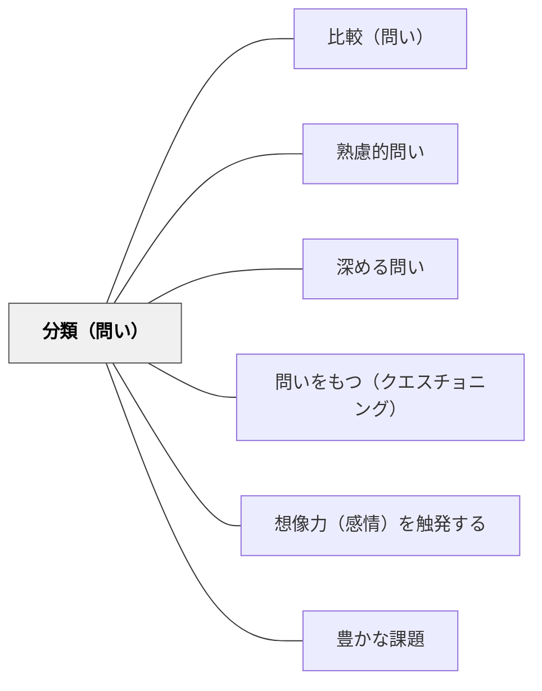

# 分類（問い）

> 「どのグループに分けられるか？」と問うことで、情報の関係性や構造が見えてくる。

## 背景（Context）

多くの事例・意見・概念が出そろった場面では、それらの関係性を整理することが理解を深める鍵になる。しかし、羅列されたままでは全体像が見えにくく、学習者はどこから考えてよいかわからなくなる。分類の問いは、散在する情報を構造化する力を持つ。

## 問題（Problem）

情報がバラバラに積み上がると、重複や矛盾が見えにくくなる。「これとあれは同じことか」「違いは何か」という問いが生まれないまま議論が続くと、深まりがない。共通点・相違点・上位・下位といった関係を意識しないと、理解は表面的にとどまる。

## 力のかたち（Forces）

- 分類の軸は一つではなく、問い手の設定が思考を誘導する
- 分類しすぎると細分化が目的になり、本質から離れる
- 分類を「正解探し」にしてしまうと創造的思考が止まる
- グループ分けの作業自体が対話のきっかけになる

## 解決（Solution）

「どのグループに分けられるか？」「どんな種類があるか？」「共通点でまとめると？」という問いを、概念や事例が出そろった段階で投げかける。たとえば「今出てきた学習方法を分類すると、いくつのグループになる？」「この問題の原因を種類別に整理すると？」などの形で使う。分類の軸を参加者が自分で決めるように促すと、思考の主体性が高まる。

## 結果（Consequences）

- 情報の構造が可視化され、全体像の把握が容易になる
- 分類の観点が多様であることに気づき、思考の柔軟性が育つ
- 分類の「正しさ」を巡る議論に時間を取られることがある

## 関連パタン
- [[パタン/比較（問い）]]

- [[パタン/熟慮的問い]] — 親パタン

- [[パタン/深める問い]] — 分類が思考を精緻化し深める問いへつながる
- [[パタン/問いをもつ（クエスチョニング）]] — 5W1H・分類を使って問いを構造化する上位パタン
- [[パタン/想像力（感情）を触発する]] — 分類の驚きが感情・想像力を動かす
- [[パタン/豊かな課題]] — 分類による問いが豊かな課題の核をつくる
## クラスター図

## Actionable Insight

- 「今出てきたアイデアを分類すると、いくつのグループになる？」と概念や事例が出そろった段階で投げかける——構造化の問いが散在する情報を有意味なパターンとして整理させる
- 分類の軸（何の観点で分けるか）を参加者自身に設定させる——観点の自律的な設定が思考の主体性を高め創造的な分類を生む
- グループ分け作業を対話のきっかけにして「なぜそのグループに入れた？」を話し合わせる——分類の理由の共有が多様な視点への気づきと思考の柔軟性を育てる

## 出典

- [[文献/熟慮的問いのパターンリスト（動画記録）]]
