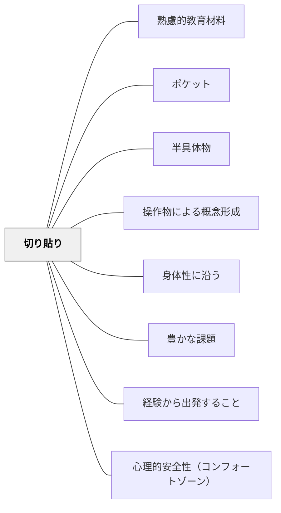

# 切り貼り

> 別の紙に書いて切り貼りする——失敗したものは捨て、成功したものだけを貼ればいい。可逆性が「試すこと」の心理的コストを下げる。

## 背景（Context）

アナログ実装技法の一つ。この技法には二つの機能がある。

**①概念操作としての切り貼り**：ワークシート・カード・図を切り取って並べ替えたり分類する活動。身体的操作を通じて概念の整理・比較・分類を促す。デジタル環境ではドラッグ＆ドロップが同様の機能を持つ。

**②創作・表現における失敗コスト低減としての切り貼り**：最終成果物（画用紙など）に直接書くのではなく、別の紙に書いてから切り貼りする方法。失敗したパーツは捨てて書き直せるため、失敗の代償が小さくなる。コラージュや係活動のポスター制作など、見た目の完成度が問われる場面で特に有効。

## 問題（Problem）

受動的に読む・書くだけでは、概念の整理・比較・分類といった操作的思考が働きにくい。また、最終成果物に直接書く形式では「失敗できない」という心理的プレッシャーが生じ、試みる前に諦めたり、萎縮した表現になりやすい。

## 力のかたち（Forces）

- 物理的操作が思考の外在化を促す
- 並べ替えや分類が概念間の関係を可視化する
- 失敗の代償が小さいと、「まずやってみる」が起きやすくなる
- 完成物は「成功したパーツだけの集積」になるため、完成度が上がる
- 完成物が学習の記録・成果物になる

## 解決（Solution）

**カード・ラベル・図を切り取って並べ替え・貼り付けする活動を教材に組み込む。試行錯誤できる可逆性を確保する（仮貼りできるようにするなど）。**

創作・表現の場面では、**最終成果物に直接書かず、別の紙に書いてから切り貼りする**ように子どもに教える。失敗したパーツは惜しまず捨てて書き直し、うまくいったものだけを貼る。「また書けばいい」という感覚が、最初の一筆の心理的障壁を取り除く。

---

### 実践例①：係活動のポスター制作

係（当番・学活など）の掲示ポスターを作る場面。画用紙にマジックペンで直接書くよう指示すると、子どもは「失敗したら終わり」の緊張感から手が止まる。

**切り貼りの手順を教えると：**
1. 別の白い紙に文字・イラストを下書きなしで書く
2. うまくいったものを切り取る
3. 画用紙に並べてバランスを確認してから貼る

完成したポスターの質が上がるだけでなく、子どもが「何度も試せる」という感覚で活動に臨むようになる。岩井は係ポスター制作でこの方法を実際に子どもたちに教えていた。

---

### 実践例②：コラージュ作品

コラージュは本来、切り貼りそのものが表現技法。失敗を前提とした素材選び・配置の試行錯誤が、完成度の高い作品を生む。「貼ってみてから動かす」ができることが、自由な実験を後押しする。

---

### 実践例③：概念カードの並べ替え

算数・国語の概念を書いたカードを切り渡し、子どもが並べ替え・分類する活動。「間違えても動かせばいい」という可逆性が、決断を速め思考の外在化を促す。

## 自己教育での適用例

Wikiページを書くとき、最初から完成形のファイルに書こうとすると萎縮する。メモ帳やコメントアウトした草稿ブロックで「切り貼り前の素材」を準備し、構成が固まってから最終ページに統合する——これは切り貼りの自己教育版である。

## 結果（Consequences）

- 学習への能動的関与が高まる
- 概念の整理・比較・分類の思考が促される
- 「失敗してもやり直せる」という経験が、試みる意欲を育てる
- 完成物の質が上がる（失敗パーツが除外されるため）
- 完成物が学習の記録・成果物として残る

## 関連パタン

- [[パタン/熟慮的教材教具]] — 親パタン
- [[パタン/ポケット]] — 切り貼りと組み合わせた収納
- [[パタン/半具体物]] — 操作的な学習教材
- [[パタン/操作物による概念形成]] — 具体的操作
- [[パタン/身体性に沿う]] — 切る・貼る身体的操作が概念理解を深める
- [[パタン/豊かな課題]] — 切り貼りを核にした豊かな課題設計
- [[パタン/経験から出発すること]] — 操作体験を学びの起点にする
- [[パタン/心理的安全性（コンフォートゾーン）]] — 失敗コスト低減が心理的安全をつくる
## クラスター図

## Actionable Insight

- 次の係ポスター・掲示物制作で「別の紙に書いてから切り貼りする」手順を一度教えてみる——「失敗しても書き直せばいい」という一言が子どもの手を動かす
- 図工や生活科の制作活動で、最終の台紙に貼る前に「試し置き」の時間を設ける——配置を確認してから貼ることで完成度が上がり達成感も増す
- 概念カードを印刷して切り渡し、並べ替え・分類させる——物理的操作が思考を外在化し、概念間の関係を体で考えさせる
- 仮貼りできる付箋で「考えの地図」を作らせ、途中で動かせる自由を確保する——可逆性が「試して考える」試行錯誤の思考を育てる

## 出典

- 鈴木克明（2002）『教材設計マニュアル――独学を支援するために』北大路書房
