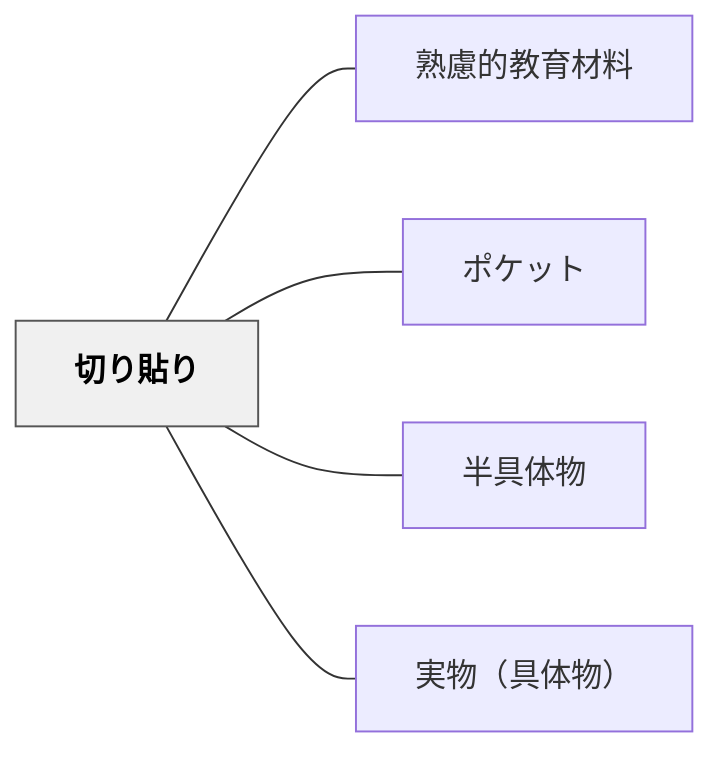

# 切り貼り

> 紙の教材を切り取り・貼り付けする操作的な活動が、学習への能動的関与を高める。

## 背景（Context）

アナログ実装技法の一つ。ワークシート・カード・図を切り取って並べ替えたり貼り付けたりする活動。身体的な操作を通じて概念の整理・比較・分類を促す。デジタル環境でもドラッグ＆ドロップが同様の機能を持つ。動画記録では切り貼り式ポケット教材の実例が紹介された。

## 問題（Problem）

受動的に読む・書くだけでは、概念の整理・比較・分類といった操作的思考が働きにくい。

## 力のかたち（Forces）

- 物理的操作が思考の外在化を促す
- 並べ替えや分類が概念間の関係を可視化する
- 完成物が学習の記録・成果物になる

## 解決（Solution）

**カード・ラベル・図を切り取って並べ替え・貼り付けする活動を教材に組み込む。試行錯誤できる可逆性を確保する（仮貼りできるようにするなど）。**

## 結果（Consequences）

- 学習への能動的関与が高まる
- 概念の整理・比較・分類の思考が促される

## 関連パタン

- [[パタン/熟慮的教材教具]] — 親パタン
- [[パタン/ポケット]] — 切り貼りと組み合わせた収納
- [[パタン/半具体物]] — 操作的な学習教材
- [[パタン/実物（具体物）]] — 具体的操作

## クラスター図

## Actionable Insight

- 概念カードを印刷して切り渡し、並べ替え・分類させる——物理的操作が思考を外在化し、概念間の関係を体で考えさせる
- 仮貼りできる付箋で「考えの地図」を作らせ、途中で動かせる自由を確保する——可逆性が「試して考える」試行錯誤の思考を育てる
- 完成した切り貼りを「学習の記録」として保存し単元末の振り返りに使う——成果物が学習の可視化と自己評価の材料になる

## 出典

- 鈴木克明（2002）『教材設計マニュアル――独学を支援するために』北大路書房
