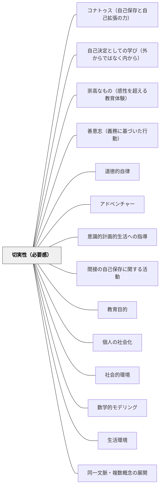

# 切実性（必要感）

**一文でいうと**：学習者が「これは自分に必要だ」と感じる文脈から学びを立ち上げる。

## 使いどころ・使いすぎ注意

| 観点         | 内容                                     |
| ------------ | ---------------------------------------- |
| 使いどころ   | 「なぜ学ぶのか」を立ち上げたいとき。     |
| 使いすぎ注意 | 必要感を演出しすぎると、不自然さが出る。 |

> 「これを知りたい・身につけたい」という必要感が学習の原動力になる。

## 背景（Context）

切実性とは学習者が学習内容に対して「今まさに必要だ」と感じる感覚である。牧口常三郎の「生活教育」の思想にも通じる。切実性がある時、学習者は外発的な動機付けなしに自ら学ぼうとする。教材設計によって切実性を意図的に生み出すことができる。

## 問題（Problem）

学習内容の必要感が学習者に感じられないと、「なぜこれを学ぶのか」が分からないまま学習が進み、学習定着も意欲も低下する。

## 力のかたち（Forces）

- 切実性は生活との結びつきから生まれることが多い
- 問題設定・課題設定の工夫で切実性を高めることができる
- すべての学習内容に切実性を生み出せるとは限らない

## 解決（Solution）

**学習内容が「今の自分に必要だ・役立つ・解決したい」と感じられる場面・文脈・問題設定を意図的に作る。**

実践例：

- 実生活の問題・事件・疑問を出発点にする
- 学習者の関心・体験を出発点にする
- 「分からないことが分かる」体験を設ける

### 教科別の具体例

**算数**：「実際に定規なしで長さを測ろうとして困る」体験から「cm という単位が必要だ」と気づかせてから単位を教える。

**国語**：「実際に友達に手紙を書こうとして書き方が分からない」状況を作ってから手紙の形式を教える。

**学級経営**：「話し合いで意見がまとまらなくて困る」体験から「ルールが必要だ」という必要感を学級会で引き出す。

## 結果（Consequences）

- 学習者が自発的に学ぼうとする
- 学習内容の意味・価値が実感される

## 関連パタン
- [[パタン/コナトゥス（自己保存と自己拡張の力）]]
- [[パタン/自己決定としての学び（外からではなく内から）]]
- [[パタン/崇高なもの（感性を超える教育体験）]]
- [[パタン/善意志（義務に基づいた行動）]]
- [[パタン/道徳的自律]]
- [[実践/カエルの算数：勝ちやすさを表で考えよう]]
- [[パタン/アドベンチャー]]
- [[パタン/意識的計画的生活への指導]]
- [[パタン/間接の自己保存に関する活動]]
- [[パタン/教育目的]]
- [[パタン/個人の社会化]]
- [[パタン/社会的環境]]
- [[パタン/数学的モデリング]]
- [[パタン/生活環境]]
- [[パタン/同一文脈・複数概念の展開]]
- [[パタン/名前を書く欄がある]]
- [[パタン/利的経済的価値の創造]]

- [[パタン/熟慮的教材教具]] — 親パタン
- [[パタン/問題設定]] — 切実性を生む問いの設定
- [[パタン/モヤモヤを置く]] — 葛藤から切実性を生む
- [[パタン/本物を扱う（当事者意識・自分ごと）]] — 本物が切実性を生む

## クラスター図

## Actionable Insight

- 単元の最初に「これを知らないと困る場面」を実際に体験させる（例：材料なしに料理しようとする、地図なしに迷う）——必要感は頭で理解するより体で感じさせる方が強い
- 学習者が実際に困った経験や疑問を授業の出発点にする——「あのとき困ったのはなぜか」という問いが内発的な学習動機をつくる
- 「なぜこれを学ぶのか」を教師が説明するのではなく、学習者に問いかけてから一緒に答えを見つける——必要感は「与えられる」ものでなく「気づく」ものとして育てる

## 出典

- [[文献/熟慮的教育材料のパターンリスト（動画記録）]]
