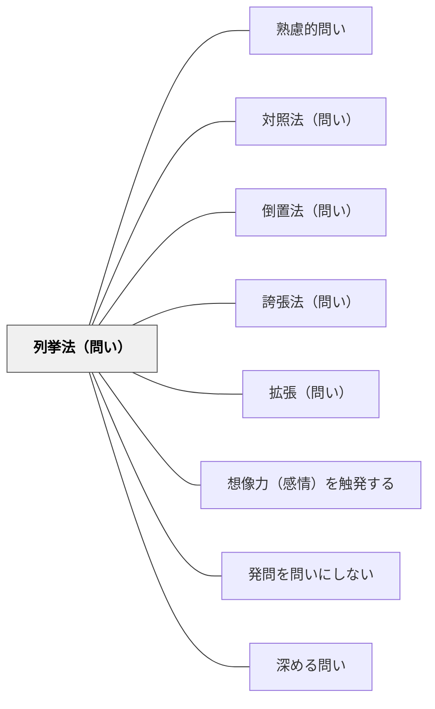

# 列挙法（問い）

> 具体的な単語・例を並べて問いの抽象度をカバーし、多様な入口を用意する問い。

## 背景（Context）
抽象的な問いは考える余地が広い反面、何から考えればよいかわからない学習者を置き去りにしやすい。
列挙法は複数の具体例・キーワードを問いの中に並べることで、問いの射程と入口を同時に示す修辞技法である。
「学び・遊び・仕事、どれが人を最も成長させるか？」のように、具体例の列挙が問いの輪郭を形成する。
列挙によって学習者は「自分はどれについて考えるか」を選ぶ自由を得る。

## 問題（Problem）
抽象的すぎる問いは思考の出発点が見つからず、探究が始まらないことがある。
具体例が一つしか示されないと、問いの射程が狭く感じられる。
学習者によって「何が問いの対象か」の解釈がバラバラになり、対話が噛み合わなくなることがある。

## 力のかたち（Forces）
- 列挙する項目が多すぎると問いが長くなり、焦点が分散する。
- 少なすぎると列挙の効果が薄れ、問いの多様性が伝わらない。
- 列挙する項目の選択が問いの方向性を暗示するため、バランスへの注意が必要である。
- 同質な項目を並べるより、対照的・多様な項目を並べる方が思考を刺激しやすい。

## 解決（Solution）
問いの中に「〇〇・△△・□□」のように具体例を3〜5個並べる形で問いを設計する。
列挙する項目は、問いのテーマを代表する多様な側面をカバーするように選ぶ。
「これらに限らず」「あるいはあなたにとっての〇〇」と付け加えることで、列挙を開放的に使う。
列挙した後に「他にどんな例があるか？」という展開問いとセットにすると探究が深まる。

## 結果（Consequences）
列挙によって問いが具体的になり、思考の出発点が見つけやすくなる。
学習者が「自分はどの例について考えるか」を選べることで、主体的な探究が始まりやすい。
一方、列挙した項目が問いの範囲を限定しすぎると、それ以外の視点が出にくくなる副作用がある。

## 関連パタン
- [[パタン/熟慮的問い]] — 親パタン
- [[パタン/対照法（問い）]] — 対比を使う関連技法
- [[パタン/倒置法（問い）]] — 語順を逆にして印象を強める兄弟パタン
- [[パタン/誇張法（問い）]] — スケールを大きくして注目させる兄弟パタン
- [[パタン/拡張（問い）]] — 列挙により視野を広げる関連パタン
- [[パタン/想像力（感情）を触発する]] — 修辞的問いが感情・想像力を動かす上位パタン
- [[パタン/発問を問いにしない]] — 修辞の形で問いの圧力を柔らげる関連手法
- [[パタン/深める問い]] — 修辞技法が表面的な応答を防ぎ思考を深める

## クラスター図

## Actionable Insight

- 抽象的な問いの後に「例えば〇〇・△△・□□など」と3つの具体例を並べて提示する——列挙が思考の入口を多様にし、考え始められる学習者が増える
- 列挙した後に「他にどんなものがあるか？」と展開問いをセットにする——列挙を起点に探究が広がる
- 列挙する項目に対照的なものを意図的に混ぜる（例：古いもの・新しいもの）——対照的な例が思考に刺激を与え多様な視点を引き出す

## 出典
- [[文献/熟慮的問いのパターンリスト（動画記録）]]
