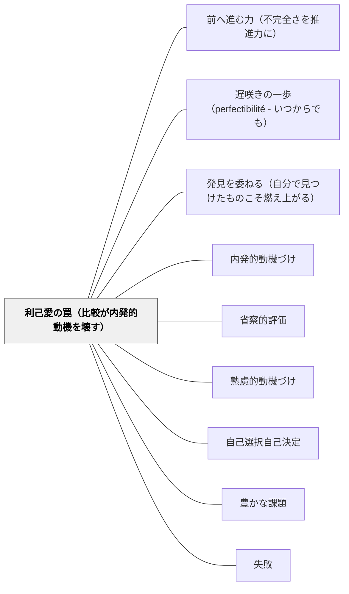

# 利己愛の罠（比較が内発的動機を壊す）

> 「比較によって生まれた感情は、内側からの動機を静かに殺す。」

---

## [Pattern Connection]

**人間不平等起源論（ルソー, 1755）統合：**

ルソーは二つの感情を峻別した：

> 「利己愛（アムール・プロープル）と自己愛（アムール・ド・ソワ）を混同してはならない。（中略）自己愛は自然な感情であり、すべての動物たちはこの自己愛のために自己保存に留意するようになる。（中略）これにたいして利己愛は、社会の中で生まれる相対的で人為的な感情である」——注一五

| 概念 | 原語 | 特徴 | 教育での表れ |
|---|---|---|---|
| **自己愛** | amour de soi | 自然な感情・自己保存・理性と憐れみで人間愛へ変容 | 「知りたい」「できるようになりたい」 |
| **利己愛** | amour propre | 社会的・比較的・人為的・名誉心・嫉妬の源泉 | 「あの子より上になりたい」「恥ずかしい」 |

- **SDTの「過正当化効果」との対応**：Deci & Ryan（2000）の「外発的報酬が内発的動機を侵食する」メカニズムは、ルソーの利己愛への転落と同じ構造を持つ。ルソーは1755年に、SDTが20世紀後半に実証したことを哲学的に定式化していた。
- **比較のメカニズム**：ルソーは「誰もが他人を眺め、誰もが他人に眺められたいと思うようになる」時点が「不平等と悪徳の最初の一歩」と述べた——これが学校の成績順位・発表会での序列・「クラスで一番」という比較文化に直接対応する。
- **補強された点**：内発的動機付けに対するルソーからの根本的な警告——SDT・Willingham（過正当化効果）・スピノザ（受動的感情）が「外から」内発的動機を損なうと論じるのに対し、ルソーは「比較という構造そのもの」が内側を腐敗させると主張する。
- **他のパタンへの波及**：[[パタン/内発的動機づけ]] — amour de soi = 内発的動機・amour propre = 外発的動機の哲学的根拠；[[パタン/省察的評価]] — 「実態（être）と外見（paraître）の分離」問題；[[文献/人間不平等起源論（ルソー）]] — 本統合の出典

---

## 背景（Context）

ルソーの分析によれば、人間が孤独で自足していた自然状態から、小共同体の段階を経て、社会（文明）が発展するにつれて「他者との比較」が生まれた。「誰もが他人を眺め、誰もが他人に眺められたいと思う」ようになると、自己の価値が内側ではなく「他者の目」に依存するようになる。

学校は意図せずして、この比較の文化を日常的に作動させる場になりやすい。成績・評価・クラス内順位・発表会での序列——これらはすべて「他者の目に映る自分」という感覚を育てる。

## 問題（Problem）

**比較を基盤とした評価・競争の文化が、学習者の利己愛（amour propre）を刺激し続けると、「学ぶこと自体への動機（amour de soi）」が「他者より優れて見えることへの動機（amour propre）」に置き換えられる。**

この転落が起きると：
- 誰も見ていない場面では学ばない（外部の目がなくなると動機が消える）
- 「分からない」と言えなくなる（能力が低く見えることへの恐れ）
- 正解できることが目的化し、わからないことを持ち続けられない
- 失敗が「自分の能力の証明」として脅威になる

ルソーの言葉を借りれば、「あること（être）と見えること（paraître）がまったく別のものになった」状態——実際に学んでいるかではなく、学んでいるように見えるかが優先される。

## 力のかたち（Forces）

- 比較による評価は即時の結果を見えやすくする反面、内発的動機を侵食する
- 成績・順位・競争を撤廃することは現実的に難しい（社会的要請・保護者の期待）
- 「誰かより上」という動機は短期的に機能するが、比較対象がなくなると消える
- 学習者は比較の文化に長年慣れていると、内発的動機を取り戻すことが難しくなる
- 「褒めること」でさえ、他者との比較を含む褒め方は利己愛を刺激する

## 解決（Solution）

**評価の焦点を「他者との比較」から「自分の成長」へ移し、「知ること自体の価値（amour de soi）」が「他者より優れて見えること（amour propre）」に置き換えられないよう、学習環境を意図的に設計する。**

---

### 比較の代わりに成長を見る評価設計

- **縦の比較（自己内比較）を使う**：「あの子より上」ではなく「先週の自分より」——ポートフォリオや振り返りジャーナルが縦の比較を可能にする
- **「分からなかった→分かった」の記録**：できなかったことができるようになった変化を可視化する
- **ランキングの非表示**：成績の公開順位・クラス内での比較表示を避ける

### 「知ること自体の楽しさ」を守る設計

- **「なぜ知りたいか」を問う**：課題の前に「これに関してどんなことが気になるか」を先に引き出す
- **「分からない」を安全にする**：「まだ分からないことがある」を肯定する文化
- **答えのない問いを場に出す**：一つの正解がある問いばかりでは、「正解を出せるか（他者の前で）」が主題になる

### ピティエ（憐れみの情）を守る協同設計

ルソーは自己愛と並んで「憐れみの情（pitié）」——他者の苦しみへの自然な共感——を人間の根源的原理とした。過度な競争環境はこの共感力を損なう。

- 協同学習・哲学対話・共同制作が、競争文化の中で共感力を保護する
- 「仲間が困っている」を助ける文化が利己愛への転落を防ぐ

---

## 結果（Consequences）

- 学習者が「他者の目がないときでも学べる」状態に近づく
- 「分からない」を持ち続けられる耐性が育つ（探究の燃料として）
- 失敗が「能力の証明」でなく「情報」として扱われる文化が生まれる
- ただし、利己愛（比較・競争）は社会全体の文化として働くため、教室内の設計だけでは限界がある——学校文化・保護者との対話が必要

## クラスター図

## Actionable Insight

- **評価の言葉を「クラスで一番」から「先週の自分より」に変える**：掲示物・フィードバックから順位・比較の言葉を減らし、「○○が先週よりできるようになった」という縦の比較に言い換える実験を1つの単元でしてみる
- **「分からないことメモ」を授業の文化にする**：「まだ分からないことを書く」コーナーを作る——分からないことを持ち続けることが価値あると示すことで、「知らない（他者より劣って見える）」という恐れを薄める
- **答え合わせ場面での言葉に注意する**：「正解者は何人？」という問いを「どんな考え方が出た？」に変える——比較（正解者数）ではなく多様な思考（プロセス）を中心に置く
- **授業設計の前に問う**：「この課題は、他者との比較（amour propre）を刺激するか、それとも知ること自体の楽しさ（amour de soi）を守れるか」——この一問を自己点検として使う

⚖ **緊張関係**: [[緊張関係マップ]] — [[パタン/ゴールドスター]]・[[パタン/ポジティブフィードバック]] と拮抗する。判断軸：〈プロセスへの情報か操作かで選ぶ〉

## 関連パタン
- [[パタン/前へ進む力（不完全さを推進力に）]]
- [[パタン/遅咲きの一歩（perfectibilité - いつからでも）]]
- [[パタン/発見を委ねる（自分で見つけたものこそ燃え上がる）]]

- [[パタン/内発的動機づけ]] — amour de soi = 内発的動機、amour propre = 外発的動機の哲学的根拠
- [[パタン/省察的評価]] — 実態（être）と外見（paraître）の分離を乗り越える評価設計
- [[パタン/熟慮的動機づけ]] — 動機の質を意図的に設計する上位パタン
- [[パタン/自己選択自己決定]] — 比較から離れ、自律性を守る設計の実践
- [[パタン/豊かな課題]] — 一つの正解がない課題が利己愛への転落を防ぐ
- [[パタン/失敗（インストラクション）]] — 失敗を「能力の証明」でなく「情報」として扱う文化
- [[文献/人間不平等起源論（ルソー）]] — 本統合の出典

## 出典

ルソー, J. J.（1755/2008）.『人間不平等起源論』中山元訳. 光文社古典新訳文庫.

> 「利己愛（アムール・プロープル）と自己愛（アムール・ド・ソワ）を混同してはならない。この二つの情念は、その性格においても、その効果においても、きわめて異なるものなのである。自己愛は自然な感情であり、すべての動物たちはこの自己愛のために自己保存に留意するようになる。人間においては、理性に導かれ、憐れみの情によって姿を変えられることを通じて、自己愛から人間愛と美徳が生まれる。これにたいして利己愛は、社会の中で生まれる相対的で人為的な感情である」——注一五

> 「誰もが他人を眺め、誰もが他人に眺められたいと思うようになる。こうして公の尊敬をうけることが重要になり始める。（中略）これが不平等が発生するための、そして同時に悪徳が生まれるための最初の一歩となったのである」——第二部
