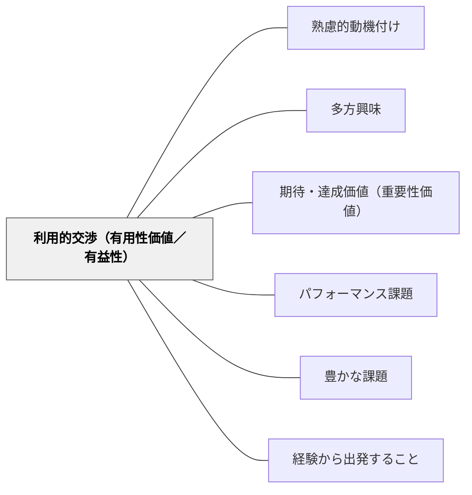

# 利用的交渉（有用性価値／有益性）

> 「これで何かできる」という実感が、学ぶ意味を作り出す。

## 背景（Context）
ヘルバルトの多方興味論および牧口常三郎の教育理論における「利用的交渉」。自然やものを利用・活用することへの興味から生まれる動機を指す。料理・工作・工芸・農作業など、「これを使って何かができる」「役に立てられる」という実用的な関わりが学習の動機になる。

## 問題（Problem）
学習内容が「将来役立つ」という抽象的な話では動機につながらない。学習者が今この瞬間に「使えた」「できた」という実感を持てないと、有用性が遠い話として処理されてしまう。

## 力のかたち（Forces）
- 即座に「使える」体験が有用性の実感を生む
- 利用・活用の機会が設けられていないと、学んだ知識が眠ったままになる
- 有用性の対象（誰のために、何のために）が明確なほど動機が高まる
- 職業・将来・地域とのつながりが有用性の幅を広げる

## 解決（Solution）
**学習した知識・技能を実際に使う機会を設け、「学んだことが役立った」という体験を学習プロセスに組み込む。**

料理の計量で分数を使う・プログラムで作品を作る・調査した内容を地域で発表するなど、実用的な文脈での活用を授業に組み込む。「これを学ぶと○○ができる」という有用性の見通しを学習前に示すことも有効。

## 結果（Consequences）
- 学習内容への有用性の認識が高まり、動機が維持される
- 知識が実践的な文脈で定着しやすくなる
- 学習者が「なぜ学ぶのか」を自分の言葉で説明できるようになる

- [[概念/動機付け]] — 有用性価値の動機付け理論的背景

## クラスター図

## Actionable Insight

- 単元の途中に「今日学んだことを使って実際に〇〇をやってみよう」という活用場面を1回設ける——「使えた」という体験が有用性の実感を生む
- 学習前に「これが分かると○○ができるようになります」と具体的な見通しを一文示す——有用性の予告が学習への参入意欲を高める
- 学習した知識を使って地域の課題や身近な問題に関わる機会を単元に1回組み込む——「誰かのために役立った」という体験が動機を内発化させる

## 出典

- 一つの教育のパタン・ランゲージ（岩井輝久）

## 関連パタン
- [[パタン/熟慮的動機付け]] — 親パタン
- [[パタン/多方興味]] — 上位パタン
- [[パタン/期待・達成価値（重要性価値）]] — 有用性価値の理論的基盤
- [[パタン/パフォーマンス課題]] — 学びを実際に使う文脈の設計
- [[パタン/豊かな課題]] — 有用性価値を核にした豊かな課題設計
- [[パタン/経験から出発すること]] — 実際に役立つ体験を学びの起点にする
