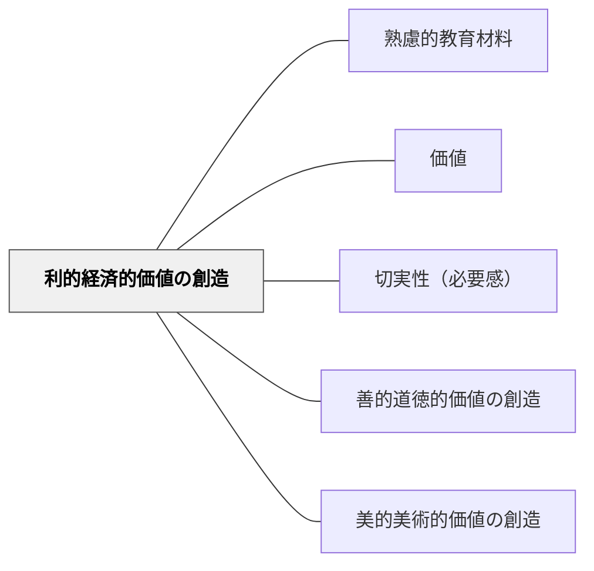

# 利的経済的価値の創造

> 役に立つこと・生活を豊かにすること——有用性の価値を育む教育材料。

## 背景（Context）

牧口常三郎の3価値分類の一つ。数学・理科・家庭科・職業教育など、生活・仕事・経済的な有用性に関わる教科は利的経済的価値を育む教育材料に分類される。「役に立つ」という実感が学習動機を支える。

## 問題（Problem）

「この学習が将来何の役に立つのか」が分からないと学習者は動機を失いやすい。

## 力のかたち（Forces）

- 有用性の実感が学習の意味づけを支える
- 近視眼的な「役立ち」だけでなく長期的な価値も含む
- 利的価値だけを重視すると教育が功利的になりすぎる

## 解決（Solution）

**学習内容の実生活・将来の仕事・経済活動との関連を明示し、有用性を実感できる教材設計をする。**

## 結果（Consequences）

- 学習内容の実用的意味が学習者に伝わる
- 切実性・必要感が高まる

## 関連パタン

- [[パタン/熟慮的教材教具]] — 親パタン
- [[パタン/価値]] — 上位パタン
- [[パタン/切実性（必要感）]] — 有用性から来る必要感
- [[パタン/善的道徳的価値の創造]] — 道徳・共同体への貢献という価値を生む兄弟パタン
- [[パタン/美的美術的価値の創造]] — 感動・美という価値を生む兄弟パタン
- [[メタパタン/価値を目標とする]] — 利・善・美の価値を目標とするメタパタン
- [[概念/教育の目標と力能]] — 価値の実現が力能の増大につながる
- [[概念/教養と人格形成]] — 価値の創造が人格形成の核心

## クラスター図

## Actionable Insight

- 学習内容が「どんな仕事で使われるか」「生活のどの場面で役立つか」を具体的に1つ示してから授業に入る——有用性の見通しが動機を高める
- 「この技術が分かると〇〇（具体的な活動）ができる」と学習後に何ができるかを明示する——「役立てられる」という実感が学習継続を支える
- 単元の終わりに「今日学んだことを使って何かやってみたいことはある？」と問う——有用性の認識が自分の文脈と結びついたとき動機が内発化する

## 出典

- 牧口常三郎（1972）『牧口常三郎全集第4巻 創価教育学体系 上』聖教新聞社
