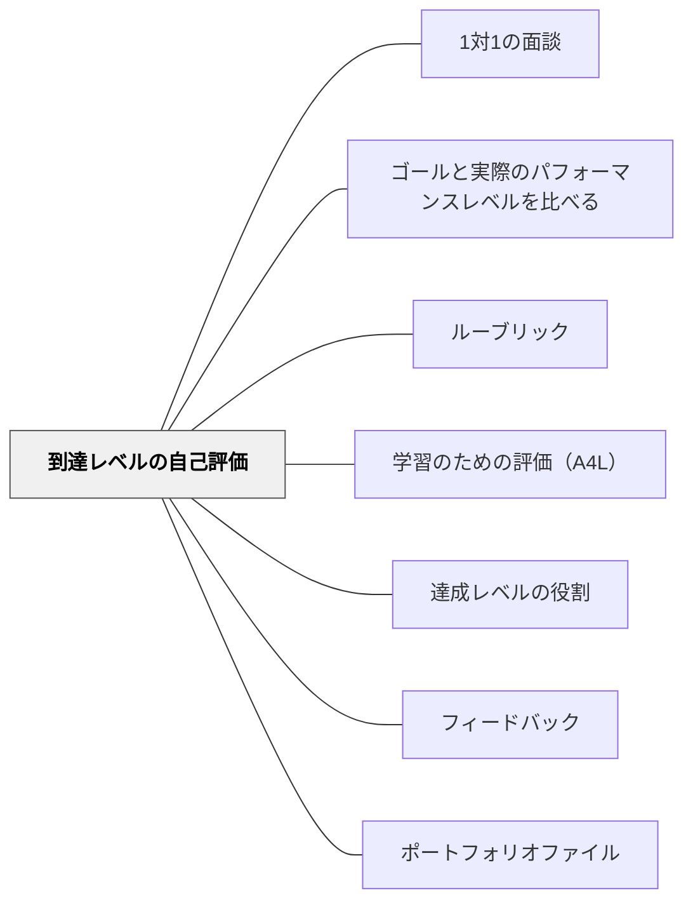

# 到達レベルの自己評価

> 自分の現在地を知る者だけが、次の一歩を選べる。

## 背景（Context）

自己評価は、学習者が自分の達成度・理解度・作品の質を自分で判断する実践だ。これは単なる「自己採点」ではなく、学習者がメタ認知（自分の学習状態についての認識）を発達させ、自己調整学習の主体となるための重要な能力だ。

ジョン・ハッティの研究では、自己評価は学習効果量が高い実践の一つとして位置づけられており、学習者が自分の学習を「外から見る」視点を育てることが、長期的な学習力の向上につながることが示されている。

## 問題（Problem）

教師が評価を一方的に行う構造では、学習者は「評価される客体」として位置づけられ、自分の学習状態に対して受動的になりやすい。その結果、フィードバックを受け取っても「先生に言われたこと」として処理され、自分の学びへの深い関与が生まれない。

また、正確な自己評価は教えられなければ身につかない。「何となく自分の出来は良かった」という曖昧な自己感覚は、ルーブリックや具体的な達成基準と照らし合わせる経験なしには精度が上がらない。

## 力のかたち（Forces）

- 正確な自己評価は、達成基準の理解と作品例との照合なしには難しい
- 学習者が自己評価を「正解を当てるゲーム」として捉えると、本来の目的が失われる
- 自己評価と教師評価のすり合わせ（キャリブレーション）の対話が、最も深い学びを生む

## 解決（Solution）

ルーブリックや成功規準を使って、学習者が自分の作品・行動・理解度を評価する機会を定期的に設ける。まず学習者が自己評価を行い、その後で教師のフィードバックを受け取る順序にすることで、自己認識と外部評価の差が明確になり、その差を話し合うことが深い学びになる。

具体的には、提出前に「この作品の最も成功している点と改善できる点をルーブリックを使って書く」という自己評価シートを設ける。学期ごとのポートフォリオ振り返りや、授業終了時の「今日の自分の達成度は？」という短い自己評価も有効だ。重要なのは、自己評価が「合っているかどうか」よりも「なぜそう判断したか」を言語化する過程にある。

## 結果（Consequences）

- 学習者がメタ認知を発達させ、自分の学習状態を客観的に把握できるようになる
- 学習の主体性が高まり、フィードバックを自分事として受け取れるようになる
- 教師と学習者の評価対話が深まり、相互理解が進む

## 関連パタン
- [[パタン/1対1の面談]]
- [[パタン/ゴールと実際のパフォーマンスレベルを比べる]]
- [[パタン/ルーブリック]]
- [[パタン/学習のための評価（A4L）]]
- [[パタン/達成レベルの役割]]

- [[パタン/フィードバック]] — 親パタン
- [[パタン/ポートフォリオファイル]] — ポートフォリオを通じた継続的な自己評価
## このパタンが働く教材

| 教材 | どのように自己評価を促すか |
|------|----------------------------|
| [[教材/ブック・バズ・ノート]] | 本の評価を星で示し、紹介後に「すばらしい」「まあまあ」「ふつう」「がんばろう」で自分のブック・バズを振り返る |
| [[教材/1週間の読書目標]] | 目標を達成したかどうかを自分で確認し、次の週の目標調整につなげる |
| [[教材/読むことの振り返り]] | 読むことへの好意・得意感・成長を振り返り、読者としての現在地を見つめる |

## クラスター図

## Actionable Insight

- 提出前にルーブリックを使って「最も成功している点と改善できる点を1つずつ書く」自己評価を1分行う——自己評価が先にあることで教師フィードバックとの差が明確になる
- 学期に一度、ポートフォリオを振り返り「学期初めと今の違い」を学習者自身に言語化させる——自己評価の視点が時間軸に広がることでメタ認知が育つ
- 自己評価と教師評価が大きくずれた場合、「なぜそう判断したか」を対話する時間を設ける——この対話が最も深い評価リテラシーを育てる

## 出典

Hattie, J. (2009). *Visible Learning*. Routledge.
Ross, J. A. (2006). The Reliability, Validity, and Utility of Self-Assessment. *Practical Assessment, Research & Evaluation*, 11(10).
