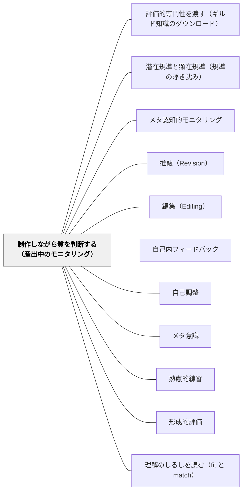

# 制作しながら質を判断する（産出中のモニタリング）

> すぐれた詩人はみな批評家を内に含む——Shenstone（1768）。評価が届くのが作品の完成後では遅い。作っているまさにその最中に、手元のものの質が自分で見えなければならない。

## 背景（Context）

Sadler（1989）は、学習者が自分で改善できるようになるための条件を三つに整理した。（a）目指す標準（standard／goal／reference level）の概念を持つこと、（b）現在の到達度と標準を比較すること、（c）ギャップを埋める適切な行動をとること。この三つは順に踏む段階ではなく、**同時に満たされていなければならない必要条件**だとされる。

そのうえで Sadler は、条件が満たされる「時点」に決定的な区別を置いた。成績づけ（grading）は（a）と（b）だけを含む巨視的な過程であり、作品が出来上がってから一度きり行われる。これに対して**産出中の制御は三条件すべてを含み、実時間で進む微視的な過程**である。学習者に必要なのはこちらのほうだ。

> The indispensable conditions for improvement are that the *student* comes to hold a concept of quality roughly similar to that held by the teacher, is able to monitor continuously the quality of what is being produced *during the act of production itself*, and has a repertoire of alternative moves or strategies from which to draw at any given point.
>
> 改善のための不可欠な条件は、学習者が教師の持つものとおおよそ同様の質の概念を持つに至ること、**産出という行為そのものの最中に**、作られつつあるものの質を継続的にモニターできること、そしてどの時点でも引き出せる代替の手立て・方略のレパートリーを持っていることである。

作品には、永続的な形を持つもの（作文・工作・陶芸・レポート）と、その場で消えるもの（発表・演奏・話し合い・授業そのもの）とがある。前者は公開されるまで無限に可塑的で、作者はいくらでも手を入れられる。後者は手を入れる機会がその一度きりで、産出と評価が同じ瞬間に重なる。この違いは、指導システムに異なる要求を課す。

## 問題（Problem）

評価もフィードバックも、作品が仕上がった後に届く。そのときにはもうその作品は終わっており、学習者にできるのは次の作品に活かすことだけである。しかも「良い」「もう少し」と後から言われても、**作っている最中のどの判断が分かれ目だったのか**は分からない。分岐点はすでに過去にあり、赤ペンはその過去には届かない。

作文を集めてから返すまでに一週間が空く。返ってきたときには子どもの関心はもう次に移っている。「ここをこう直すとよくなる」というコメントは正しいが、その子が来週別の題材を書くときに再現できる保証はない。

学習者が本当に改善できるようになるには、作っているまさにその最中に、自分の産出物の質を自分で見られなければならない。ところが多くの教室で、質を判断する役は最後まで教師が独占している。

## 力のかたち（Forces）

- **完成後の評価の扱いやすさ vs 産出中の評価の効き目**——完成品はそろえて比較でき、記録も残せる。しかし直せる時点はすでに過ぎている。産出中の評価は効き目が高いが、教師が一人ひとりの手元を同時に見ることはできない
- **外部からのフィードバック vs 自己モニタリング**——Sadler は、情報源が学習者の外にあるものを feedback、学習者自身が情報を生むものを self-monitoring と呼び分けた。前者は精度が高いが依存を生み、後者は自律を育てるが最初は精度が低い
- **焦点的意識 vs 副次的意識**——質を意識させようとして細部の点検に意識を張りつめさせると、産出そのものが壊れる。かといって何も意識しなければ質は運任せになる
- **判断の基準がないと見えない vs 基準を意識しすぎると手が止まる**——規準を渡さなければ何を見ればよいか分からない。渡しすぎるとチェックリスト作業になり、書く行為・つくる行為が死ぬ
- **その場で消える作品 vs 残る作品**——発表や演奏は取り返しがきかないぶん、産出中のモニタリングが唯一の制御手段になる。作文や工作は後から直せるぶん、産出中に見る動機が弱くなりやすい

## 解決（Solution）

**制作の途中に、自分の作品を基準に照らして見る場面を設計として組み込む。ただし意識を細部の点検に張りつめさせすぎると産出そのものが壊れるので、評価的な知識が背景で働く「副次的意識」の状態を育てることを最終的な目標にする。**

Sadler が Polanyi（1962）を引いて指摘するのはこの点だ。音楽の実演のようなライブの作品では、産出の機構や制御に意識を向けすぎると質はしばしば損なわれ、ときに壊滅的になる。演者は、暗黙的な評価的知識に無意識に支えられた**副次的意識（subsidiary awareness）**で、その瞬間その瞬間の出来を制御している。逆に**焦点的意識（focal awareness）**は、演奏を妨げ、損なうことがある。

したがって設計の順序はこうなる。最初は意識的な点検の場面を外から差し込む（焦点的意識を借りる）。回数を重ねるにつれてその点検を短く・少なくし、最後は手が動きながら質が見えている状態（副次的意識）へ移す。**足場としての点検場面は、外すことを前提に置く。**

そして Sadler は、多くの指導システムの目標は**フィードバックから自己モニタリングへの移行を促すこと**にあると述べる。教師の赤ペンは、それ自体が目的ではなく、子どもの内側に「批評家」を育てるための一時的な代替物である。

---

### 場面1：作文の途中で「読み手の椅子」に一分間だけ座る（国語・第4学年）

説明文を書く45分の授業で、これまでは書き始めから終わりまで一気に書かせ、集めてから教師が朱を入れていた。設計を変え、書き始めて15分たったところで一度だけ鉛筆を置かせる。

黒板には、その単元で顕在化してある規準が三つだけ貼ってある。「はじめに問いがあるか」「例が二つ以上あるか」「読む人が知らない言葉に説明があるか」。子どもは自分の書きかけを、その三つの目で一分間だけ読む。直すのは一箇所だけでよいと伝える。

A児は「例が一つしかない」ことに自分で気づき、二つ目を書き足して残り時間を使った。従来なら、それは一週間後に赤ペンで指摘される内容だった。**指摘の内容は同じでも、届く時点が違えばそれは別のもの**になる。

回数を重ねるうちに、教師が「置いて」と言う前に自分で手を止めて読み返す子が出てくる。そこまで来たら、止める合図の回数を減らしていく。

---

### 場面2：リコーダーの合奏——意識を向けすぎると壊れる（音楽・第5学年）

合奏の練習で、教師が「指づかい」「タンギング」「息の量」「友だちの音を聞く」と四つ同時に意識させたところ、演奏はかえって崩れた。一人ひとりが自分の指先を凝視し、合奏としてのまとまりが消えたのである。

これが Polanyi のいう焦点的意識の弊害そのものだった。翌時間、教師は意識させる対象を「まわりの音より自分が大きくなっていないか」の一点だけに絞った。演奏中に見るのは一つ、残りは体に任せる。演奏は明らかに良くなった。

その場で消える作品では、後からの修正がきかない。だからこそモニタリングは産出中でしか働けないが、同時に**モニタリングの重さが産出を潰す危険も最大になる**。見る対象を一つに絞ることは、質を下げる妥協ではなく、副次的意識が働く余地を残すための設計である。

---

### 場面3：発表の最中に聞き手の顔を見る（総合・第6学年）

調べたことの発表会。これまでは発表後に「声が小さかった」「原稿を読んでいた」という感想が付箋で返っていた。しかし本人にとって、その発表はもう終わっている。

そこで、発表中に一度だけ顔を上げて聞き手を見る、という約束を全員に置いた。見て、聞き手がうなずいていなければ、そこだけもう一度言い直してよいことにした。

B児は説明の途中で顔を上げ、聞き手が首をかしげているのを見て「えっと、つまり、この矢印は水が流れる向きです」と言い直した。原稿にない一文だった。産出中に質を判断し、その場で行動を変えた——Sadler の三条件がすべて実時間で満たされた瞬間である。

---

### 特別支援の視点：点検を外に置き、頭の中の負荷を下げる

産出中のモニタリングは、原理的に二重課題である。作る作業と、それを評価する作業が同時に走る。ワーキングメモリに困難のある子・注意の配分に困難のある子にとって、この二重負荷はそのままでは成立しないことが多い。

有効なのは、点検の側をできるだけ外に出すことだ。見る観点を頭の中に保持させず、机上の小さなカードや付箋一枚に書いて置く。観点は一つに絞る。点検のタイミングも本人の判断に委ねず、教師の合図やタイマーで外から与える。

こうして評価側の負荷を外部化すると、産出に使える容量が残る。**モニタリングができないのではなく、モニタリングを頭の中だけで走らせる設計が成り立っていない**という見方に切り替えることが要点である。慣れるにつれてカードを短くし、合図を減らしていけばよい。

## 結果（Consequences）

**利点**

- **直せる時点に情報が届く**——同じ指摘でも、完成後に届くのと産出中に届くのとでは意味が違う。産出中の気づきはその作品自体を変える
- **フィードバックから自己モニタリングへの移行が進む**——質の判断の担い手が教師から学習者へ移り、教師がいない場面でも質が保てるようになる
- **どの判断が分かれ目だったかが本人に見える**——完成後の講評では見えない「あのとき例を足したから通じた」という因果が、本人の経験として残る
- **その場で消える作品にも手立てが立つ**——発表・演奏・話し合いのように後から直せない産出でも、実時間の制御という形で質の向上が可能になる

**注意点・リスク**

- **点検が重すぎると産出が壊れる**——これが最大のリスク。観点を増やす、点検の回数を増やす、チェックリストを長くする、はいずれも焦点的意識を過剰にし、書く行為・つくる行為そのものを止めてしまう。観点は一つか二つに絞る
- **足場を外し忘れる**——「途中で止めて点検する」場面は本来外すべき足場である。何年も同じ回数・同じ長さで続けると、自分で止められる子まで教師の合図を待つようになる
- **規準がないところで点検させても空回りする**——見る目がまだ育っていない段階で「自分で見直して」と言っても、見えないものは見えない。質の概念を渡す作業が先に必要になる
- **速さや量の評価と衝突する**——制限時間内に書き上げることを重く扱う課題設計のもとでは、途中で止まることが損に見える。時間設計と一緒に変えないと、点検場面は形だけになる

## 関連パタン

- [[パタン/評価的専門性を渡す（ギルド知識のダウンロード）]] — 上位。本パタンは渡された評価的専門性が実際に働く場面を扱う
- [[パタン/潜在規準と顕在規準（規準の浮き沈み）]] — 制作中に何を見るか。顕在化された規準が自己点検の焦点になる
- [[概念/質的判断（曖昧な規準とメタ規準）]] — 制作中に働かせている判断の正体
- [[パタン/メタ認知的モニタリング]] — 「今どのくらい分かっているか」という理解の状態の監視。本パタンは「今作っているものが基準にどれだけ届いているか」という産出物の質の監視で、対象が違う
- [[パタン/推敲（Revision）]] — 書き終えた後に一歩下がって見直す。本パタンは書いている最中に見る点で時間的位置が違う
- [[パタン/編集（Editing）]] — 内容が決まった後の表記の点検。本パタンはもっと手前の、質そのものの判断を扱う
- [[パタン/自己内フィードバック]] — 自分で現在地を確認する力。本パタンはそれが産出のただ中で働く場合
- [[パタン/自己調整]] — 学習過程全体の自己調整。本パタンはその中の「実行中のモニタリング」に焦点を絞ったもの
- [[パタン/メタ意識]] — 自分を一歩引いて見る力の一般形
- [[パタン/熟慮的練習]] — 目標と内省を伴う練習。本パタンは練習の最中に何を見ているかを扱う
- [[パタン/形成的評価]] — 上位の枠組み。本パタンは評価の担い手が学習者自身になり、時点が産出中まで前倒しされた極

- [[パタン/理解のしるしを読む（fit と match）]] — 質の判断を産出中に前倒しするのと同型に、理解の判断を正答の手前に前倒しする
## クラスター図

## Actionable Insight

- **今週の作文の授業に「一分間の読み手タイム」を一回だけ差し込む**——書き始めて15分で鉛筆を置かせ、黒板に貼った規準を三つだけ示して自分の書きかけを読ませる。直すのは一箇所でよいと伝える。集めて赤ペンを入れる前に、その一分を置く
- **産出中に意識させる観点を一つに絞って口に出す**——合奏でも発表でも工作でも、「今日はこれだけ見て」と一点だけ告げる。四つ告げた日と一つ告げた日の出来を比べてみる
- **合図の回数を単元の中で減らしていく**——第1時は教師が三回止める、第3時は一回、第5時は「自分で止めていい」と言うだけにする。止められた子の名前を記録して、足場が外れつつあるかを確認する

## 出典

Sadler, D. R. (1989). Formative assessment and the design of instructional systems. *Instructional Science, 18*(2), 119–144.

> In other words, students have to be able to judge the quality of what they are producing and be able to regulate what they are doing during the doing of it. As Shenstone (correctly) put it over two centuries ago, "Every good poet includes a critic; the reverse will not hold" (Shenstone, 1768, p. 172).
>
> 言いかえれば、学習者は自分が産出しているものの質を判断でき、それを行っているそのさなかに自分の行為を調整できなければならない。Shenstone が二世紀以上前に（正しく）述べたように、「すぐれた詩人はみな批評家を内に含む。その逆は成り立たない」。（p. 121）

> The (macro) process of grading involves the first two in that it is essentially comparing a particular case either with a standard or with one or more other cases. Control during production involves all three conditions and is, by contrast, a (micro) process carried out in real time.
>
> 成績づけという（巨視的な）過程は、本質的にある事例を標準または他の事例と比較することであるから、三条件のうち初めの二つしか含まない。これに対して産出中の制御は三条件すべてを含み、実時間で遂行される（微視的な）過程である。（p. 121）

> The goal of many instructional systems is to facilitate the transition from feedback to self-monitoring.
>
> 多くの指導システムの目標は、フィードバックから自己モニタリングへの移行を促すことである。（p. 122）

> If the performer focuses too consciously on either the mechanics of production or the control of production during the performance itself, the quality of the performance frequently suffers. Occasionally the loss of quality is catastrophic. The performer needs to control the performance using what Polanyi calls *subsidiary awareness* (1962, p. 55) of the state of play at any instant.
>
> 演者が、実演のさなかに産出の機構や産出の制御に意識を向けすぎると、実演の質はしばしば損なわれる。ときにその質の低下は壊滅的である。演者は、その瞬間その瞬間の状態について Polanyi が「副次的意識」と呼ぶものを用いて実演を制御する必要がある。（p. 136）

Polanyi, M. (1962). *Personal knowledge: Towards a post-critical philosophy*. University of Chicago Press.（Sadler 1989 における引用）

Shenstone, W. (1768). *Essays on men and manners*.（Sadler 1989 における引用）
