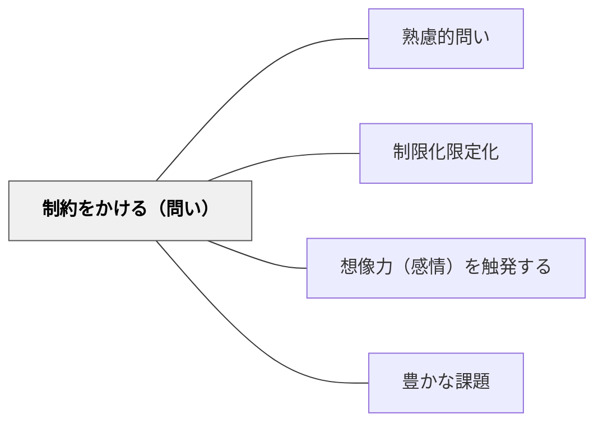

# 制約をかける（問い）

> 「もし〇〇の条件だけで答えるなら？」と制約を設けることで、自由な発想ではなく意外な発見が生まれる。

## 背景（Context）

「自由に考えてください」という問いは、逆に発想を止めてしまうことがある。人は選択肢が多すぎると動けなくなる（選択のパラドックス）。意図的な制約を課すことで、思考の方向が絞られ、その制約の中で創造性が発揮されやすくなる。

## 問題（Problem）

自由度が高すぎる問いは、参加者に「どこから手をつければよいか」という戸惑いを生む。一方で制約がなければ、表面的で当たり障りのない答えに留まりやすい。制約こそが思考の深さと創造性を引き出す道具になりうるが、その活用は意識的に行う必要がある。

## 力のかたち（Forces）

- 制約が強すぎると、参加者が窮屈に感じ、発想がかえって萎縮する
- 制約の設定が恣意的に感じられると、参加者の動機が下がる
- 制約の種類（時間・人物・場所・手段・資源）によって、引き出される思考が異なる
- 制約の中で答えを探すゲーム性が、参加の意欲を高めることがある

## 解決（Solution）

「予算がゼロなら？」「10分しかないとしたら？」「テクノロジーなしで解決するなら？」「子どもだけで解決するとしたら？」のように、トピック・範囲・答え方・使える資源を意図的に限定して問う。たとえば「もし一つだけ変えてよいとしたら、何を変える？」「この授業を教室なしで行うとしたら？」のように具体的な制約を提示する。

## 結果（Consequences）

- 制約が創造性を刺激し、普段は出てこない発想が生まれやすくなる
- 参加者が「条件内での最善」を真剣に考える姿勢が育つ
- 制約への反発が生まれる場合があるため、制約の意図を丁寧に伝えることが重要

## 関連パタン

- [[パタン/熟慮的問い]] — 親パタン
- [[パタン/制限化限定化]] — 範囲を絞ることで思考を研ぎ澄ます上位パタン
- [[パタン/想像力（感情）を触発する]] — 制約という条件がゲーム的な想像力を引き出す
- [[パタン/豊かな課題]] — 制約をかけた課題が低コスト・高エントリーの豊かな問いになる
- [[メタパタン/経済を原理とする]] — 制約は最小の手段で最大の学びを生む経済的設計

## クラスター図

## Actionable Insight

- 問題解決の活動に「道具は1つだけ」「時間は5分」のような制約を1つ加える——制約がゲーム性を生み、普段は出てこない発想を引き出す
- 「もし予算がゼロなら？」「テクノロジーなしで解決するなら？」と具体的な制約問いを提示する——選択肢の縛りが思考の深みを増し、本質的な答えへ向かう経路を開く
- 「一つだけ変えてよいとしたら何を変える？」で選択を絞り優先順位の思考を促す——制約への反発が生まれたとき「なぜこの制約か」を丁寧に説明することで学習者の納得が生まれる

## 出典

- [[文献/熟慮的問いのパターンリスト（動画記録）]]
