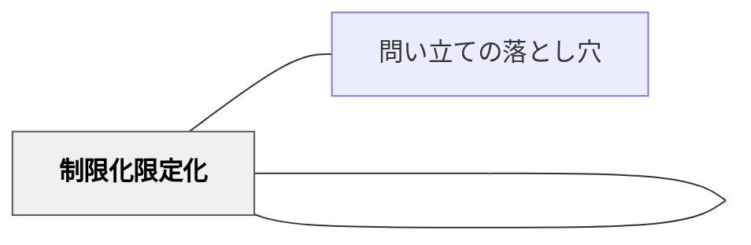

# 制限化（限定化）

> 無制限であることによって、安心できないし、学ぶことが妨げられている。

## Pattern Connection

### 岩井輝久（2023）——制限化は自己調整学習の鍵であり大パタン

> 「自己調整学習の鍵の一つが制限化（限定化）。力のある教育者は、自分に対しても、被教育者に対しても状況に応じて適切に教育を制限化している。これを教育者も被教育者もできるように助けていくこと。制限化は、あらゆる教育、学習を貫く原則、大パタン。」（岩井輝久、2023）

- **既存パタンとの関連**：既存の記述（千葉雅也「教育とは、まず制限なのです」・教科書や学校図書館の例）は制限化の働きを説明するが、このツイートは「なぜ大パタンか」の根拠を追加する——自己調整学習に直結するからこそ、制限化はあらゆる教育場面を貫く
- **補強された点**：制限化の適用対象が「教師自身」にも及ぶという視点が加わった。教師が自分の教え方・発問・介入を適切に制限化することと、子どもが自分の学習を制限化（フォーカス）することは同じ構造をもつ
- **他のパタンへの波及**：[[パタン/自己調整]]（制限化が自己調整のループを起動させる——目標・範囲・時間の制限があって初めて「どこに向かうか」の自己判断が生まれる）・[[パタン/目標設定]]（「何をしないか」を決めることが目標を明確にする）・[[パタン/ボトルネック]]（無制限であることはボトルネックの一形態）

---

## 背景（Context）

「教育とは、まず制限なのです。」千葉雅也

## 問題（Problem）

学習者が学習の土台に乗れず、本来の教育の価値が届かない。

## 力のかたち（Forces）

- 教育者の意図と学習者の実態のギャップ
- 個々の状況に応じた柔軟な対応の必要性
- 経済性（無駄なコスト・苦しみを省く）の原理

## 解決（Solution）

無制限であることによって、安心できないし、学ぶことが妨げられている。

教育において、どのように制限するのかということは、教育を支える、根本的で極めて重

要なパタンです。

「どのような知識が最も価値があるのだろうか」とスペンサーは問いました。今ある算数

や数学の教科書は、人間が長い時間をかけて構成してきた知識の中でも基本的で最も価値

のある知識を順序を考えて整理（制限化）したものです。

おにあそびでは、逃げることができる範囲を制限することで、より安全に楽しく遊ぶこと

ができます。

学校図書館では、限られた空間に、教材となるものも含めて、選りすぐりの本を集めてい

ます。子どもたちは制限化（限定化）された環境で本を選ぶことによって効果的に学ぶこ

とができます。

多くの社会科や理科の単元学習のはじめは社会事象や自然事象との出会いから始まる構成

になっています。社会事象や自然事象に出会うことで、無制限に自由に思考するのではな

く、子どもたちの思考には、大きな学習テーマが生まれます（制限化）。その大きなテー

マの中で小テーマ（学びたいこと／質問）を出していくわけです。ただ無制限に自由に学

ぶというのは、教育ではありません。

効果的に教育を制限化せよ

♡♡♡

制限化することによって、被教育者は安心して経済的に学習に取り組むことができる。

参考文献
千葉雅也（２０２２）『現代思想入門』講談社

## 結果（Consequences）

- 学習者の力能（なしうる力）が増大する
- パタンの圧縮による教育の経済性が実現する
- 関連パタンと重ね合わせることで効果が高まる

## 関連パタン

- [[概念/パタン・ランゲージ概論]]
- [[パタン/制限化限定化]] （原典パタン集に存在する場合）
- [[パタン/問い立ての落とし穴]] — 「大きすぎるテーマ」の絞り方として制限化が機能する

## クラスター図

## Actionable Insight

- 課題を出す時に「今日はこの3つの方法だけ使ってよい」と制限する——自由すぎると思考が止まる。制限が創造を生む
- 学習テーマを決めたら「この単元では考えないこと」を明示する——何をしないかを決めることで何をするかが明確になる
- 自由探究の前に「使える素材はこれだけ」「発表時間は2分」という制限を設ける——制限が安心と集中と経済性を生む

## 出典

岩井輝久「岩井輝久『一つの教育のパタン・ランゲージ』」（2026-04-29 vault収録）
