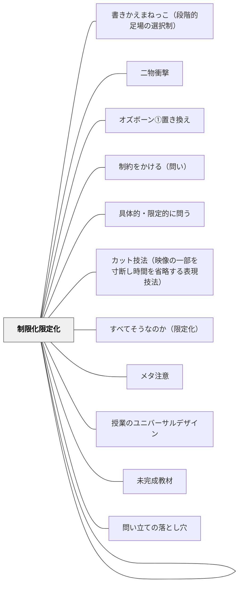

# 制限化（限定化）

**一文でいうと**：何を・どこまで・どれだけ扱うかを絞り、子どもが安心して集中し、その中で考えられるようにする。

## 使いどころ・使いすぎ注意

| 観点 | 内容 |
| --- | --- |
| 使いどころ | 課題や活動が広すぎて、子どもが何から始めればよいか分からないとき。単元のテーマを決めるとき。 |
| 使いすぎ注意 | 絞りすぎると、子どもが選び、自分のやり方で考える余地がなくなる。 |

> 無制限であることによって、安心できないし、学ぶことが妨げられている。

## 背景（Context）

「教育とは、まず制限なのです。」千葉雅也

## 問題（Problem）

無制限であることによって、安心できないし、学ぶことが妨げられている。

## 力のかたち（Forces）

- 教育において、どのように制限するのかということは、教育を支える、根本的で極めて重要なパタンである
- 「どのような知識が最も価値があるのだろうか」（スペンサー）——何を学ぶかを選ぶことは避けられない
- 制約は創造を生む（北大路翼「十七文字の器はでけーぞ。」、下の補足）
- 制限は、教師が子どもにかけるだけでなく、教師が自分自身にも、子どもが自分の学習にもかけるもの。状況に応じて適切に制限化できることが、自己調整学習の鍵になる（岩井 2023、下の補足）
- ただ無制限に自由に学ぶというのは、教育ではない

## 解決（Solution）

**近いパタンとの見分け**：教材・教具の表では、本パタンの見分けの問いは「範囲や条件をあえて絞り、安心して取り組めるようにしているか（岩井）」。全体の表は [[パタン/熟慮的教材教具#近いパタンとの見分け|熟慮的教材教具]] にある。

**効果的に教育を制限化せよ。**

### 制限化の例

- **教科書**：今ある算数や数学の教科書は、人間が長い時間をかけて構成してきた知識の中でも基本的で最も価値のある知識を、順序を考えて整理（制限化）したものです。
- **おにあそび**：逃げることができる範囲を制限することで、より安全に楽しく遊ぶことができます。
- **学校図書館**：限られた空間に、教材となるものも含めて、選りすぐりの本を集めています。子どもたちは制限化（限定化）された環境で本を選ぶことによって効果的に学ぶことができます。
- **社会科・理科の単元のはじめ**：多くの社会科や理科の単元学習のはじめは、社会事象や自然事象との出会いから始まる構成になっています。社会事象や自然事象に出会うことで、無制限に自由に思考するのではなく、子どもたちの思考には、大きな学習テーマが生まれます（制限化）。その大きなテーマの中で小テーマ（学びたいこと／質問）を出していくわけです。

### 研究の裏づけ

> **研究の裏づけ（2026-11-01）**：米国教育科学研究所の算数の問題解決の実践ガイド（Woodward ほか 2012）は、解く過程を点検する問いかけの一覧を子どもの手元に置くよう勧め（根拠 strong）、一覧は全部渡さず数個に絞るよう書く。「多すぎる問いかけは解く過程を遅くするか、無視される」からである。手がかりも、多ければよいわけではない例である。出典：[[文献/算数の問題解決を4〜8年生で育てる（Woodwardほか2012）]]。

> **研究の裏づけ（2026-11-04）**：組織の創造性とイノベーションについて、2000年以降の145の研究を分野をまたいで整理したレビューは、制約を3つに分けた。時間・お金・材料が足りない「入力の制約」、手順や規則の「過程の制約」、作るものの指定の「出力の制約」である。そのうえで、制約は少なすぎても多すぎても創造性によくないという逆U字の枠組みを提案した（オンライン先行版 p. 13）。少なすぎると、いちばん思いつきやすい解に流れる。適度だと挑戦として受けとられ、手元のものの新しい組み合わせを探す。多すぎると、自分で決めている感覚と、組み合わせる材料が減る。制約が「管理」と受けとられると、早い段階で逆効果になる（p. 15）。対象は会社や従業員で子どもではなく、逆U字は著者の提案である。出典：[[文献/制約は創造性を妨げるのか、引き出すのかを、分野をまたいで整理する（Acarほか2019）]]。

> **研究の裏づけ（2026-11-04）**：絞ることには限りもある。「選択肢が多すぎると選ぶ気持ちや満足が下がる」という選択過多の仮説（ジャムの実験で知られる）を、選択肢の数を実験で変えた50の実験（63の条件・5,036人）でまとめたメタ分析では、効果の平均はほぼゼロだった（d = 0.02）。はっきりした好みや詳しい知識をもつ人は、選択肢が多いほうがよい結果だった（p. 417）。選択過多が起きうるのは、選択肢が種類別にまとまっていない・一つ一つの情報が多い・時間に追われる・あとで理由の説明を求められる、といった条件で、どれも一つの研究ずつでしか示されていない（pp. 419–420）。著者は、選択過多が起きる十分な条件は特定できなかったと書く（p. 421）。何を絞るかは、選択肢の数よりも、並べ方と、選ぶ人の詳しさで決めるほうがよい。主に大人の消費者の実験で、子どもの学習の選択は含まれない。出典：[[文献/選択肢が多すぎると選べなくなるのかを、50の実験から確かめる（Scheibehenneほか2010）]]。

> **研究の裏づけ（2026-11-05）**：（観察）どれだけ扱うかを絞ることには、一つの活動の長さを絞ることも含まれる。米国の幼稚園〜4年生の30学級の観察では、一つの活動が長いほど、子どもが課題に向かう割合が下がった。10分の活動は30分の活動より、課題に向かう見込み（オッズ）が1.42倍高いと推定された（pp. 37–38）。観察した活動の長さは6.7〜39.7分で、中央値は12.8分だった。著者は、30分ほどの長い活動は小学校では最適でないかもしれないとする（p. 47）。ただし観察研究で、活動の長さは授業1時間の平均で測った粗い指標であり、長い活動と短い活動では形態や中身も違いうる（p. 46）。学びの成果は測っていない。出典：[[文献/小学生が授業から離れるのは、どんな形態の授業で、どのくらいの長さの活動のときかを、52の学級で観察して確かめる（Godwinほか2016）]]。

> **研究の裏づけ（2026-11-06）**：（実験室の研究の総説）「どれだけ扱うか」を絞る理由の一つは、頭の中に一度に置いておける量の限界である。心の中でくり返す・まとめるといった工夫を防いで測ると、若い大人で約3〜5個のまとまりまでで、何度も組で覚えた言葉の組も一つのまとまりとして数えられる。単純な色の図形の実験では、7歳が約1.5個、年長の子どもと大人が約3.0個で、幼い子どもでは置いておける量そのものが少なかった。文章を読むときも、前提・前の段落の要点・今の段落の事実と意見を一つのまとまりに合わせられて初めて読み進められる、とする。実験室の課題の数字で、教室で一度に扱う量を決めたものではない。出典：[[文献/頭の中に一度に置いておけるのは3〜5個のまとまりまでで、幼い子どもはもっと少ないことを、記憶の実験から整理する（Cowan2010）]]。

## 結果（Consequences）

- 制限化することによって、被教育者は安心して経済的に学習に取り組むことができる
- 大きな学習テーマの中で、子どもが自分の小テーマ（学びたいこと／質問）を出せるようになる（社会科・理科の例）

## Pattern Connection

### 北大路翼（2019）生き抜くための俳句塾 統合（2026-06-02）：17文字——制約が創造を必然化する

17文字という俳句の制約は、制限化（限定化）の最も洗練された実践例の一つである。

> 「十七文字の器はでけーぞ。」——北大路翼（2019）第一講

北大路翼はこの一文で逆説を示す：制約（17文字）は小さいのではなく「でかい」。制約があることで、感情・経験・観察のすべてが17文字に向かって収斂する。「何を言わないか」が決まるとき、「何を言うか」が際立つ。

**「音数よりも音量」——制約の精神：**
「字余り・字足らずは気にしない。音数よりも音量」——これは「17という数字に制限されるのではなく、17文字という精神（何を伝えるか）に制限される」ということ。制限化の本質は「何もかもを詰め込まないこと」であり、数字そのものではない。

**制限が発想を生む：**
「なんでもいいから具体的なモノを一つ持ってきて」「二物（二つのものを取り合わせる）」——俳句の技法はすべて制限から生まれる発想法。制約がなければ「どこから始めればいいかわからない」状態になる。これは既存の解決部分「制限化することによって、被教育者は安心して経済的に学習に取り組むことができる」の詩的な実証例である。

- **既存パタンとの関連**：岩井（2023）の接続が「制限化は自己調整学習の鍵」という原理論を示すとすれば、北大路翼は「17文字の制約が感性・発想・表現をすべて収斂させる」という詩的実践での具体例を提供する
- **補強された点**：「制限が安心と学習を生む」（本パタンの解決部分）に、「制限が創造を生む」という補強が加わる——「器が小さいから詰め込まれる」のではなく「器が小さいから選ばれる」
- **他のパタンへの波及**：[[パタン/二物衝撃]] — 17文字の中で二物を選ぶという制限が取り合わせを鋭くする；[[パタン/多作多捨]] — 制限された形式（17文字・句会）が多作多捨のリズムを制度化する；[[文献/生き抜くための俳句塾（北大路翼）]] — 本統合の出典

---

### 岩井輝久（2023）——制限化は自己調整学習の鍵であり大パタン

> 「自己調整学習の鍵の一つが制限化（限定化）。力のある教育者は、自分に対しても、被教育者に対しても状況に応じて適切に教育を制限化している。これを教育者も被教育者もできるように助けていくこと。制限化は、あらゆる教育、学習を貫く原則、大パタン。」（岩井輝久、2023）

- **既存パタンとの関連**：既存の記述（千葉雅也「教育とは、まず制限なのです」・教科書や学校図書館の例）は制限化の働きを説明するが、このツイートは「なぜ大パタンか」の根拠を追加する——自己調整学習に直結するからこそ、制限化はあらゆる教育場面を貫く
- **補強された点**：制限化の適用対象が「教師自身」にも及ぶという視点が加わった。教師が自分の教え方・発問・介入を適切に制限化することと、子どもが自分の学習を制限化（フォーカス）することは同じ構造をもつ
- **他のパタンへの波及**：[[パタン/自己調整]]（制限化が自己調整のループを起動させる——目標・範囲・時間の制限があって初めて「どこに向かうか」の自己判断が生まれる）・[[パタン/目標設定]]（「何をしないか」を決めることが目標を明確にする）・[[パタン/ボトルネック]]（無制限であることはボトルネックの一形態）

## 関連パタン
- [[実践/作家の時間（2年生）]]
- [[パタン/書きかえまねっこ（段階的足場の選択制）]]
- [[パタン/二物衝撃]]
- [[パタン/オズボーン①置き換え]]
- [[パタン/制約をかける（問い）]]
- [[学級経営/オンボーディング]]
- [[パタン/具体的・限定的に問う]]
- [[パタン/カット技法（映像の一部を寸断し時間を省略する表現技法）]]
- [[パタン/すべてそうなのか（限定化）]]
- [[パタン/メタ注意]]
- [[パタン/授業のユニバーサルデザイン]]
- [[パタン/未完成教材]]

- [[概念/パタン・ランゲージ概論]]
- [[パタン/制限化限定化]] （原典パタン集に存在する場合）
- [[パタン/問い立ての落とし穴]] — 「大きすぎるテーマ」の絞り方として制限化が機能する
- [[文献/算数の問題解決を4〜8年生で育てる（Woodwardほか2012）]] — 問いかけの一覧は数個に絞る（多すぎると無視される）
- [[文献/制約は創造性を妨げるのか、引き出すのかを、分野をまたいで整理する（Acarほか2019）]] — 制約は少なすぎても多すぎてもよくないという逆U字の枠組み（組織の研究の整理）
- [[文献/選択肢が多すぎると選べなくなるのかを、50の実験から確かめる（Scheibehenneほか2010）]] — 選択過多のメタ分析：選択肢を減らしても平均では変わらない。詳しい人は多いほうがよい
- [[文献/小学生が授業から離れるのは、どんな形態の授業で、どのくらいの長さの活動のときかを、52の学級で観察して確かめる（Godwinほか2016）]] — 一つの活動の長さを絞る：活動が長いほど課題に向かう割合が下がった（観察）
- [[文献/頭の中に一度に置いておけるのは3〜5個のまとまりまでで、幼い子どもはもっと少ないことを、記憶の実験から整理する（Cowan2010）]] — 一度に頭に置いておける量は3〜5個のまとまりまでで、7歳では約1.5個（実験室の研究の総説）

## クラスター図

```mermaid
flowchart LR
    ne588b6e99990e58c96e99990e5ae9ae58c96["制限化限定化"]
    ne69bb8e3818de3818be38188e381bee381ade381a3e38193efbc88e6aeb5e99a8ee79a84e8b6b3e5a0b4e381aee981b8e68a9ee588b6efbc89["書きかえまねっこ（段階的足場の選択制）"]
    ne4ba8ce789a9e8a19de69283["二物衝撃"]
    ne382aae382bae3839ce383bce383b3e291a0e7bdaee3818de68f9be38188["オズボーン①置き換え"]
    ne588b6e7b484e38292e3818be38191e3828befbc88e5958fe38184efbc89["制約をかける（問い）"]
    ne585b7e4bd93e79a84e383bbe99990e5ae9ae79a84e381abe5958fe38186["具体的・限定的に問う"]
    ne382abe38383e38388e68a80e6b395efbc88e698a0e5838fe381aee4b880e983a8e38292e5afb8e696ade38197e69982e99693e38292e79c81e795a5e38199e3828be8a1a8e78fbee68a80e6b395efbc89["カット技法（映像の一部を寸断し時間を省略する表現技法）"]
    ne38199e381b9e381a6e3819de38186e381aae381aee3818befbc88e99990e5ae9ae58c96efbc89["すべてそうなのか（限定化）"]
    ne383a1e382bfe6b3a8e6848f["メタ注意"]
    ne68e88e6a5ade381aee383a6e3838be38390e383bce382b5e383abe38387e382b6e382a4e383b3["授業のユニバーサルデザイン"]
    ne69caae5ae8ce68890e69599e69d90["未完成教材"]
    ne588b6e99990e58c96e99990e5ae9ae58c96["制限化限定化"]
    ne5958fe38184e7ab8be381a6e381aee890bde381a8e38197e7a9b4["問い立ての落とし穴"]

    ne588b6e99990e58c96e99990e5ae9ae58c96 --- ne69bb8e3818de3818be38188e381bee381ade381a3e38193efbc88e6aeb5e99a8ee79a84e8b6b3e5a0b4e381aee981b8e68a9ee588b6efbc89
    ne588b6e99990e58c96e99990e5ae9ae58c96 --- ne4ba8ce789a9e8a19de69283
    ne588b6e99990e58c96e99990e5ae9ae58c96 --- ne382aae382bae3839ce383bce383b3e291a0e7bdaee3818de68f9be38188
    ne588b6e99990e58c96e99990e5ae9ae58c96 --- ne588b6e7b484e38292e3818be38191e3828befbc88e5958fe38184efbc89
    ne588b6e99990e58c96e99990e5ae9ae58c96 --- ne585b7e4bd93e79a84e383bbe99990e5ae9ae79a84e381abe5958fe38186
    ne588b6e99990e58c96e99990e5ae9ae58c96 --- ne382abe38383e38388e68a80e6b395efbc88e698a0e5838fe381aee4b880e983a8e38292e5afb8e696ade38197e69982e99693e38292e79c81e795a5e38199e3828be8a1a8e78fbee68a80e6b395efbc89
    ne588b6e99990e58c96e99990e5ae9ae58c96 --- ne38199e381b9e381a6e3819de38186e381aae381aee3818befbc88e99990e5ae9ae58c96efbc89
    ne588b6e99990e58c96e99990e5ae9ae58c96 --- ne383a1e382bfe6b3a8e6848f
    ne588b6e99990e58c96e99990e5ae9ae58c96 --- ne68e88e6a5ade381aee383a6e3838be38390e383bce382b5e383abe38387e382b6e382a4e383b3
    ne588b6e99990e58c96e99990e5ae9ae58c96 --- ne69caae5ae8ce68890e69599e69d90
    ne588b6e99990e58c96e99990e5ae9ae58c96 --- ne588b6e99990e58c96e99990e5ae9ae58c96
    ne588b6e99990e58c96e99990e5ae9ae58c96 --- ne5958fe38184e7ab8be381a6e381aee890bde381a8e38197e7a9b4

    classDef hub fill:#f0f0f0,stroke:#555,color:#000,font-weight:bold
    class ne588b6e99990e58c96e99990e5ae9ae58c96 hub
```

## Actionable Insight

- 課題を出す時に「今日はこの3つの方法だけ使ってよい」と制限する——自由すぎると思考が止まる。制限が創造を生む
- 学習テーマを決めたら「この単元では考えないこと」を明示する——何をしないかを決めることで何をするかが明確になる
- 自由探究の前に「使える素材はこれだけ」「発表時間は2分」という制限を設ける——制限が安心と集中と経済性を生む

## 出典
- [[文献/一つの教育のパタン・ランゲージ]]

岩井輝久「岩井輝久『一つの教育のパタン・ランゲージ』」（2026-04-29 vault収録）  
千葉雅也（2022）『現代思想入門』講談社
