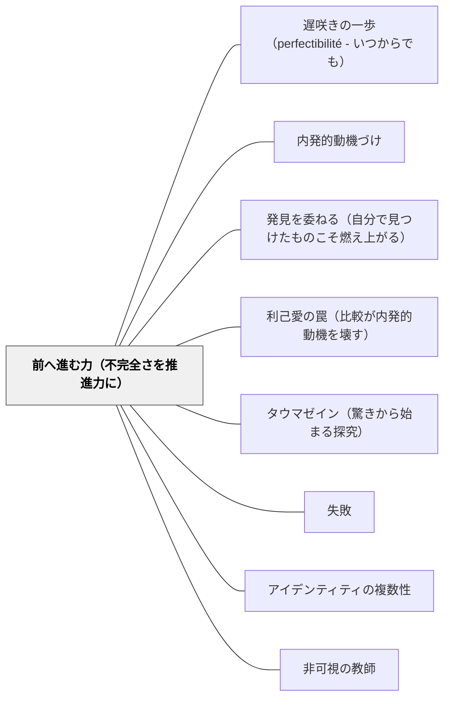

# 前へ進む力（不完全さを推進力に）

> 「取り返せないものがある。完全に解決できない問題がある。それでも——そういうモノを推進力にできたら、前へ進める。うみ子の映画のテーマは「できないことをできるようになる」だった。不完全さは障害ではなく、創造の燃料である。」

## [Pattern Connection]

### たらちねジョン（2026）海が走るエンドロール 9——完成した物語から

うみ子が3年間の美大生活を経て完成させた映画のテーマは、彼女自身の旅だった。

> 「そういうモノを 推進力にできたらと 思っていて」——うみ子

> 「『前へ進みたい』って うみ子さんの 映画だって感じ」——第三者

> 「できないことを できるようになる そうして 撮った映画が」——うみ子

> 「異質で 変わってることは なんら珍しいことではない」——うみ子の映画の脚本テーマ

3年前に第1巻で「取り返せないものがあることを知っている」（夫との対話の未完）と言ったうみ子が、その後悔を「前へ進みたい」という映画の推進力に変えた。これが本パタンの核心。

**「数字どうこうは 置いといて 最高だった」——amour de soi的評価：**
うみ子の映画は「クオリティ低いし粗いし 美術も音声も 最悪やった」と評されながらも「最高だった」と言われる。数字（再生回数・評価点）を置いておいて、作品の本質に触れた感動——これが amour de soi（内側からの評価）の純粋形。

- **既存パタンとの関連**：[[パタン/遅咲きの一歩（perfectibilité - いつからでも）]]が「始まること」を描くとすれば、本パタンは「続けること」と「困難を燃料にすること」を描く。perfectibilité の継続的側面。
- **補強された点**：amour de soi の評価が「数字」に対抗するとき（「数字を置いといて 最高だった」）、内発的動機付けの本質が最も鮮明に現れる。外部指標なしに「これは最高だった」と言える感覚こそ、amour de soi的評価の純粋形。
- **他のパタンへの波及**：[[パタン/内発的動機づけ]]（amour de soiとamour propreの評価の対比）；[[パタン/発見を委ねる（自分で見つけたものこそ燃え上がる）]]（自分の旅が作品の素材になる）；[[パタン/利己愛の罠（比較が内発的動機を壊す）]]（数字=amour propre的評価への対抗）

---

## 背景（Context）

学習者は困難・失敗・不完全さに直面するとき、それを「障害」として扱いがちである。「できないこと」は「欠如」であり、乗り越えるか回避するものとして処理される。

創造的な仕事（作文・作品・探究）においても、「完璧なものを作ること」が目的になると、不完全さは恥ずかしいもの・隠すべきものになる。

しかし最も強力な創造は、しばしば「解決できなかった問い」「取り返せなかった体験」「できなかったこと」を素材にして生まれる。うみ子の映画がそれを体現した。

## 問題（Problem）

困難・後悔・不完全さを「除去すべき障害」として扱うとき、それは創造の燃料になり損ねる。

- 「まだできていないこと」を恥として隠す
- 作品が「完成したもの」の提出になり、「変化の過程」が見えない
- 困難を「乗り越えた話」として美化するだけで、現在進行形の不完全さが動機にならない
- 「数字が低い・評価が悪い」という外部指標が、内側からの「最高だった」感覚を上書きする
- 「異質さ・違い」を隠したり矯正したりすることで、固有の視点が作品から失われる

## 力のかたち（Forces）

- 「取り返せないもの」への後悔は、同じ失敗を繰り返さない動機になりうる——後悔は動機の深さを作る
- 「できないことをできるようになる」というプロセスそのものが、最も本物の創造の素材になる
- 完全な解決を待たずに「前へ進む」決断が、積み重なって変化を作る
- amour de soi的評価（「最高だった」）は、amour propre的指標（数字・順位）と別の次元にある
- 「異質さ」は矯正すべき欠如でなく、固有の視点として作品に込められる可能性がある
- 他者の不完全な旅が「自信の源」になる（海がうみ子の旅から自信を得たように）

## 解決（Solution）

**困難・後悔・不完全さを「除去する」のではなく「推進力にする」。自分の変化のプロセスを創造の素材とし、外部指標ではなく内側の「最高だった」感覚を評価の基準にする。**

---

### うみ子の映画——物語的体現

うみ子の旅の構造は、「前へ進む力」パタンの完全な体現である：

| うみ子の体験 | パタンの構造 |
|---|---|
| 夫との対話が未完のまま終わった（第1巻）| 「取り返せないもの」としての後悔 |
| 映画を学び始める（第1巻→第9巻） | 後悔を「前へ進む動機」に変換 |
| 乳がんの手術を経てもなお映画を続ける | 身体的困難を推進力に |
| 映画のテーマ「できないことをできるようになる」 | 変化プロセスが創造物の内容になる |
| 「数字どうこうは置いといて 最高だった」 | amour de soi的評価が外部指標を超える |
| 「異質で変わってることはなんら珍しくない」 | 固有性を脚本テーマに |

---

### 教室での「前へ進む力」設計

**1. 「不完全な作品」を隠さない文化を作る**

作品を「完成したもの」として提出させるのではなく、「変化の証拠」として扱う。「この前できなかったことが今日はできた」「まだできていないけどここまで来た」を見えるようにする作業：ポートフォリオ・学習日記・修正稿の保存。

**2. 自分の「取り返せないもの」を動機に変える問いを設計する**

「あなたが後悔していることが、今の学びの動機になっていることはあるか」「失敗したことが、次の挑戦のエネルギーになった体験は？」——これは深い問いであり、強制しない。ただし、うみ子の物語を通じて「後悔が推進力になりうる」という構造を共有することで、子どもたちが自分に引き当てやすくなる。

**3. 「数字を置いといて」評価する時間を作る**

成績・点数・再生回数を一時的に脇に置いて「これは最高だった」「これは自分の本物だ」という感覚で作品を振り返る時間。作品を数字で見る前に、内側の感覚で見る先行評価——これが amour de soi的評価の訓練。

**4. 「異質さ」を固有性として作品に込める**

「あなたにしかない視点は何か」「みんなと違うあなたの見方を作品に入れる」——違いを矯正するのでなく、固有性を作品の強みとして位置づける設計。特別支援の文脈では：「異質で変わってることはなんら珍しいことではない」といううみ子の宣言を、子どもたちと共有できる。

**5. 「完全に解決できない問題」に対話で向き合う**

海が現場のハラスメントに声を上げ「空気が読めない」と言われながらも「わずかな変化をもたらした」——問題の完全解決を目標にしなくても、「声を上げること」「対話すること」に意味がある。教室でも「解決できない問題に対して何ができるか」を考える機会が、「前へ進む力」を育てる。

---

### 相互的な自信の付与——うみ子と海の関係

> 「俺の自信って うみ子さんに もらってるところが」「うみ子さんだったら どう考えて動くかなって」——海

65歳の「初心者」うみ子が、若い「上級者」海の自信の源になる。これは教えることなく、旅を続けることで他者の自信を支えるという構造——**存在することが教える**形態。

教師は「自分の旅」を子どもに見せること（どう困難に向き合うか・どう続けるか）が、最も深い教育になりうる。牧口の「第四階級（教育法への内発的関心）」が教師の存在から子どもに伝わるように、うみ子の「続ける姿」が海の自信になった。

---

### 自己教育への適用（岩井の実践）

> ✏️ *AI支援で整理した考察（そら子）：* 岩井さんが数学デイリーを続けること・このWikiを構築し続けること・漫画を統合し続けること——これらはすべて「前へ進む力」の実践形態である。「まだうまくいっていない」「完璧ではない」という不完全さを推進力にして続けること。そして岩井さんの旅が、子どもたちの「先生もまだ挑戦中なんだ」という信頼の源になる——うみ子が海の自信の源になったように。「数字どうこうは置いといて 最高だった」という感覚を、毎日の実践の中に見つけること。

---

## 結果（Consequences）

- 「できなかったこと・後悔したこと」が動機の深さを生む体験が積み重なる
- 学習者の作品に「変化の証拠」が込められ、単なる「正解の提出」を超えた創造が生まれる
- amour de soi的評価（内側の「最高だった」）が育つと、外部指標への過度な依存が減る
- 「異質さ」を固有性として扱う文化が育つと、多様な学習者が自分の視点を持ちやすくなる
- ただし、「不完全さを推進力に」という姿勢は、完成・達成を諦める口実にもなりうる——「これでいい」と「これから続ける」の違いを問い続ける必要がある

## 関連パタン

- [[パタン/遅咲きの一歩（perfectibilité - いつからでも）]] — perfectibilité の「始まり」（第1巻）に対し、本パタンは「継続」（第9巻）を扱う
- [[パタン/内発的動機づけ]] — amour de soi的評価（「数字を置いといて 最高だった」）の源泉
- [[パタン/発見を委ねる（自分で見つけたものこそ燃え上がる）]] — 自分の旅・固有性が作品の素材になる
- [[パタン/利己愛の罠（比較が内発的動機を壊す）]] — 数字・順位（amour propre的指標）を超える内側の評価
- [[パタン/タウマゼイン（驚きから始まる探究）]] — 困難・不完全さへの驚きが探究の入口になる
- [[パタン/失敗（インストラクション）]] — 失敗を「除去すべき事故」でなく「創造の燃料」として扱う
- [[パタン/アイデンティティの複数性]] — 「異質で変わってること」を固有のアイデンティティとして
- [[パタン/非可視の教師]] — うみ子が教えることなく存在することで海の自信を支える
- [[文献/海が走るエンドロール 9（たらちねジョン）]] — 本パタンの物語的出典
- [[文献/海が走るエンドロール 1（たらちねジョン）]] — 旅の出発点（「取り返せないものがあることを知っている」）

## クラスター図

## Actionable Insight

- **「変化の証拠」を作品に込める授業設計**：次の作文・作品課題で「あなたが最近できるようになったこと・変わったことを、作品のどこかに入れてみよう」を一言添える——うみ子的に、自分の旅を創造物のテーマにする入口。
- **「数字を置いといて」振り返る**：作品を提出した後、点数やコメントを見る前に「この作品のどこが自分にとって最高だったか」を30秒で書く——amour de soi的評価の習慣化。
- **「声を上げる練習」の機会**：解決できない問題（学級の課題・社会問題など）について「解決はできなくても、自分が言えることを一つ言ってみる」場面を作る——「わずかな変化をもたらす」という海の経験を教室に。
- **教師自身の「不完全な旅」を見せる**：「先生も今日できなかったこと・まだわからないこと」を子どもに短く話す——教師の旅が子どもの自信の源になるという逆転。

## 出典

たらちねジョン（2026）『海が走るエンドロール』第9巻. 秋田書店（ボニータ・コミックス）

> 「そういうモノを 推進力にできたらと 思っていて」——うみ子

> 「数字どうこうは 置いといてさ 最高だった」——（うみ子の映画を観た人物）

> 「最終巻とはなりますが 『海が走るエンドロール』は まだまだ続いていきます」——たらちねジョン
