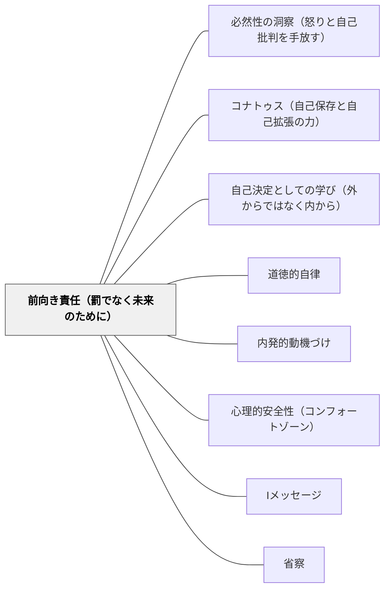

# 前向き責任（罰でなく未来のために）

> 「あなたのやったことへの報い」としての罰でなく、「未来のあなたと共同体をよりよくするための対話・支援」として責任を扱う。スピノザは応報的罰（復讐）を「憎しみ（悲しみの特殊形）」として道徳的に誤りと断じ、前向き責任を徳（寛容）の実践として位置づけた。

---

## [Pattern Connection]

**Spinoza on Free Will（Kisner, 2026）統合：**

スピノザの責任論は「後ろ向き責任（backward-looking responsibility）」と「前向き責任（forward-looking responsibility）」の区別を軸に展開する（Kisner, 2026, Ch.5）：

| 後ろ向き責任 | 前向き責任 |
|---|---|
| 過去の行為への報い（応報・罰） | 未来の行動改善のための手段 |
| 行為者は別のことができたはずだという仮定に基づく | 因果的に決定されていても動機・意図は評価できる |
| 復讐・怒り・憎しみと結びつく | 合理的な「適切さ」に基づく |
| 悲しみ（力の減少）の増大 | 喜び（力の増大）の追求 |

スピノザがハスダイ・クレスカスから受け継いだ三主張（Kisner, pp.58–62）：
1. 随意的な行為は因果決定されていてもよい
2. 責任を問うのは随意的な行為（強制でなく動機から生まれた行為）のみ
3. 責任は結果でなく動機・意図に基づく

- **既存パタンとの関連**：[[パタン/道徳的自律]] のカントの罰（「罰は魂の治療」という目的論的位置づけ）と共鳴する。ゴルギアスでのプラトン「罰は治療——道徳的矯正」（476a–480e）とも重なる。スピノザはそれをさらに進め、罰そのものを「適切さ（fittingness）」という基準で正当化し、応報的根拠（「やったからやられて当然」）を否定する。
- **補強された点**：Dewey（1909）の「恐怖と競争心」批判（[[パタン/内発的動機づけ]] 既統合）に哲学的基盤を加える。Deweyが経験主義・プラグマティズムから「恐怖は最悪の動機だ」と言うとき、スピノザは「恐怖は悲しみ（力の減少）から生まれ、復讐は憎しみという最大の悲しみを生む」と哲学的に根拠づける。
- **必然主義と責任の関係**：スピノザの必然主義（すべての出来事は一つの仕方でしか起きえない）は「もし〜していれば」という反事実的怒りを論理的に無効化する。「あのとき別のことができたはず」という前提なしに、「今後どうすればよいか」に集中できる。
- **他のパタンへの波及**：[[パタン/コナトゥス（自己保存と自己拡張の力）]] — 復讐は悲しみ（力の減少）であり、コナトゥスに反する；[[パタン/自己決定としての学び（外からではなく内から）]] — 罰への恐怖が自己決定を阻害する——両者を接続する実践的結節点。

---

## 背景（Context）

教室で問題行動が起きたとき、教師は何のために規律を使うのか。

多くの規律実践は暗黙のうちに「後ろ向き責任」の論理で動いている：「あなたがやったことの報いとして、これを受けなさい」。この論理の根拠は「あの時別のことができたはずだ（自由意志）」という仮定にある。しかしスピノザは因果決定論の立場からこの仮定を疑い、同時に責任実践を全否定しない——ただし「前向き」に再構成する。

Kisner（2026）が整理するスピノザの洞察：復讐・応報的罰は「憎しみ（悲しみの特殊形）」であり、行為者と観察者の両方の力を減少させる。これは道徳的に誤りであるだけでなく、自己利益の観点からも誤りである——スピノザにとって道徳と合理的利益は一致する。

## 問題（Problem）

応報的罰（過去の行為への報い）には以下の問題がある：

- 「報い」の根拠となる「もし別のことができたはず」という仮定が、決定論的な世界観では成立しない
- 罰は「悲しみ（力の減少）」を生むから、罰された子の学習・関係・成長の力を減少させる
- 罰を与える教師が「復讐」「憎しみ」という悲しみから罰するとき、教師の力も減少する
- 「怖いからやらない」という動機は受動的感情であり、内発的な変化を生まない
- 罰を受けた子は「どう動機・行動を変えるか」でなく「どう罰を避けるか」を学ぶ

## 力のかたち（Forces）

- 子どもの問題行動には必ず原因がある——「悪い子」でなく「その状況でそう行動した子」として見る
- 応報的罰は過去を裁くが、未来を変えない
- 前向き責任は「未来の行動をよりよくするための道具」として責任実践を使う
- 必然主義の洞察：起きたことは起きざるをえなかった——「あのとき別のことができたはず」という反事実的怒りを手放すことで、「今後どうするか」に集中できる
- 随意的な行為（強制でなく動機から生まれた行為）だけに責任を問う——強制・パニック・理解できない状況では責任を問わない
- 動機・意図を中心に責任を考える——結果の大小でなく、どんな動機から行動したかを問う

## 解決（Solution）

**問題行動を「過去への報い（罰）」で処理するのでなく、「未来の行動・関係・共同体をよりよくするための対話・支援」として扱う。責任を問うとき、動機・意図を中心に置き、「どうすればよかったか・どうしたいか」という前向きな問いに集中する。**

---

### 前向き責任の三ステップ

**ステップ1：事実確認（動機を理解する）**
「何が起きたか」でなく「なぜそうしたか」を先に理解する。動機・意図を丁寧に聞く。強制・パニック・誤解から来た行動は責任の問い方が変わる。

**ステップ2：影響の確認**
「あなたの行動が誰にどんな影響を与えたか」を一緒に考える——報いでなく、実際に起きた影響を確認する。

**ステップ3：前向きな問い**
「次はどうしたいか・どうすれば解決できるか」を中心に対話する。過去を裁くのでなく、未来の行動設計を一緒に行う。

---

### 憎しみ・復讐の感情を教師が管理する

スピノザの指摘：罰を復讐として与えるとき、教師は「憎しみ（悲しみの特殊形）」の状態にある——これは教師自身のコナトゥスを減少させる。

- **感情のモニタリング**：「今私は怒っているか・憎んでいるか」を内省する。感情的な状態での罰は後ろ向き責任の罰になりやすい。
- **間を置く**：問題行動の直後に罰を与えるのでなく、感情が収まった後に前向き責任の対話を行う。
- **「この子の力を増大させたい」という動機の確認**：罰を与える前に「これはこの子の未来をよくするためか、それとも私の怒りを解消するためか」を問う。

---

### 修復的実践（Restorative Practices）との接続

スピノザの前向き責任論は、修復的実践の哲学的基盤になる：

| 応報的規律 | 修復的実践（前向き責任）|
|---|---|
| ルールを破った——罰を与える | 関係が傷ついた——修復を支援する |
| 「何のルールを破ったか」 | 「誰が傷ついたか・何が必要か」 |
| 教師→子どもへの一方向的処分 | 関係する全員での対話 |
| 行為者を孤立させる | 行為者をコミュニティに再統合する |

---

### 具体例

**例1：けんかの後**
Aが BをけがさせたとしてAに謝罪を強制するのでなく、「なぜそうなったか（動機）」→「Bはどう感じているか（影響）」→「これからどうするか（前向きな問い）」を一緒に話す。

**例2：規則を破ったとき**
「なぜそのルールがあるか、あなたはどう思うか」を問い返す——罰による服従でなく、ルールの意味を自分で理解する体験。[[パタン/道徳的自律]] の実践的応用。

**例3：慢性的な問題行動**
繰り返す問題行動に応報的罰を与え続けるのは、スピノザ的には「効かない手段を繰り返している」状態。「この子の動機は何か・どんな支援があれば未来を変えられるか」という前向きな問いに切り替える。

## 結果（Consequences）

- 問題行動が「罰を避けるための行動変容」でなく「動機・理解の変容」を通じた本質的な変化につながりやすくなる
- 教師が復讐・憎しみ（力の減少）から行動しなくなり、教師自身のコナトゥスが守られる
- 教室の文化が「裁く場」から「一緒に解決する場」に変わり、心理的安全性が高まる
- ただし、前向き責任の論理を一貫させることは難しい——特に繰り返し傷つける行為や共同体への深刻な影響がある場合には、境界線の設計が必要

## 関連パタン

- [[パタン/必然性の洞察（怒りと自己批判を手放す）]] — 前向き責任の認識論的根拠：「あの時別のことができたはず」という仮定を吟味する
- [[パタン/コナトゥス（自己保存と自己拡張の力）]] — 復讐は悲しみ（力の減少）であり、コナトゥスに反する
- [[パタン/自己決定としての学び（外からではなく内から）]] — 罰への恐怖は自己決定を阻害する
- [[パタン/道徳的自律]] — 前向き責任はカントの「罰は治療」論（ゴルギアス）と共鳴する
- [[パタン/内発的動機づけ]] — Dewey（1909）「恐怖は最悪の動機」との哲学的接続
- [[パタン/心理的安全性（コンフォートゾーン）]] — 前向き責任の文化が心理的安全性の基盤になる
- [[パタン/Iメッセージ]] — 前向き責任の感情表現ツール
- [[パタン/省察]] — 問題行動後の「なぜそうなったか」の省察が前向き責任の核心
- [[文献/Spinoza on Free Will（Kisner）]] — 本パタンの出典

---

## クラスター図

## Actionable Insight

- 問題行動の直後にすぐ罰を与えず、「今は感情的になっているから、落ち着いたら一緒に話そう」と間を置く——感情が収まってから前向きな対話を始める習慣をつくる
- 「なぜそうしたの？」を問い返す一言を持つ——動機・意図を理解しようとする姿勢が、後ろ向き責任から前向き責任への第一歩
- 「どうすればよかったか」でなく「これからどうするか」を問う——過去は変えられないが未来は変えられる、という前向きな問いの向きを習慣化する

---

## 出典

Kisner, M. J. (2026). *Spinoza on Free Will*. Cambridge Elements: The Philosophy of Benedict de Spinoza. Cambridge University Press.  
DOI: https://doi.org/10.1017/9781009698917

> "Spinoza suggests that when we hate and punish people who have wronged us, we are acting in a way that decreases our power, and so we have good self-interested reasons to avoid these practices." — Kisner (2026, p.68 趣意)
