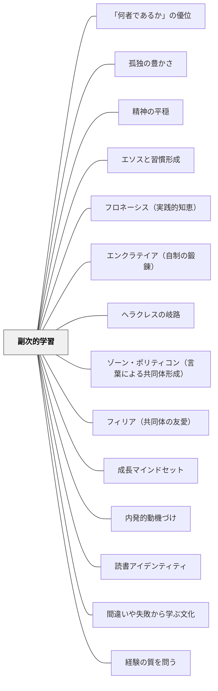

# 副次的学習

> 授業で一番大切なことは、その時間に教えた内容ではないかもしれない。

## Pattern Connection

### モンテスキュー（1748）——Livre IV, Ch.V

モンテスキューは「外部の印象が家庭教育を打ち消す」という現象を、18世紀に明確に記述していた：

> 「On est ordinairement le maître de donner à ses enfants ses connaissances; on l'est encore plus de leur donner ses passions. Si cela n'arrive pas, c'est que ce qui a été fait dans la maison paternelle est détruit par les impressions du dehors.」
> （一般に人は自分の知識を子どもたちに与えることはできるが、自分の情熱を与えることはさらによくできる。もしそれが起きないなら、家庭でなされたことが外部の印象によって打ち消されているのである。）

- **既存パタンとの関連**：副次的学習として形成される「態度」は、学校以外の教育源——家庭・社会・デジタルメディア——からの「外部の印象」によって随時書き換えられる。これが副次的学習の設計を難しくする根本原因。
- **補強された点**：Deweyの「副次的学習」はどんな態度が形成されるかを問うが、モンテスキューはその形成の場が複数・矛盾していることを指摘する。教師が意図した副次的学習が「外部の印象」に打ち消されうることを前提に設計する必要がある。
- **他のパタンへの波及**：[[パタン/複数の教育源]]（三つの教育源の矛盾）・[[パタン/政体の原理と教育目標]]（各教育源の動機原理の診断）

---

### アリストテレス（前335年頃）——ニコマコス倫理学 第二巻・エソス（習慣づけ）／政治学 第2巻

> 「年少の頃からずっと『そのように』習慣づいているのと、『このように』習慣づいているのとで、相違は小さなものではなく、きわめて大きい。否、それどころか、それこそがすべてであると言うべきであろう。」（ニコマコス倫理学 第二巻第一章）

アリストテレスは「人間の徳（アレテー）は生まれつきではなく、習慣（エソス）によって形成される」と論じる。エソスとは「第二の自然本性」——長期的な繰り返しが人間の性質そのものになる過程。

ニコマコス倫理学はキタラ奏者の例で副次的学習の構造を逆から照らす：「上手く弾くことから上手いキタラ奏者が生まれ、下手に弾くから下手な奏者が生まれる」——正しい行為の反復が正しい性向を、誤った行為の反復が誤った性向を形成する。これは副次的学習の「向き」の設計責任を問う。

また「正しい教育とは、人はごく若い頃から早々に喜ぶべきものを喜び、苦痛を感ずべきものに苦痛を感じるよう導かれることだ」（第二巻第三章）——副次的に形成される「快苦の感受性の方向」そのものが教育の核心という主張。

- **既存パタンとの関連**：Deweyの副次的学習が「一つの授業で同時に形成される態度」を論じるなら、アリストテレスのエソスは「習慣の積み重ねによって形成される性格（エートス）」を論じる。短期（一授業の態度）と長期（年間・生涯の習慣）の二水準で副次的学習を考える軸が生まれる。
- **補強された点**：「どんな行為の反復を設計するか」が「どんな人格が形成されるか」を決定する——副次的学習の設計は**年間を通じた習慣の向きの設計**でもある。
- **教室への翻訳**：「この活動を1年間繰り返したとき、学習者にどんな第二の自然本性（エソス）が形成されるか」——これが副次的学習の長期版の問い。

[[文献/ニコマコス倫理学（上）（アリストテレス）]] · [[パタン/エソスと習慣形成]] · [[文献/政治学（上）（アリストテレス）]]

---

### Dewey（1909）Moral Principles in Education 統合（2026-05-31）：

Deweyは1938年の「副次的学習」概念より29年早く、1909年の *Moral Principles in Education* Ch.1 で「道徳的観念（moral ideas）と道徳についての観念（ideas about morality）」を区別した：

> "There is a fundamental difference between moral ideas and ideas about morality. The former class consists of ideas which are the moving springs of conduct—they are directive and dynamic in character. Ideas about morality... may, however, have little or no direct influence on what a man does."（Ch.1）

- **既存パタンとの関連**：直接の道徳教育（道徳の時間に美徳を教える）は「道徳についての観念」を与えるが、副次的学習として学習者の行為を変える「道徳的観念」はむしろ教室の雰囲気・活動・教師の姿勢から形成される。1938年の副次的学習概念の哲学的前身として1909年の区別が機能する。
- **補強された点**：「道徳の時間に道徳を教えても行為は変わらない」という1909年の主張が、1938年の「副次的学習の方が最も大切なことを教える」という主張の前提として機能することが明確になる。副次的学習の概念は単なる「意図しない学習の副産物」ではなく、「行為を変える学習の本体」を指している。
- **他のパタンへの波及**：[[パタン/胚細胞的コミュニティとしての学校]]（学校コミュニティの中で形成される道徳的観念）・[[パタン/道徳的交渉]]（行為を改善する観念の授受の場）

[[文献/Moral Principles in Education（Dewey）]]

---

### Dewey（1938）

本パタンはDeweyの *Experience and Education*（1938）Ch.3で提示された「副次的学習（Collateral Learning）」の概念をパタン化したものである。これはDeweyが「最大の教育的誤謬」と呼んだ前提への反証であり、学習文化の設計に根本的な問いを投げかける。

> "Perhaps the greatest of all pedagogical fallacies is the notion that a person learns only the particular thing he is studying at the time. Collateral learning in the way of formation of enduring attitudes, of likes and dislikes, may be and often is much more important than the spelling lesson or lesson in geography or history that is learned. For these attitudes are fundamentally what count in the future."（Ch.3）

- **既存パタンとの関連**：[[パタン/成長マインドセット]]（学びへの態度の形成）・[[パタン/内発的動機づけ]]（学習への内的関心の形成）・[[パタン/読書アイデンティティ]]（「自分は読む人間だ」という態度）の各パタンは、副次的学習の典型例である。
- **補強された点**：授業で「内容を教える」ことへの集中が、より根本的な「学びへの態度」形成を見えなくするという構造的問題が浮上する。授業設計の問いが「何を教えるか」から「この授業はどんな態度を形成するか」へ拡張される。

---

## 背景（Context）

教師は教科の内容を教えることに集中する。計画・準備・評価のすべてが「その授業で何を学ばせるか」を軸に設計される。子どもたちもまた「今日は何の勉強か」という枠で授業を経験する。

しかし実際に教室で起きていることは、はるかに広い。子どもたちは内容と同時に、学ぶという行為そのものについての態度・感情・自己イメージを形成し続けている。

## 問題（Problem）

授業で教えた「内容」だけを評価基準にすると、その時間に同時に形成された態度——「算数は楽しい/怖い」「自分は読める/読めない」「間違えるのは恥ずかしい」「学ぶことは義務だ」——が見えなくなる。これらの態度は、内容の習得よりも長く・深く学習者の将来の経験を方向づける。

## 力のかたち（Forces）

- 学習者は内容を学ぶと同時に、学ぶことへの態度を形成している——これは止められない
- 形成される態度は意図的に設計できるが、無意図のまま放置すると有害な態度が育つ
- 評価・フィードバック・教師の言葉遣い・成功・失敗の扱い方のすべてが態度形成に影響する
- 「学び続けたい」という態度が失われると、内容の習得以上に大きな損害が生まれる

## 解決（Solution）

**授業設計において「この経験は学習者にどんな態度を形成するか」を第2の問いとして設ける。内容の計画と並行して、学びへの態度の設計を意識する。**

最も守るべき副次的学習：**学び続けたいという態度（the attitude of desire to go on learning）**。

> "The most important attitude that can be formed is that of desire to go on learning. If impetus in this direction is weakened instead of being intensified, something much more than mere lack of preparation takes place. The pupil is actually robbed of native capacities which otherwise would enable him to cope with the circumstances that he meets in the course of his life."（Dewey, 1938, Ch.3）

---

### 副次的学習として形成されるものの例

| 場面 | 意図した内容学習 | 形成される副次的学習（態度） |
|---|---|---|
| 毎回の計算テストで速さを競う | 計算の正確さ | 数学は速さの競争→苦手な子は「自分は数学が苦手」 |
| 間違いを黒板で訂正する | 正しい方法の理解 | 間違いは恥ずかしいこと→リスク回避の態度 |
| 一人で黙読する時間を守る | 読解スキル | 読書は静かに一人でするもの→または読書への好意・嫌悪 |
| 自分の問いを授業に持ち込む | 探究の方法 | 自分の問いは価値がある→学びへの主体感 |
| 難しい問題に仲間と取り組む | 内容の理解 | 困難は乗り越えられる・仲間と学ぶのは楽しい |

---

### 教師の問い：副次的学習の設計チェック

- この授業で「できなかった」子どもは、何という態度を持ち帰るか
- フィードバックの言葉は「内容の修正」だけを伝えているか、それとも「自分には力がある」という信念も育てているか
- 今日の活動は、明日また学びたいという気持ちを増やすか、減らすか

---

## 結果（Consequences）

- 授業設計が「内容を教えること」から「経験の質を設計すること」へと拡張される
- 副次的学習として形成される態度を見るようになると、評価が「正解率」から「学習者がどう変化したか」へ広がる
- 「学び続けたい」態度が守られることで、卒業後の自律的な学習能力が育まれる
- ただし、副次的学習は無意図でも起きる——「設計しない」ことは「何も形成しない」ではなく「意図しない態度を形成する」を意味する

## 関連パタン
- [[パタン/「何者であるか」の優位]]
- [[パタン/孤独の豊かさ]]
- [[パタン/精神の平穏]]
- [[パタン/エソスと習慣形成]]
- [[パタン/フロネーシス（実践的知恵）]]
- [[パタン/エンクラテイア（自制の鍛錬）]]
- [[パタン/ヘラクレスの岐路]]
- [[パタン/ゾーン・ポリティコン（言葉による共同体形成）]] — ロゴスによる習慣が共同体を形成する
- [[パタン/フィリア（共同体の友愛）]] — 友愛がエソスとして教室に根付くとき共同体が安定する

- [[パタン/成長マインドセット]] — 「能力は伸びる」という態度が副次的学習として育つ
- [[パタン/内発的動機づけ]] — 学びへの内的関心は副次的学習として形成される
- [[パタン/読書アイデンティティ]] — 「自分は読む人間だ」という態度が副次的学習の典型例
- [[パタン/間違いや失敗から学ぶ文化]] — 失敗への態度は最も重要な副次的学習のひとつ
- [[パタン/経験の質を問う]] — 副次的学習の視点が経験の質を問う際の具体的な軸になる
- [[パタン/省察]] — 授業後に副次的学習を振り返る実践
- [[パタン/スタミナを育てる]] — 学び続ける態度の形成
- [[パタン/複数の教育源]] — 外部の教育源が副次的学習に影響する構造
- [[パタン/政体の原理と教育目標]] — 教育環境の「原理」が副次的学習の方向を決める
- [[文献/法の精神（モンテスキュー）]] — 「外部の印象が家庭の教育を打ち消す」
- [[パタン/胚細胞的コミュニティとしての学校]] — 学校コミュニティの中で形成される道徳的観念（副次的学習の場の設計）
- [[文献/Moral Principles in Education（Dewey）]] — 「道徳的観念 vs 道徳についての観念」の区別（1909）——副次的学習の先駆け

## クラスター図

## Actionable Insight

- 授業計画に「この授業で形成される態度は何か」という欄を1行加える——内容の計画と並行して態度の設計が習慣になる
- 今週の授業で「できなかった子はどんな態度を持ち帰るか」を1分間イメージする——副次的学習への意識が生まれる
- 「間違い」「失敗」「困難」が授業に出たとき、内容の訂正より前に「よく挑戦した」という態度へのメッセージを添える

## 出典

Dewey, J. (1938). *Experience and Education*. Kappa Delta Pi.

> "Collateral learning in the way of formation of enduring attitudes, of likes and dislikes, may be and often is much more important than the spelling lesson or lesson in geography or history that is learned."（Ch.3）

[[文献/Experience and Education（Dewey）]]
