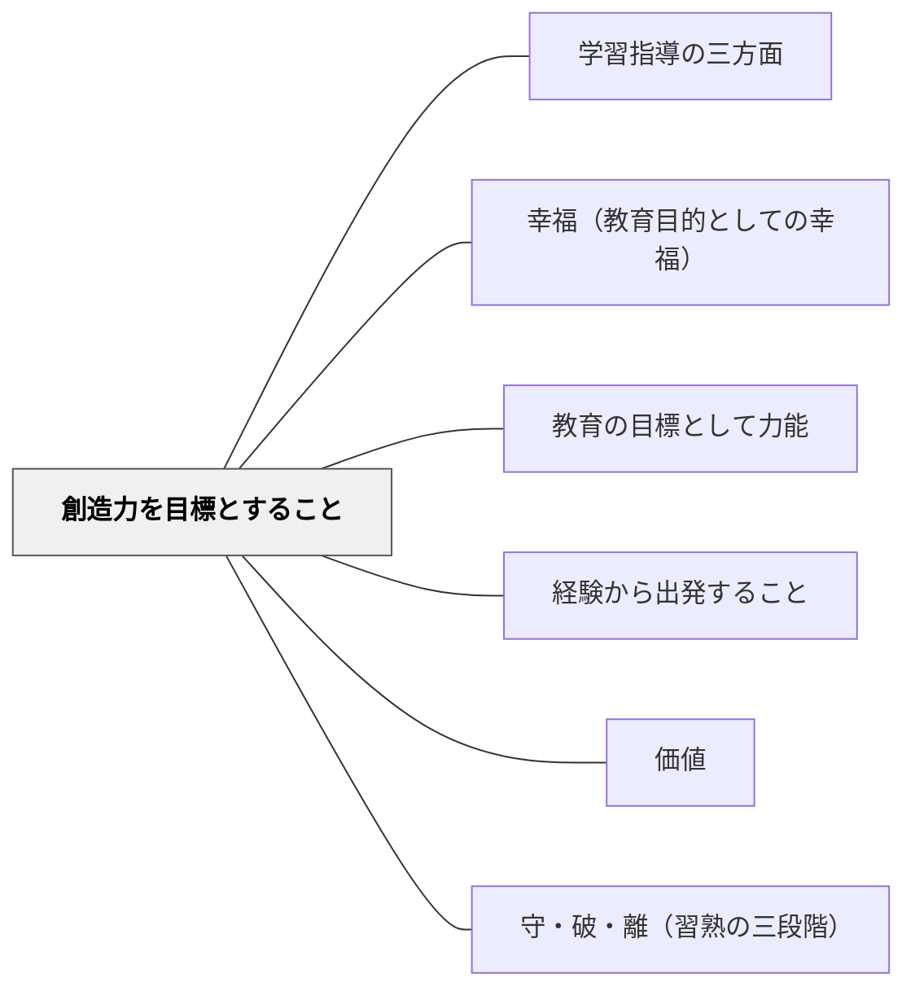

# 創造力を目標とすること

> 経験がなければ何も認識できない。

## Pattern Connection

### 牧口常三郎（1931）——鑑賞は創作への第一歩：評価作用が創価作用への橋梁

*創価教育学体系 第2巻* は、創造力の育成にいたるプロセスを「評価作用→創価作用」という二段階で説明する。

> 「鑑賞は創作への第一歩であるとは、総ての美術家、芸術家の一致する主張である。従って創作能力の涵養を職能とする教育方法の第一渉として、鑑賞が唱えられることは当然である」

また、評価作用（鑑賞・感動・価値判断）は「創価作用への橋梁」と明言される。

**三段階の移行：認識→評価→創価**

| 段階 | 作用 | 教育上の対応 |
|---|---|---|
| **認識** | 「何があるか」を知る | 知識・概念の習得 |
| **評価（鑑賞）** | 「これはどんな価値を持つか」を感じる・判断する | 比較・鑑賞・価値体験 |
| **創価（創造）** | 「新しい価値を生み出す」 | 制作・発明・独自の表現 |

評価（鑑賞）を経ずに創造を求めても空虚になる。逆に言えば、**感動体験と価値判断の機会を授業に組み込むことが、創造力育成の最初の一歩**である。

**授業設計への含意**

- 「この作品の何が美しいか」「なぜこの方法が良いか」を問う評価の場が、創造への動機を作る
- 鑑賞（評価）の質が、その後の創造の質を決める——感動が深いほど創作への意欲が高まる
- 「作る前に見る・比べる・感動する」という順序が創造力育成の基本手順

- **他のパタンへの波及**：[[パタン/美的美術的価値の創造]]（美との出会いが創造への橋）・[[パタン/審美的交渉]]（美への感動が創造動機になる）・[[パタン/守・破・離（習熟の三段階）]]（「離」の創造は守・破の評価的蓄積の上に立つ）

---

## 背景（Context）

経験がなければ何も認識できない。しかし、認識が問題とする経験の世界とは別に価値の

世界がある。価値の創造は、幸福である。教育が目標とするのは、価値創造力である。

## 問題（Problem）

教育の目標が「知識の習得」「技能の練習」に限定されると、学習者は価値を受け取る立場に留まり、「価値を創り出す」体験が設計されない。牧口が示した三段階——認識（知る）→評価（感じ・判断する）→創価（創る）——の最終段階に到達しないまま授業が終わる。「鑑賞なき創造」は空虚になり、「評価なき認識」は蓄積で終わる。

## 力のかたち（Forces）

- 教育者の意図と学習者の実態のギャップ
- 個々の状況に応じた柔軟な対応の必要性
- 経済性（無駄なコスト・苦しみを省く）の原理

## 解決（Solution）

人生の目的とは何だろうか。人生の目的と教育の目標が合致しないとしたら、教育は無駄
足になってしまうだろう。

「教育は児童に幸福なる生活をなさしめるのを目的とする」牧口常三郎

「教育の目的は被教育者の価値創造の能力を涵養するにあり」牧口常三郎

「あらゆる領域において生命の勝利が創造であるとすれば、芸術家や学者の創造とは違っ
ていつでもだれにでも追求できる創造にこそ、人間の生命の存在理由があると考えるべき
ではないでしょうか。その創造は自分で自分を創造することであり、少ないものから多く
のものを引き出し、無から何ものかを引き出し、世界の豊かなものにたえず何かを加える
努力によって、人格を大きくすることであります」（渡辺秀訳、白水社『ベルクソン全集
第五巻』）

　創造には、哲学的思考や科学的探求によって心の中に構成する認識（概念／知識）の創
造と人間の行為によって生み出される価値の創造の２種類がある。前者は、経験から出発
して、哲学的思考や実験、観察などの手続きによって、内心に法則や真理、理論などの知
識（概念）を構成することであり、知識の創造である。後者の価値の創造とは、利的経済
的価値創造・善的道徳的価値創造・美的芸術的価値創造である。

創造力を目標とせよ

認識（概念／知識）の創造＋価値の創造＝幸福な生活
♡♡♡

　経験がなければ何も認識できない。しかし、哲学的思考や科学的認識が問題とする経験
の世界とは別に価値の世界がある。教育は、創造力を目標とすること、経験から出発するこ
と、経済を原理とすること、想像力を触発すること、幸福であること。

参考文献　

斎藤正二(2010)『牧口常三郎の思想』第三文明社.
牧口常三郎(1981)『牧口常三郎全集 第5巻』第三文明社
牧口常三郎(1982)『牧口常三郎全集 第7巻』第三文明社
牧口常三郎(1984)『牧口常三郎

---

**教師の手立て**：「評価（鑑賞）→創価（創造）」の順序で単元を組む。例えば国語では①優れた作品を読んで「この作者の工夫はどこか」を分析・評価し、②同じ工夫を使って自分の作品を書く（創造）という2段階を設計する。算数では美しい解法を「なぜこれが優れているか」で評価してから「別の方法でも証明できるか」に挑む。評価（鑑賞・感動）を経ずに「作れ」と求めても空虚になる——評価の場を先に設けることが、創造力育成の最初の一歩である。

---

**自己教育での適用例（ruisuishiki開発、2026-06）**

算数・数学教育プラットフォーム ruisuishiki の開発を通じた実例。
このパタンが示す「認識（知る）→評価（感じ・判断する）→創価（創る）」の三段階が、開発プロセスそのものに内包されている。
「数学を学ぶ（認識）→教材を作る（創価）→自分で解いて改善する（評価）→また学ぶ（認識）」という循環が成立し、
**作り手でありユーザーでもあること**が、評価と創造の往復を自然に生み出している。
高校数学のコンテンツを作ること自体が自分の高校数学の学習になる——「価値を受け取る立場」と「価値を創り出す立場」を同時に生きる一石二鳥の構造。
1ヶ月の適応期間を経て、複数の関心領域（数学学習・教育パタン研究・AI開発）がruisuishikiという結節点でつながり始めた。

## 結果（Consequences）

- 学習者の力能（なしうる力）が増大する
- パタンの圧縮による教育の経済性が実現する
- 関連パタンと重ね合わせることで効果が高まる

## 関連パタン
- [[パタン/学習指導の三方面]]
- [[パタン/幸福（教育目的としての幸福）]]

- [[パタン/教育の目標として力能]]
- [[パタン/経験から出発すること]]
- [[パタン/価値]] — 利・善・美の三価値が創造の目標
- [[パタン/守・破・離（習熟の三段階）]] — 独創（離）が価値創造の究極の形

## クラスター図

## Actionable Insight

- 授業の最後に「今日学んだことで、自分の生活の何かを変えられるとしたら？」を1行書かせる——価値の創造意識を日常の学びに芽生えさせる最小単位
- 知識を学んだ後に「これを使って何かを作ってみよう」という短い制作タイムを設ける——認識の創造から価値の創造へとつなぐ最もシンプルな設計
- 単元の終わりに「この学びで自分は何を創ることができるか」を問いかける——創造力を目標にするとは、学んだことが何かを生み出すことにつながることを体感させること

## 出典
- [[文献/一つの教育のパタン・ランゲージ]]

岩井輝久「岩井輝久『一つの教育のパタン・ランゲージ』」（2026-04-29 vault収録）
