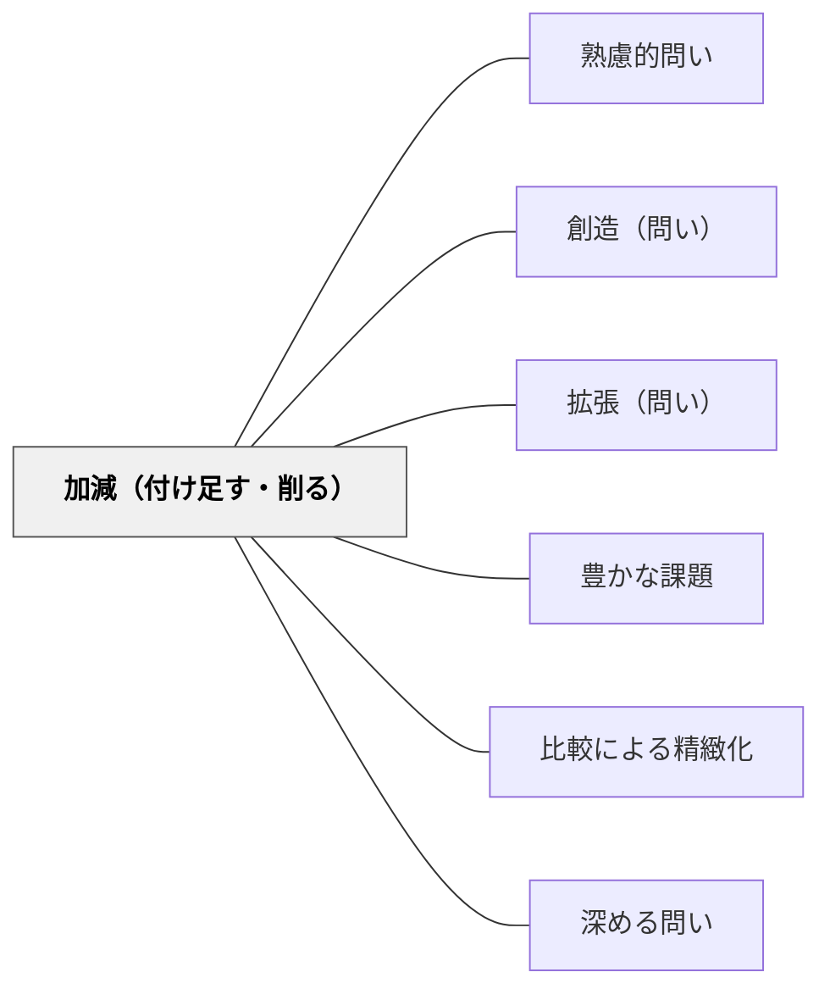

# 加減（付け足す・削る）

> 要素の追加・除去を問うことで、問題の本質と不要な要素を見極める。

## 背景（Context）
複雑に見える問題や概念も、要素を足したり引いたりすることで理解が大きく変わることがある。「何が必要不可欠で、何は取り除いても成り立つか」を問う視点は、本質の抽出や創造的な問題解決に直結する。デザイン・科学・哲学など多様な分野に応用できる思考の型である。

## 問題（Problem）
学習者は与えられた問題や状況をそのままの形で受け取り、要素の変更を試みないことが多い。「もし〇〇がなかったら」「〇〇を加えたらどうなるか」という変更実験を行わないため、本質的な要素と付随的な要素の区別ができない。

## 力のかたち（Forces）
- 要素の除去は「最低限何が必要か」という本質を炙り出す
- 要素の追加は「何があればより良くなるか」という改善思考を生む
- 加減の実験が思考の自由度を広げ、固定観念を打ち破る
- 要素の変化に対する感受性が、構造理解の深さを示す

## 解決（Solution）
「この問題から何か取り除いても成り立つか？何かを付け足すとどうなるか？」と問いかける。例えば「この文章から一文を削ると意味が変わるか？」「この実験に新しい変数を加えたら？」と具体的に誘導する。「最もシンプルな形はどれか？」という問いと組み合わせると、経済性の原理（オッカムの剃刀）的な思考も育つ。

## 結果（Consequences）
- 問題・概念・構造の本質的要素が明確になる
- 変更実験の習慣が、探究的・創造的思考力を育てる
- 「最小限の要素で最大の効果」という効率的思考が養われる

## 関連パタン
- [[パタン/熟慮的問い]] — 親パタン
- [[パタン/創造（問い）]] — 新しいものを付け足す創造的問い
- [[パタン/拡張（問い）]] — 加える方向への展開

- [[パタン/豊かな課題]] — 付け足す・削るの問いが豊かな探究課題を生む
- [[パタン/比較による精緻化]] — 加減による比較が概念の精緻化を促す
- [[パタン/深める問い]] — 加減の問いが思考を深める
## クラスター図

## Actionable Insight

- 「この文章から一文を削ると意味が変わるか？」と問いかける——要素の除去が「最低限何が必要か」という本質を炙り出す
- 「この実験に新しい変数を加えたら？」と問う——要素の追加が「何があればより良くなるか」という改善思考を生む
- 「この問題の最もシンプルな形はどれか？」と問う——経済性の原理的な思考が問題の本質的要素の理解を深める

## 出典
- [[文献/熟慮的問いのパターンリスト（動画記録）]]
