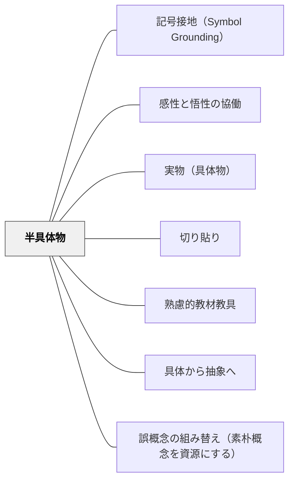

# 半具体物

> 具体物と抽象記号の間をつなぐ——操作可能な半具体的教材。

## 背景（Context）

数のブロック・図形の磁石・タイル・ペグボードなど、実物よりも抽象化されているが操作可能な教材を「半具体物」と呼ぶ。ブルーナーのEIS理論（Enactive-Iconic-Symbolic）において「Iconic（像的）」段階に相当し、具体操作から抽象的記号操作への橋渡しをする。

## 問題（Problem）

実物から一気に抽象記号（数字・式）へ移行すると、理解が飛躍して学習者がつまずく。

## 力のかたち（Forces）

- 半具体物は操作できるため身体感覚を保ちながら抽象化を進められる
- 市販のものと手作りのものがある
- 使い方が定型化すると形式的な操作になりやすい

## 解決（Solution）

**具体物と抽象記号の間に半具体物を意図的に挿入し、操作活動を通じて抽象概念への架け橋を作る。**

## 結果（Consequences）

- 抽象概念への移行がスムーズになる
- 操作を通じた理解が概念の定着を支える

## 関連パタン
- [[パタン/記号接地（Symbol Grounding）]]
- [[パタン/感性と悟性の協働]]
- [[特別支援/特別支援で使えるパタン]]
- [[教科/算数]]
- [[パタン/実物（具体物）]]
- [[パタン/切り貼り]]
- [[パタン/熟慮的教材教具]] — 親パタン
- [[パタン/具体から抽象へ]] — 学習の配列原則
- [[パタン/誤概念の組み替え（素朴概念を資源にする）]] — 数直線・面積図・折り紙などの半具体物が、素朴概念をゆさぶり適用範囲を再交渉する足場になる

## このパタンが働く実践
- [[実践/個別支援級の複式算数：重さと面積をわたり・ずらしで学ぶ]]

| 実践パタン | どのように半具体物が働くか |
|------------|----------------------------|
| [[実践/10や100を単位にして計算しよう]] | 数カードや10・100のまとまりの図が、具体的な数量と抽象的な式をつなぐ |

## クラスター図

## Actionable Insight

- 抽象記号（数字・式）を教える前に数のブロック・タイル・磁石図形などの半具体物で操作させる——EIS理論に基づくこの順序が具体から抽象への移行をスムーズにする
- 操作活動の後に「今触ったものを数字・図・式で表すとどうなる？」と橋渡しをする——言語化の要求が半具体物の操作を抽象的理解へと接続する
- 半具体物の使い方を定型化しすぎず「自由に並べ替えてみよう」という探索の余地を残す——形式的な操作にならないよう試行錯誤の空間が半具体物の効果を高める

## 出典

- [[文献/熟慮的教育材料のパターンリスト（動画記録）]]
