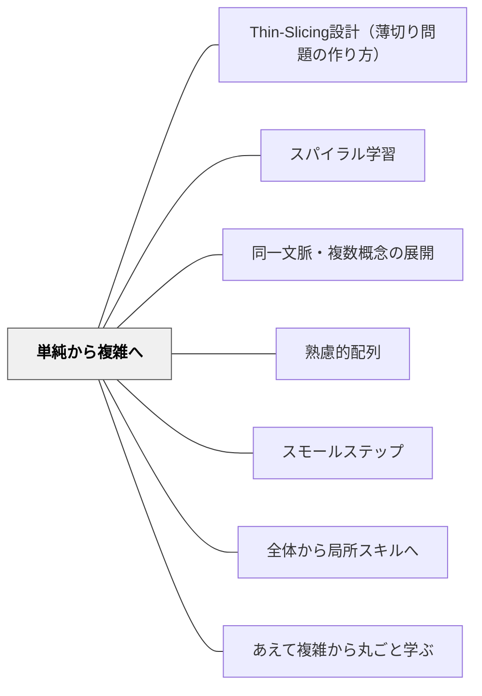

# 単純から複雑へ

> 単純なモデルは間違っているかもしれないが、複雑さへの入口として正しい。

## [Pattern Connection]

**ペスタロッチ（1801）ゲルトルート児童教育法 統合——「最も単純な結果から始めよ」という心理学的順序の根拠：**

- **哲学的根拠の提供**：「芸術教育は、音・形・数という三つの基本的な力の最初の、そして最も単純な結果に連鎖しなければならない」——ペスタロッチはこの原則を、認知科学的な「効果があるから」という理由ではなく「人間の精神発達の不変の原型に従うから」という必然として論じた。単純から複雑への配列は、教育的工夫ではなく、人間の認識が発達する自然の順序そのものである。
- **混乱→明確→概念の三段階との対応**：ペスタロッチの直観教授は「曖昧な見解から明確な見解へ、明確な見解から明確な概念へ」という三段階で進む。「曖昧な見解」の段階では複雑な現実は複雑なまま提示されない——最初は「本質的な関係だけを含む単純な見解」から始まる。これが「単純から複雑へ」の認識論的根拠である。
- **単純化は「近似」であり「誤魔化し」ではない**：本パタンのActionable Insightで「このモデルは完全に正確ではないが、本質を理解するための近似だ」と伝えることを推奨しているのは、ペスタロッチが示した「単純なモデルを経由した認識の発展」という考えと対応する。近似として単純化することは科学的思考のプロセスであり、後で複雑さが加えられることが前提に組み込まれている。
- **具体的な実践との接続**：ペスタロッチが音教育で示した「バ・バ・バ→音節→単語→文」という系列は、本パタンの「変数1つ→条件分岐→ループ→関数」というプログラミング例と同型の構造を持つ。単純な要素から始まり、段階的に複雑さが加えられていく。
- **波及するパタン**：[[パタン/熟慮的配列]] — 心理学的順序の全体；[[パタン/スモールステップ]] — 難易度軸の段階化；[[文献/ゲルトルート児童教育法（ペスタロッチ）]] — 本統合の出典

---

## 背景（Context）

[[パタン/熟慮的配列]] の複雑さ次元。複雑な現実は、単純化されたモデルを経由してはじめて理解できる。これは [[パタン/スモールステップ]] と関連するが、こちらは「難易度」より「系の複雑さ」に焦点を当てる。

## 問題（Problem）

複雑な現実をそのまま学習者に提示すると、注意すべき変数が多すぎて「何が本質か」が見えない。学習者は現象を操作することも、説明することもできないまま圧倒される。

## 力のかたち（Forces）

- 単純化されたモデルは現実を歪める（それをそのまま「現実」と思い込む危険）
- 複雑さを除去しすぎると、本質的な現象が消えてしまう場合もある
- どこで「複雑さを加える」かの判断が難しい

## 解決（Solution）

**まず本質的な関係だけを含む単純なモデル・事例・状況から始め、理解が安定したら段階的に変数・条件・複雑さを加えていく。**

実践例：
- 力学：摩擦のない水平面での運動→摩擦あり→傾斜面→空気抵抗あり
- 社会科：二者の交換→市場→貨幣経済→国際経済
- 文章の分析：一段落の文章→複数段落→長文→複数テクスト
- プログラミング：変数1つ→条件分岐→ループ→関数→クラス

加えた複雑さが理解にどう影響したかを学習者に振り返らせることで、複雑さへの感度が育つ。

## 結果（Consequences）

- 学習者が「本質」と「付随的な複雑さ」を区別できるようになる
- 単純なモデルが「現実の近似」であるという科学的思考の習慣が育つ
- 複雑な現実に出会ったとき、単純化して考えるストラテジーを使える

## クラスター図

## Actionable Insight

- 単元の最初に「変数を1つだけにした最も単純な事例」を設定し、そこから段階的に変数を増やす授業計画を立てる——複雑さを加えるたびに「何が変わったか」を学習者に言語化させることで複雑さへの感度が育つ
- 「このモデルは完全に正確ではないが、本質を理解するための近似だ」と一言伝えてから授業に入る——単純化が誤魔化しでなく科学的思考のツールだと伝えることで学習者の科学的な見方が育つ
- 単元末に「この内容を最もシンプルな言葉で説明してみよう」という活動を設ける——単純化して説明できることが深い理解の証拠になる

## 出典

- 一つの教育のパタン・ランゲージ（岩井輝久）
- [[文献/ゲルトルート児童教育法（ペスタロッチ）]]

## 関連パタン
- [[パタン/Thin-Slicing設計（薄切り問題の作り方）]]
- [[パタン/スパイラル学習]]
- [[パタン/同一文脈・複数概念の展開]]

- [[パタン/熟慮的配列]] — 上位パタン
- [[パタン/スモールステップ]] — 難易度の段階化
- [[パタン/全体から局所スキルへ]] — 全体の複雑さを分解する
- [[パタン/あえて複雑から丸ごと学ぶ]] — 意図的に複雑から入る逆パタン
