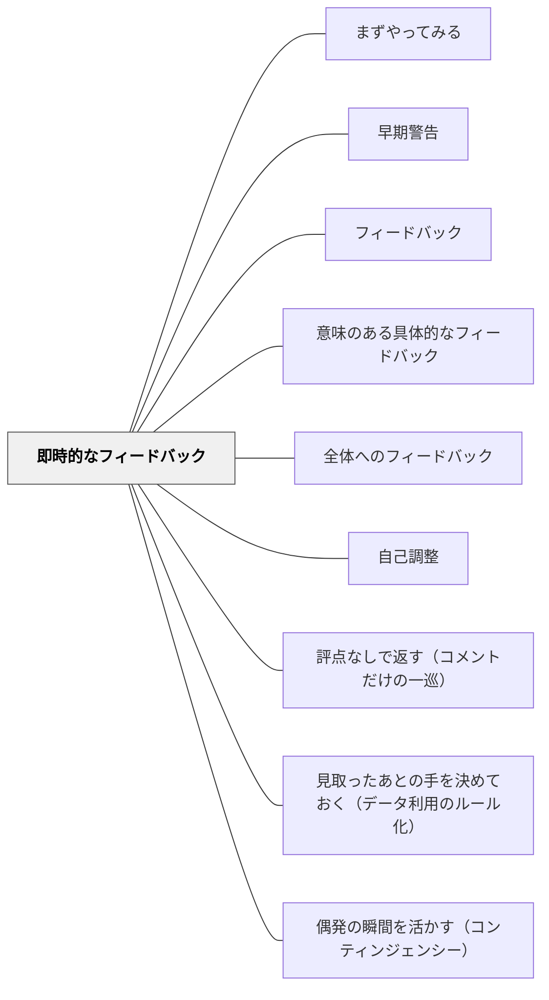

# 即時的なフィードバック

> 行動の直後にフィードバックが届くほど、その情報は学習に活きる。時間が経つほど文脈と記憶が薄れ、フィードバックの効果は下がる。

## 背景（Context）

フィードバックの効果は内容だけでなく、タイミングにも大きく左右される。学習者がパフォーマンスを行った直後は、そのプロセスの記憶が鮮明であり、フィードバックを自分の行動と結びつけやすい。時間が経過すると記憶が薄れ、「そのときどう考えたか」「何に躓いたか」という文脈が失われていく。

即時的なフィードバックは、学習・パフォーマンスの直後に与えられるフィードバックであり、記憶と文脈が生きているうちに修正の情報を届けることができる。コンピュータによる自動フィードバック、教室での即時コメント、活動直後の振り返りなどがこれにあたる。

## 問題（Problem）

学校教育では、課題提出後に時間が経ってからフィードバックが返ることが多い。翌週に返却されるテスト、数日後の添削コメント、月末の評定などは、学習者が「いつ・何をしたか」を鮮明に覚えていない時点で届く。その結果、フィードバックを受け取っても「どの場面のことか」が結びつかず、改善に活かされない。

ただし即時が常に最善というわけではない。創造的思考・深い理解・概念的探究においては、十分に考えた後で届くフィードバックの方が熟考を促す場合もある。

## 力のかたち（Forces）

- 直後のフィードバックは記憶と文脈が鮮明で、学習者が行動と情報を結びつけやすい
- 時間が経つほど文脈が薄れ、同じ内容のフィードバックでも効果が減じる
- 深い思考・探究の場面では、即時よりも「熟考後」のフィードバックが適している場合がある

## 解決（Solution）

フィードバックのタイミングを意図的に設計する。日常的な学習活動（ドリル・練習・クイズ・小テスト）には即時またはその授業時間内のフィードバックを心がける。課題・作品・プロジェクトなど時間をかけた学習には、提出後できる限り速やかに返すことを目標とする。

デジタルツール（自動採点・即時クイズ・フィードバックアプリ）を活用することで、教師の負担を増やさずに即時性を確保できる場面もある。[[パタン/全体へのフィードバック]]として共通の誤りをその授業の中で取り扱うことも、クラス全体への即時フィードバックとして機能する。

## 結果（Consequences）

- 行動直後のフィードバックにより、学習者が改善情報を文脈と結びつけやすくなる
- フィードバックの遅延が減ることで、誤概念が固定化する前に修正できる
- すべての学習場面で即時を目指すと教師の負担が増大するため、優先順位の設計が重要

## 関連パタン
- [[パタン/まずやってみる]]
- [[パタン/早期警告]]

- [[パタン/フィードバック]] — 親パタン
- [[パタン/意味のある具体的なフィードバック]] — タイミングと内容の両方が重要
- [[パタン/全体へのフィードバック]] — 即時フィードバックを効率的に届ける方法
- [[パタン/自己調整]] — フィードバックを受け取ってすぐに行動できる学習者の育成

- [[パタン/評点なしで返す（コメントだけの一巡）]] — タイミングの側面での補完。コメントは早く返し、評点だけを後ろへずらす
- [[パタン/見取ったあとの手を決めておく（データ利用のルール化）]] — 対比。子どもへの返しは速いほどよいが、教師の側の判断は単元計画へ前倒しして決めておくほうがよい

- [[パタン/偶発の瞬間を活かす（コンティンジェンシー）]] — 同期の偶発の瞬間。ただし非同期（出口パス・翌年の設計）も形成的でありうる

## クラスター図

## Actionable Insight

- 授業中の演習・ドリルには、その授業時間内に共通の誤りを全体で取り上げる——即時の全体フィードバックが最も効率的に誤概念を修正する
- デジタルクイズ（Kahootなど）を使い、問題直後に正答率を可視化する——自動採点の即時性を形成的評価として活用する
- 深い思考が必要な課題には即時を求めず、翌日に返すことを意図的に選ぶ——タイミングの設計が「いつ早く、いつ待つか」を判断できる教師力を育てる

## 出典

Hattie, J. & Timperley, H. (2007). The Power of Feedback. *Review of Educational Research*, 77(1), 81–112.
Bangert-Drowns, R. L. et al. (1991). The instructional effect of feedback in test-like events. *Review of Educational Research*, 61(2), 213–238.
