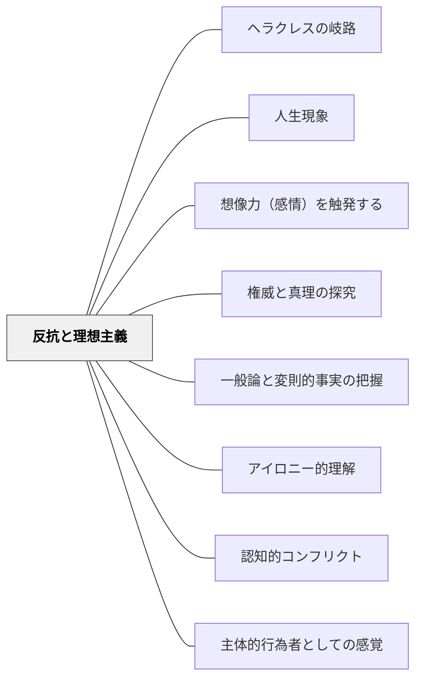

# 反抗と理想主義

> 若者の反抗心と理想主義を、学びへのエネルギーとして活かす

## 背景（Context）

青年期の学習者は、既成の権威や社会の矛盾に強い感受性をもつ。この時期に特有の「青春疾風怒涛」的な感情——理想と現実の狭間での葛藤、不条理への怒り、純粋さへのこだわり——は、しばしば学校教育の場では否定的なものとして扱われがちである。

## 問題（Problem）

学習者がもつ反抗心や理想主義を無視したり抑圧したりすると、学習の場から感情的エネルギーが失われる。逆に、この力を活かす方法を見つけなければ、学びは「つまらない義務」となってしまう。

## 力のかたち（Forces）

- 青年期の反抗心（サリンジャー的な疎外感や純粋さへの渇望）は、学習への強力な動機となりうる
- 理想と現実の乖離への感覚は、批判的思考や探究の起点となる
- しかしこのエネルギーは方向性がなければ、単なる反発や無気力に終わることもある
- 教育者はこの感情を「問い」や「探究」へと接続する橋渡し役を担う

## 解決（Solution）

カリキュラムや授業設計において、学習者の反抗心・理想主義と共鳴するテーマや問いを意図的に組み込む。「なぜ社会はこうなっているのか」「本当にそれは正しいのか」という問いを正面から取り上げ、学習者の感情的エネルギーを探究と批判的思考へと向ける。

文学・歴史・社会問題など、既成の秩序への疑問を誘う題材を選び、学習者が自分の感情を正当な学びのリソースとして認識できるようにする。

## 結果（Consequences）

学習者は自分の感情的エネルギーが学びの中で肯定され、活かされると感じる。探究の動機が内発化され、学習への主体的関与が深まる。ただし、反抗心を煽るだけになると建設的な探究に繋がらないため、「問い」と「解決への試み」をセットで提供することが重要である。

## 関連パタン
- [[パタン/ヘラクレスの岐路]]
- [[パタン/人生現象]]

- [[パタン/想像力（感情）を触発する]]
- [[パタン/権威と真理の探究]]
- [[パタン/一般論と変則的事実の把握]]
- [[パタン/アイロニー的理解]]
- [[パタン/認知的コンフリクト]]
- [[パタン/主体的行為者としての感覚]]

## クラスター図

## Actionable Insight

- 「なぜ社会はこうなっているのか」「本当にそれは正しいのか」という問いを正面から取り上げる題材を一単元に一度組み込む——学習者の感情的エネルギーを探究へ向ける入口になる
- 学習者が「おかしい」「不公平だ」と感じた場面を授業で共有し、「ではどう変えられるか」を一緒に考える——反抗心を問いと行動の文脈に置くことで建設的な探究につながる
- 文学・歴史の授業で、既成の秩序に疑問を持った人物を主人公にした題材を使う——理想主義を体現したモデルが学習者の感情的エネルギーを肯定する

## 出典

Egan, K. (2005). *An Imaginative Approach to Teaching*. Jossey-Bass.（邦訳（2010）『想像力を触発する教育――認知的道具を活かした授業づくり』北大路書房）
