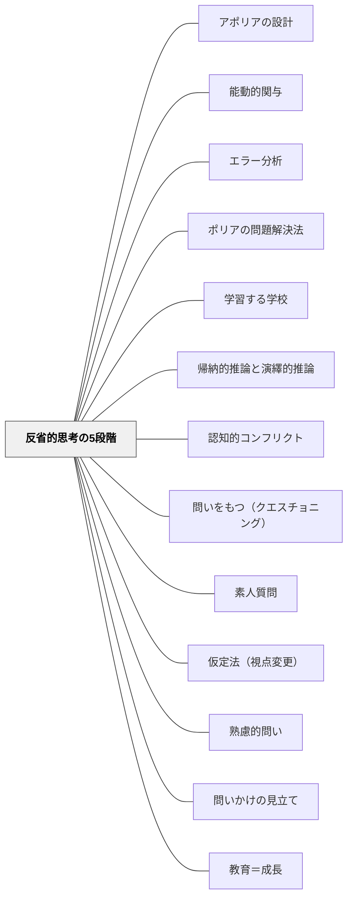

# 反省的思考の5段階

> 「正しい答えを出すこと」でなく「思考の質」が教育の尺度。困惑から始まり、検証で終わる5段階の反省的思考を授業設計の骨格にする。

## Pattern Connection（Dewey, 1916）

**既存パタンとの関連**：[[パタン/認知的コンフリクト]] は「困惑・疑問・ズレ」を思考の着火点として位置づけるが、本パタンはその着火後の**全プロセス**を5段階で体系化する。認知的コンフリクトが「炎を起こす」なら、反省的思考の5段階は「その炎で何を燃やすか」の地図である。[[パタン/問いかけの見立て]] が「いつ問いを立てるか」を診断するなら、本パタンは「どんな思考プロセスを経るか」を設計する。

**補強された点**：Deweyの反省的思考は、「正しい答えを産出すること」ではなく「困惑を知的に扱う能力」が目標であることを明確にする。これは [[パタン/熟慮的問い]] の「問いを設計する」という発想に、「思考のプロセス全体を設計する」という視点を加える。

> "Were all instructors to realize that the quality of mental process, not the production of correct answers, is the measure of educative growth something hardly less than a revolution in teaching would be worked."（Dewey, 1916, Ch.13）

**他のパタンへの波及**：[[パタン/素人質問]] はステップ1（困惑）を引き出す技法。[[パタン/バイアス破壊]] はステップ2（問題の知的化）を促す技法。[[パタン/仮定法（視点変更）]] はステップ3（仮説）を広げる技法。5段階全体が既存の問い系パタン群の統合フレームになる。

**Dewey（1910）How We Think 統合（2026-05-31）：**

*How We Think*（1910）は、*Democracy and Education*（1916）Ch.12に収録された反省的思考の5段階の**一次資料**である。1916年版でよく知られるが、段階の構造・各段階の名称・「思考の質こそが教育的成長の尺度」という命題はすべて1910年版（Ch.6）に先行して定式化されている。

**1910年版と1916年版の対応：**

| How We Think (1910) Ch.6 | Democracy and Education (1916) Ch.12 |
|---|---|
| A felt difficulty（困難を感じること） | 困惑・疑問・不確かさ |
| Intellectualization（知的化） | 問題の局所化・定義 |
| Suggestion/Hypothesis（仮説） | 仮説・提案 |
| Elaboration by reasoning（推論による精緻化） | 推論による精緻化 |
| Testing by action or imagination（検証） | 検証（行動または想像） |

**歩行者の例（How We Think, Ch.1）：**  
空が曇ってきた→「雨が来るかもしれない」と推論する歩行者の例は、日常的な反省的思考の原型を示す。suggestion（示唆）が起動し、signifying（意味付け）によって結論に向かう——この「示唆→意味付け」の関係が思考の鍵。授業で「思考の具体例」が必要なとき、この歩行者の例をそのまま使える。

**「思考の質こそが教育成長の尺度」の1910年版：**  
1916年版の引用でよく示されるが、同命題は1910年版 Ch.6 に既に存在する：

> "Were all instructors to realize that the quality of mental process, not the production of correct answers, is the measure of educative growth something hardly less than a revolution in teaching would be worked."（Dewey, 1910, Ch.6）

- **補強された点**：本パタンの核心命題が1916年版だけでなく1910年版にも明示されており、Deweyの一貫した主張であることが確認できる
- **修正された点**：出典表記を「How We Think (1910) ＋ Democracy and Education (1916)」の両者に更新する——本書（1910）を反省的思考5段階の正式な一次資料として参照する
- **他のパタンへの波及**：[[文献/How We Think（Dewey）]] — 本統合の出典（文献ページ新規作成）

---

**Blitzer（2014）統合（2026-05-24）——ポリアの4段階との対応：**

*Thinking Mathematically* Ch.1 Section 3 は、ジョージ・ポリア（1945）の4段階問題解決法（Understand → Devise a Plan → Carry out → Look Back）を提示する。これは Dewey の反省的思考の**数学問題解決への特化版**として位置づけられる。

| Deweyの反省的思考 | ポリアの4段階 |
|----------------|-------------|
| ①困惑・疑問（A felt difficulty） | Step 1: 問題を理解する（Understand） |
| ②問題の知的化（Intellectualization） | Step 1〜2: 理解→計画 |
| ③仮説（Suggestion） | Step 2: 計画を立てる（Devise a Plan） |
| ④推論による精緻化 | Step 3: 計画を実行する（Carry out） |
| ⑤検証（Testing） | Step 4: 振り返る（Look Back） |

- **補強された点**：Dewey の「思考の質こそが教育成長の尺度」という主張（本書が引用）がポリアの Step 4「振り返り・別解を探す」と完全に対応する——答えの確認ではなく「どう考えたか」の省察が教育の目的
- **拡張された点**：ポリアは8つの問題解決ストラテジー（図を描く・逆算する・類似問題を考える等）を Step 2 の具体的手立てとして提示する。Dewey の「仮説を立てる」ステップに「どう立てるか」の道具箱が加わった
- **他のパタンへの波及**：[[パタン/ポリアの問題解決法]] — 数学問題解決に特化した子パタン

---

## 背景（Context）

「考える力を育てる」という目標が掲げられながら、授業は「正しい答えを確認する場」になりやすい。教師が問い、子どもが答え、教師が評価する——このサイクルでは子どもは正解を再生産するだけで、本物の思考は起きていない。

思考とは「不確かな状況を扱う能力」である（Dewey, 1916）。不確かさのない状況に置かれた子どもに思考は生まれない。同様に、不確かさに放置されるだけの子どもにも思考は育たない。

## 問題（Problem）

困惑・疑問・不確かさを「解消すべきノイズ」として扱い、素早く正解を与えることで「思考の着火前に消火する」授業設計になっていないか。逆に、困惑に放置されたまま「考えなさい」と言われるだけで、思考のプロセスが支援されない状態になっていないか。

## 力のかたち（Forces）

- 思考は困惑（perplexity）から始まる——問題がないところに思考は生まれない
- 訓練されていない心は「知的な宙吊り状態（intellectual suspense）」を嫌い、最初に浮かんだ結論に飛びつく
- 仮説は検証されなければ思考を閉じてしまう——「試してみること」まで設計が必要
- 思考は社会的な文脈で育つ——他者との対話が各段階を豊かにする
- 教師が答えを急ぎすぎると、子どもは「困惑を扱う力」を育てる機会を失う

## 解決（Solution）

**反省的思考の5段階を授業設計の骨格として使い、困惑から検証まで全プロセスを学習者が経験できるよう設計する。**

---

### 反省的思考の5段階（Dewey, 1916, Ch.12）

| 段階 | Deweyの原語 | 内容 |
|---|---|---|
| **① 困惑・混乱・疑問** | A felt difficulty | 目前の状況に違和感・不確かさ・引っかかりを感じる。思考の起動条件 |
| **② 問題の知的化** | Intellectualization | 漠然とした困惑を「解くべき問題」として言語化・明確化する |
| **③ 仮説・提案** | Suggestion / Hypothesis | 問題の解決に向けた可能性・見通し・仮の答えを立てる |
| **④ 推論による精緻化** | Elaboration by reasoning | 仮説の意味・含意を論理的に展開する。「もしそうなら〜になるはず」 |
| **⑤ 検証（行動または想像）** | Testing by action or imagination | 仮説を実際に試すか、想像の中でシミュレートする |

---

### 各段階の教育的設計

**① 困惑を生む**（認知的コンフリクトの設計）
- 予測を立てさせてから意外な結果を見せる
- 「なんかおかしい」という違和感を大切にする文化をつくる
- 素人質問（AKY技法）で当然視されている前提に穴を開ける

**② 問題を言語化する**
- 「どこが引っかかる？」「何が疑問？」と問いの言語化を促す
- 「何を知れば解ける？」に絞り込む活動を設計する
- 漠然とした困惑を「○○が分からない」という問いの形に変換させる

**③ 仮説を立てる**（心理的安全性が必要）
- 「正しくなくていい、考えを出してみよう」と宣言する
- 仮定法（「もしこうだったら？」）で可能性を広げる
- ペアで複数の仮説を出し合う

**④ 仮説の含意を追う**
- 「もしそうなら、次に何が起きるはず？」と推論を連鎖させる
- 「その説だと、〇〇はどう説明できる？」と矛盾を探る
- 論理的な展開（「つまり〜ということになる」）を練習する

**⑤ 検証する**
- 実験・実際の試み・他の事例への適用で仮説を試す
- 「予測と結果はどう違ったか」を振り返る
- 検証が不可能な問いは「想像上のシミュレーション」として扱う

---

### 思考の質を評価する

Deweyは言う：「正しい答えの産出ではなく、思考のプロセスの質が教育的成長の尺度」。

これを教師の評価に翻訳すると：
- 「正解できたか」ではなく「困惑を問題に変えられたか」
- 「答えが合っているか」ではなく「仮説を検証しようとしたか」
- 「早く解けたか」ではなく「5段階を丁寧に踏んだか」

---

### 訓練されていない心の特徴（避けるべき状態）

Deweyが指摘する「思考しない心」の傾向：
- 知的な宙吊り（suspense）を避け、最初の結論に飛びつく
- 証拠なしに確信する（wishful thinking）
- 困惑を「わからない、終わり」で処理する
- 他者の権威に従って自分で考えない（rote learning への批判）

これらを「問題」ではなく「よくある状態」として理解し、5段階の設計でそれを構造的に防ぐ。

## 結果（Consequences）

- 子どもが「困惑→問題→仮説→検証」の思考サイクルを習慣的に使えるようになる
- 「正解を当てる授業」から「思考プロセスを経験する授業」に転換できる
- 教師が「答えを急ぐ」誘惑に抵抗できる理論的根拠を持てる
- 各段階が丁寧に踏まれた授業は、科学的思考・問題解決・探究学習の基盤になる
- ただし5段階全部を1時間で完結させようとすると過密になる——単元全体や数時間で設計することが現実的

## 関連パタン
- [[パタン/アポリアの設計]]
- [[パタン/能動的関与]]
- [[パタン/エラー分析]]
- [[パタン/ポリアの問題解決法]]
- [[パタン/学習する学校]]
- [[パタン/帰納的推論と演繹的推論]]

- [[パタン/認知的コンフリクト]] — 段階①の設計：困惑・疑問の着火
- [[パタン/問いをもつ（クエスチョニング）]] — 段階②の設計：問題の言語化
- [[パタン/素人質問]] — 段階①②を促す技法
- [[パタン/仮定法（視点変更）]] — 段階③の設計：仮説の多様化
- [[パタン/熟慮的問い]] — 各段階に応じた問いの設計
- [[パタン/問いかけの見立て]] — どの段階に今の学習者がいるかを診断する
- [[パタン/教育＝成長]] — 反省的思考は成長のプロセスそのもの
- [[メタパタン/経験から出発する]] — 思考は経験の中の困惑から始まる

---

## クラスター図

## Actionable Insight

- 授業の「答え合わせ」の前に「自分はどんな仮説を立てたか」を1分書かせる——仮説を言語化する習慣が段階③④の思考力を育てる
- 子どもが困惑したとき「どこが引っかかっているか言葉にしてみよう」と促す——段階②（困惑の知的化）を支援するだけで思考の質が変わる
- 「正しい答えを言えた子」だけでなく「良い仮説を立てた子」「検証の方法を考えた子」を価値ある思考として学級全体に示す——「思考の質」を評価する文化が5段階を機能させる

---

## 出典

Dewey, J. (1916). *Democracy and Education: An introduction to the philosophy of education*. Macmillan. (Ch. 11–12)

> "Were all instructors to realize that the quality of mental process, not the production of correct answers, is the measure of educative growth something hardly less than a revolution in teaching would be worked."（Ch.13）

> "The most important factor in the training of good mental habits consists in acquiring the attitude of suspended conclusion, and in mastering the various methods of searching for new materials to corroborate or to refute the first suggestions that arise."（Ch.12）

- [[文献/Democracy and Education（Dewey）]]
- [[文献/How We Think（Dewey）]] — 反省的思考5段階の一次資料（1910年）
