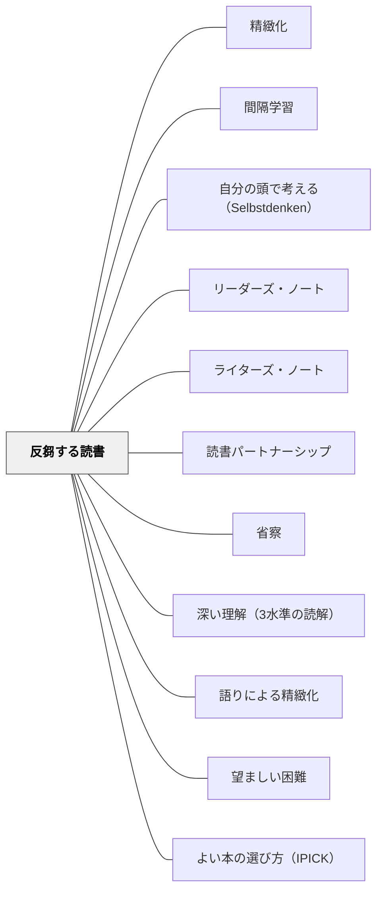

# 反芻する読書

> 「本を読んでも、自分の血となり肉となるのは、反芻し、じっくり考えたことだけ」——ショーペンハウアー

---

## Pattern Connection

**ショーペンハウアー（1851/2013）統合（2026-05-31）：**

ショーペンハウアーは「反芻（Ruminatio）」——読んだことをじっくり考え直すこと——を、読書から知識を血肉化させる唯一の方法として位置づけた。「ひっきりなしに読んで考えなければ、知識は根を下ろさずに消える」という指摘は、現代の学習科学（間隔学習・精緻化）とも合致する。

- **既存パタンとの関連**：[[パタン/精緻化]] の「新しい知識を既有知識・経験と結びつける」に、「読んだ後に時間をかけてじっくり考え直す」という具体的な時間的プロセスが加わる。精緻化は「何と結びつけるか」を問うが、反芻は「十分に時間をかけて考え直したか」を問う
- **補強された点**：[[パタン/間隔学習]] の「忘れかけた頃に思い出す」という設計に、「そもそも一度の読書では吸収されない（50分の1しか残らない）」という根拠が加わる。間隔学習の理論的前提として反芻が機能する
- **修正・拡張された点**：「読書量が多いほどよい」という多読主義への対抗パタンとして機能する。少なく読んで深く考えることが、多く読んで浅く流すことより血肉化すると主張する
- **他のパタンへの波及**：[[パタン/リーダーズ・ノート]] — ノートに書くことが反芻の実践的形態になる；[[パタン/自分の頭で考える（Selbstdenken）]] — Selbstdenken は読む前に考えるが、反芻は読んだ後に考える——両者で読書を挟む

---

## 背景（Context）

「本をたくさん読ませる」「読書量を増やす」という読書指導のアプローチは広く共有されている。しかし、読んだ量が多くても、読んだ後に何も考えなければ、内容の多くは失われる。

ショーペンハウアーは「読んだものの50分の1しか吸収されない」と言い、「ひっきりなしに読んで考えなければ、根を下ろさず失われる」と警告した。この指摘は、Ebbinghaus の忘却曲線（1885）——人間は学習後24時間で74%を忘れる——や、現代の精緻化研究とも一致する。

## 問題（Problem）

「読んだ」「調べた」「聞いた」は学習の完了を意味しない。情報が流れ込んで終わり、「わかったつもり」の状態が生まれる。

本を読み終えた後、次の本を開く前に「考える時間」がない。多読の圧力（たくさん読むことへの期待）が、考える間を埋めてしまう。結果として、多くの本を読んでも「自分の言葉で説明できない」「使える知識にならない」状態が続く。

## 力のかたち（Forces）

- 多く読むほど「勉強している」という実感が得られる——でも血肉化するのは反芻した分だけ
- 「考える時間」は成果として見えにくいため、削られやすい
- 反芻には「一人でじっくりと」いる時間が必要——現代の学習環境は常に刺激があり、反芻の場が育ちにくい
- 読んで考えない状態を長く続けると、「考える力」が弱まる（ショーペンハウアーの警告）
- 重要な本を一度読んで「わかった」とするのは早計——「重要な本は二度読むべきだ」（ショーペンハウアー）

## 解決（Solution）

**「読んだ後に考える」時間を意図的に設計する。読む量を意識的に絞り、じっくり考え抜く（反芻する）ことで知識を血肉化させる。**

---

### 反芻の3つの形態

**1. ノートに書く（書く反芻）**

読んだ後すぐにノートを閉じず、「印象に残ったことを自分の言葉で書く」——リーダーズ・ノートやライターズ・ノートへの記録が反芻の実践になる。

「読んでいてどんなことを考えた？」——感想でなく思考の記録。

**2. 間をおいて考え直す（時間的反芻）**

「昨日読んだことを今日もう一度考える」——翌日の授業冒頭に「昨日読んだ話で、一番印象に残ったことは？」と問う。これが間隔学習の読書版。

「重要な本は二度読め」（ショーペンハウアー）——単元で読んだ本を数週間後に再読する機会を設計する。

**3. 話して考える（対話的反芻）**

読んだことを誰かに話す——読書パートナーシップ・読書サークル・クラスでの共有が反芻の場になる。「話す」ことで整理・再構成が起き、精緻化が深まる。

「自分の言葉で説明する」ことが血肉化の条件（ショーペンハウアー）。

---

### 授業での実装

| 場面 | 反芻の実践 |
|---|---|
| 読み終わった直後 | 「一番残ったことを1文で書く」——即時の言語化 |
| 翌日の授業冒頭 | 「昨日読んだ本で印象に残ったことは？」——時間的反芻 |
| 1週間後 | リーダーズ・ノートを読み返して「今どう思うか」を書き加える |
| 単元末 | 複数のテキストを読んだ後「自分の考えはどう変わったか」を書く |

---

### 「少なく深く読む」の価値づけ

特別支援学級・読書が苦手な子どもへの応用として：

「たくさん読まなくていい。一つのことをよく考えることの方が大事」——ショーペンハウアーの「少読深読」は、多読プレッシャーを外す根拠になる。

一冊の本を繰り返し読む（「お気に入りの本を何度も読む」）ことは、反芻の自然な実践として価値づけられる。

---

## 結果（Consequences）

- 読んだ内容が「使える知識」として定着しやすくなる
- 「たくさん読む」より「よく考えながら読む」という読書観が育つ
- 読書後の思考時間がノートへの記録習慣や読書パートナーシップとつながる
- ただし「考える時間」が見えにくいため、教師・保護者への説明が必要——「読む量が少ない」と見られることへの対抗的な価値づけが求められる
- 反芻の時間は一人で静かにいることを必要とする——一人でいることを苦手とする学習者には対話的反芻（話す）の設計が有効

## 関連パタン

- [[パタン/精緻化]] — 反芻は精緻化の時間的実践——「十分に考え直したか」を問う
- [[パタン/間隔学習]] — 「忘れかけた頃に考え直す」が反芻の時間設計と一致する
- [[パタン/自分の頭で考える（Selbstdenken）]] — Selbstdenken は読む前、反芻は読んだ後——両者で読書を挟む
- [[パタン/リーダーズ・ノート]] — ノートが反芻の記録場になる
- [[パタン/ライターズ・ノート]] — 読書から書くことへ——反芻が書く素材を生む
- [[パタン/読書パートナーシップ]] — 対話が反芻の外在化手段になる
- [[パタン/省察]] — 反芻は読書における省察の具体的形態
- [[パタン/深い理解（3水準の読解）]] — 反芻によって推論的・応用的水準の理解が育つ
- [[パタン/語りによる精緻化]] — 読んだことを語ることが反芻の深化になる
- [[パタン/望ましい困難]] — 反芻は「難しく感じる」が、その困難が血肉化を生む
- [[パタン/よい本の選び方（IPICK）]] — 少なく深く読むためには「今の自分に合う本」を選ぶことが前提になる
- [[文献/読書について（ショーペンハウアー）]] — 一次資料

---

## クラスター図

## Actionable Insight

- **読み終わった後、次の本を開く前に「1文だけ書く」**——「一番残ったことを1文で」。この1文が反芻の最小単位。リーダーズ・ノートの先頭に「今日の反芻」コーナーを作る
- **「昨日読んだこと」を翌日の授業冒頭で1分問う**——「昨日読んだ話で、今日でも覚えていることは？」。覚えていることを問われる体験が、反芻（記憶の再活性化）そのものになる
- **重要な単元テキストを2回読む授業を設計する**——1回目は通読、2回目は「気になった部分に印をつけながら」。2回目で理解の深さが格段に変わる体験を積ませる
- **読書パートナーとの「反芻対話」を定期的に設ける**——「先週読んだ本で、今でも残っている場面を1つ話して」。時間をおいて語ることが反芻の深化になる

---

## 出典

Schopenhauer, A.（1851/2013）.『読書について』（鈴木芳子訳）. 光文社古典新訳文庫.

> 「本を読んでも、自分の血となり肉となるのは、反芻し、じっくり考えたことだけ」——ショーペンハウアー（1851/2013）

> 「重要な本はどれもみな、続けて二度読むべきだ」——ショーペンハウアー（1851/2013）
